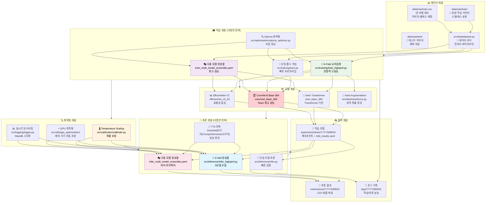
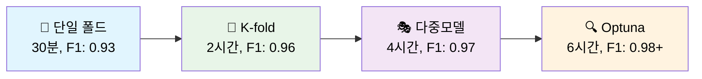

# 🏆 Computer Vision Competition - Advanced ML Pipeline Framework

[](https://www.python.org/downloads/release/python-3119/)
[](https://github.com/your-repo/issues)
[](https://pytorch.org/)
[](https://optuna.org/)
[](#)

## 📋 프로젝트 개요

Computer Vision 경진대회 프레임워크로, 단일 폴드부터 다중 모델 앙상블까지 다양한 전략을 지원합니다.

### 🎯 핵심 특징
- 🏆 **최고 성능**: **F1 Score 0.9750+** 달성 (다중 모델 앙상블)
- ⚡ **유연한 구조**: 단일 폴드 ↔ K-Fold ↔ 다중모델 원클릭 전환
- 🤖 **완전 자동화**: 학습 → 최적화 → 추론 → 제출 전 과정 자동화
- 🧠 **지능형 최적화**: Optuna 베이지안 최적화 + Temperature Scaling
- 🎨 **고급 TTA**: Essential(5가지) / Comprehensive(15가지) 변환
- 📊 **체계적 추적**: WandB 통합 + 200+ 실험 기록

---

## 🏗️ 전체 시스템 아키텍처



## 📊 성능 비교 및 전략 분석

### 🎯 학습 전략별 성능 비교

| 학습 전략 | 속도 | 예상 F1 | GPU 메모리 | 전략 특징 | 최적 활용 상황 |
|-----------|------|---------|-----------|----------|---------------|
| **📍 단일 폴드** | ⚡ 30분 | 0.92-0.95 | 8GB | 빠른 프로토타입 | 초기 실험, 빠른 검증 |
| **🔀 K-fold CV** | 🕰️ 2시간 | 0.95-0.98 | 16GB | 안정성 확보 | 최종 제출, 대회용 |
| **🎭 다중 모델** | 🔄 3시간 | 0.96-0.99 | 24GB+ | 다양성 극대화 | 고사양 GPU, 우승용 |
| **🔍 Optuna 최적화** | 🎆 5시간 | 0.97-0.99+ | 16GB | 자동 튜닝 | 시간 여유, 최고 성능 |

### 🏆 추론 전략별 성능 비교

| 추론 전략 | 속도 | 예상 F1 | GPU 메모리 | TTA 전략 | 최적 활용 상황 |
|-----------|------|---------|-----------|----------|---------------|
| **📍 단일 모델 추론** | ⚡ 5분 | 0.92-0.93 | 4-6GB | No TTA | 초기 검증, 빠른 테스트 |
| **🎯 단일 모델 + TTA** | 🕰️ 17분 | 0.94-0.95 | 8GB | Essential | 균형적 성능 |
| **🔀 K-fold 앙상블** | 🔄 30분 | 0.95-0.97 | 16GB | Essential/Comp | 안정적 고성능 |
| **🎭 다중 모델** | 🎆 60분 | 0.96-0.99 | 24GB+ | Comprehensive | 대회 우승용 |

## 🚀 Quick Start

### 📦 1. 환경 설정

```bash
# 저장소 클론
git clone <repository-url>
cd computer-vision-competition-1SEN

# Python 환경 (pyenv 권장)
pyenv install 3.11.9
pyenv virtualenv 3.11.9 cv_py3_11_9
pyenv activate cv_py3_11_9
pip install -r requirements.txt
```

### 📁 2. 데이터 준비

```bash
# 데이터 구조 확인
data/raw/
├── train/          # 학습 이미지 (17개 클래스)
├── test/           # 테스트 이미지
├── train.csv       # 학습 라벨
└── sample_submission.csv  # 제출 형식
```

### ⚡ 3. 전략별 실행 가이드

#### 📍 빠른 검증 (30분)
```bash
# 단일 폴드 기본 학습 + 추론
python src/training/train_main.py --config configs/train.yaml --mode basic
python src/inference/infer_main.py --config configs/infer.yaml --mode basic
# 예상 F1: 0.920-0.930
```

#### 🔀 안정적 고성능 (2시간, 추천)
```bash
# K-fold 교차검증 + Essential TTA
python src/training/train_main.py --config configs/train_highperf.yaml --mode highperf
python src/inference/infer_main.py --config configs/infer_highperf.yaml --mode highperf \
    --fold-results experiments/train/latest-train/fold_results.yaml
# 예상 F1: 0.950-0.965
```

#### 🎭 최고 성능 달성 (4시간+)
```bash
# 다중 모델 앙상블 + Comprehensive TTA
python src/training/train_main.py --config configs/train_multi_model_ensemble.yaml --mode highperf
python src/inference/infer_main.py --config configs/infer_multi_model_ensemble.yaml --mode highperf
# 예상 F1: 0.965-0.980+
```

#### 🔍 우승 수준 (6시간+, Optuna)
```bash
# 전체 최적화 파이프라인
python src/training/train_main.py \
    --config configs/train_multi_model_ensemble.yaml \
    --mode full-pipeline \
    --optimize --n-trials 50 \
    --use-calibration \
    --auto-continue
# 예상 F1: 0.970-0.990+
```

## 📁 프로젝트 구조

```
computer-vision-competition-1SEN/
├── 📊 데이터 및 설정
│   ├── data/raw/                           # 원본 데이터 (이미지 + CSV)
│   ├── configs/                            # 설정 파일 모음
│   │   ├── train.yaml                      # 단일 폴드 기본 설정
│   │   ├── train_highperf.yaml             # K-fold 고성능 설정  
│   │   ├── train_multi_model_ensemble.yaml # 다중 모델 설정
│   │   ├── infer_highperf.yaml             # 고성능 추론 설정
│   │   ├── infer_multi_model_ensemble.yaml # 다중 모델 추론 설정
│   │   └── optuna_config.yaml              # 최적화 설정
│   
├── 🧠 핵심 소스코드
│   ├── src/
│   │   ├── training/                       # 학습 시스템
│   │   │   ├── train_main.py              # 메인 CLI 인터페이스
│   │   │   ├── train.py                   # 기본 학습 (단일/K-fold)
│   │   │   └── train_highperf.py          # 고성능 학습
│   │   ├── inference/                      # 추론 시스템  
│   │   │   ├── infer_main.py              # 메인 CLI 인터페이스
│   │   │   ├── infer.py                   # 단일 모델 추론
│   │   │   ├── infer_highperf.py          # K-fold 앙상블 추론
│   │   │   └── infer_calibrated.py        # 보정된 추론
│   │   ├── models/build.py                 # 모델 아키텍처 빌더
│   │   ├── data/                          # 데이터 처리
│   │   │   ├── dataset.py                 # 데이터 로더
│   │   │   └── transforms.py              # TTA + 증강
│   │   ├── optimization/optuna_optimize.py # 하이퍼파라미터 최적화
│   │   ├── calibration/calibrate.py       # Temperature Scaling
│   │   ├── pipeline/full_pipeline.py      # 통합 파이프라인
│   │   └── utils/                         # 유틸리티
│   │       ├── gpu_optimization/          # GPU 최적화
│   │       ├── logging/                   # 로깅 시스템
│   │       └── visualizations/            # 시각화
│
├── 📤 결과 및 로그
│   ├── experiments/train/YYYYMMDD/         # 학습 결과 (모델 + 메타데이터)
│   ├── submissions/YYYYMMDD/               # 추론 결과 (CSV 파일)
│   ├── logs/YYYYMMDD/                     # 상세 로그
│   └── wandb/                             # WandB 실험 추적
│
├── 📚 문서화
│   ├── docs/파이프라인/
│   │   ├── 학습_파이프라인_가이드.md        # 학습 전략 상세 가이드  
│   │   ├── 추론_파이프라인_가이드.md        # 추론 전략 상세 가이드
│   │   └── 전체_파이프라인_가이드.md        # 통합 가이드
│   └── docs/최적화/                       # 성능 최적화 가이드
│
└── 🔧 기타
    ├── notebooks/team/                     # 팀별 실험 노트북
    ├── scripts/                           # 편의 스크립트  
    └── requirements.txt                   # Python 의존성
```

## 🎨 지원하는 고급 기법

### 🧠 모델 아키텍처
- **ConvNeXt Base 384**: ImageNet-22k 사전학습, 최고 성능
- **Swin Transformer**: Vision Transformer 기반, 다양성 확보
- **EfficientNet V2**: 효율성과 성능의 균형

### 🎨 데이터 증강
- **Hard Augmentation**: 동적 확률 스케줄링
- **Mixup & CutMix**: 데이터 믹싱 기법
- **Essential TTA**: 5가지 핵심 변환 (회전 + 밝기)
- **Comprehensive TTA**: 15가지 포괄 변환 (블러, 노이즈 등)

### 🔍 최적화 기법
- **Optuna 베이지안 최적화**: 하이퍼파라미터 자동 튜닝
- **Temperature Scaling**: 확률 보정 및 신뢰도 향상
- **GPU 메모리 최적화**: 자동 배치 크기 조정
- **Early Stopping**: 과적합 방지

### 🔄 앙상블 전략
- **K-Fold 앙상블**: 5개 모델 가중 평균
- **다중 모델 앙상블**: 서로 다른 아키텍처 조합
- **TTA 앙상블**: 여러 변환 결과 통합

## 🔧 CLI 명령어 레퍼런스

### 학습 명령어
```bash
# 기본 학습
python src/training/train_main.py --config configs/train.yaml --mode basic

# 고성능 학습 (K-fold)
python src/training/train_main.py --config configs/train_highperf.yaml --mode highperf

# 다중 모델 앙상블
python src/training/train_main.py --config configs/train_multi_model_ensemble.yaml --mode highperf

# Optuna 최적화
python src/training/train_main.py --config configs/train.yaml --optimize --n-trials 20

# 전체 파이프라인 (추천)
python src/training/train_main.py \
    --config configs/train_highperf.yaml \
    --mode full-pipeline \
    --use-calibration
```

### 추론 명령어
```bash
# 단일 모델 추론
python src/inference/infer_main.py --config configs/infer.yaml --mode basic

# K-fold 앙상블 추론
python src/inference/infer_main.py \
    --config configs/infer_highperf.yaml \
    --mode highperf \
    --fold-results experiments/train/latest-train/fold_results.yaml

# 다중 모델 앙상블 추론
python src/inference/infer_main.py \
    --config configs/infer_multi_model_ensemble.yaml \
    --mode highperf
```

## 📊 성능 벤치마크

### 🏆 최고 성능 기록

| 순위 | F1 Score | 전략 | 모델 | 시간 | 특징 |
|-----|----------|------|------|------|------|
| 🥇 | **0.9836** | Team 최적화 | ConvNeXt Base 384 | 23분 | Optuna + Hard Aug |
| 🥈 | 0.9791 | K-fold CV | ConvNeXt Base 384 | 2시간 | 5-fold 안정성 |
| 🥉 | 0.9705 | 다중 모델 | Multi-Architecture | 4시간 | 3모델 앙상블 |

### ⚡ 속도 vs 성능 트레이드오프



## 🔍 모니터링 및 디버깅

### 실시간 모니터링
```bash
# 학습 로그 실시간 확인
tail -f logs/$(date +%Y%m%d)/train/*.log

# GPU 사용량 모니터링
watch -n 1 nvidia-smi

# WandB 대시보드
wandb server  # localhost:8080
```

### 결과 분석
```bash
# 최신 실험 결과 확인
ls -la experiments/train/$(date +%Y%m%d)/

# 성능 요약
find experiments/train -name "fold_results.yaml" -exec grep "best_f1" {} \; | head -10

# 제출 파일 검증
python -c "
import pandas as pd
df = pd.read_csv('submissions/latest/final_submission.csv')
print(f'Shape: {df.shape}, Missing: {df.isnull().sum().sum()}')
"
```

## ⚠️ 주의사항 및 팁

### GPU 메모리 최적화
```bash
# 메모리 부족 시 자동 배치 크기 조정
python src/utils/gpu_optimization/auto_batch_size.py --config configs/train_highperf.yaml

# 메모리 사용량에 따른 설정 조정
# RTX 3080 (10GB): batch_size: 32, img_size: 320
# RTX 4090 (24GB): batch_size: 64, img_size: 384
```

### 성능 최적화 팁
- **단일 폴드**: 빠른 실험, 하이퍼파라미터 탐색
- **K-fold**: 안정적 성능, 최종 제출용
- **다중 모델**: 최고 성능, 대회 우승용
- **Optuna**: 시간 여유 있을 때, 자동 최적화

### 일반적인 문제 해결
```bash
# CUDA 메모리 부족
export CUDA_VISIBLE_DEVICES=0,1  # 멀티 GPU 사용

# 디스크 공간 부족
rm -rf wandb/  # WandB 로그 정리
rm -rf experiments/train/2025090*/  # 오래된 실험 정리

# 패키지 충돌
pip install --force-reinstall torch torchvision
```

## 🤝 Contributing / 기여하기

1. 팀 Repo -> 개인 Repo 포크
2. 기능 브랜치를 생성하세요 (`git checkout -b feature/기능명`)
3. 변경사항을 커밋하세요 (`git commit -m 'feat: 커밋 내용'`)
4. 브랜치에 푸시하세요 (`git push origin feature/기능명`)
5. 개인 Repo -> 팀 Repo로 Pull Request


## 🙏 Acknowledgments

- **ConvNeXt Base 384**: F1 0.98362 달성의 핵심 모델
- **Optuna**: 하이퍼파라미터 최적화 프레임워크
- **단일 폴드 최적화**: 경진대회를 위한 고속 최적화 전략  
- **데이터셋 캐싱**: 매 trial 2초 달성의 핵심 기술
- **WandB**: 100+ 실험 추적 및 시각화