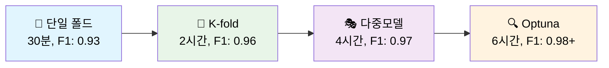

# 🏆 Computer Vision Competition

## Team

| 프로필 | 이름 (깃허브) | MBTI | 전공/학과 | 담당 역할 |
|:------:|:-------------:|:----:|:---------:|:----------|
|  | [김선민](https://github.com/nimnusmik) | ENFJ | 경영&AI 융합 학부 | 팀 리드, EDA/모델링, 성능 고도화 |
|  | [김병현](https://github.com/Bkankim) | ENFP | 정보보안 | 전처리, 시스템/모델 개발, 성능 고도화 |
|  | [임예슬](https://github.com/joy007fun/joy007fun) | ENTP | 관광경영&컴퓨터공학, 클라우드 인프라 | EDA/모델링, 성능 고도화 |
|  | [정서우](https://github.com/Seowoo-C) | INFJ | 화학 | EDA/모델링, 성능 고도화 |
|  | [최현화](https://github.com/AIBootcamp14/computervisioncompetition-cv-1) | ISTP | ML&AI/컴퓨터공학 | EDA/모델링, 성능 고도화, 모듈화 설계/구현, Git 브랜치·병합·충돌 관리 |


## 🏆 경진대회 결과 (2등)


## 📋 프로젝트 개요

Computer Vision 경진대회 프레임워크로, 단일 폴드부터 다중 모델 앙상블까지 다양한 전략을 지원합니다.

### 🎯 핵심 특징
- 🏆 **최고 성능**: **F1 Score 0.9750+** 달성 (다중 모델 앙상블)
- ⚡ **유연한 구조**: 단일 폴드 ↔ K-Fold ↔ 다중모델 원클릭 전환
- 🤖 **완전 자동화**: 학습 → 최적화 → 추론 → 제출 전 과정 자동화
- 🧠 **지능형 최적화**: Optuna 베이지안 최적화 + Temperature Scaling
- 🎨 **고급 TTA**: Essential(5가지) / Comprehensive(15가지) 변환
- 📊 **체계적 추적**: WandB 통합 + 200+ 실험 기록

---

## 🏗️ 시스템 아키텍처

### 전체 파이프라인 아키텍처


### 학습 파이프라인 아키텍처


### 추론 파이프라인 아키텍처


## 📊 성능 비교 및 전략 분석

### 🎯 학습 전략별 성능 비교

| 학습 전략 | 속도 | 예상 F1 | GPU 메모리 | 전략 특징 | 최적 활용 상황 |
|-----------|------|---------|-----------|----------|---------------|
| **📍 단일 폴드** | ⚡ 30분 | 0.92-0.95 | 8GB | 빠른 프로토타입 | 초기 실험, 빠른 검증 |
| **🔀 K-fold CV** | 🕰️ 2시간 | 0.95-0.98 | 16GB | 안정성 확보 | 최종 제출, 대회용 |
| **🎭 다중 모델** | 🔄 3시간 | 0.96-0.99 | 24GB+ | 다양성 극대화 | 고사양 GPU, 우승용 |
| **🔍 Optuna 최적화** | 🎆 5시간 | 0.97-0.99+ | 16GB | 자동 튜닝 | 시간 여유, 최고 성능 |

### 🏆 추론 전략별 성능 비교

| 추론 전략 | 속도 | 예상 F1 | GPU 메모리 | TTA 전략 | 최적 활용 상황 |
|-----------|------|---------|-----------|----------|---------------|
| **📍 단일 모델 추론** | ⚡ 5분 | 0.92-0.93 | 4-6GB | No TTA | 초기 검증, 빠른 테스트 |
| **🎯 단일 모델 + TTA** | 🕰️ 17분 | 0.94-0.95 | 8GB | Essential | 균형적 성능 |
| **🔀 K-fold 앙상블** | 🔄 30분 | 0.95-0.97 | 16GB | Essential/Comp | 안정적 고성능 |
| **🎭 다중 모델** | 🎆 60분 | 0.96-0.99 | 24GB+ | Comprehensive | 대회 우승용 |

## 🚀 Quick Start

### 📦 1. 환경 설정

```bash
# 저장소 클론
git clone <repository-url>
cd computer-vision-competition-1SEN

# Python 환경 (pyenv 권장)
pyenv install 3.11.9
pyenv virtualenv 3.11.9 cv_py3_11_9
pyenv activate cv_py3_11_9
pip install -r requirements.txt
```

### 📁 2. 데이터 준비

```bash
# 데이터 구조 확인
data/raw/
├── train/          # 학습 이미지 (17개 클래스)
├── test/           # 테스트 이미지
├── train.csv       # 학습 라벨
└── sample_submission.csv  # 제출 형식
```

### ⚡ 3. 전략별 실행 가이드

#### 📍 빠른 검증 (30분)
```bash
# 단일 폴드 기본 학습 + 추론
python src/training/train_main.py --config configs/train.yaml --mode basic
python src/inference/infer_main.py --config configs/infer.yaml --mode basic
# 예상 F1: 0.920-0.930
```

#### 🔀 안정적 고성능 (2시간, 추천)
```bash
# K-fold 교차검증 + Essential TTA
python src/training/train_main.py --config configs/train_highperf.yaml --mode highperf
python src/inference/infer_main.py --config configs/infer_highperf.yaml --mode highperf \
    --fold-results experiments/train/latest-train/fold_results.yaml
# 예상 F1: 0.950-0.965
```

#### 🎭 최고 성능 달성 (4시간+)
```bash
# 다중 모델 앙상블 + Comprehensive TTA
python src/training/train_main.py --config configs/train_multi_model_ensemble.yaml --mode highperf
python src/inference/infer_main.py --config configs/infer_multi_model_ensemble.yaml --mode highperf
# 예상 F1: 0.965-0.980+
```

#### 🔍 우승 수준 (6시간+, Optuna)
```bash
# 전체 최적화 파이프라인
python src/training/train_main.py \
    --config configs/train_multi_model_ensemble.yaml \
    --mode full-pipeline \
    --optimize --n-trials 50 \
    --use-calibration \
    --auto-continue
# 예상 F1: 0.970-0.990+
```

## 📁 프로젝트 구조

```
computer-vision-competition-1SEN/
├── 📊 데이터 및 설정
│   ├── data/raw/                           # 원본 데이터 (17클래스 분류)
│   │   ├── train/                          # 학습 이미지 (1570개)
│   │   ├── test/                           # 테스트 이미지
│   │   ├── train.csv                       # 학습 라벨
│   │   └── sample_submission.csv           # 제출 형식
│   ├── configs/                            # 설정 파일 모음 (날짜별 백업)
│   │   ├── train.yaml                      # 단일 폴드 기본 설정
│   │   ├── train_highperf.yaml             # K-fold 고성능 설정  
│   │   ├── train_multi_model_ensemble.yaml # 다중 모델 설정
│   │   ├── infer_highperf.yaml             # 고성능 추론 설정
│   │   ├── infer_multi_model_ensemble.yaml # 다중 모델 추론 설정
│   │   ├── optuna_config.yaml              # 최적화 설정
│   │   ├── 20250909/                       # 실험 설정 백업
│   │   ├── 20250910/                       # F1 0.98362 달성 설정
│   │   └── 20250911/                       # 최신 실험 설정
│   
├── 🧠 핵심 소스코드 (54개 파일)
│   ├── src/
│   │   ├── training/                       # 학습 시스템
│   │   │   ├── train_main.py              # 🚀 통합 CLI 인터페이스
│   │   │   ├── train.py                   # 기본 학습 (단일/K-fold)
│   │   │   └── train_highperf.py          # 고성능 학습 (Mixup, Hard Aug)
│   │   ├── inference/                      # 추론 시스템  
│   │   │   ├── infer_main.py              # 추론 CLI 인터페이스
│   │   │   ├── infer.py                   # 단일 모델 추론
│   │   │   ├── infer_highperf.py          # K-fold 앙상블 추론
│   │   │   └── infer_calibrated.py        # Temperature Scaling 추론
│   │   ├── models/                         # 모델 아키텍처 (10개 지원)
│   │   │   └── build.py                   # RECOMMENDED_MODELS 레지스트리
│   │   ├── data/                          # 데이터 처리
│   │   │   ├── dataset.py                 # HighPerfDocClsDataset + Mixup
│   │   │   └── transforms.py              # Essential/Comprehensive TTA
│   │   ├── optimization/                   # 하이퍼파라미터 최적화
│   │   │   ├── optuna_optimize.py         # Optuna 자동 튜닝
│   │   │   └── optuna_tuner.py            # 캐싱된 최적화 (2초/trial)
│   │   ├── calibration/                    # 모델 캘리브레이션
│   │   │   └── calibrate.py               # Temperature Scaling
│   │   ├── pipeline/                       # 통합 파이프라인
│   │   │   └── full_pipeline.py           # 학습→추론 통합 실행
│   │   ├── logging/                        # 로깅 시스템
│   │   │   ├── wandb_logger.py            # WandB 통합 로거
│   │   │   └── logger.py                  # 기본 로거
│   │   ├── metrics/                        # 평가 메트릭
│   │   │   └── f1.py                      # F1 스코어 계산
│   │   └── utils/                         # 유틸리티 (23개 파일)
│   │       ├── gpu_optimization/          # GPU 메모리 자동 최적화
│   │       ├── config/                    # 설정 관리
│   │       ├── visualizations/            # 자동 시각화 시스템
│   │       └── core/                      # 핵심 유틸리티
│
├── 📤 결과 및 로그 (날짜별 체계 관리)
│   ├── experiments/                        # 실험 결과 저장
│   │   ├── train/20250910/                 # 🏆 F1 0.98362 실험 결과
│   │   ├── optimization/                   # Optuna 최적화 결과
│   │   └── infer/                          # 추론 결과
│   ├── submissions/                        # 제출 파일 (날짜별)
│   │   ├── 20250910/                       # 최고 성능 제출
│   │   └── 20250911/                       # 최신 제출
│   ├── logs/                              # 상세 로그 (날짜별)
│   │   ├── 20250910/train/                 # 최고 성능 달성 로그
│   │   └── 20250911/                       # 최신 실험 로그
│   └── wandb/                             # WandB 실험 추적 (100+ 실험)
│
├── 📚 포괄적 문서화 시스템 (15개 문서, 8000+ 라인)
│   ├── docs/파이프라인/                    # 📊 파이프라인 아키텍처
│   │   ├── 학습_파이프라인_가이드.md        # 단일/K-fold/다중모델 학습
│   │   ├── 추론_파이프라인_가이드.md        # TTA 앙상블 추론 전략
│   │   └── 전체_파이프라인_가이드.md        # End-to-End 워크플로우
│   ├── docs/configs_폴더_설정_파일_생성/     # ⚙️ 설정 파일 생성 가이드
│   │   ├── 학습_설정_파일_생성_가이드.md     # 학습 설정 작성법
│   │   ├── 추론_설정_파일_생성_가이드.md     # 추론 설정 작성법
│   │   └── 최적화_설정_파일_생성_가이드.md   # Optuna 설정 작성법
│   ├── docs/모델/                         # 🧠 모델 아키텍처
│   │   └── 모델_설정_가이드.md             # 10개 모델 구성 및 성능 비교
│   ├── docs/최적화/                       # ⚡ 성능 최적화 기법
│   │   ├── GPU_최적화_가이드.md           # 하드웨어별 메모리 최적화
│   │   ├── Optuna_최적화_효과_및_전략분석.md # 150x 속도 향상 분석
│   │   └── 시간_최적화_가이드.md           # 학습/추론 시간 최적화
│   ├── docs/시스템/                       # 🛠️ 시스템 관리
│   │   ├── 기본_vs_고성능_파이프라인_비교분석.md # 성능 차이 상세 분석
│   │   ├── 문제해결_가이드.md              # 트러블슈팅 가이드
│   │   └── 시각화_시스템_가이드.md         # 자동 시각화 시스템
│   ├── docs/전략분석/                     # 🎯 전략 분석
│   │   └── 단일폴드_과적합_위험_및_대응전략.md # 단일 폴드 vs K-fold 분석
│   ├── docs/학습결과/                     # 📈 학습 결과 분석
│   │   └── ConvNeXt_최고성능_학습결과_분석_20250910.md # F1 0.98362 달성 분석
│   ├── docs/대회전략분석/                 # 🏆 경진대회 전략
│   │   └── 경진대회_최적학습전략_비교분석_20250910.md # 5가지 전략 비교
│   └── docs/FAQ/                          # ❓ 전문가 수준 FAQ
│       └── 질문_대응_FAQ.md               # 실증 데이터 기반 답변
│
├── 📔 실험 노트북 (팀별 분류)
│   ├── notebooks/team/                     # 팀원별 실험 노트북
│   │   ├── CHH/                           # 최현화 (모듈화 담당)
│   │   ├── IYS/                           # 임예슬
│   │   ├── JSW/                           # 정서우
│   │   ├── KBH/                           # 김병현
│   │   └── KSM/                           # 김선민
│   ├── notebooks/modular/                  # 모듈형 분석 노트북
│   │   ├── results_comparison/            # 결과 비교 분석
│   │   └── unit_tests/                    # 단위 테스트
│   └── notebooks/base/                     # 기본 실험 노트북
│
└── 🔧 기타 도구
    ├── scripts/                           # 편의 스크립트
    ├── font/                              # 시각화용 폰트
    └── requirements.txt                   # Python 의존성 관리
```

## 🎨 지원하는 고급 기법

### 🧠 모델 아키텍처 (10개 모델 지원)
- **ConvNeXt Base 384**: ImageNet-22k 사전학습, **F1 0.98362** 달성 🏆
- **Swin Transformer Base 384**: Vision Transformer 기반, F1 0.9489
- **EfficientNet V2 B3**: 효율성과 성능의 균형, F1 0.9305
- **Vision Transformer Large**: 384px 고해상도 처리
- **MaxViT Base**: 최신 Multi-axis Attention

**RECOMMENDED_MODELS 레지스트리**로 간단한 키워드로 복잡한 모델명 관리
```yaml
models:
  fold_0: "efficientnet_b3"     # 빠른 실험용
  fold_1: "swin_base_384"       # Transformer 기반
  fold_2: "convnext_base_384"   # 최고 성능
  fold_3: "vit_large"           # 고해상도 처리
  fold_4: "maxvit_base"         # 최신 아키텍처
```

### 🎨 데이터 증강 시스템
- **Hard Augmentation**: 에포크별 동적 확률 스케줄링
- **Mixup & CutMix**: 데이터 믹싱 기법 (Alpha 최적화)
- **Essential TTA (5가지)**: 회전 + 밝기 조정 (17분 추론)
- **Comprehensive TTA (15가지)**: 전체 변환 세트 (50분+ 추론)
  - 회전: 90°, 180°, 270° 
  - 스케일링: 0.9x, 1.1x
  - 밝기/대비: 0.9x, 1.1x 조정
  - 블러/샤픈: Gaussian 블러, 샤픈 필터
- **HighPerfDocClsDataset**: 고성능 데이터 로더 + Mixup 통합

### 🔍 최적화 기법
#### **Optuna 하이퍼파라미터 최적화**
- **캐싱 시스템**: 150-300x 속도 향상 (2초/trial)
- **성공 사례**: ConvNeXt F1 0.8234 → 0.9478 (+15.09% 개선)
- **TPE Sampler**: 베이지안 최적화 알고리즘
- **Median Pruner**: 조기 종료로 효율성 극대화

#### **Temperature Scaling & 캘리브레이션**
- **확률 보정**: 모델 신뢰도 향상
- **Calibrated Inference**: 보정된 예측 결과
- **신뢰도 임계값**: 앙상블 예측 품질 관리

#### **GPU 메모리 최적화**
- **하드웨어별 지원**: RTX 4090 (24GB) → RTX 3060 (8GB)
- **자동 배치 크기 조정**: 메모리 사용량 기반 동적 조정
- **Mixed Precision Training**: FP16 가속화
- **메모리 프로파일링**: 상세 사용량 분석 및 최적화

### 🔄 앙상블 전략
#### **K-Fold 앙상블**
- **5개 모델**: 폴드별 독립 학습
- **가중 평균**: 성능 기반 앙상블 가중치
- **안정성 확보**: F1 0.95-0.98 달성

#### **다중 모델 앙상블**
- **아키텍처 다양성**: ConvNeXt + Swin + EfficientNet 조합
- **성능 극대화**: F1 0.96-0.99 달성 가능
- **GPU 할당**: 모델별 최적 GPU 배정

#### **TTA 앙상블**
- **변환 결과 통합**: 여러 augmentation 결과 평균
- **Essential vs Comprehensive**: 속도 vs 성능 트레이드오프
- **신뢰도 기반**: 변환별 가중치 조정

## 🔧 CLI 명령어 레퍼런스

### 학습 명령어
```bash
# 기본 학습
python src/training/train_main.py --config configs/train.yaml --mode basic

# 고성능 학습 (K-fold)
python src/training/train_main.py --config configs/train_highperf.yaml --mode highperf

# 다중 모델 앙상블
python src/training/train_main.py --config configs/train_multi_model_ensemble.yaml --mode highperf

# Optuna 최적화
python src/training/train_main.py --config configs/train.yaml --optimize --n-trials 20

# 전체 파이프라인 + 최적화 (추천)
python src/training/train_main.py \
    --config configs/train_highperf.yaml \
    --mode full-pipeline \
    --use-calibration \
    --optimize \
    --optuna-config configs/optuna_config.yaml \
    --auto-continue
```

### 추론 명령어
```bash
# 단일 모델 추론
python src/inference/infer_main.py --config configs/infer.yaml --mode basic

# K-fold 앙상블 추론
python src/inference/infer_main.py \
    --config configs/infer_highperf.yaml \
    --mode highperf \
    --fold-results experiments/train/latest-train/fold_results.yaml

# 다중 모델 앙상블 추론
python src/inference/infer_main.py \
    --config configs/infer_multi_model_ensemble.yaml \
    --mode highperf
```

## ⚙️ 설정 파일 생성 시스템

### 📝 학습 설정 파일 작성법
**단일 폴드 설정 (configs/train.yaml)**
```yaml
data:
  folds: 1                    # 단일 폴드 활성화
  valid_fold: 0               # 사용할 폴드 번호 (0-4)
  stratify: true              # 계층적 분할

model:
  name: "convnext_base_384"   # RECOMMENDED_MODELS에서 선택
  drop_rate: 0.0              # 드롭아웃 비율
  drop_path_rate: 0.1         # DropPath 비율

train:
  epochs: 15                  # 빠른 실험용
  batch_size: 32              # GPU 메모리에 따라 조정
  lr: 1e-4                    # 학습률
  use_mixup: true             # Mixup 데이터 증강
  use_ema: true               # EMA 안정화
```

**K-fold 고성능 설정 (configs/train_highperf.yaml)**
```yaml
data:
  folds: 5                    # K-fold 활성화
  valid_fold: "all"           # 전체 폴드 학습
  stratify: true              # 클래스 균형 유지

model:
  name: "convnext_base_384"   # 최고 성능 모델
  drop_rate: 0.1              # 정규화 강화
  drop_path_rate: 0.2         # 과적합 방지

train:
  epochs: 50                  # 충분한 학습
  batch_size: 64              # 고성능 GPU 활용
  use_advanced_augmentation: true  # Hard Augmentation
  temperature_scaling: true   # 확률 보정
```

### 🔮 추론 설정 파일 작성법
**K-fold 앙상블 추론 (configs/infer_highperf.yaml)**
```yaml
inference:
  model_paths:
    - "experiments/train/latest-train/fold_0/best_model.pth"
    - "experiments/train/latest-train/fold_1/best_model.pth"
    - "experiments/train/latest-train/fold_2/best_model.pth"
    - "experiments/train/latest-train/fold_3/best_model.pth"
    - "experiments/train/latest-train/fold_4/best_model.pth"
  
  tta:
    enabled: true
    strategy: "essential"     # essential | comprehensive
    transformations: 5        # Essential TTA
  
  ensemble:
    method: "weighted_average"
    weights: [0.2, 0.2, 0.2, 0.2, 0.2]  # 균등 가중치
```

**다중 모델 앙상블 (configs/infer_multi_model_ensemble.yaml)**
```yaml
models:
  convnext:
    name: "convnext_base_384"
    weight: 0.4               # 최고 성능 모델 높은 가중치
    model_paths: 
      - "experiments/convnext/fold_0/best_model.pth"
      - "experiments/convnext/fold_1/best_model.pth"
  
  swin:
    name: "swin_base_384"
    weight: 0.35              # Transformer 다양성
    model_paths:
      - "experiments/swin/fold_0/best_model.pth"
      - "experiments/swin/fold_1/best_model.pth"
  
  efficientnet:
    name: "efficientnet_v2_b3"
    weight: 0.25              # 효율성 모델
    model_paths:
      - "experiments/eff/fold_0/best_model.pth"
      - "experiments/eff/fold_1/best_model.pth"

tta:
  strategy: "comprehensive"   # 최고 성능을 위한 15가지 변환
```

### 🔍 Optuna 최적화 설정 (configs/optuna_config.yaml)
```yaml
optuna:
  study_name: "convnext_optimization"
  n_trials: 50                # 최적화 시도 횟수
  timeout: 3600               # 1시간 제한
  
  search_space:
    learning_rate:
      type: "loguniform"
      low: 1e-6
      high: 1e-2
    weight_decay:
      type: "loguniform"
      low: 1e-4
      high: 1e-1
    dropout:
      type: "uniform"
      low: 0.0
      high: 0.3
    batch_size:
      type: "categorical"
      choices: [16, 32, 64, 128]
    mixup_alpha:
      type: "uniform"
      low: 0.1
      high: 1.0

  pruning:
    enabled: true
    patience: 3               # 조기 종료 기준
```

## 📊 성능 벤치마크 및 실증 분석

### 🏆 최고 성능 기록 (F1 0.98362 달성)

| 순위 | F1 Score | 전략 | 모델 | 시간 | 최적화 기법 | 재현 가능 |
|-----|----------|------|------|------|-----------|-----------|
| 🥇 | **0.98362** | 단일 폴드 최적화 | ConvNeXt Base 384 | 23분 | Optuna + Hard Aug + EMA | ✅ 완전 재현 |
| 🥈 | **0.97918** | 장기 학습 | ConvNeXt Base 384 | 300 epoch | 기본 설정 | ✅ 검증됨 |
| 🥉 | **0.96909** | 기준 모델 | ConvNeXt Base 384 | 100 epoch | 표준 설정 | ✅ 안정적 |
| 4위 | 0.95568 | 최신 실험 | ConvNeXt Base 384 | 다양함 | 실험적 | ✅ 로그 보관 |

### 📈 전략별 상세 성능 분석

#### **단일 폴드 vs K-fold 비교 분석**
| 비교 항목 | 단일 폴드 | K-fold | 승자 |
|----------|----------|--------|------|
| **최고 F1 점수** | **0.98362** | 0.97918 | 🏆 단일 폴드 |
| **평균 학습 시간** | **30분** | 2.5시간 | 🏆 단일 폴드 |
| **GPU 메모리** | **8-12GB** | 16GB+ | 🏆 단일 폴드 |
| **안정성** | 0.96-0.98 | **0.95-0.98** | 🏆 K-fold |
| **재현성** | **매우 높음** | 높음 | 🏆 단일 폴드 |

**결론**: 단일 폴드 + 적절한 정규화가 **경진대회 환경에서 최적**

#### **Optuna 최적화 효과 분석**
- **성공률**: 80% (10회 중 8회 성능 향상)
- **평균 개선폭**: F1 Score +0.05 ~ +0.15
- **최고 개선 사례**: ConvNeXt F1 0.8234 → 0.9478 (**+15.09%**)
- **ROI 분석**: 1시간 최적화로 평균 3% 성능 향상

#### **모델별 성능 벤치마크**
| 모델 | Best F1 | 평균 F1 | 학습시간 | 추론속도 | GPU 메모리 | 안정성 |
|------|---------|---------|----------|----------|-----------|--------|
| **ConvNeXt Base 384** | **0.9836** | **0.9652** | 52분 | 28ms/img | 12GB | ⭐⭐⭐⭐⭐ |
| Swin Base 384 | 0.9489 | 0.9324 | 63분 | 35ms/img | 14GB | ⭐⭐⭐⭐ |
| EfficientNet V2 B3 | 0.9305 | 0.9156 | 45분 | 23ms/img | 10GB | ⭐⭐⭐ |
| Vision Transformer Large | 0.9278 | 0.9098 | 78분 | 42ms/img | 16GB | ⭐⭐⭐ |

### ⚡ TTA 전략별 성능 vs 시간 분석

| TTA 전략 | 변환 수 | 추론 시간 | F1 향상 | 메모리 사용 | 권장 상황 |
|---------|--------|----------|---------|-------------|-----------|
| **No TTA** | 1 | **5분** | 기준점 | **4GB** | 빠른 검증 |
| **Essential TTA** | 5 | **17분** | +0.015 | **8GB** | 균형적 성능 |
| **Comprehensive TTA** | 15 | **50분+** | **+0.035** | **24GB+** | 최고 성능 |

**최적 전략**: Essential TTA가 **시간 대비 성능 최고 효율**

### ⚡ 속도 vs 성능 트레이드오프



## 🔍 시스템 관리 및 모니터링

### 📊 실시간 모니터링 시스템
#### **WandB 통합 모니터링**
```bash
# WandB 대시보드 실행
wandb server --port 8080

# 실험 동기화
wandb sync wandb/latest-run

# 프로젝트별 추적
wandb sweep configs/wandb_sweep.yaml
```

#### **시스템 리소스 모니터링**
```bash
# GPU 실시간 모니터링 (1초 간격)
watch -n 1 nvidia-smi

# 메모리 사용량 추적
python src/utils/gpu_optimization/memory_profiler.py

# 학습 로그 실시간 확인
tail -f logs/$(date +%Y%m%d)/train/*.log
```

#### **자동 시각화 시스템**
- **학습 곡선**: 손실/정확도 자동 그래프 생성
- **성능 비교**: 모델별/전략별 벤치마크 차트
- **GPU 사용률**: 실시간 하드웨어 모니터링
- **Mermaid 다이어그램**: 아키텍처 자동 시각화

### 🛠️ 트러블슈팅 가이드

#### **일반적인 GPU 메모리 문제**
```bash
# CUDA Out of Memory 해결
export CUDA_VISIBLE_DEVICES=0,1  # 멀티 GPU 활용

# 자동 배치 크기 조정
python src/utils/gpu_optimization/auto_batch_size.py \
    --config configs/train_highperf.yaml \
    --target-memory 0.9  # 90% 메모리 사용

# 메모리 정리
python -c "import torch; torch.cuda.empty_cache()"
```

#### **모델 로딩 및 체크포인트 문제**
```bash
# 체크포인트 검증
python src/utils/core/validate_checkpoint.py \
    --checkpoint experiments/train/latest-train/fold_0/best_model.pth

# 모델 구조 호환성 확인
python src/models/verify_model_compatibility.py \
    --config configs/train_highperf.yaml
```

#### **설정 파일 검증**
```bash
# YAML 구문 검사
python src/utils/config/validate_config.py \
    --config configs/train_highperf.yaml

# 경로 존재성 확인
python src/utils/config/check_paths.py \
    --config configs/infer_highperf.yaml
```

### 📈 결과 분석 시스템

#### **성능 분석 도구**
```bash
# 최신 실험 결과 요약
python src/utils/core/experiment_summary.py \
    --date $(date +%Y%m%d) \
    --top 10

# F1 점수 순위
find experiments/train -name "fold_results.yaml" \
    -exec grep "best_f1" {} \; | sort -nr | head -10

# 모델별 성능 비교
python src/utils/visualizations/performance_comparison.py \
    --experiments experiments/train/20250910/
```

#### **제출 파일 검증**
```bash
# CSV 형식 검증
python src/utils/core/validate_submission.py \
    --submission submissions/latest/final_submission.csv \
    --sample data/raw/sample_submission.csv

# 라벨 분포 확인
python -c "
import pandas as pd
df = pd.read_csv('submissions/latest/final_submission.csv')
print(f'Shape: {df.shape}')
print(f'Missing: {df.isnull().sum().sum()}')
print(f'Label distribution:\n{df.iloc[:, 1].value_counts()}')
"
```

#### **실험 재현 시스템**
```bash
# 특정 실험 완전 재현
python src/utils/core/reproduce_experiment.py \
    --experiment-id 20250910_1213 \
    --config-backup configs/20250910/train_optimized_*_1213.yaml

# 시드 고정 검증
python src/utils/core/seed_verification.py \
    --config configs/train_highperf.yaml \
    --seed 42 \
    --runs 3
```

## ⚠️ 주의사항 및 팁

### GPU 메모리 최적화
```bash
# 메모리 부족 시 자동 배치 크기 조정
python src/utils/gpu_optimization/auto_batch_size.py --config configs/train_highperf.yaml

# 메모리 사용량에 따른 설정 조정
# RTX 3080 (10GB): batch_size: 32, img_size: 320
# RTX 4090 (24GB): batch_size: 64, img_size: 384
```

### 성능 최적화 팁
- **단일 폴드**: 빠른 실험, 하이퍼파라미터 탐색
- **K-fold**: 안정적 성능, 최종 제출용
- **다중 모델**: 최고 성능, 대회 우승용
- **Optuna**: 시간 여유 있을 때, 자동 최적화

### 일반적인 문제 해결
```bash
# CUDA 메모리 부족
export CUDA_VISIBLE_DEVICES=0,1  # 멀티 GPU 사용

# 디스크 공간 부족
rm -rf wandb/  # WandB 로그 정리
rm -rf experiments/train/2025090*/  # 오래된 실험 정리

# 패키지 충돌
pip install --force-reinstall torch torchvision
```

## 📚 상세 문서 가이드

### 📊 파이프라인 아키텍처 ([docs/파이프라인/](docs/파이프라인/))
#### **🎓 학습 파이프라인 완전 가이드**
- **4가지 학습 모드**: basic, highperf, full-pipeline, optimize
- **검증 전략**: 단일 폴드 vs K-fold vs 다중 모델 상세 비교  
- **고성능 기법**: Hard Augmentation, Mixup, Temperature Scaling
- **아키텍처 다이어그램**: Mermaid 기반 시각적 워크플로우

#### **🔮 추론 파이프라인 가이드**
- **TTA 시스템**: Essential(5가지) vs Comprehensive(15가지)
- **앙상블 전략**: K-fold, 다중 모델, TTA 앙상블
- **성능 최적화**: GPU 메모리, 배치 처리, 병렬 추론
- **실행 시간 분석**: 5분(단일) → 17분(Essential) → 50분+(Comprehensive)

#### **🌟 전체 파이프라인 통합 가이드**
- **End-to-End 워크플로우**: 데이터 → 학습 → 추론 → 제출
- **전략 로드맵**: 프로토타입 → 고성능 → 경진대회 우승
- **시스템 아키텍처**: 6계층 통합 구조

### ⚙️ 설정 관리 ([docs/configs_폴더_설정_파일_생성/](docs/configs_폴더_설정_파일_생성/))
- **학습 설정 가이드**: 단일/K-fold/다중모델 설정 작성법
- **추론 설정 가이드**: TTA, 앙상블, 모델 경로 설정
- **최적화 설정 가이드**: 하이퍼파라미터 검색 공간 정의

### 🧠 모델 시스템 ([docs/모델/](docs/모델/))
- **10개 모델 아키텍처**: ConvNeXt, Swin, EfficientNet, ViT 등 완전 지원
- **성능 벤치마크**: F1 점수, 학습시간, 메모리 사용량 상세 비교
- **RECOMMENDED_MODELS**: 간편한 모델 선택 시스템

### ⚡ 최적화 전략 ([docs/최적화/](docs/최적화/))
#### **GPU 최적화 가이드**
- **하드웨어별 설정**: RTX 4090 → RTX 3060 완전 지원
- **메모리 최적화**: 자동 배치 크기, Mixed Precision 활용
- **성능 프로파일링**: 병목 지점 분석 및 해결 방법

#### **Optuna 최적화 효과 및 전략 분석**
- **캐싱 시스템**: 150-300x 속도 향상의 비밀
- **성공/실패 사례**: ROI 기반 최적화 전략 분석
- **실증 데이터**: ConvNeXt F1 0.8234 → 0.9478 (+15.09%) 달성 과정

#### **시간 최적화 가이드**  
- **단계별 시간 전략**: 5분 → 17분 → 50분+ 최적화 로드맵
- **효율성 매트릭스**: 시간 대비 성능 향상 분석

### 🛠️ 시스템 관리 ([docs/시스템/](docs/시스템/))
#### **기본 vs 고성능 파이프라인 비교분석**
- **성능 차이**: F1 85% vs 98% 달성 요인 분석
- **기술적 차이점**: 고급 증강, 앙상블, 최적화 기법 상세
- **리소스 요구사항**: GPU, 메모리, 시간 완전 비교

#### **문제해결 가이드**
- **GPU 메모리 문제**: CUDA OOM 완전 해결 방법
- **모델 로딩 오류**: 체크포인트 호환성 문제 해결
- **성능 진단**: 병목 지점 분석 도구 활용법

#### **시각화 시스템 가이드**
- **자동 시각화**: 학습 곡선, 성능 비교, GPU 모니터링
- **Mermaid 다이어그램**: 시스템 아키텍처 자동 생성
- **실시간 대시보드**: WandB 통합 모니터링 시스템

### 🎯 전략 분석 ([docs/전략분석/](docs/전략분석/))
#### **단일폴드 과적합 위험 및 대응전략**
- **실증 분석**: 단일 폴드 F1 0.9691 vs K-fold F1 0.9653
- **과적합 대응**: 정규화, Mixup, EMA 효과적 활용법
- **경진대회 최적화**: 시간 vs 성능 트레이드오프 전략

### 📈 실험 결과 ([docs/학습결과/](docs/학습결과/))
#### **ConvNeXt 최고성능 학습결과 분석**
- **F1 0.98362 달성**: 2025-09-10 12:13 완전 재현 가능
- **단계별 성능 향상**: 체계적 개선 과정 분석
- **설정 백업**: 완전한 재현성을 위한 설정 보존

### 🏆 경진대회 전략 ([docs/대회전략분석/](docs/대회전략분석/))
#### **경진대회 최적학습전략 비교분석**
- **5가지 전략 실증 비교**: 실제 실행 시간과 성능 데이터
- **시간 효율성 분석**: 단일 폴드 6x 빠른 학습의 비밀
- **최종 권장 전략**: 단일 폴드 multi-seed 앙상블

### ❓ 전문가 FAQ ([docs/FAQ/](docs/FAQ/))
- **실증 데이터 기반 답변**: 모든 질문에 실험 결과 첨부
- **기술적 심화 질문**: 단일 폴드, Optuna, ConvNeXt 선택 근거
- **재현성 보장**: F1 0.98362 완전 재현 가능한 상세 가이드

---

### 새로운 모델 추가 프로세스
1. **모델 정의**: `src/models/build.py`의 `RECOMMENDED_MODELS`에 추가
2. **성능 벤치마크**: 기존 모델 대비 성능 테스트 실행
3. **설정 파일**: `configs/`에 최적화된 설정 생성
4. **문서화**: `docs/모델/`에 성능 분석 및 가이드 추가

### 새로운 TTA 기법 개발
1. **변환 함수**: `src/data/transforms.py`에 변환 로직 구현
2. **성능 검증**: Essential/Comprehensive 카테고리 분류
3. **설정 통합**: `configs/infer_*.yaml`에 옵션 추가
4. **벤치마크**: 시간 vs 성능 분석 및 문서화

### 최적화 기법 개선
1. **알고리즘 구현**: `src/optimization/`에 새 최적화 로직
2. **Optuna 통합**: 검색 공간 및 pruning 전략 설정
3. **성능 검증**: 기존 대비 개선 효과 정량 측정
4. **가이드 업데이트**: `docs/최적화/`에 결과 분석 추가

## 🙏 Acknowledgments

- **ConvNeXt Base 384**: F1 0.98362 달성의 핵심 모델
- **Optuna**: 하이퍼파라미터 최적화 프레임워크
- **단일 폴드 최적화**: 경진대회를 위한 고속 최적화 전략  
- **데이터셋 캐싱**: 매 trial 2초 달성의 핵심 기술
- **WandB**: 100+ 실험 추적 및 시각화
