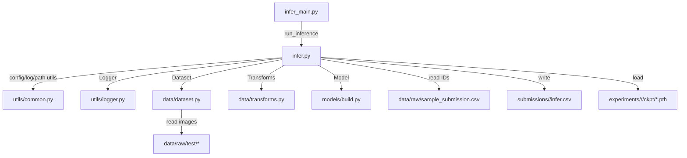
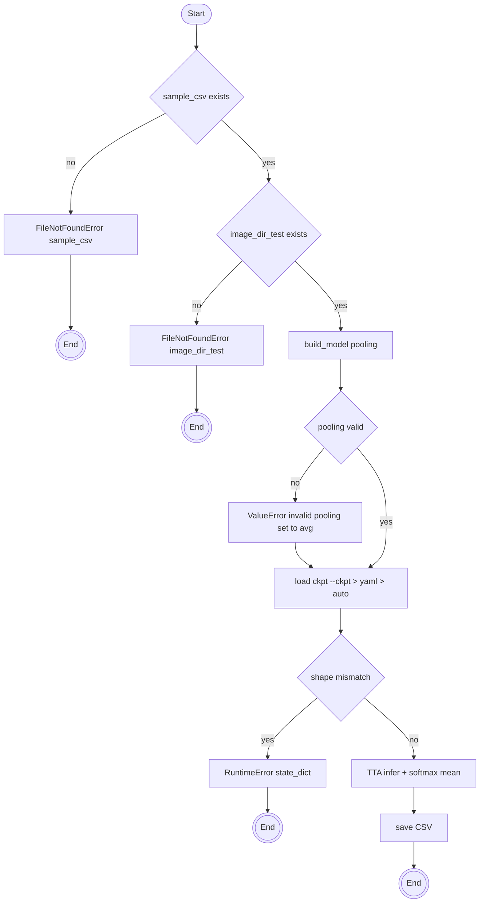

# 📘 Inference Pipeline 실행 가이드

## 1) 실행 명령어

```bash
python -m src.inference.infer_main --config configs/infer.yaml
```

**무슨 뜻?**

- `m src.inference.infer_main` → `src/inference/infer_main.py`를 **엔트리포인트**로 실행
- `-config configs/infer.yaml` → 추론용 **설정 파일** 지정

> ⚙️ 환경 변수(필요 시)
> 
> 
> ```bash
> export PYTHONPATH="$(pwd):$PYTHONPATH"
> ```
> 

---

## 2) 환경 요구사항 & 설치(🧰)

- Python ≥ 3.9 권장
- 핵심 패키지: `torch`, `timm`, `albumentations`, `opencv-python`, `pandas`, `numpy`, `tqdm`, `Pillow`, `torchvision`
- 설치 예시
    
    ```bash
    pip install -r requirements.txt
    ```
    
- NVIDIA GPU 사용 시: CUDA 런타임/드라이버 버전과 설치된 PyTorch CUDA 빌드가 **호환**되어야 함

---

## 3) 실행 전 체크리스트(🧱)

- 🗂️ **데이터**
    - `data/raw/sample_submission.csv` (필수 컬럼: `ID`)
    - `data/raw/test/` (테스트 이미지)
- 🔤 **확장자 처리**
    - CSV `ID`에 확장자가 **있어도/없어도** OK
    - 없으면 `data.image_ext`(예: `.jpg`) → 그래도 없으면 `[".jpg",".jpeg",".png", 대/소문자]` **Fallback**
- 📁 **디렉토리**
    - `logs/`, `submissions/` 등 **부모 폴더 자동 생성**
- 🧪 **체크포인트**
    - `-ckpt` 미지정 시: `experiments/<YYYYMMDD>/<run_name>/ckpt/best_fold0.pth` **자동 탐색**
- 🧬 **일관성**
    - 검증/추론 변환은 `build_valid_tfms(img_size)` → **학습의 img_size와 동일**해야 함

---

## 4) 실행 커맨드 & 옵션 (CLI)

```bash
# 기본
python -m src.inference.infer_main --config configs/infer.yaml

# ckpt/out 명시
python -m src.inference.infer_main \
  --config configs/infer.yaml \
  --ckpt experiments/20250904/v087-8c206e/ckpt/best_fold0.pth \
  --out  submissions/20250904/infer.csv
```

**옵션 우선순위(🔽 높은 → 낮은)**

1. CLI `-ckpt` / `-out`
2. YAML `ckpt.path` / `inference.out_csv`
3. 자동 규칙 경로(ckpt): `experiments/<날짜>/<run_name>/ckpt/best_fold0.pth`

**종료 코드**: 정상 `0` / 사용자 중단 `130` / 예외 `1`

---

## 5) 설정 파일 맵핑 (예: `configs/infer.yaml`)

```yaml
project: { run_name, device, num_workers, date_format, time_format }
data:    { sample_csv, image_dir_test, image_ext, id_col, target_col, num_classes }
model:   { name, pretrained, drop_rate, drop_path_rate, pooling }
inference: { tta, tta_rot_degrees, out_csv }
ckpt:    { path }
output:  { logs_dir, exp_dir, snapshots }
```

**핵심 포인트**

- `data.sample_csv`에서 **ID를 읽어** 추론 대상 결정
- `dataset`이 **확장자 Fallback** 지원
- `model.pooling`은 유효 값만 허용(잘못되면 `avg` 강제), `num_classes>0` + `pooling=None` **금지**
- `inference.tta=true`이면 `tta_rot_degrees` 각도별 **softmax 확률 평균**

> 📌 경로는 config 파일 기준 상대경로 사용 권장
> 
> 
> (예: `configs/infer.yaml` 기준 `../data/raw/test` → 레포 루트 `data/raw/test`)
> 

---

## 6) 내부 흐름(모듈 & 호출 순서)

### (1) 엔트리포인트: `src/inference/infer_main.py`

1. `argparse`: `-config/--ckpt/--out`
2. `run_inference(config, out, ckpt)` 호출
3. 종료 코드 출력

### (2) 파이프라인: `src/inference/infer.py → run_inference(...)`

1. **Config 로드** & **Logger 시작**(표준 출력 리디렉트, 파일 로그 기록)
2. **경로 검증**: `require_file(sample_csv)`, `require_dir(image_dir_test)`
3. **CSV 로드**: `ID` 목록 확보
4. **Dataset/DataLoader**: `DocClsDataset` + `build_valid_tfms(img_size)`
5. **모델 빌드**: `build_model(name, num_classes, pretrained, drop_rate, drop_path_rate, pooling)` → `.eval()`
6. **ckpt 로드**: CLI > YAML > 자동 규칙 경로
7. **TTA 추론**: 각 `deg` → `_rotate_tensor` → `softmax` → **확률 평균**
8. **CSV 저장**: `ID,target` (부모 폴더 자동 생성)
9. **종료 로그**: 성공/실패/중단 코드 및 마커

---

## 7) 파일 간 관계(의존 다이어그램)



---

## 8) 결과물 & 디렉토리 구조(🧪)

```
submissions/
└── 20250904/
    └── infer.csv
logs/
└── infer/
    └── infer_<run_name>.log
```

**CSV 스키마**

```
ID,target
0001,3
0002,7
...
```

- `ID`: sample CSV 그대로
- `target`: 예측 클래스(0 ~ num_classes-1)

---

## 9) TTA 설계(🧭)

- `inference.tta: true` → `tta_rot_degrees`(예: `[0, -3, 3]`) 순회
- 각도별 **모델 추론** → `softmax` 확률 **누적/평균** → `argmax`
- 📌 문서 이미지 특성상 **소각(±3~6도)**부터 점증 권장
    
    90° 단위 강회전은 텍스트 방향성에 민감(성능 저하 가능)
    

---

## 10) 성능/리소스 튜닝(⚡)

- **DataLoader**
    - `project.num_workers`: 디스크·CPU 상황에 맞게 조정(병목 시 과도 증가는 역효과)
    - `pin_memory=True` 유지, 큰 배치가 가능하면 **추론 전용 배치 크기 키**를 도입해 속도 ↑
- **입력 크기**
    - 학습/검증/추론 `img_size` 일치가 **정답**
    - 제출 직전에는 `img_size` 다운스케일로 속도-정확도 트레이드오프 평가
- **I/O 최적화**
    - 이미지가 대용량이면 **이미지 캐시**(e.g., LMDB) 검토
    - 네트워크 스토리지 사용 시 Prefetch/로컬 캐시
- **락/메모리**
    - OOM 발생 시: 배치 축소, `num_workers` 축소, 불필요한 텐서 즉시 `del` 및 `torch.cuda.empty_cache()` 주기적 호출(필요 시)

---

## 11) 로그 분석 팁(🔎)

- ⭐ 시작/경로/설정:
    - `[PATH] OK ...` : CSV/이미지 경로 검증 통과
    - `[DATA] test size=...` : 샘플 수 확인
    - `[CKPT] loaded: ...` : 가중치 정상 로드
- ✅ 체크포인트:
    - `[CKPT] loaded: .../best_fold0.pth` : 최고 성능 체크포인트
- 🔁 진행률:
    - `[INFER] step i/total processed` : 대략적인 남은 시간 감
- 🏁 결과/종료:
    - `[OUT] submission saved: ... | shape=(N, 2)`
    - `[EXIT] INFERENCE SUCCESS code=0`

**빠른 추출 예시**

```bash
# 가장 중요한 라인만 추출
grep -E "^\[PATH\]|\[CKPT\]|\[OUT\]|\[EXIT\]" logs/infer/infer_*.log
```

---

## 12) 에러 플로우(🧯)



---

## 14) TTA 각도 실험

```yaml
# configs/infer.yaml
inference:
  tta: true
  tta_rot_degrees: [0, -3, 3, 6]
```

> 과도한 각도는 속도/성능 모두 악영향 가능 → 소각부터 점증
> 

---

## 15) FAQ(❓)

- **Q. `-ckpt` 없이도 되나요?**
    
    A. 네. YAML의 `ckpt.path` 또는 자동 규칙 경로를 순차적으로 탐색합니다. 없으면 에러.
    
- **Q. `ID`에 확장자가 섞여 있어도?**
    
    A. 네. 이미 확장자가 있으면 그대로 사용, 없으면 기본 확장자 → Fallback 순으로 탐색합니다.
    
- **Q. 클래스 개수가 다른 ckpt 로딩 에러?**
    
    A. `model.num_classes/pooling/백본`이 학습 당시 설정과 일치해야 합니다.
    
- **Q. 추론 배치 크기 어디서 바꾸나요?**
    
    A. 현재 학습 설정(`train.batch_size`)을 재사용합니다. 추론 전용 키를 YAML에 추가해 오버라이드하는 것을 권장합니다.
    

---

## 16) 테스트 전/제출 전 최종 체크(✅)

- [ ]  `sample_csv` **존재** & `ID` 컬럼 확인
- [ ]  `image_dir_test` **존재** & 실제 이미지 파일 확인
- [ ]  확장자/대소문자(Fallback) 동작 이해
- [ ]  `model.name/num_classes/pooling`이 ckpt와 **일치**
- [ ]  `img_size`(학습/검증/추론) **일치**
- [ ]  `-out` 또는 `inference.out_csv` 경로 **쓰기 권한**
- [ ]  제출 스키마 `ID,target` + 헤더 + `index=False`

---

## 17) 트러블슈팅(증상 → 조치)

- ❌ `FileNotFoundError: ...sample_submission.csv`
    
    → `configs/infer.yaml`에서 **config 기준 상대경로** 확인, 철자/대소문자 점검
    
- ❌ `FileNotFoundError: .../test`
    
    → 테스트 폴더/이미지 실존 여부 확인
    
- ❌ 이미지 로드 실패
    
    → 확장자/대소문자 불일치. 폴더에 파일 자체가 없으면 Fallback도 실패
    
- ❌ `RuntimeError: state_dict`
    
    → ckpt와 모델 구조 불일치. `name/num_classes/pooling` 재확인
    
- ❌ `ValueError: pooling(None) + num_classes>0`
    
    → `pooling: "avg"`로 수정
    

---

### 부록) 로그 예시(요약)

```
[BOOT] inference pipeline started
[PATH] OK | sample_csv=... | image_dir_test=...
[CFG] data=..., model=..., inference=...
[CKPT] loaded: .../best_fold0.pth
[TTA] enabled=True degs=[0, -3, 3]
[INFER] >>> start
[INFER] step 20/XXX processed
[OUT] submission saved: submissions/20250904/infer.csv | shape=(N, 2)
[INFER] <<< finished successfully
[EXIT] INFERENCE SUCCESS code=0
```