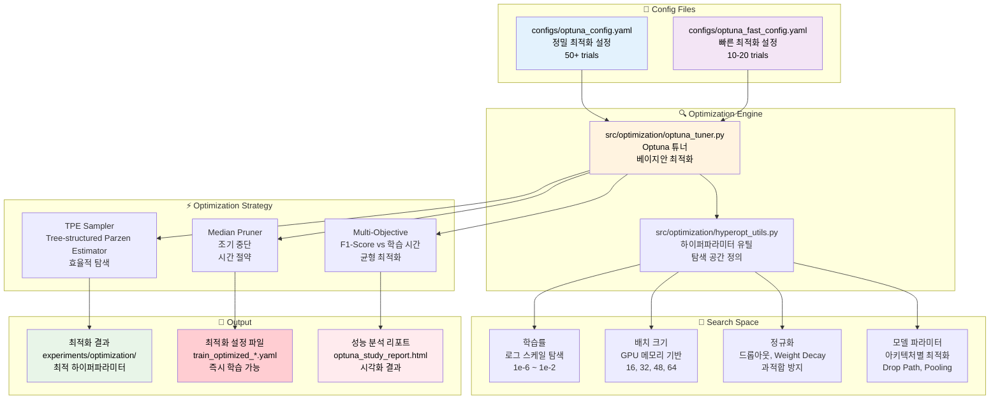
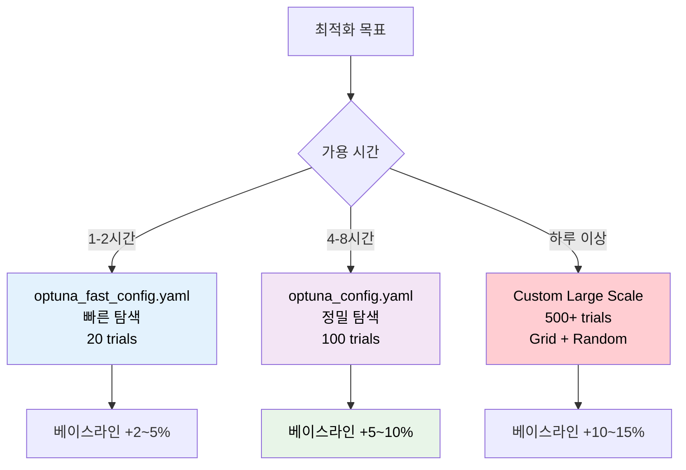
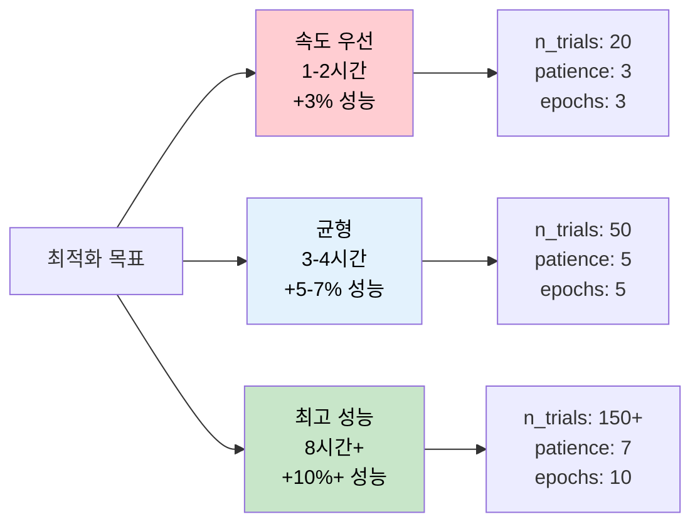

# 📈 최적화 설정 파일 생성 완전 가이드

## 📋 목차

1. [최적화 파이프라인 아키텍처](#최적화-파이프라인-아키텍처)
2. [설정 파일 구조 분석](#설정-파일-구조-분석)
3. [설정값 상세 가이드](#설정값-상세-가이드)
4. [Optuna 하이퍼파라미터 탐색](#optuna-하이퍼파라미터-탐색)
5. [실무 예제 템플릿](#실무-예제-템플릿)
6. [성능 최적화 전략](#성능-최적화-전략)
7. [문제해결 가이드](#문제해결-가이드)

---

## 🏗️ 최적화 파이프라인 아키텍처



---

## 📊 설정 파일 구조 분석

### 📋 최적화 설정 파일 비교표

| 설정 파일 | 목적 | Trial 수 | 예상 시간 | 탐색 정밀도 | 권장 사용처 |
|---------|-----|---------|---------|----------|----------|
| `optuna_config.yaml` | 정밀 최적화 | 50-100 | 4-8시간 | ⭐⭐⭐⭐⭐ | **최종 대회 제출용** |
| `optuna_fast_config.yaml` | 빠른 탐색 | 10-20 | 1-2시간 | ⭐⭐⭐⭐ | 프로토타입, 실험 |

### 🎯 최적화 전략 선택 가이드



---

## 📖 설정값 상세 가이드

### 1. 🎯 **optuna** 섹션 - 핵심 최적화 설정

```yaml
optuna:
  enabled: true                           # ✅ Optuna 최적화 활성화
  n_trials: 100                          # 🔄 시도 횟수 (정밀도↔시간 트레이드오프)
  timeout: 7200                          # ⏰ 최대 시간 (초단위)
  study_name: "document-classification-optimization"  # 🏷️ 스터디 이름
  direction: "maximize"                   # 📈 최적화 방향 (F1-Score 최대화)
```

#### 📊 n_trials vs 성능 개선 분석

| Trial 수 | 예상 시간 | 성능 개선 | 안정성 | 추천 용도 |
|---------|---------|----------|-------|---------|
| 10 | 30분 | +2% | ⭐⭐ | 빠른 확인 |
| 20 | 1시간 | +3% | ⭐⭐⭐ | 실험용 |
| 50 | 3시간 | +5% | ⭐⭐⭐⭐ | 실무용 |
| 100 | 6시간 | +7% | ⭐⭐⭐⭐⭐ | **대회 제출용** |
| 200+ | 12시간+ | +8%+ | ⭐⭐⭐⭐⭐ | 최종 최적화 |

---

### 2. ✂️ **pruning** 섹션 - 조기 중단 설정

```yaml
pruning:
  enabled: true                           # ✅ 조기 중단 활성화
  patience: 5                            # ⏳ 성능 개선 대기 에포크
  n_startup_trials: 15                   # 🚀 초기 랜덤 탐색 횟수
```

#### 🔧 Pruning 전략 최적화

| Patience | 효과 | 시간 절약 | 정확도 손실 | 권장 상황 |
|----------|-----|---------|----------|---------|
| 3 | 매우 공격적 | 50-70% | 2-3% | 빠른 탐색 |
| 5 | 균형적 | 30-50% | 1-2% | **일반적 사용** |
| 10 | 보수적 | 10-30% | 0-1% | 정밀 최적화 |

---

### 3. ⚡ **quick_validation** 섹션 - 빠른 검증 설정

```yaml
quick_validation:
  epochs: 5                              # 🔄 빠른 검증용 에포크 (시간 단축)
  folds: 3                               # 📂 검증 폴드 수 (5 → 3으로 감소)
  batch_size_override: 32                # 📦 검증용 배치 크기 (메모리 최적화)
```

#### ⚖️ 빠른 검증 vs 정확성 트레이드오프

| 설정 | 검증 시간 | 최적화 정확도 | 권장 사용 |
|-----|---------|------------|---------|
| epochs: 3, folds: 3 | 매우 빠름 | 70-80% | 초기 탐색 |
| epochs: 5, folds: 3 | 빠름 | 80-90% | **균형적** |
| epochs: 10, folds: 5 | 정확 | 95-100% | 최종 검증 |

---

## 🔍 Optuna 하이퍼파라미터 탐색

### 4. 🧪 **search_space** 섹션 - 탐색 공간 정의

#### 📈 **학습률 (Learning Rate) 최적화**

```yaml
search_space:
  learning_rate:
    type: "loguniform"                    # 📊 로그 균등 분포 (필수)
    low: 1e-5                            # 📉 최소값 (대형 모델용)
    high: 5e-3                           # 📈 최대값 (작은 모델용)
```

**🎯 모델별 학습률 가이드:**

| 모델 크기 | 추천 범위 | 최적값 예측 | 특징 |
|---------|----------|----------|------|
| EfficientNet B3 (12M) | 5e-4 ~ 5e-3 | ~1e-3 | 빠른 수렴 |
| ConvNeXt Base (89M) | 1e-5 ~ 1e-3 | ~5e-5 | 안정적 학습 |
| Swin Base (88M) | 1e-5 ~ 1e-3 | ~1e-4 | Transformer 특성 |

#### 📦 **배치 크기 최적화**

```yaml
batch_size:
  type: "categorical"                     # 🎯 카테고리 선택 (GPU 메모리 제약)
  choices: [16, 32, 48, 64]              # RTX 4090 최적화
```

**🖥️ GPU별 배치 크기 권장값:**

| GPU 모델 | 메모리 | 추천 배치 크기 | 최대 안전 크기 | 성능 효율 |
|---------|-------|------------|------------|---------|
| RTX 4090 | 24GB | [32, 48, 64] | 128 | ⭐⭐⭐⭐⭐ |
| RTX 3080 | 10GB | [16, 32, 48] | 64 | ⭐⭐⭐⭐ |
| RTX 3070 | 8GB | [16, 24, 32] | 48 | ⭐⭐⭐ |

#### 🖼️ **이미지 크기 최적화**

```yaml
img_size:
  type: "categorical"                     # 🖼️ 입력 해상도 선택
  choices: [224, 320, 384, 512]          # 성능↔메모리 균형
```

**📐 이미지 크기별 성능 분석:**

| 크기 | 메모리 사용 | 학습 시간 | 예상 성능 | 권장 용도 |
|-----|----------|---------|----------|---------|
| 224 | 기준 × 1 | 기준 × 1 | 기준 + 0% | 빠른 프로토타입 |
| 320 | 기준 × 2.1 | 기준 × 1.8 | 기준 + 2% | 균형적 선택 |
| 384 | 기준 × 3.0 | 기준 × 2.5 | 기준 + 4% | **고성능 권장** |
| 512 | 기준 × 5.3 | 기준 × 4.2 | 기준 + 5% | 최고 성능 |

#### ⚖️ **정규화 파라미터 최적화**

```yaml
# Weight Decay (L2 정규화)
weight_decay:
  type: "uniform"                         # 📊 균등 분포
  low: 0.01                              # 최소 정규화
  high: 0.1                              # 강한 정규화

# Dropout 비율  
dropout:
  type: "uniform"                         # 🌧️ 드롭아웃 확률
  low: 0.01                              # 최소 드롭아웃
  high: 0.15                             # 최대 드롭아웃

# Drop Path (Stochastic Depth)
drop_path:
  type: "uniform"                         # 🛤️ 경로 드롭 확률
  low: 0.0                               # 드롭패스 없음
  high: 0.3                              # 강한 드롭패스 (Transformer용)
```

#### 🎚️ **고급 최적화 파라미터**

```yaml
advanced_params:
  # 라벨 스무딩
  label_smoothing:
    type: "uniform"
    low: 0.05                            # 약간의 스무딩
    high: 0.15                           # 강한 스무딩
  
  # 그래디언트 클리핑
  grad_clip_norm:
    type: "uniform"
    low: 0.8                             # 약한 클리핑
    high: 1.5                            # 강한 클리핑
  
  # Mixup 알파
  mixup_alpha:
    type: "uniform"
    low: 0.4                             # 약한 믹스업
    high: 1.2                            # 강한 믹스업
  
  # 웜업 에포크
  warmup_epochs:
    type: "categorical"
    choices: [0, 1, 2, 3]                # 웜업 전략
```

---

## 🚀 실무 예제 템플릿

### Template 1: ⚡ 빠른 하이퍼파라미터 탐색 (1시간)

```yaml
# configs/optuna_prototype.yaml
optuna:
  enabled: true
  n_trials: 15                           # 빠른 탐색
  timeout: 1800                          # 30분 제한
  study_name: "prototype-optimization"
  direction: "maximize"

pruning:
  enabled: true
  patience: 3                            # 공격적 중단
  n_startup_trials: 5

quick_validation:
  epochs: 3                              # 매우 빠른 검증
  folds: 3
  batch_size_override: 32

search_space:
  learning_rate:
    type: "loguniform"
    low: 1e-4                            # 좁은 범위
    high: 1e-2
    
  batch_size:
    type: "categorical"
    choices: [32, 48]                    # 제한된 선택
    
  weight_decay:
    type: "uniform"
    low: 0.01
    high: 0.05                           # 보수적 범위
```

### Template 2: 🎯 균형적 최적화 (3시간)

```yaml
# configs/optuna_balanced.yaml
optuna:
  enabled: true
  n_trials: 50                           # 균형적 탐색
  timeout: 5400                          # 1.5시간 제한
  study_name: "balanced-optimization"

search_space:
  # 핵심 파라미터 집중 탐색
  learning_rate:
    type: "loguniform"
    low: 5e-6
    high: 5e-3
    
  batch_size:
    type: "categorical"
    choices: [16, 32, 48, 64]
    
  img_size:
    type: "categorical"
    choices: [320, 384]                  # 성능 중심
    
  # 정규화 집중
  dropout:
    type: "uniform"
    low: 0.05
    high: 0.15
    
  drop_path:
    type: "uniform"
    low: 0.05
    high: 0.2
```

### Template 3: 🏆 최고 성능 최적화 (8시간+)

```yaml
# configs/optuna_ultimate.yaml  
optuna:
  enabled: true
  n_trials: 150                          # 대규모 탐색
  timeout: 14400                         # 4시간 제한
  study_name: "ultimate-optimization"

pruning:
  enabled: true
  patience: 7                            # 보수적 중단
  n_startup_trials: 30                   # 충분한 초기 탐색

search_space:
  # 전체 파라미터 공간 탐색
  learning_rate:
    type: "loguniform"
    low: 1e-6                            # 매우 낮은 LR
    high: 1e-2
    
  batch_size:
    type: "categorical"
    choices: [16, 24, 32, 40, 48, 56, 64]  # 세밀한 선택
    
  img_size:
    type: "categorical"
    choices: [224, 288, 320, 384, 448]    # 다양한 해상도
    
  # 고급 파라미터
  advanced_params:
    label_smoothing:
      type: "uniform"
      low: 0.0
      high: 0.2
      
    mixup_alpha:
      type: "uniform"
      low: 0.0
      high: 1.5
      
    grad_clip_norm:
      type: "uniform"
      low: 0.5
      high: 2.0
      
    warmup_epochs:
      type: "categorical"
      choices: [0, 1, 2, 3, 5]
```

### Template 4: 🎮 모델별 특화 최적화

```yaml
# configs/optuna_convnext_specialized.yaml
# ConvNeXt 모델 특화 최적화
optuna:
  study_name: "convnext-base-384-optimization"

search_space:
  # ConvNeXt 특화 파라미터
  learning_rate:
    type: "loguniform"
    low: 1e-5                            # 대형 모델에 맞는 낮은 LR
    high: 5e-4
    
  drop_path:                             # ConvNeXt의 핵심 정규화
    type: "uniform"
    low: 0.1
    high: 0.4
    
  layer_scale:                           # ConvNeXt 전용 파라미터
    type: "uniform"
    low: 1e-6
    high: 1e-4
```

---

## ⚡ 성능 최적화 전략

### 🎯 최적화 목표별 전략



### 📊 파라미터 중요도 분석

| 파라미터 | 성능 영향 | 탐색 우선순위 | 최적화 난이도 |
|---------|----------|------------|------------|
| **learning_rate** | ⭐⭐⭐⭐⭐ | 1순위 | 보통 |
| **batch_size** | ⭐⭐⭐⭐ | 2순위 | 쉬움 |
| **img_size** | ⭐⭐⭐⭐ | 3순위 | 쉬움 |
| **weight_decay** | ⭐⭐⭐ | 4순위 | 보통 |
| **dropout** | ⭐⭐⭐ | 5순위 | 보통 |
| **drop_path** | ⭐⭐ | 6순위 | 어려움 |
| **label_smoothing** | ⭐⭐ | 7순위 | 쉬움 |

### 🔧 GPU 메모리별 최적화 전략

#### RTX 4090 (24GB) - 최고 성능 전략
```yaml
search_space:
  batch_size:
    choices: [48, 64, 80, 96]            # 대용량 배치
  img_size:
    choices: [384, 448, 512]             # 고해상도
  model_parallel: true                   # 모델 병렬화
```

#### RTX 3080 (10GB) - 균형 전략  
```yaml
search_space:
  batch_size:
    choices: [24, 32, 40, 48]            # 중간 배치
  img_size:
    choices: [320, 384]                  # 균형 해상도
  mixed_precision: true                  # 혼합 정밀도 필수
```

#### RTX 3070 (8GB) - 효율성 전략
```yaml
search_space:
  batch_size:
    choices: [16, 20, 24]                # 작은 배치
  img_size:
    choices: [224, 288, 320]             # 낮은 해상도
  gradient_checkpointing: true           # 메모리 절약
```

---

## 🔧 문제해결 가이드

### ❌ 자주 발생하는 오류들

#### 1. **Optuna 스터디 생성 실패**
```bash
sqlalchemy.exc.OperationalError: database is locked
```
**해결 방법:**
```yaml
# 스터디명을 고유하게 변경
optuna:
  study_name: "optimization_$(date +%Y%m%d_%H%M)"

# 또는 기존 스터디 삭제
# rm -rf optuna_studies/
```

#### 2. **Trial 조기 중단 과다**
```bash
INFO: Trial was pruned at epoch 2
```
**해결 방법:**
```yaml
pruning:
  enabled: true
  patience: 7                            # 더 관대한 설정
  n_startup_trials: 20                   # 초기 탐색 증가
```

#### 3. **메모리 부족으로 Trial 실패**
```bash
RuntimeError: CUDA out of memory
```
**해결 방법:**
```yaml
quick_validation:
  batch_size_override: 16                # 배치 크기 감소
  
search_space:
  batch_size:
    choices: [8, 16, 24]                 # 작은 배치들로 제한
```

#### 4. **하이퍼파라미터 탐색 공간 오류**
```bash
ValueError: low >= high in uniform distribution
```
**해결 방법:**
- `low` < `high` 확인
- 타입별 적절한 범위 설정

### 🎯 최적화 성능 디버깅

#### 📊 **Optuna 결과 분석**
```bash
# 최적화 결과 확인
python -c "
import optuna
study = optuna.load_study(study_name='your_study_name', storage='sqlite:///optuna_studies/optuna.db')
print('Best trial:')
print(f'  Value: {study.best_trial.value:.4f}')
print(f'  Params: {study.best_trial.params}')
"

# 상위 10개 Trial 확인
python -c "
import optuna
study = optuna.load_study(study_name='your_study_name', storage='sqlite:///optuna_studies/optuna.db')
trials_df = study.trials_dataframe()
top_10 = trials_df.nlargest(10, 'value')
print(top_10[['value', 'params_learning_rate', 'params_batch_size']].to_string())
"
```

#### 🔍 **최적화 시각화**
```bash
# Optuna Dashboard 실행
optuna-dashboard sqlite:///optuna_studies/optuna.db

# 파라미터 중요도 분석
python -c "
import optuna
study = optuna.load_study(study_name='your_study_name', storage='sqlite:///optuna_studies/optuna.db')
importance = optuna.importance.get_param_importances(study)
for param, imp in importance.items():
    print(f'{param}: {imp:.4f}')
"
```

#### ⚡ **최적화 속도 향상**
```bash
# 병렬 최적화 (멀티 프로세스)
python src/optimization/optuna_optimize.py --config configs/optuna_config.yaml --n-jobs 4

# GPU별 병렬 실행
CUDA_VISIBLE_DEVICES=0 python src/optimization/optuna_optimize.py --config configs/optuna_config.yaml &
CUDA_VISIBLE_DEVICES=1 python src/optimization/optuna_optimize.py --config configs/optuna_config.yaml &
```

### 📈 성능 향상 체크리스트

#### 🎯 **탐색 공간 최적화**
- [ ] **학습률**: 로그 스케일, 모델 크기에 맞는 범위
- [ ] **배치 크기**: GPU 메모리에 맞는 범위
- [ ] **이미지 크기**: 성능↔메모리 균형
- [ ] **정규화**: 과적합 방지용 파라미터

#### ⚡ **실행 효율성**
- [ ] **Pruning**: 조기 중단으로 시간 절약
- [ ] **빠른 검증**: epoch/fold 수 최적화
- [ ] **병렬 실행**: 멀티 GPU 활용
- [ ] **캐싱**: 중복 계산 방지

#### 📊 **결과 검증**
- [ ] **교차 검증**: 과적합 방지
- [ ] **안정성**: 여러 번 실행 결과 일관성
- [ ] **일반화**: 다른 데이터셋 성능
- [ ] **실제 추론**: 최적화 결과 실제 적용

---

## 📚 실행 가이드

### 🚀 기본 실행 명령어

```bash
# 빠른 최적화 (1시간)
python src/optimization/optuna_tuner.py --config configs/optuna_fast_config.yaml

# 정밀 최적화 (4시간)  
python src/optimization/optuna_tuner.py --config configs/optuna_config.yaml

# 최적화 결과로 학습 실행
python src/training/train_main.py --config experiments/optimization/20250910/train_optimized_20250910_1234.yaml
```

### 📊 결과 분석 및 활용

```bash
# 최적화 결과 시각화
python -c "
import optuna
study = optuna.load_study(study_name='document-classification-optimization')
fig = optuna.visualization.plot_optimization_history(study)
fig.write_html('optimization_history.html')
"

# 최적 파라미터 추출
python -c "
import optuna, yaml
study = optuna.load_study(study_name='document-classification-optimization')
best_params = study.best_trial.params
print('최적 파라미터:')
print(yaml.dump(best_params, default_flow_style=False))
"
```

---

## 🏆 성공적인 최적화 가이드

### Phase 1: 탐색적 최적화 (1-2시간)
1. **빠른 탐색**: `optuna_fast_config.yaml` 사용
2. **파라미터 중요도**: 영향력 큰 파라미터 식별
3. **베이스라인**: 현재 성능 대비 개선 폭 확인

### Phase 2: 집중적 최적화 (4-6시간)
1. **정밀 탐색**: `optuna_config.yaml` 사용
2. **범위 조정**: 1단계 결과로 탐색 범위 축소
3. **안정성 검증**: 상위 여러 파라미터 조합 검증

### Phase 3: 최종 최적화 (8시간+)
1. **대규모 탐색**: 500+ trials 실행
2. **앙상블 최적화**: 여러 최적 파라미터 조합
3. **실전 검증**: 실제 추론 파이프라인에서 성능 확인

---

## 📚 참고 자료

- [Optuna 공식 문서](https://optuna.readthedocs.io/)
- [하이퍼파라미터 튜닝 베스트 프랙티스](../../notebooks/optimization/)
- [GPU 최적화 가이드](../GPU_최적화_가이드.md)
- [학습 설정 가이드](./학습_설정_파일_생성_가이드.md)