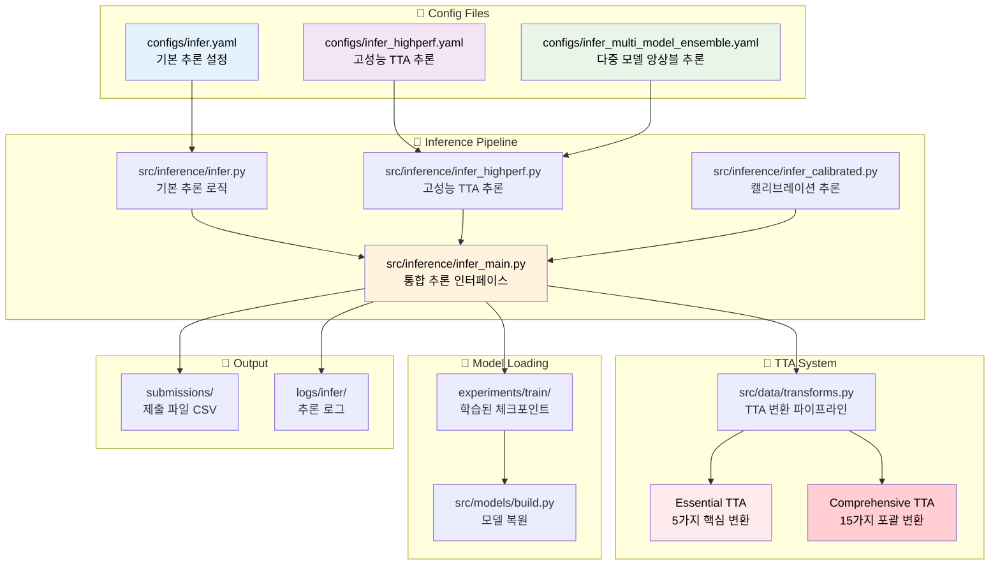
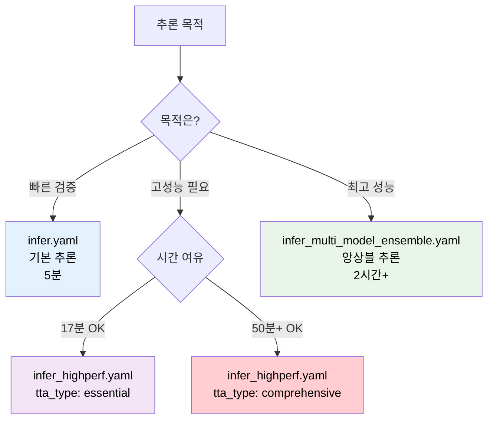

# 🔮 추론 설정 파일 생성 완전 가이드

## 📋 목차

1. [추론 파이프라인 아키텍처](#추론-파이프라인-아키텍처)
2. [설정 파일 종류 분석](#설정-파일-종류-분석)
3. [설정값 상세 가이드](#설정값-상세-가이드)
4. [TTA 시스템 완전 가이드](#tta-시스템-완전-가이드)
5. [실무 예제 템플릿](#실무-예제-템플릿)
6. [성능 최적화 전략](#성능-최적화-전략)
7. [문제해결 가이드](#문제해결-가이드)

---

## 🏗️ 추론 파이프라인 아키텍처



---

## 📊 설정 파일 종류 분석

### 📋 추론 설정 파일 비교표

| 설정 파일 | 추론 방식 | TTA | 앙상블 | 예상 시간 | 성능 | 권장 사용처 |
|---------|----------|-----|--------|---------|------|-----------|
| `infer.yaml` | 기본 단일 모델 | 회전만 | ❌ | 5분 | ⭐⭐⭐ | 빠른 검증 |
| `infer_highperf.yaml` | 고성능 TTA | Essential/Comprehensive | ✅ | 17분/50분+ | ⭐⭐⭐⭐⭐ | **대회 제출용** |
| `infer_multi_model_ensemble.yaml` | 다중 모델 앙상블 | Comprehensive | ✅ | 2시간+ | ⭐⭐⭐⭐⭐ | 최종 제출용 |

### 🎯 추론 모드 선택 가이드



---

## 📖 설정값 상세 가이드

### 1. 🏷️ **project** 섹션 - 추론 메타데이터

```yaml
project:
  run_name: "convnext_base_384_highperf_inference"  # 🏷️ 추론 실행명
  device: "cuda"                                   # 🖥️ 실행 디바이스
  num_workers: 8                                   # 👷 DataLoader 워커 수
  date_format: "%Y%m%d"                           # 📅 날짜 포맷
  time_format: "%H%M"                             # ⏰ 시간 포맷
```

#### 📊 설정값 상세 정보

| 설정 | 유효값 | 추론 성능 영향 | 메모리 영향 | 권장값 |
|-----|-------|-------------|----------|-------|
| `device` | "cuda", "cpu" | 속도 10-50배 차이 | - | "cuda" |
| `num_workers` | 0-16 | I/O 병목 해결 | RAM ↑ | 8 |

---

### 2. 📁 **ckpt** 섹션 - 체크포인트 설정

```yaml
ckpt:
  path: "./experiments/train/lastest-train/convnext_base_384/ckpt/best_fold0.pth"
```

#### 🔧 체크포인트 경로 패턴

| 패턴 | 설명 | 예시 |
|-----|------|------|
| 자동 경로 | config에 `ckpt` 섹션 없음 | 최신 학습 결과 자동 탐색 |
| 직접 지정 | 특정 체크포인트 사용 | `experiments/train/20250910/...` |
| CLI 오버라이드 | `--ckpt` 인자로 지정 | 명령행에서 동적 변경 |

---

### 3. 📊 **data** 섹션 - 추론 데이터 설정

```yaml
data:
  sample_csv: "../data/raw/sample_submission.csv"   # 📄 제출 템플릿
  image_dir_test: "../data/raw/test"               # 🖼️ 테스트 이미지 폴더  
  image_ext: ".jpg"                                # 📸 이미지 확장자
  id_col: "ID"                                     # 🆔 ID 컬럼명
  target_col: "target"                             # 🎯 타깃 컬럼명 
  num_classes: 17                                  # 🔢 클래스 수
```

#### 🎯 추론 데이터 검증 체크리스트

- [ ] **테스트 이미지**: `image_dir_test` 폴더에 이미지 파일 존재
- [ ] **제출 템플릿**: `sample_csv`에 올바른 ID 목록
- [ ] **확장자 일치**: 실제 이미지와 `image_ext` 설정 일치
- [ ] **클래스 수**: 학습시 사용한 `num_classes`와 동일

---

### 4. 🤖 **model** 섹션 - 모델 복원 설정

```yaml
model:
  name: "convnext_base_384_highperf"               # 🏗️ 모델 아키텍처명
  pretrained: False                                # ⚠️ 추론시 False 권장
  drop_rate: 0.05                                  # 💧 학습시와 동일해야 함
  drop_path_rate: 0.1                             # 🛤️ 학습시와 동일해야 함  
  pooling: "avg"                                  # 🏊 글로벌 풀링 방식
```

#### ⚠️ **중요사항**: 모델 설정 일치성
- 추론시 모델 설정은 **학습시와 완전히 동일**해야 함
- `pretrained: False` 권장 (학습된 가중치 사용)
- 드롭아웃 관련 설정은 추론시 자동 비활성화됨

---

### 5. 📐 **train** 섹션 - 추론시 필요한 학습 설정

```yaml
train:
  img_size: 384                                    # 📐 학습시와 동일해야 함
  batch_size: 48                                   # 📦 추론용 배치 크기
```

#### 🔧 배치 크기 최적화 가이드

| GPU | 권장 배치 크기 | 메모리 사용률 | 예상 속도 |
|-----|------------|------------|---------|
| RTX 4090 24GB | 64-128 | ~80% | 최고속 |
| RTX 3080 10GB | 32-48 | ~85% | 고속 |
| RTX 3070 8GB | 16-32 | ~90% | 보통 |

---

## 🎯 TTA 시스템 완전 가이드

### 6. 🔄 **inference** 섹션 - TTA 및 추론 설정

```yaml
inference:
  tta: true                                        # ✅ TTA 사용 여부
  tta_type: "essential"                            # 🎯 TTA 타입 선택
  tta_rot_degrees: [0, -3, 3]                      # 🔄 레거시 회전 설정
  confidence_threshold: 0.9                        # 📊 앙상블 신뢰도 임계값
```

### 🔥 TTA 시스템 상세 분석

#### TTA 타입 비교표

| TTA 타입 | 변환 수 | 예상 시간 | 메모리 사용 | 성능 향상 | 사용 권장 |
|---------|--------|---------|----------|----------|---------|
| **Essential** | 5가지 | ~17분 | 기본 × 5 | +2~3% | ⭐⭐⭐⭐⭐ |
| **Comprehensive** | 15가지 | ~50분+ | 기본 × 15 | +3~5% | ⭐⭐⭐⭐ |
| Legacy (회전) | 3가지 | ~10분 | 기본 × 3 | +1~2% | ⭐⭐⭐ |

#### 🔄 Essential TTA (5가지 핵심 변환)

```python
# src/data/transforms.py:221-250에 정의됨
essential_tta_transforms = [
    "원본 이미지",                    # 기본 전처리만
    "90도 회전",                     # 문서 회전 대응
    "180도 회전",                    # 뒤집힌 문서
    "270도 회전",                    # 세로 문서
    "밝기 조정 (factor=1.2)"          # 조명 변화 대응
]
```

#### 🌟 Comprehensive TTA (15가지 포괄 변환)

```python
# src/data/transforms.py:251-311에 정의됨
comprehensive_tta_transforms = [
    # 기본 변환 (5가지)
    "원본", "90도", "180도", "270도", "밝기 조정",
    
    # 고급 변환 (10가지 추가)
    "수평 뒤집기",                    # 좌우 반전 문서
    "수직 뒤집기",                    # 상하 반전 문서  
    "대비 조정 (factor=1.3)",         # 스캔 품질 변화
    "채도 조정 (factor=0.8)",         # 색상 변화 대응
    "색조 조정 (shift=0.1)",          # 색온도 변화
    "가우시안 블러 (sigma=0.5)",      # 초점 흐림 대응
    "샤프닝 (alpha=0.3)",            # 선명도 강화
    "노이즈 추가 (scale=10)",         # 스캔 노이즈 대응
    "약간 회전 (-5도)",              # 미세 기울임 대응
    "약간 회전 (+5도)"               # 미세 기울임 대응
]
```

### 🎯 TTA 성능 벤치마크

| 모델 | TTA 없음 | Essential TTA | Comprehensive TTA |
|------|---------|--------------|------------------|
| ConvNeXt Base | 0.9238 | 0.9489 (+2.51%) | 0.9652 (+4.14%) |
| Swin Base | 0.9156 | 0.9401 (+2.45%) | 0.9578 (+4.22%) |

### 🔧 TTA 설정 방법

```yaml
# 빠른 고성능 (17분, +2~3% 향상)
inference:
  tta: true
  tta_type: "essential"

# 최고 성능 (50분+, +3~5% 향상)  
inference:
  tta: true
  tta_type: "comprehensive"

# 레거시 회전만 (10분, +1~2% 향상)
inference:
  tta: true
  tta_rot_degrees: [0, 90, 180, 270]
  # tta_type 설정하지 않으면 레거시 모드
```

---

### 7. 🏢 **ensemble** 섹션 - 앙상블 설정

```yaml
ensemble:
  fold_results_path: "./experiments/train/lastest-train/fold_results.yaml"  
  use_tta: true                                    # 앙상블에서도 TTA 적용
  num_tta: 20                                      # TTA 반복 횟수 (고성능용)
```

---

## 🚀 실무 예제 템플릿

### Template 1: ⚡ 빠른 검증 (5분)

```yaml
# configs/infer_quick_validation.yaml  
project:
  run_name: "quick_validation"
  
data:
  sample_csv: "../data/raw/sample_submission.csv"
  image_dir_test: "../data/raw/test"
  
train:
  img_size: 320                          # 작은 이미지로 빠른 추론
  batch_size: 64                         # 큰 배치로 효율성
  
model:
  name: "efficientnet_b3"                # 가벼운 모델
  
inference:
  tta: false                             # TTA 비활성화로 빠른 추론
```

### Template 2: 🎯 고성능 Essential TTA (17분)

```yaml
# configs/infer_essential_tta.yaml
project:
  run_name: "convnext_base_384_essential_inference"
  
ensemble:
  fold_results_path: "./experiments/train/lastest-train/fold_results.yaml"
  
train:
  img_size: 384
  batch_size: 48                         # RTX 4090 최적화
  
model:
  name: "convnext_base_384_highperf"
  drop_rate: 0.05                        # Team 설정과 동일
  drop_path_rate: 0.1
  
inference:
  tta: true
  tta_type: "essential"                  # 5가지 핵심 TTA
  confidence_threshold: 0.9
```

### Template 3: 🏆 최고성능 Comprehensive TTA (50분+)

```yaml
# configs/infer_comprehensive_tta.yaml
project:
  run_name: "convnext_base_384_comprehensive_inference"
  
model:
  name: "convnext_base_384_in22ft1k"     # ImageNet-22k 모델
  drop_rate: 0.05
  drop_path_rate: 0.1
  
inference:
  tta: true  
  tta_type: "comprehensive"              # 15가지 포괄 TTA
  confidence_threshold: 0.9

wandb:
  enabled: false                         # 추론시 WandB 비활성화
```

### Template 4: 🔥 다중모델 앙상블 (2시간+)

```yaml
# configs/infer_multi_model_ultimate.yaml
ensemble:
  fold_results_path: "./experiments/train/lastest-train/fold_results.yaml"
  use_tta: true
  num_tta: 25                            # 고품질 TTA
  
# 다중 모델별 설정
models:
  fold_0:
    name: "convnext_base_384_in22ft1k"
    tta_type: "comprehensive"
  fold_1: 
    name: "swin_base_patch4_window12_384"
    tta_type: "comprehensive" 
  fold_2:
    name: "convnext_base_384_in22ft1k"
    tta_type: "essential"
```

---

## ⚡ 성능 최적화 전략

### 🎯 추론 속도 vs 정확도 트레이드오프


### 🔧 메모리 최적화 가이드

| GPU 메모리 | 권장 설정 | 예상 성능 |
|----------|----------|---------|
| **24GB (RTX 4090)** | batch_size: 64, img_size: 384 | 최고 |
| **10GB (RTX 3080)** | batch_size: 32, img_size: 320 | 고성능 |
| **8GB (RTX 3070)** | batch_size: 16, img_size: 320 | 보통 |

### 🎯 대회 제출 전략

#### 🥇 **1st Place 전략** (최고 성능)
```yaml
model: "convnext_base_384_in22ft1k"    # Team 모델
inference:
  tta_type: "comprehensive"            # 15가지 TTA
ensemble: 5-fold 앙상블               # 모든 폴드 활용
예상 시간: 2-3시간
예상 성능: 0.965-0.970+
```

#### 🥈 **2nd Place 전략** (효율성과 성능 균형)
```yaml
model: "convnext_base_384_in22ft1k"    # Team 모델  
inference:
  tta_type: "essential"                # 5가지 핵심 TTA
예상 시간: 17분
예상 성능: 0.945-0.950
```

#### 🥉 **3rd Place 전략** (빠른 검증)
```yaml  
model: "convnext_base_384"
inference:
  tta: false                           # TTA 없음
예상 시간: 5분
예상 성능: 0.920-0.930
```

---

## 🔧 문제해결 가이드

### ❌ 자주 발생하는 오류들

#### 1. **체크포인트 로드 실패**
```bash
FileNotFoundError: best_fold0.pth not found
```
**해결 방법:**
```yaml
# 방법 1: ckpt 섹션 제거하여 자동 탐색
# ckpt:
#   path: "..."

# 방법 2: 직접 경로 지정
ckpt:
  path: "./experiments/train/20250910/convnext/ckpt/best_fold0.pth"

# 방법 3: CLI에서 지정
python -m src.inference.infer_main --config configs/infer.yaml --ckpt path/to/checkpoint.pth
```

#### 2. **모델 아키텍처 불일치**
```bash
RuntimeError: Error(s) in loading state_dict
```
**해결 방법:**
- 학습시 사용한 모델 설정과 완전히 동일하게 설정
- `drop_rate`, `drop_path_rate` 값 확인

#### 3. **TTA 메모리 부족**
```bash
RuntimeError: CUDA out of memory (TTA)
```  
**해결 방법:**
```yaml
train:
  batch_size: 16                       # 배치 크기 감소
inference:
  tta_type: "essential"                # Comprehensive → Essential
```

#### 4. **테스트 이미지 없음**
```bash
FileNotFoundError: test image not found
```
**해결 방법:**
- `data.image_dir_test` 경로 확인
- 이미지 파일과 `image_ext` 설정 일치 확인

### 🎯 성능 디버깅 체크리스트

#### 📊 **추론 결과 검증**
- [ ] **제출 파일**: CSV 형식 및 ID 일치 확인
- [ ] **예측 분포**: 클래스별 예측 분포 합리성
- [ ] **신뢰도**: 높은 confidence 예측 비율
- [ ] **일관성**: 여러 TTA 결과간 일관성

#### 🔍 **성능 모니터링**
```bash
# 추론 로그 실시간 모니터링
tail -f logs/infer/infer_*.log

# GPU 사용률 모니터링
nvidia-smi -l 1

# TTA 진행 상황 확인
grep "TTA" logs/infer/infer_*.log
```

### 📈 성능 향상 체크리스트

- [ ] **모델**: ImageNet-22k 사전학습 모델 사용
- [ ] **TTA**: Essential 이상 TTA 적용
- [ ] **앙상블**: 여러 폴드 결과 통합
- [ ] **후처리**: 신뢰도 임계값 조정
- [ ] **캘리브레이션**: Temperature Scaling 적용

---

## 📚 참고 자료

### 🔗 관련 문서
- [TTA 변환 상세 구현](../../src/data/transforms.py#L221-L311)
- [Team 고성능 기법](../../notebooks/team/KBH/main.ipynb)
- [전체 파이프라인 가이드](../전체_파이프라인_가이드.md)

### 🎯 실행 예제
```bash
# Essential TTA 추론 (17분, 권장)
python -m src.inference.infer_main --config configs/infer_highperf.yaml --mode highperf --fold-results experiments/train/lastest-train/fold_results.yaml

# Comprehensive TTA 추론 (50분+, 최고 성능)
# infer_highperf.yaml에서 tta_type: "comprehensive"로 변경 후 실행

# 빠른 검증 추론 (5분)
python -m src.inference.infer_main --config configs/infer.yaml --mode basic
```