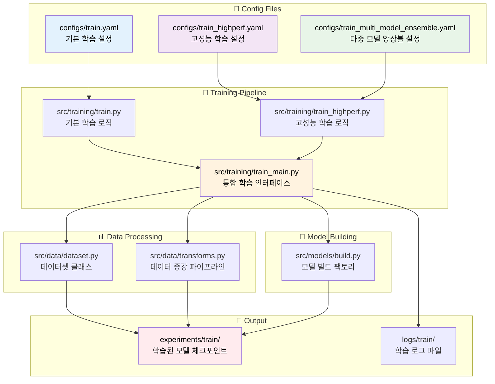
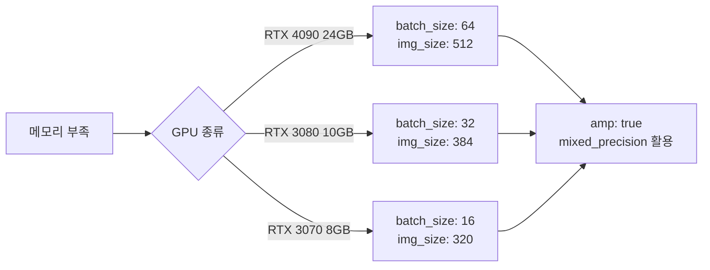

# 🎓 학습 설정 파일 생성 완전 가이드

## 📋 목차

1. [학습 파이프라인 아키텍처](#학습-파이프라인-아키텍처)
2. [설정 파일 구조 분석](#설정-파일-구조-분석)
3. [설정값 상세 가이드](#설정값-상세-가이드)
4. [실무 예제 템플릿](#실무-예제-템플릿)
5. [성능 최적화 팁](#성능-최적화-팁)
6. [문제해결 가이드](#문제해결-가이드)

---

## 🏗️ 학습 파이프라인 아키텍처



---

## 🔍 설정 파일 구조 분석

### 📋 학습 설정 파일 종류

| 설정 파일 | 용도 | 특징 | 권장 사용처 |
|---------|-----|------|----------|
| `train.yaml` | 기본 학습 | 표준 설정, 빠른 프로토타입 | 초기 실험, 베이스라인 |
| `train_highperf.yaml` | 고성능 학습 | Team 기법 적용, 0.9652 성능 | 최종 모델, 대회 제출용 |
| `train_multi_model_ensemble.yaml` | 앙상블 학습 | 다중 모델, 폴드별 아키텍처 | 최고 성능, 앙상블 전략 |

---

## 📖 설정값 상세 가이드

### 1. 🏷️ **project** 섹션 - 프로젝트 메타데이터

```yaml
project:
  run_name: "convnext_base_384"           # 🏷️ 실험 식별자
  seed: 42                                # 🎲 랜덤 시드
  date_format: "%Y%m%d"                   # 📅 날짜 포맷
  time_format: "%H%M"                     # ⏰ 시간 포맷  
  num_workers: 8                          # 👷 DataLoader 워커 수
  device: "cuda"                          # 🖥️ 실행 디바이스
  verbose: true                           # 📝 상세 로그 출력
  log_prefix: "train_convnext_base_384"   # 📄 로그 파일 접두사
```

#### 📊 설정값 상세 정보

| 설정 | 데이터 타입 | 유효 범위 | 기본값 | 설명 |
|-----|-----------|----------|-------|------|
| `run_name` | string | 영숫자, 하이픈, 언더스코어 | - | 실험 폴더명/파일명에 사용 |
| `seed` | integer | 0-2147483647 | 42 | 재현성을 위한 랜덤 시드 |
| `num_workers` | integer | 0-CPU코어수 | 8 | 메모리 사용량과 속도 균형 |
| `device` | string | "cuda", "cpu", "auto" | "cuda" | GPU 사용 권장 |

#### 🔧 **사용 위치:** 
- `src/training/train_highperf.py:266-273` - 실험 경로 생성
- `src/utils/config.py:45-49` - 시드 고정
- `src/data/dataset.py:238, 248` - DataLoader 워커 설정

---

### 2. 📊 **data** 섹션 - 데이터 설정

```yaml
data:
  root: "./data"                          # 📁 데이터 루트 경로
  train_csv: "./data/raw/train.csv"       # 📄 학습 CSV 파일
  sample_csv: "./data/raw/sample_submission.csv"  # 📄 제출 샘플
  image_dir_train: "./data/raw/train"     # 🖼️ 학습 이미지 폴더
  image_dir_test: "./data/raw/test"       # 🖼️ 테스트 이미지 폴더
  image_ext: ".jpg"                       # 📸 이미지 확장자
  id_col: "ID"                           # 🆔 ID 컬럼명
  target_col: "target"                    # 🎯 타깃 컬럼명
  num_classes: 17                         # 🔢 분류 클래스 수
  folds: 5                               # 📂 교차검증 폴드 수 (1: 단일폴드, 5: K-Fold)
  valid_fold: all                        # ✅ 검증 폴드 선택 (단일폴드시 무시됨)
  stratify: true                         # ⚖️ 층화 샘플링 여부
```

#### 📊 데이터 설정 상세표

| 설정 | 필수 | 유효값 | 기본값 | 모듈 사용 위치 |
|-----|-----|-------|-------|------------|
| `num_classes` | ✅ | 2-1000 | 17 | `src/models/build.py:89` |
| `folds` | ✅ | 1, 3-10 | 5 | `src/training/train_highperf.py:312` |
| `valid_fold` | ✅ | 0-folds, "all" | "all" | 단일폴드(folds=1)시 무시 |
| `image_ext` | ✅ | ".jpg", ".png", ".jpeg" | ".jpg" | `src/data/dataset.py:76` |
| `stratify` | ⚪ | true/false | true | `sklearn.model_selection.StratifiedKFold` |

---

### 3. 🎓 **train** 섹션 - 핵심 학습 파라미터

```yaml
train:
  img_size: 384                           # 📐 입력 이미지 크기
  batch_size: 48                          # 📦 배치 크기
  use_advanced_augmentation: false        # 🔄 고급 증강 사용
  epochs: 10                              # 🔄 학습 에포크 수
  lr: 0.001                              # 📈 학습률
  weight_decay: 0.0                       # ⚖️ L2 정규화
  optimizer: "adam"                       # 🚀 옵티마이저
  scheduler: "cosine"                     # 📉 LR 스케줄러
  amp: true                              # ⚡ 자동 혼합정밀도
  grad_clip_norm: 1.0                    # ✂️ 그래디언트 클리핑
  label_smoothing: 0.0                   # 🧊 라벨 스무딩
```

#### 🎯 학습 파라미터 최적화 가이드

| 파라미터 | RTX 4090 권장값 | RTX 3080 권장값 | 일반 GPU 권장값 | 효과 |
|---------|---------------|---------------|------------|------|
| `img_size` | 384-512 | 320-384 | 224-320 | 클수록 정확도↑, 메모리↑ |
| `batch_size` | 48-64 | 32-48 | 16-32 | 클수록 안정성↑, 메모리↑ |
| `lr` | 1e-4 ~ 5e-3 | 5e-5 ~ 1e-3 | 1e-5 ~ 5e-4 | 모델 크기에 반비례 |
| `epochs` | 30-50 | 20-30 | 10-20 | 데이터 크기에 비례 |

#### 🔧 **핵심 사용 위치:**
- `src/training/train_highperf.py:197-199` - 학습 파라미터 추출
- `src/data/transforms.py:175-185` - 증강 파이프라인 선택
- `src/training/train.py:112-119` - 옵티마이저/스케줄러 설정

---

### 4. 🤖 **model** 섹션 - 모델 아키텍처

```yaml
model:
  name: "convnext_base_384"               # 🏗️ 모델 아키텍처
  pretrained: true                        # 🎯 사전학습 가중치
  drop_rate: 0.0                         # 💧 드롭아웃 비율
  drop_path_rate: 0.0                    # 🛤️ 스토캐스틱 뎁스
  pooling: "avg"                         # 🏊 글로벌 풀링 방식
```

#### 🏗️ 지원 모델 아키텍처

| 모델명 | 입력 크기 | 파라미터 수 | 메모리 사용량 | 성능 |
|-------|----------|----------|-----------|------|
| `efficientnet_b3` | 320 | 12M | 낮음 | ⭐⭐⭐ |
| `convnext_base_384` | 384 | 89M | 중간 | ⭐⭐⭐⭐ |
| `convnext_base_384_in22ft1k` | 384 | 89M | 중간 | ⭐⭐⭐⭐⭐ |
| `swin_base_patch4_window12_384` | 384 | 88M | 중간 | ⭐⭐⭐⭐ |

#### 🔧 **사용 위치:**
- `src/models/build.py:33-103` - 모델 빌드 팩토리
- `src/training/train.py:303, 314-324` - 모델 인스턴스 생성

---

### 5. 💾 **output** 섹션 - 결과 저장

```yaml
output:
  logs_dir: "logs/train"                  # 📄 로그 저장 경로
  exp_dir: "experiments/train"            # 🧪 실험 결과 경로
  snapshots: true                         # 📸 설정 스냅샷 저장
```

---

### 6. 📊 **wandb** 섹션 - 실험 추적

```yaml
wandb:
  project_name: "document-classification-basic"  # 📊 WandB 프로젝트명
  entity: null                                   # 🏢 WandB 엔티티
  experiment_name: "convnext_base_384"           # 🧪 실험명
  tags: ["convnext_base_384", "basic"]          # 🏷️ 태그 목록
  enabled: true                                  # ✅ WandB 사용 여부
```

---

## 🚀 실무 예제 템플릿

### Template 1: 🏃‍♂️ 빠른 프로토타입 (10분 학습)

```yaml
# configs/train_quick_prototype.yaml
project:
  run_name: "quick_test_efficientnet_b3"
  seed: 42
  device: "cuda"
  
data:
  train_csv: "./data/raw/train.csv"
  image_dir_train: "./data/raw/train"
  num_classes: 17
  folds: 3                    # 빠른 검증을 위해 3-fold
  
train:
  img_size: 224               # 작은 이미지로 빠른 학습
  batch_size: 64              # 큰 배치로 효율성 향상
  epochs: 3                   # 빠른 확인용
  lr: 0.001
  
model:
  name: "efficientnet_b3"     # 가벼운 모델
  pretrained: true
```

### Template 2: 🏆 최고 성능 (Team 기법 적용)

```yaml
# configs/train_max_performance.yaml
project:
  run_name: "convnext_base_384_in22ft1k_team_tech"
  
train:
  img_size: 384
  batch_size: 48
  use_advanced_augmentation: true    # Team 고급 증강 기법
  epochs: 50                         # 충분한 학습
  lr: 0.0001                        # 안정적인 학습률
  weight_decay: 0.01                # L2 정규화
  optimizer: "adamw"                # AdamW 옵티마이저
  scheduler: "cosine"               # 코사인 스케줄링
  
  # Team 고성능 기법들
  use_mixup: true                   # Mixup 데이터 증강
  mixup_alpha: 1.0
  hard_augmentation: true           # 강한 증강
  label_smoothing: 0.05             # 라벨 스무딩
  
model:
  name: "convnext_base_384_in22ft1k"  # ImageNet-22k 사전학습
  pretrained: true
  drop_rate: 0.05                   # Team 권장 드롭아웃
  drop_path_rate: 0.1               # Team 권장 스토캐스틱 뎁스
```

### Template 3: 🔥 앙상블 최적화

```yaml
# configs/train_ensemble_optimized.yaml
# 다중 모델 앙상블 설정
models:
  fold_0:
    name: "convnext_base_384_in22ft1k"
    pretrained: true
    drop_rate: 0.05
    drop_path_rate: 0.1
  fold_1:
    name: "swin_base_patch4_window12_384"
    pretrained: true  
    drop_rate: 0.1
    drop_path_rate: 0.1
  fold_2:
    name: "convnext_base_384_in22ft1k"
    pretrained: true
    drop_rate: 0.0
    drop_path_rate: 0.05
```

---

## ⚡ 성능 최적화 팁

### 🎯 메모리 최적화 전략



### 📈 성능 향상 체크리스트

- [ ] **모델 선택**: `convnext_base_384_in22ft1k` 사용 (0.9652 달성 모델)
- [ ] **Team 기법**: `use_advanced_augmentation: true` 설정
- [ ] **Hard Augmentation**: 동적 확률 스케줄링 적용
- [ ] **Mixup**: `use_mixup: true, mixup_alpha: 1.0`
- [ ] **라벨 스무딩**: `label_smoothing: 0.05`
- [ ] **옵티마이저**: `optimizer: "adamw", weight_decay: 0.01`
- [ ] **스케줄러**: `scheduler: "cosine"`
- [ ] **정규화**: `drop_rate: 0.05, drop_path_rate: 0.1`

### 🔥 하이퍼파라미터 튜닝 가이드

| 목표 성능 | 학습률 | 에포크 | 배치 크기 | 예상 학습 시간 |
|---------|-------|-------|----------|------------|
| 0.90+ | 1e-4 | 20 | 32 | 2시간 |  
| 0.95+ | 5e-5 | 40 | 48 | 4시간 |
| 0.965+ | 1e-4 | 50 | 48 | 6시간 |

---

## 🔧 문제해결 가이드

### ❌ 자주 발생하는 오류들

#### 1. CUDA Out of Memory
```bash
RuntimeError: CUDA out of memory
```
**해결 방법:**
```yaml
train:
  batch_size: 16        # 배치 크기 감소
  img_size: 320         # 이미지 크기 감소
  amp: true            # 혼합 정밀도 활성화
```

#### 2. DataLoader 워커 오류
```bash
RuntimeError: DataLoader worker process died
```
**해결 방법:**
```yaml
project:
  num_workers: 4        # 워커 수 감소 (또는 0)
```

#### 3. 모델 아키텍처 오류
```bash
KeyError: 'convnext_base_384_in22ft1k'
```
**해결 방법:**
- `src/models/build.py:125-140` 확인
- 지원 모델 목록에서 선택

### 🎯 성능 디버깅 체크리스트

1. **데이터 품질**
   - [ ] CSV 파일 경로 확인
   - [ ] 이미지 파일 존재 여부
   - [ ] 클래스 분포 균형

2. **모델 설정**  
   - [ ] 사전학습 가중치 로드 확인
   - [ ] 출력 클래스 수 일치 (17개)
   - [ ] 드롭아웃 비율 적절성

3. **학습 설정**
   - [ ] 학습률 스케일 적절성
   - [ ] 배치 크기 vs GPU 메모리
   - [ ] 에포크 수 충분성

### 📊 로그 분석 가이드

```bash
# 학습 로그 실시간 모니터링
tail -f logs/train/train_*.log

# 최고 성능 확인
grep "BEST" logs/train/train_*.log
```

---

## 📚 참고 자료

- [Team 고성능 기법 분석](../notebooks/team/KBH/main.ipynb)
- [전체 파이프라인 가이드](../전체_파이프라인_가이드.md)
- [GPU 최적화 가이드](../GPU_최적화_가이드.md)
- [문제해결 가이드](../문제해결_가이드.md)