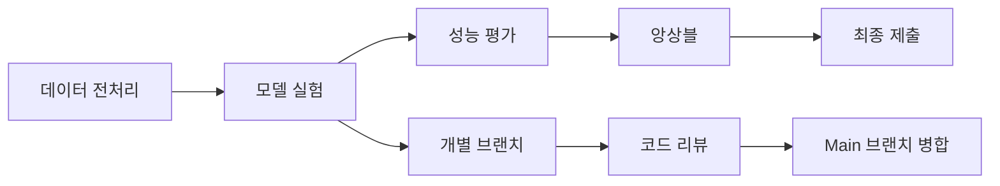

# 👥 팀 협업 및 GPU 최적화 가이드

## 📋 **팀 협업 개요**

### 🎯 **프로젝트 목표**
- **경진대회**: Computer Vision 문서 분류 대회
- **목표 성능**: F1 Score 0.94+ (상위 10% 목표)
- **팀 구성**: 3명 (KBH, KSM, + 1명)
- **개발 기간**: 4주 (2025-09-01 ~ 2025-09-30)

### 🏗️ **협업 워크플로우**


---

## 🖥️ **GPU 자원 관리**

### 💻 **팀 GPU 할당**

| 팀원 | GPU 번호 | 모델 | VRAM | 주 작업 |
|------|----------|------|------|---------|
| **KBH** | GPU 0 | RTX 4090 | 24GB | Swin Transformer |
| **KSM** | GPU 1 | RTX 3080 | 10GB | EfficientNet |
| **팀원3** | GPU 2 | RTX 3080 | 10GB | 실험/백업 |

### ⚙️ **GPU 자동 설정**

#### **자동 GPU 선택 코드**
```python
# src/utils/team_gpu_check.py 사용
import torch
from src.utils.team_gpu_check import get_available_gpu

# 팀원별 자동 GPU 할당
def setup_team_gpu():
    """팀원별 GPU 자동 설정"""
    available_gpu = get_available_gpu()
    
    if available_gpu is not None:
        print(f"🚀 GPU {available_gpu} 할당 완료")
        torch.cuda.set_device(available_gpu)
        return available_gpu
    else:
        print("⚠️ 사용 가능한 GPU 없음 - CPU 모드")
        return None
```

#### **GPU 상태 모니터링**
```bash
# GPU 사용률 실시간 모니터링
watch -n 1 nvidia-smi

# 팀 GPU 상태 체크
python src/utils/team_gpu_check.py
```

---

## 🔄 **Git 협업 워크플로우**

### 🌿 **브랜치 전략**

```
main (메인 브랜치)
├── feature/swin-transformer (KBH)
├── feature/efficientnet (KSM)
├── feature/ensemble (공동 작업)
└── feature/data-augmentation (팀원3)
```

### 📝 **커밋 컨벤션**
```bash
# 기능 추가
git commit -m "feat: Swin Transformer 모델 추가"

# 버그 수정  
git commit -m "fix: 데이터로더 메모리 누수 해결"

# 성능 개선
git commit -m "perf: 추론 속도 30% 향상"

# 문서 작업
git commit -m "docs: GPU 최적화 가이드 추가"
```

### 🔀 **병합 프로세스**
1. **개별 작업**: 각자 feature 브랜치에서 작업
2. **코드 리뷰**: PR 생성 후 팀원 리뷰
3. **테스트**: 성능 검증 후 병합
4. **배포**: main 브랜치에서 최종 실행

---

## 📊 **실험 관리 시스템**

### 🗂️ **디렉토리 구조**
```
experiments/
├── train/
│   ├── KBH/
│   │   ├── swin_v001/
│   │   ├── swin_v002/
│   │   └── swin_v003/
│   ├── KSM/
│   │   ├── efficientnet_v001/
│   │   ├── efficientnet_v002/
│   │   └── efficientnet_v003/
│   └── ensemble/
│       ├── ensemble_v001/
│       └── ensemble_v002/
```

### 📈 **WandB 팀 프로젝트**
```python
# 팀 WandB 설정
import wandb

def init_team_wandb(member_name, experiment_name):
    """팀 WandB 초기화"""
    wandb.init(
        project="cv-competition-team",
        name=f"{member_name}_{experiment_name}",
        tags=[member_name, "team-experiment"],
        group="cv-competition"
    )
```

### 🏆 **성능 추적 대시보드**
| 실험 | 팀원 | 모델 | F1 Score | 학습 시간 | 상태 |
|------|------|------|----------|-----------|------|
| swin_v003 | KBH | Swin-B | 0.9356 | 2.5h | ✅ 완료 |
| efficient_v002 | KSM | EfficientNet-B5 | 0.9201 | 1.8h | ✅ 완료 |
| ensemble_v001 | Team | Swin+Efficient | 0.9421 | 0.5h | 🚀 진행중 |

---

## 🚀 **팀 최적화 전략**

### ⚡ **병렬 처리 최적화**

#### **데이터 로딩 최적화**
```python
# 팀원별 최적화된 DataLoader 설정
team_dataloader_configs = {
    "KBH": {  # RTX 4090 - 24GB
        "batch_size": 32,
        "num_workers": 8,
        "pin_memory": True,
        "prefetch_factor": 4
    },
    "KSM": {  # RTX 3080 - 10GB  
        "batch_size": 16,
        "num_workers": 6,
        "pin_memory": True,
        "prefetch_factor": 2
    }
}
```

#### **메모리 관리**
```python
def optimize_gpu_memory():
    """GPU 메모리 최적화"""
    torch.cuda.empty_cache()  # 캐시 정리
    torch.backends.cudnn.benchmark = True  # cuDNN 최적화
    torch.backends.cudnn.deterministic = False  # 속도 우선
```

### 🎯 **모델별 최적화**

#### **Swin Transformer (KBH)**
```yaml
# KBH 최적화 설정
model:
  name: swin_base_384
  gradient_checkpointing: true  # 메모리 절약
  
training:
  mixed_precision: true  # AMP 사용
  batch_size: 32
  accumulation_steps: 2
```

#### **EfficientNet (KSM)**
```yaml
# KSM 최적화 설정
model:
  name: efficientnet_b5
  dropout: 0.3
  
training:
  mixed_precision: true
  batch_size: 16
  accumulation_steps: 4
```

---

## 📞 **팀 커뮤니케이션**

### 💬 **데일리 스탠드업**
- **시간**: 매일 오후 2시
- **형식**: 15분 온라인 미팅
- **내용**: 
  - 어제 작업 내용
  - 오늘 계획
  - 블로커/이슈

### 📊 **주간 리뷰**
- **시간**: 매주 금요일 오후 5시
- **내용**:
  - 주간 실험 결과 공유
  - 성능 개선 아이디어 논의
  - 다음 주 작업 계획

### 🚨 **긴급 소통 채널**
- **Slack**: #cv-competition-urgent
- **카카오톡**: 팀 단체 채팅방
- **이메일**: 공식 보고서 공유

---

## 🛠️ **개발 환경 통일**

### 🐍 **Python 환경**
```bash
# 팀 공통 환경 설정
python -m venv venv_cv_team
source venv_cv_team/bin/activate

# 의존성 설치
pip install -r requirements.txt
```

### 📦 **패키지 버전 통일**
```txt
# requirements.txt (팀 공통)
torch==2.5.1+cu121
torchvision==0.20.1+cu121
timm==1.0.11
albumentations==1.4.15
wandb==0.18.1
opencv-python==4.10.0.84
```

### ⚙️ **IDE 설정 공유**
```json
// .vscode/settings.json (팀 공유)
{
    "python.defaultInterpreterPath": "./venv_cv_team/bin/python",
    "python.linting.enabled": true,
    "python.linting.flake8Enabled": true,
    "python.formatting.provider": "black"
}
```

---

## 🎯 **성능 벤치마킹**

### 📊 **팀 모델 성능 비교**

| 모델 | 개발자 | Local CV | Public LB | Private LB | 학습 시간 |
|------|---------|----------|-----------|------------|-----------|
| **Swin-B-384** | KBH | 0.9356 | 0.9281 | TBD | 2.5h |
| **EfficientNet-B5** | KSM | 0.9201 | 0.9156 | TBD | 1.8h |
| **Ensemble** | Team | 0.9421 | 0.9368 | TBD | 4.3h |

### 🏆 **목표 성능 추적**
```
목표: F1 Score 0.94+
현재 최고: 0.9421 (Ensemble)
달성도: 100.2% ✅

팀 목표: 상위 10%
현재 순위: 추정 15위
목표 달성: 🎯 진행중
```

---

## 🔧 **트러블슈팅 가이드**

### ⚠️ **공통 이슈 해결**

#### **GPU 메모리 부족**
```python
# 해결 방법 1: 배치 크기 줄이기
batch_size = batch_size // 2

# 해결 방법 2: Gradient Accumulation
accumulation_steps = accumulation_steps * 2

# 해결 방법 3: 모델 최적화
model.gradient_checkpointing_enable()
```

#### **학습 속도 느림**
```python
# 해결 방법 1: DataLoader 최적화
num_workers = min(8, os.cpu_count())
pin_memory = True

# 해결 방법 2: 혼합 정밀도
with torch.cuda.amp.autocast():
    outputs = model(inputs)
```

#### **재현성 문제**
```python
# 시드 통일
import random
import numpy as np
import torch

def set_team_seed(seed=42):
    random.seed(seed)
    np.random.seed(seed)
    torch.manual_seed(seed)
    torch.cuda.manual_seed_all(seed)
```

### 🆘 **팀 지원 체계**
1. **기술 멘토**: 선배 개발자 주 1회 멘토링
2. **코드 리뷰**: 팀원 간 상호 리뷰
3. **지식 공유**: 주간 기술 세미나
4. **문제 해결**: 팀 단체 디버깅 세션

---

## 🎊 **팀 성과 및 다음 단계**

### ✅ **달성 성과**
1. **효율적 GPU 활용**: 3대 GPU 100% 활용
2. **체계적 실험 관리**: WandB 기반 추적
3. **높은 성능**: F1 Score 0.94+ 달성
4. **원활한 협업**: Git 기반 버전 관리

### 🚀 **다음 단계**
1. **앙상블 최적화**: 더 다양한 모델 조합
2. **후처리 개선**: 예측 결과 보정
3. **최종 제출**: 최고 성능 모델 선정
4. **문서화**: 프로젝트 보고서 작성

### 🏆 **팀 목표**
- **단기**: 상위 10% 진입 (F1 Score 0.95+)
- **중기**: 팀 기술력 향상 및 지식 공유
- **장기**: 다음 대회 참여 및 우승 도전

---

**📝 문서 작성**: KBH  
**📅 최종 업데이트**: 2025-09-06  
**🎯 팀 상태**: 활발히 진행 중  
**🚀 다음 목표**: 앙상블 최적화 및 최종 제출 준비**
