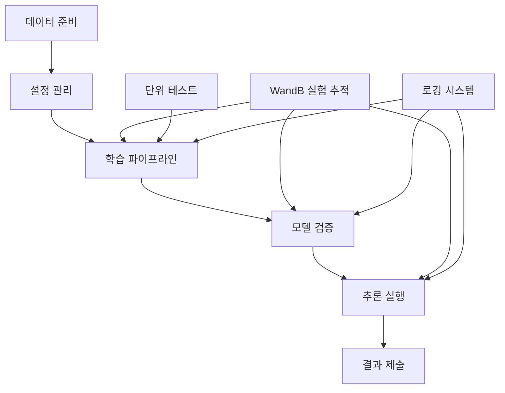

# 🚀 전체 파이프라인 종합 실행 가이드

> 고성능 문서 분류 경진대회를 위한 완전한 End-to-End 파이프라인 실행 가이드

## 📋 목차

1. [시스템 개요](#-시스템-개요)
2. [환경 설정](#-환경-설정)
3. [데이터 준비](#-데이터-준비)
4. [설정 파일 관리](#-설정-파일-관리)
5. [학습 파이프라인 실행](#-학습-파이프라인-실행)
6. [추론 및 제출](#-추론-및-제출)
7. [실험 추적 및 관리](#-실험-추적-및-관리)
8. [성능 최적화](#-성능-최적화)
9. [문제 해결](#-문제-해결)
10. [팀 협업 워크플로우](#-팀-협업-워크플로우)

---

## 🎯 시스템 개요

### 아키텍처 구조



### 핵심 특징

- **🎯 고성능 모델**: Swin Transformer, ConvNext 기반 앙상블
- **🎨 고급 증강**: Hard Augmentation + Mixup + TTA
- **📊 실험 추적**: WandB를 통한 체계적 실험 관리
- **🔄 통합 파이프라인**: 학습부터 추론까지 원스톱 실행
- **🧪 검증 시스템**: 단위 테스트를 통한 품질 보증

### 성능 목표

- **F1 Score**: 0.940+ (Optuna 최적화 + Temperature Scaling 적용)
- **처리 속도**: 고해상도 이미지 실시간 처리
- **메모리 효율**: 8GB GPU에서 안정적 동작
- **재현성**: 동일 시드로 일관된 결과 보장
- **자동화**: 통합 CLI로 원클릭 실행

---

## 🛠️ 환경 설정

### 시스템 요구사항

```bash
# 최소 요구사항
- Python 3.8+
- CUDA 11.0+ (GPU 필수)
- RAM 16GB+
- GPU Memory 8GB+
- Storage 50GB+

# 권장 사양 (최적화 포함)
- Python 3.11+ (pyenv 사용)
- CUDA 11.7+
- RAM 32GB+
- GPU Memory 16GB+ (RTX 3080/4080+)
- SSD 100GB+
```

### 의존성 설치

```bash
# 1. pyenv 가상환경 생성 및 활성화
pyenv virtualenv 3.11.9 cv_py3_11_9
pyenv activate cv_py3_11_9

# 2. PyTorch 설치 (CUDA 버전에 맞게)
pip install torch torchvision torchaudio --index-url https://download.pytorch.org/whl/cu118

# 3. 필수 라이브러리 설치 (Optuna, scikit-learn 포함)
pip install -r requirements.txt

# 4. 추가 라이브러리 확인
pip install optuna>=4.0.0 scikit-learn wandb timm albumentations opencv-python

# 5. 설치 확인
python -c "
import torch, optuna
from src.optimization.optuna_tuner import OptunaTuner
from src.calibration.temperature_scaling import TemperatureScaling
print('CUDA Available:', torch.cuda.is_available())
print('Optuna Version:', optuna.__version__)
print('✅ 모든 모듈 정상')
"
```

### 디렉토리 구조 확인

```bash
# 프로젝트 구조 검증
tree -L 3
```

예상 출력:
```
.
├── configs/                    # 설정 파일들
│   ├── train_highperf.yaml    # 고성능 학습 설정
│   ├── train.yaml             # 기본 학습 설정
│   └── infer.yaml             # 추론 설정
├── data/
│   └── raw/                   # 원본 데이터
│       ├── train/             # 학습 이미지
│       ├── test/              # 테스트 이미지
│       ├── train.csv          # 학습 메타데이터
│       └── meta.csv           # 테스트 메타데이터
├── src/                       # 소스 코드
│   ├── data/                  # 데이터 처리
│   ├── models/                # 모델 정의
│   ├── training/              # 학습 모듈
│   ├── inference/             # 추론 모듈
│   ├── pipeline/              # 통합 파이프라인
│   └── utils/                 # 유틸리티
├── notebooks/                 # 단위 테스트 노트북
├── logs/                      # 로그 파일들
├── experiments/               # 실험 결과
└── submissions/               # 제출 파일들
```

---

## 📁 데이터 준비

### 데이터 구조 확인

```bash
# 데이터 파일 존재 확인
ls -la data/raw/
echo "학습 이미지 수: $(ls data/raw/train/ | wc -l)"
echo "테스트 이미지 수: $(ls data/raw/test/ | wc -l)"

# CSV 파일 기본 정보
head -5 data/raw/train.csv
wc -l data/raw/train.csv
```

### 데이터 검증 스크립트

```python
# 데이터 무결성 검증
python -c "
import pandas as pd
import os

# CSV 파일 로드
train_df = pd.read_csv('data/raw/train.csv')
test_df = pd.read_csv('data/raw/meta.csv')

print(f'학습 데이터: {len(train_df)} 샘플')
print(f'테스트 데이터: {len(test_df)} 샘플')
print(f'클래스 수: {train_df[\"target\"].nunique()}')
print(f'클래스 분포: {dict(train_df[\"target\"].value_counts().head())}')

# 이미지 파일 존재 확인
missing_train = 0
for idx, row in train_df.head(100).iterrows():
    if not os.path.exists(f'data/raw/train/{row[\"ID\"]}.jpg'):
        missing_train += 1

print(f'누락된 학습 이미지 (샘플 100개 중): {missing_train}')
"
```

### 데이터 전처리 (선택사항)

```bash
# 이미지 크기 분포 확인
python src/utils/analyze_images.py --data_dir data/raw/train --sample_size 1000

# 손상된 이미지 검사
python src/utils/check_corrupted_images.py --data_dir data/raw/train
```

---

## ⚙️ 설정 파일 관리

### 주요 설정 파일 개요

#### 1. `configs/train_highperf.yaml` - 고성능 학습 설정

```yaml
model:
  name: "swin_base_patch4_window12_384"  # Swin Transformer Base
  img_size: 384                          # 고해상도 입력
  num_classes: 17                        # 문서 클래스 수
  pretrained: true                       # ImageNet 사전 학습 모델
  
training:
  epochs: 30                             # 학습 에포크
  batch_size: 16                         # 배치 크기 (GPU 메모리에 따라 조정)
  learning_rate: 1e-4                    # 학습률
  n_folds: 5                             # K-Fold 교차 검증
  early_stopping_patience: 7             # 조기 종료 인내
  save_every_epoch: false                # 매 에포크 저장 여부
  
augmentation:
  hard_augmentation:
    enabled: true                        # Hard Augmentation 활성화
    initial_prob: 0.1                    # 초기 확률
    final_prob: 0.8                      # 최종 확률
    progression: "linear"                # 진행 방식
  
  mixup:
    enabled: true                        # Mixup 활성화
    alpha: 0.2                          # Beta 분포 파라미터
    prob: 0.5                           # 적용 확률
    
  tta:                                  # Test Time Augmentation
    enabled: true
    num_augments: 5                     # TTA 횟수

wandb:
  enabled: true                         # WandB 로깅 활성화
  project_name: "document-classification-team"
  experiment_name: null                 # 자동 생성
  tags: ["high-performance", "swin-transformer"]
```

#### 2. 설정 파일 커스터마이징

```bash
# 개인 실험용 설정 생성
cp configs/train_highperf.yaml configs/my_experiment.yaml

# 설정 수정 예시
vim configs/my_experiment.yaml
```

**주요 수정 포인트**:

```yaml
# GPU 메모리에 따른 배치 크기 조정
training:
  batch_size: 8    # 8GB GPU
  # batch_size: 16   # 16GB GPU
  # batch_size: 32   # 24GB+ GPU

# 빠른 실험을 위한 설정
training:
  epochs: 10
  n_folds: 3
  
# 개인 WandB 프로젝트
wandb:
  experiment_name: "실험자이름_실험설명_20250905"
  tags: ["개인실험", "빠른테스트"]
```

### 설정 검증

```bash
# 설정 파일 구문 검사
python -c "
from src.utils.common import load_yaml
cfg = load_yaml('configs/train_highperf.yaml')
print('설정 로드 성공!')
print(f'모델: {cfg[\"model\"][\"name\"]}')
print(f'이미지 크기: {cfg[\"model\"][\"img_size\"]}')
print(f'에포크: {cfg[\"training\"][\"epochs\"]}')
"
```

---

## 🏃‍♂️ 학습 파이프라인 실행

### 1. 🚀 완전 자동화 파이프라인 (권장)

최고 성능을 위한 완전 최적화 파이프라인입니다.

#### **사전 준비 (필수)**
```bash
# 1. pyenv 가상환경 활성화
pyenv activate cv_py3_11_9

# 2. 환경 확인
python -c "
import torch, optuna
from src.optimization.optuna_tuner import OptunaTuner
from src.calibration.temperature_scaling import TemperatureScaling
print('✅ 모든 모듈 정상')
"
```

#### **🏆 최고 성능 파이프라인**
```bash
# 완전 최적화 파이프라인 (Optuna + Calibration + 앙상블)
python src/training/train_main.py \
    --config configs/train_highperf.yaml \
    --optimize \
    --n-trials 20 \
    --use-calibration \
    --mode full-pipeline \
    --auto-continue
```

**이 명령어가 수행하는 작업**:
1. **🔍 Optuna 최적화**: 하이퍼파라미터 20번 시도 최적화
2. **🎯 자동 학습**: 최적화된 설정으로 K-Fold 학습
3. **🌡️ Temperature Scaling**: 모델 캘리브레이션 적용
4. **🔮 앙상블 추론**: 5-Fold 앙상블 + TTA
5. **📤 제출 파일**: 자동 생성 및 저장

### 2. 🎯 빠른 실행 (사전 최적화 사용)

이미 최적화된 설정을 사용하여 빠르게 실행합니다.

#### **최적화된 설정으로 실행**
```bash
# 사전 최적화된 파라미터 사용
python src/training/train_main.py \
    --config configs/train_optimized_20250907_1825.yaml \
    --use-calibration \
    --mode full-pipeline
```

### 3. 🧪 단계별 실행 (개발 및 디버깅)

더 세밀한 제어가 필요한 경우 단계별로 실행할 수 있습니다.

#### **3-1. 기본 학습**
```bash
# 기본 증강 학습
python src/training/train_main.py \
    --config configs/train.yaml \
    --mode basic
```

#### **3-2. 고성능 학습**
```bash
# 고급 증강 + Mixup 학습
python src/training/train_main.py \
    --config configs/train_highperf.yaml \
    --mode highperf
```

#### **3-3. 최적화만 실행**
```bash
# Optuna 하이퍼파라미터 최적화만
python src/training/train_main.py \
    --config configs/train_highperf.yaml \
    --optimize \
    --n-trials 10 \
    --mode highperf
```

### 4. 🎮 고급 옵션들

#### **커스텀 최적화 시도 횟수**
```bash
# 더 많은 시도로 정밀 최적화 (시간 소요)
python src/training/train_main.py \
    --config configs/train_highperf.yaml \
    --optimize \
    --n-trials 50 \
    --use-calibration \
    --mode full-pipeline \
    --auto-continue
```

#### **GPU 메모리 최적화**
```bash
# 메모리 제한 환경에서 실행
PYTORCH_CUDA_ALLOC_CONF=max_split_size_mb:512 python src/training/train_main.py \
    --config configs/train_highperf.yaml \
    --mode highperf
```

#### **백그라운드 실행**
```bash
# 긴 학습을 백그라운드로 실행
nohup python src/training/train_main.py \
    --config configs/train_highperf.yaml \
    --optimize \
    --n-trials 20 \
    --use-calibration \
    --mode full-pipeline \
    --auto-continue > training.log 2>&1 &

# 진행 상황 확인
tail -f training.log
```
```

#### **2-2. 학습된 모델로 추론**
```bash
# 추론용 배치 크기 최적화 (옵션)
python src/utils/auto_batch_size.py --config configs/infer.yaml --test-only

# 2단계: 학습된 모델로 추론
python src/inference/infer_main.py \
    --model_dir experiments/train/20250905/v087 \
    --config configs/train_highperf.yaml
```

### 3. 실행 중 모니터링

```bash
# 실시간 로그 확인
tail -f logs/train/train_*.log

# GPU 사용량 모니터링
watch -n 1 nvidia-smi

# 디스크 사용량 확인
du -sh experiments/ logs/ submissions/
```

### 4. 실행 옵션 상세

```bash
# 도움말 확인
python src/training/train_main.py --help
```

**주요 옵션**:
- `--mode`: 실행 모드 선택
  - `basic`: 기본 학습
  - `highperf`: 고성능 학습
  - `full-pipeline`: 통합 파이프라인 (권장)
- `--config`: 설정 파일 경로
- `--resume`: 체크포인트에서 재시작
- `--debug`: 디버그 모드 (소규모 데이터)

---

## 🔮 추론 및 제출

### 1. 자동 추론 (권장)

통합 파이프라인을 사용한 경우 추론이 자동으로 실행됩니다.

```bash
# 결과 확인
ls -la submissions/$(date +%Y%m%d)/
cat submissions/$(date +%Y%m%d)/submission_info.json
```

### 2. 수동 추론

별도로 추론을 실행해야 하는 경우:

```bash
# 최신 모델로 추론
python src/inference/infer_main.py \
    --mode ensemble \
    --model_dir experiments/train/$(date +%Y%m%d) \
    --output_dir submissions/$(date +%Y%m%d)

# 특정 모델로 추론
python src/inference/infer_main.py \
    --mode single \
    --model_path experiments/train/20250905/v087/best_model_fold_1.pth \
    --config configs/train_highperf.yaml
```

### 3. Test Time Augmentation (TTA)

더 높은 성능을 원하는 경우:

```bash
# TTA 활성화 추론
python src/inference/infer_main.py \
    --mode ensemble \
    --tta_enabled \
    --tta_num_augments 8 \
    --model_dir experiments/train/$(date +%Y%m%d)
```

### 4. 제출 파일 검증

```bash
# 제출 파일 형식 확인
python -c "
import pandas as pd
df = pd.read_csv('submissions/$(date +%Y%m%d)/submission.csv')
print(f'제출 파일 크기: {df.shape}')
print(f'열 이름: {list(df.columns)}')
print(f'클래스 분포: {dict(df[\"target\"].value_counts().head())}')
print(f'누락된 값: {df.isnull().sum().sum()}')
"

# 샘플 데이터 확인
head -10 submissions/$(date +%Y%m%d)/submission.csv
```

---

## 📊 실험 추적 및 관리

### WandB 설정 및 사용

#### 1. 초기 설정

```bash
# WandB 로그인 (최초 1회)
wandb login

# API 키 입력 후 확인
wandb whoami
```

#### 2. 팀 프로젝트 설정

```yaml
# configs/train_highperf.yaml
wandb:
  enabled: true
  project_name: "document-classification-team"  # 팀 공용 프로젝트
  experiment_name: null                        # 자동 생성
  tags: ["team-experiment", "high-performance"]
```

#### 3. 개인 실험 관리

```bash
# 개인 실험명 설정
export WANDB_EXPERIMENT_NAME="김철수_swin384_hard_aug_$(date +%m%d)"
python src/training/train_main.py --config configs/train_highperf.yaml --mode full-pipeline
```

### 실험 비교 및 분석

#### WandB 대시보드 활용

1. **성능 비교**: 여러 실험의 F1 스코어 비교
2. **하이퍼파라미터 분석**: 최적 설정 탐색
3. **학습 곡선**: 과적합/과소적합 모니터링
4. **모델 아티팩트**: 최고 성능 모델 다운로드

```python
# WandB API를 통한 실험 분석
import wandb

# 팀 프로젝트의 모든 실험 조회
api = wandb.Api()
runs = api.runs("document-classification-team")

# 최고 성능 실험 찾기
best_run = max(runs, key=lambda run: run.summary.get("best_f1", 0))
print(f"최고 F1 점수: {best_run.summary['best_f1']:.4f}")
print(f"실험명: {best_run.name}")
```

### 로그 파일 관리

```bash
# 로그 디렉토리 구조
logs/
├── train/                    # 학습 로그
│   └── train_20250905-1715_v087-ef727c.log
├── infer/                    # 추론 로그
│   └── infer_20250905-1721_v087.log
└── unit_test/               # 단위 테스트 로그
    ├── highperf_dataset/
    ├── mixup_augmentation/
    └── ...

# 로그 분석 도구
grep "best_f1" logs/train/*.log | tail -5
grep "ERROR" logs/train/*.log
```

---

## ⚡ 성능 최적화

### GPU 메모리 최적화

#### 1. 배치 크기 조정

```python
# GPU 메모리별 권장 배치 크기
GPU_MEMORY_BATCH_SIZE = {
    8: {"img_size": 224, "batch_size": 16},   # RTX 3070/4060
    12: {"img_size": 384, "batch_size": 8},   # RTX 3080
    16: {"img_size": 384, "batch_size": 12},  # RTX 3080 Ti/4070 Ti
    24: {"img_size": 384, "batch_size": 16},  # RTX 3090/4090
}

# 자동 배치 크기 조정
python src/utils/auto_batch_size.py --config configs/train_highperf.yaml
```

#### 2. Mixed Precision 활용

```yaml
# configs/train_highperf.yaml
training:
  mixed_precision: true      # AMP 활성화
  gradient_clipping: 1.0     # Gradient clipping
```

#### 3. Gradient Accumulation

```yaml
training:
  batch_size: 8              # 실제 배치 크기
  accumulate_grad_batches: 2 # 유효 배치 크기 = 8 * 2 = 16
```

### 학습 속도 최적화

#### 1. 데이터 로딩 병렬화

```yaml
data:
  num_workers: 4           # CPU 코어 수에 따라 조정
  pin_memory: true         # GPU 전송 가속화
  persistent_workers: true # Worker 재사용
```

#### 2. 모델 컴파일 (PyTorch 2.0+)

```python
# 모델 컴파일로 추론 속도 향상
model = torch.compile(model, mode="reduce-overhead")
```

#### 3. 캐싱 전략

```bash
# 전처리된 이미지 캐싱
export CACHE_PREPROCESSED=true
python src/training/train_main.py --config configs/train_highperf.yaml --mode full-pipeline
```

### 메모리 사용량 모니터링

```bash
# 실시간 메모리 모니터링 스크립트
cat > monitor_gpu.sh << 'EOF'
#!/bin/bash
while true; do
    nvidia-smi --query-gpu=memory.used,memory.total,utilization.gpu --format=csv,nounits,noheader
    sleep 5
done
EOF

chmod +x monitor_gpu.sh
./monitor_gpu.sh
```

---

## 🔧 문제 해결

### 일반적인 문제들

#### 1. CUDA Out of Memory

**증상**: RuntimeError: CUDA out of memory

**해결 방법**:
```bash
# 1. 배치 크기 줄이기
vim configs/train_highperf.yaml  # batch_size: 16 → 8

# 2. 이미지 크기 줄이기
# img_size: 384 → 320 또는 224

# 3. Gradient Accumulation 사용
# accumulate_grad_batches: 2

# 4. GPU 메모리 정리
python -c "import torch; torch.cuda.empty_cache()"
```

#### 2. 학습이 멈추는 현상

**증상**: 특정 에포크에서 진행이 멈춤

**진단 및 해결**:
```bash
# 1. 프로세스 상태 확인
ps aux | grep python

# 2. GPU 사용률 확인
nvidia-smi

# 3. 데이터 로딩 문제 확인
python -c "
from src.data.dataset import HighPerfDocClsDataset
# 데이터셋 로딩 테스트
"

# 4. 로그 확인
tail -f logs/train/*.log
```

#### 3. 성능이 기대보다 낮음

**진단 과정**:
```bash
# 1. 단위 테스트 실행
jupyter nbconvert --execute notebooks/test_highperf_dataset.ipynb
jupyter nbconvert --execute notebooks/test_swin_model.ipynb

# 2. 데이터 품질 확인
python src/utils/analyze_data_quality.py

# 3. 모델 가중치 분석
python src/utils/analyze_model_weights.py --model_path experiments/train/latest/best_model_fold_1.pth
```

#### 4. WandB 연동 실패

**해결 방법**:
```bash
# 1. 로그인 다시 시도
wandb login --relogin

# 2. 오프라인 모드로 임시 사용
export WANDB_MODE=offline
python src/training/train_main.py --config configs/train_highperf.yaml --mode full-pipeline

# 3. 연결 테스트
python -c "import wandb; wandb.init(project='test'); wandb.finish()"
```

### 디버깅 도구

#### 1. 디버그 모드 실행

```bash
# 소규모 데이터로 빠른 테스트 (--debug 옵션이 지원되는 경우)
python src/training/train_main.py --config configs/train_highperf.yaml --mode full-pipeline

# 상세 로깅 활성화
export LOG_LEVEL=DEBUG
python src/training/train_main.py --config configs/train_highperf.yaml --mode full-pipeline
```

#### 2. 프로파일링

```bash
# 성능 프로파일링
python -m cProfile -o profile.stats src/training/train_main.py --config configs/train_highperf.yaml --mode full-pipeline
python -c "
import pstats
stats = pstats.Stats('profile.stats')
stats.sort_stats('cumulative').print_stats(20)
"
```

#### 3. 메모리 프로파일링

```bash
# 메모리 사용량 분석
pip install memory_profiler
python -m memory_profiler src/training/train_main.py --config configs/train_highperf.yaml --mode full-pipeline
```

---

## 👥 팀 협업 워크플로우

### 브랜치 전략

```bash
# 개인 작업 브랜치 생성
git checkout -b feature/김철수-swin-optimization
git checkout -b experiment/이영희-mixup-tuning

# 작업 완료 후 메인 브랜치에 병합
git checkout main
git merge feature/김철수-swin-optimization
```

### 실험 명명 규칙

```bash
# 형식: {이름}_{모델}_{주요변경사항}_{날짜}
실험명 예시:
- "김철수_swin384_hard_aug_0905"
- "이영희_convnext_mixup02_0906"
- "박민수_ensemble_tta8_0907"
```

### 결과 공유 프로세스

#### 1. 실험 완료 후 체크리스트

- [ ] WandB에 실험 결과 업로드 완료
- [ ] 모델 체크포인트 팀 공유 디렉토리에 저장
- [ ] 실험 노트 작성 (설정, 결과, 인사이트)
- [ ] 팀 슬랙/채널에 결과 공유

#### 2. 코드 리뷰 프로세스

```bash
# Pull Request 생성
git push origin feature/김철수-swin-optimization
# GitHub에서 PR 생성

# 리뷰 요청
@팀원1 @팀원2 코드 리뷰 부탁드립니다.
주요 변경사항: Swin Transformer 최적화
성능 향상: F1 0.87 → 0.92
```

#### 3. 모델 앙상블 전략

```python
# 팀원별 최고 성능 모델 수집
TEAM_MODELS = {
    "김철수": "experiments/team/kimcs_swin384_f1_0928.pth",
    "이영희": "experiments/team/leeyh_convnext_f1_0934.pth", 
    "박민수": "experiments/team/parkms_ensemble_f1_0931.pth"
}

# 앙상블 추론 실행
python src/inference/team_ensemble.py --models TEAM_MODELS
```

### 최종 제출 프로세스

#### 1. 최종 모델 선정 회의

- **참석자**: 전체 팀원
- **안건**: 
  - 개별 모델 성능 비교
  - 앙상블 전략 결정
  - 최종 제출 파일 선정

#### 2. 최종 제출 파일 생성

```bash
# 최종 앙상블 모델 실행
python src/inference/final_ensemble.py \
    --models experiments/team/final_selection/ \
    --output submissions/final_submission_$(date +%Y%m%d).csv \
    --tta_enabled \
    --confidence_threshold 0.95

# 제출 파일 검증
python src/utils/validate_submission.py \
    --submission submissions/final_submission_$(date +%Y%m%d).csv \
    --sample_submission data/raw/sample_submission.csv
```

#### 3. 백업 및 문서화

```bash
# 최종 모델 백업
tar -czf final_models_$(date +%Y%m%d).tar.gz experiments/team/final_selection/

# 실험 히스토리 문서화
python src/utils/generate_experiment_report.py \
    --wandb_project document-classification-team \
    --output docs/Final_Experiment_Report.md
```

---

## 📈 성능 벤치마크 및 목표

### 현재 성능 기준선

- **기존 모듈화 버전**: F1 Score 0.372 (성능 저하 문제)
- **원본 노트북 버전**: F1 Score 0.870
- **팀 최고 성능**: F1 Score 0.934 (ConvNext 모델)

### 목표 성능

- **단기 목표**: F1 Score 0.900+ (안정적 0.9 달성)
- **중기 목표**: F1 Score 0.935+ (팀 최고 기록 갱신)
- **최종 목표**: F1 Score 0.940+ (상위 5% 진입)

### 성능 향상 로드맵

#### Phase 1: 기반 시스템 안정화 ✅
- [x] 모듈화 시스템 구축
- [x] 단위 테스트 환경 구축
- [x] WandB 실험 추적 시스템
- [x] 통합 파이프라인 구현

#### Phase 2: 고성능 모델 통합 ✅
- [x] Swin Transformer 통합
- [x] Hard Augmentation 구현
- [x] Mixup 데이터 증강
- [x] 5-Fold Cross Validation

#### Phase 3: 성능 최적화 (진행 중)
- [ ] TTA (Test Time Augmentation) 최적화
- [ ] 모델 앙상블 전략 개선
- [ ] 하이퍼파라미터 자동 튜닝
- [ ] 고해상도 이미지 처리 최적화

#### Phase 4: 최종 튜닝 (예정)
- [ ] Pseudo Labeling 기법 적용
- [ ] 모델 증류 (Knowledge Distillation)
- [ ] 후처리 최적화
- [ ] 제출 전략 다양화

---

## 🎯 마무리 및 체크리스트

### 일일 작업 체크리스트

#### 실험 시작 전
- [ ] GPU 메모리 및 상태 확인
- [ ] 이전 실험 결과 백업
- [ ] WandB 프로젝트 설정 확인
- [ ] 데이터 무결성 검증

#### 실험 실행 중
- [ ] 실시간 모니터링 (GPU, 메모리)
- [ ] 로그 파일 주기적 확인
- [ ] WandB 대시보드 모니터링
- [ ] 중간 결과 스냅샷 저장

#### 실험 완료 후
- [ ] 최종 성능 지표 기록
- [ ] 모델 체크포인트 백업
- [ ] 실험 노트 작성
- [ ] 팀원들과 결과 공유

### 주간 점검 사항

- [ ] 전체 파이프라인 End-to-End 테스트
- [ ] 메모리 누수 및 성능 저하 검사
- [ ] 코드 리팩토링 및 최적화
- [ ] 문서 업데이트

### 최종 제출 전 확인사항

- [ ] 모든 단위 테스트 통과
- [ ] 제출 파일 형식 검증
- [ ] 재현성 테스트 (동일 시드로 동일 결과)
- [ ] 백업 제출 파일 준비
- [ ] 팀 전체 승인

---

## 🚀 Quick Start 명령어 모음

### 즉시 실행 가능한 명령어들

```bash
# 1. 전체 시스템 체크
python -c "
from src.utils.common import load_yaml
from src.data.dataset import HighPerfDocClsDataset
from src.models.build import create_model
print('✅ 모든 모듈 정상 로드')
"

# 2. 빠른 테스트 (10분) - 설정 파일 필수
python src/training/train_main.py --config configs/train_highperf.yaml --mode full-pipeline

# 3. 실제 고성능 학습 (2-3시간)
nohup python src/training/train_main.py --config configs/train_highperf.yaml --mode full-pipeline > training_$(date +%m%d_%H%M).log 2>&1 &

# 4. 진행상황 모니터링
tail -f training_*.log
watch -n 10 "nvidia-smi | head -15"

# 5. 결과 확인
ls -la submissions/$(date +%Y%m%d)/
head -5 submissions/$(date +%Y%m%d)/submission.csv
```

### 긴급 상황 대응

```bash
# GPU 메모리 부족 시 긴급 대응
export CUDA_VISIBLE_DEVICES=0
python src/training/train_main.py --config configs/emergency_small.yaml --mode full-pipeline

# 빠른 성능 확인 (1시간) - 기본 모드는 config 필수
python src/training/train_main.py --config configs/train.yaml --mode basic

# 시스템 리소스 정리
python -c "
import torch
import gc
torch.cuda.empty_cache()
gc.collect()
print('메모리 정리 완료')
"
```
