# 📘 Training Pipeline 실행 가이드 (🚀 통합 CLI 버전)

## 📋 사전 준비 (필수)

### 🔧 환경 설정 및 GPU 최적화
```bash
# 1. pyenv 가상환경 활성화
pyenv activate cv_py3_11_9

# 2. 통합 모듈 import 테스트
python -c "
from src.optimization.optuna_tuner import OptunaTuner
from src.calibration.temperature_scaling import TemperatureScaling
print('✅ 모든 모듈 정상')
"
```

### 📁 새로운 날짜별 로그 구조
이제 모든 로그가 날짜별로 체계적으로 관리됩니다:
```
logs/
└── YYYYMMDD/  (예: 20250907)
    ├── train/         # 학습 로그
    ├── infer/         # 추론 로그  
    ├── optimization/  # 최적화 로그
    └── pipeline/      # 파이프라인 로그
```

## 1) 🚀 통합 CLI 실행 명령어

### 🏆 최고 성능 모드 (권장 - F1 ~0.940+ 목표)
```bash
# 환경 활성화
pyenv activate cv_py3_11_9

# 완전 최적화 파이프라인 (Optuna + Calibration)
python src/training/train_main.py \
    --config configs/train_highperf.yaml \
    --optimize \
    --n-trials 20 \
    --use-calibration \
    --mode full-pipeline \
    --auto-continue
```

### ⚡ 빠른 실험 모드 (20-30분, 경진대회용)
```bash
# 빠른 프로토타이핑 및 아이디어 검증용
python src/training/train_main.py \
    --config configs/train_fast_optimized.yaml \
    --optimize \
    --optuna-config configs/optuna_fast_config.yaml \
    --n-trials 8 \
    --mode full-pipeline \
    --auto-continue
```

**빠른 실험 모드 특징:**
- 🕒 **실행 시간**: 20-30분
- 🎯 **목표 성능**: F1 스코어 0.92+
- 🔄 **반복 실험**: 빠른 아이디어 검증
- ⚙️ **최적화**: 8회 시도로 효율적 탐색

### 🏅 고성능 모드 (사전 최적화 사용)
```bash
# 사전 최적화된 설정으로 빠른 실행
python src/training/train_main.py \
    --config configs/train_optimized_20250907_1825.yaml \
    --use-calibration \
    --mode full-pipeline
```

### 📚 기본 모드 (기존 성능)
```bash
# 기본 증강 + 기본 모델
python src/training/train_main.py \
    --config configs/train.yaml \
    --mode basic
```

### 🧪 최적화만 실행 (실험용)
```bash
# 하이퍼파라미터 최적화만 실행
python src/training/train_main.py \
    --config configs/train_highperf.yaml \
    --optimize \
    --n-trials 30 \
    --mode highperf
```

**🎯 새로운 통합 CLI 옵션 설명:**

- `--config`: 설정 파일 경로 (필수)
- `--mode`: 실행 모드 (basic, highperf, full-pipeline)
- `--optimize`: Optuna 하이퍼파라미터 최적화 사용
- `--n-trials`: 최적화 시도 횟수 (기본: 20)
- `--use-calibration`: Temperature Scaling 캘리브레이션 적용
- `--auto-continue`: 최적화 후 자동으로 전체 학습 진행
- `--skip-training`: 학습 건너뛰고 추론만 실행

> 🎯 **성능 비교**
> - **기본 모드**: F1 ~0.89 (EfficientNet-B3 + 기본 증강)
> - **고성능 모드**: F1 ~0.934 (Swin Transformer + 고급 증강)
> - **최적화 모드**: F1 ~0.940+ (Optuna + Temperature Scaling)

## 2) 고급 기능

### 🔍 Optuna 하이퍼파라미터 최적화
```bash
# Optuna 최적화 전용 실행 (최적화만)
python src/training/train_main.py \
    --config configs/train_highperf.yaml \
    --optimize \
    --n-trials 50 \
    --skip-training

# 최적화 + 자동 학습 진행
python src/training/train_main.py \
    --config configs/train_highperf.yaml \
    --optimize \
    --n-trials 30 \
    --auto-continue
```

### 🌡️ Temperature Scaling 캘리브레이션
```bash
# 캘리브레이션만 적용
python src/training/train_main.py \
    --config configs/train_optimized_20250907_1825.yaml \
    --use-calibration \
    --mode full-pipeline

# 최적화 + 캘리브레이션 통합
python src/training/train_main.py \
    --config configs/train_highperf.yaml \
    --optimize \
    --n-trials 20 \
    --use-calibration \
    --auto-continue
```

### 📊 실시간 성능 모니터링
```bash
# WandB 대시보드 확인
wandb dashboard

# 로그 실시간 확인
tail -f logs/$(date +%Y%m%d)/train/train_*.log
```

---

## 3) 실행 전 체크리스트

- 🗂️ **데이터 배치**
    - `data/raw/train.csv` : 학습 메타 (필수 컬럼: `ID`, `target`)
    - `data/raw/sample_submission.csv` : 제출 포맷 참고용
    - `data/raw/train/` : **학습 이미지 폴더**
    - `data/raw/test/` : (추론용 이미지 폴더 — *학습 가이드에서는 사용하지 않음*)
- 🔤 **파일명/확장자**
    - CSV의 `ID`가 `abc123.jpg`처럼 **확장자를 포함**하든, `abc123`처럼 **없든** 모두 안전 처리됩니다. (`.jpg.jpg` 방지)
- 🧱 **디렉토리**
    - `logs/`, `experiments/` 폴더는 실행 중 **자동 생성**됩니다.
- 🧬 **재현성**
    - 시드(`project.seed`) 고정, 설정 스냅샷(`experiments/.../config.yaml`) 저장으로 **완전 재현**을 지원합니다.

---

## 3) 실행 시 내부 흐름 (모듈 & 함수 호출 순서)

### (1) 엔트리포인트: `src/training/train_main.py`

1. 🧭 `argparse`로 CLI 인자 파싱 (`-config`)
2. 🚀 `run_training(config_path)` 호출
3. 🏁 종료 상태를 **콘솔**에 출력
    - 정상: `[EXIT] training finished successfully (see logs/* for details)`
    - 에러: `[EXIT][ERROR] training failed: ...`

### (2) 핵심 파이프라인: `src/training/train.py` → `run_training(cfg_path)`

1. 📄 **Config 로드 & 표시**
    - `load_yaml`로 YAML 로드 → `[CFG] ...` 섹션 로그 출력
    - 예: 모델/학습/데이터/출력 경로 등 설정값을 전부 로그에 남김
2. 🎲 **Seed 고정**
    - `set_seed` 호출 → PyTorch/NumPy/랜덤 시드 고정
3. 📝 **Logger 시작 + 표준 입·출력 리디렉션**
    - `logs/YYYYMMDD/train/train_YYYYMMDD-HHMM_<run_id>_<augmentation_type>.log` 생성
    - 모든 `print`/오류가 **로그 파일에도** 기록
    - 시작: `>> Logger started: ...` / 종료: `>> Stopping logger and restoring stdio`
4. 📂 **경로 검증 & 데이터 로드**
    - `require_file/require_dir`로 `train.csv`, `image_dir_train` 등 **필수 경로 확인**
    - `[PATH] OK | train_csv=... | sample_csv=... | image_dir_train=...`
    - `pd.read_csv(train_csv)` → 필수 컬럼(`ID`, `target`) 점검
5. 🔀 **K-Fold 분할**
    - `StratifiedKFold(n_splits=folds)` 또는 기존 `fold` 열 검증
    - `[FOLD] distribution={0:..., 1:..., ...}` 로 분배 로그
6. 📦 **아티팩트 디렉토리 생성**
    - `experiments/YYYYMMDD/<run_id>/` 생성
    - 포함:
        - `ckpt/` (체크포인트)
        - `metrics.jsonl` (에폭별 지표: loss/F1/lr/시간/메모리)
        - `config.yaml` (실행 스냅샷)
    - `[ARTIFACTS] ...`로 경로를 명확히 로깅
7. 🧰 **데이터로더 & 모델 빌드**
    - `DocClsDataset` + `DataLoader` 구성 (`_build_loaders`)
    - `build_model`로 timm 기반 백본 생성 (`global_pool` 정석 매핑)
    - `Adam/AdamW`, `CosineAnnealingLR` 등 옵티마/스케줄러 초기화 로그
8. 🔁 **학습/검증 루프**
    - `train_one_epoch` : 스텝별 loss, lr, 메모리 등 촘촘 로그
    - `validate` : `macro_f1`/loss 계산, 요약 로그
    - Best 갱신 시 `ckpt/best_fold{n}.pth` 저장 + `NEW_BEST` 로그
    - 각 에폭 결과는 `metrics.jsonl`에 **JSON Lines**로 누적
9. 📚 **모드 분기**
    - `data.valid_fold: int` → **단일 폴드 학습**
    - `data.valid_fold: "all"` → **전 폴드 순회(K-Fold 학습)**
        - OOF 결과(`oof_logits.npy`, `oof_targets.npy`) 저장
10. ✅ **종료 마커**
    - 파이프라인 정상 종료: `[BOOT] training pipeline finished successfully`
    - **항상 기록되는 최종 마커**:
        - 정상: `[EXIT] TRAINING SUCCESS code=0`
        - 에러: `[EXIT] TRAINING ERROR code=1` (Traceback 포함)

---

## 4) 결과물 & 디렉토리 구조

### 🧾 로그

- 위치: `logs/YYYYMMDD/train/train_YYYYMMDD-HHMM_<run_id>_<augmentation_type>.log`
- 주요 태그:
    
    `[BOOT]`, `[CFG]`, `[PATH]`, `[DATA]`, `[MODEL]`, `[EPOCH]`, `NEW_BEST`, `[DONE]`, `[EXIT]`
    

### 🧪 실험 아티팩트

- 위치: `experiments/YYYYMMDD/<run_id>/`
- 🆕 **Latest-train 자동 복사**: 모든 학습 결과가 `experiments/train/latest-train/`에도 자동 복사됩니다!

```
experiments/
├── train/                    # 날짜별 학습 결과
│   ├── 20250907/
│   │   └── swin-highperf_20250907_1825/
│   ├── 20250908/
│   │   └── efficientnet-basic_20250908_1030/
│   └── latest-train/         # 🆕 최신 학습 결과 자동 복사
│       └── efficientnet-basic_20250908_1030/  # 덮어쓰기 방식
└── 20250904/                 # 기존 호환성 유지
    └── v087-8c206e/
        ├── ckpt/
        │   ├── best_fold0.pth
        │   ├── best_fold1.pth
        │   ├── best_fold2.pth
        │   ├── best_fold3.pth
        │   └── best_fold4.pth
        ├── oof/
        │   ├── oof_logits.npy
        │   └── oof_targets.npy
        ├── config.yaml
        └── metrics.jsonl
```

**파일 설명**

- `ckpt/best_fold*.pth` : 폴드별 **최고 성능** 시점의 가중치
- `metrics.jsonl` : 각 에폭의 `train_loss`, `valid_loss`, `macro_f1`, `lr`, `time_s`, `mem_MiB` 기록
- `config.yaml` : 실행 당시 설정 스냅샷 (재현성)
- `oof/*.npy` : 전 폴드 OOF 검증 결과(선택 저장)

---

## 5) 파일 간 관계(의존 다이어그램)

```mermaid
flowchart TD

subgraph "🛠️ 실행 스크립트"
    S1[scripts/run_fast_training.sh]
    S2[scripts/run_highperf_training.sh]
    S3[scripts/monitor_training.sh]
end

subgraph "⚙️ 설정 파일"
    C1[configs/train_fast_optimized.yaml]
    C2[configs/train_highperf.yaml]
    C3[configs/optuna_fast_config.yaml]
    C4[configs/optuna_config.yaml]
end

subgraph "🚀 학습 엔진"
    A[train_main.py] -->|run_training| B[train.py]
    B -->|optuna 최적화| O1[optimization/optuna_tuner.py]
    B -->|calibration| O2[calibration/temperature_scaling.py]
end

subgraph "🔧 유틸리티"
    B -->|config load| C[utils/common.py]
    B -->|set_seed| D[utils/seed.py]
    B -->|Logger| E[utils/logger.py]
    C -->|create_log_path| L1[logs/YYYYMMDD/train/]
end

subgraph "📊 데이터 처리"
    B -->|Dataset| F[data/dataset.py]
    B -->|Transforms| G[data/transforms.py]
    F -->|load images| F1[data/raw/train/]
    F -->|load labels| F2[data/raw/train.csv]
end

subgraph "🧠 모델 관리"
    B -->|Model build| H[models/build.py]
    B -->|Metrics| I[metrics/f1.py]
    H -->|save checkpoints| H1[experiments/YYYYMMDD/]
end

S1 -.->|uses| C1
S1 -.->|uses| C3
S2 -.->|uses| C2
S2 -.->|uses| C4
S1 -->|executes| A
S2 -->|executes| A
S3 -.->|monitors| L1

C1 -->|config input| A
C2 -->|config input| A
```



---

## 6) 설정(`train_v087.yaml`) 핵심 키 설명

- 🌳 `data.*`
    - `train_csv` : 학습 CSV 경로 (예: `../data/raw/train.csv`)
    - `sample_csv` : 샘플 제출 CSV (경로 검증용)
    - `image_dir_train` : **학습 이미지 폴더** (예: `../data/raw/train`)
    - `image_ext` : 확장자 기본값 (`.jpg` 등).
        
        → CSV `ID`에 이미 확장자가 있으면 **추가하지 않음**. 없으면 붙임. 그래도 못 찾으면 `.jpg/.png/...` **후보 확장자 자동 탐색**
        
    - `id_col`, `target_col` : 컬럼명 지정 (기본 `ID`, `target`)
    - `folds` / `valid_fold` : 폴드 수 / **`int`(단일 폴드) 또는 `"all"`(전 폴드)**
    - `stratify` : 층화 여부
- 🧠 `model.*`
    - `name` : timm 모델명 (예: `efficientnet_b3`)
    - `pretrained` : 사전학습 가중치 사용
    - `pooling` : `avg`/`gem`/`max`/… → timm `global_pool`로 매핑
- 🏋️ `train.*`
    - `img_size`, `batch_size`, `epochs`, `lr`, `weight_decay`, `optimizer`, `scheduler`, `amp`, `grad_clip_norm`, `label_smoothing`
    - `log_interval` : 미니배치 로그 간격
- 🗃️ `output.*`
    - `logs_dir` : 로그 디렉토리
    - `exp_dir` : 실험(아티팩트) 디렉토리
    - `snapshots` : 설정 스냅샷 저장 여부

> 📌 경로 해석 규칙
> 
> 
> 현재 예시는 **config 파일 기준 상대경로**(`../data/...`)를 사용합니다.
> 
> → `configs/train_v087.yaml`에서 `../data/...`는 레포 루트의 `data/...`를 가리킵니다.
> 

---

## 7) 로그 판독 요령 (현업용 포인트)

- ✅ **정상 시작 지표**
    - `[PATH] OK ...` : CSV/이미지 경로 검증 통과
    - `[DATA] dataset sizes | train=... valid=...` : 샘플 수 확인
    - `[MODEL] name=... pooling=... params(total/trainable)=...` : 모델/파라미터 확인
- 📈 **에폭별 핵심**
    - `[EPOCH n] ... loss=... lr=...`
    - `validate` 후 `macro_f1=...`
    - `NEW_BEST F1=... -> ckpt/best_foldX.pth` : 최고 성능 저장 포인트
- 🏁 **마지막 줄(가장 중요)**
    - 정상 종료: `[EXIT] TRAINING SUCCESS code=0`
    - 에러 종료: `[EXIT] TRAINING ERROR code=1` (+ Traceback)

---

## 8) 트러블슈팅 (증상 → 조치)

- ❌ `FileNotFoundError: .../data/raw/train.csv`
    - `train_v087.yaml`의 경로가 **config 기준 상대경로**로 맞는지 확인
    - `../data/raw/train.csv` 형태인지 검증
- ❌ 이미지 로드 실패(`.../train/xxx.jpg.jpg`)
    - CSV `ID`에 확장자가 이미 들어있음
    - **현재 데이터셋 로직이 중복 확장 방지**하므로, 혹시 최신 코드가 아니라면 `src/data/dataset.py` 업데이트
- ❌ `AssertionError: Pooling can only be disabled ...`
    - `model.pooling`이 timm `global_pool`로 올바르게 매핑되어야 함
    - `pooling: "avg"` 권장 (커스텀 풀링을 쓰려면 외부 head 구성 필요)
- ❌ `No module named src.training.train_main`
    - `PYTHONPATH` 확인: `export PYTHONPATH="$(pwd):$PYTHONPATH"`

---

## 9) 로그 & 메트릭 활용 팁

- 🔎 `metrics.jsonl`은 **JSON Lines** 형식 → 손쉽게 집계/시각화 가능
- 예) 마지막 에폭만 추려보기(Python)
    
    ```python
    import json
    with open("experiments/20250904/v087-xxxxxx/metrics.jsonl") as f:
        rows = [json.loads(l) for l in f]
    last = [r for r in rows if isinstance(r.get("epoch"), int)]
    print(sorted(last, key=lambda x:(x["fold"], x["epoch"]))[-1])
    ```

---

## 🆕 10) Latest-train 자동 복사 시스템

### 🎯 **새로운 기능**: 학습 결과 자동 복사
이제 모든 학습이 완료되면 **자동으로** `experiments/train/latest-train/` 폴더에 결과가 복사됩니다!

### 📁 **폴더 구조**
```
experiments/train/
├── 20250907/                    # 원본: 날짜별 저장 (기존 방식 유지)
│   └── swin-highperf_20250907_1825/
├── 20250908/
│   └── efficientnet-basic_20250908_1030/
└── latest-train/                # 🆕 최신 결과 자동 복사
    └── efficientnet-basic_20250908_1030/  # 가장 최근 학습 결과
```

### 🔄 **동작 방식**
1. **기본 저장**: `experiments/train/YYYYMMDD/모델명_날짜시간/` (기존 방식 유지)
2. **추가 복사**: `experiments/train/latest-train/모델명_날짜시간/` (덮어쓰기 방식)
3. **로그 확인**: 학습 완료 시 다음 메시지 출력
   ```
   [COPY] Results copied to latest-train/swin-highperf_20250908_1030
   📁 Latest results: experiments/train/latest-train/swin-highperf_20250908_1030
   ```

### 🚀 **이점**
- ✅ **날짜 걱정 없음**: 훈련이 자정을 넘겨도 latest-train에서 최신 결과 접근
- ✅ **설정 파일 자동화**: `update_inference_date.sh --latest-train` 명령어 지원
- ✅ **워크플로우 간소화**: 항상 일관된 경로로 최신 결과 참조 가능
- ✅ **기존 호환성**: 날짜별 폴더는 그대로 유지

### 📝 **추론 설정 업데이트 방법**
```bash
# 최신 학습 결과 기준으로 추론 설정 업데이트
./scripts/update_inference_date.sh --latest-train

# 또는 특정 날짜 기준
./scripts/update_inference_date.sh 20250908
./scripts/update_inference_date.sh --latest
```

이제 학습 후 바로 `--latest-train` 옵션으로 추론 설정을 업데이트할 수 있습니다! 🎉