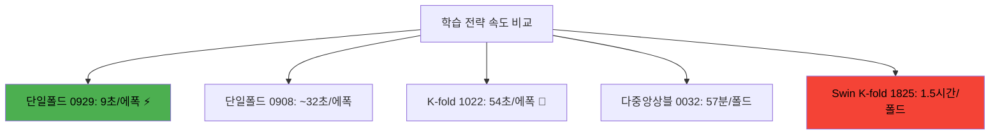
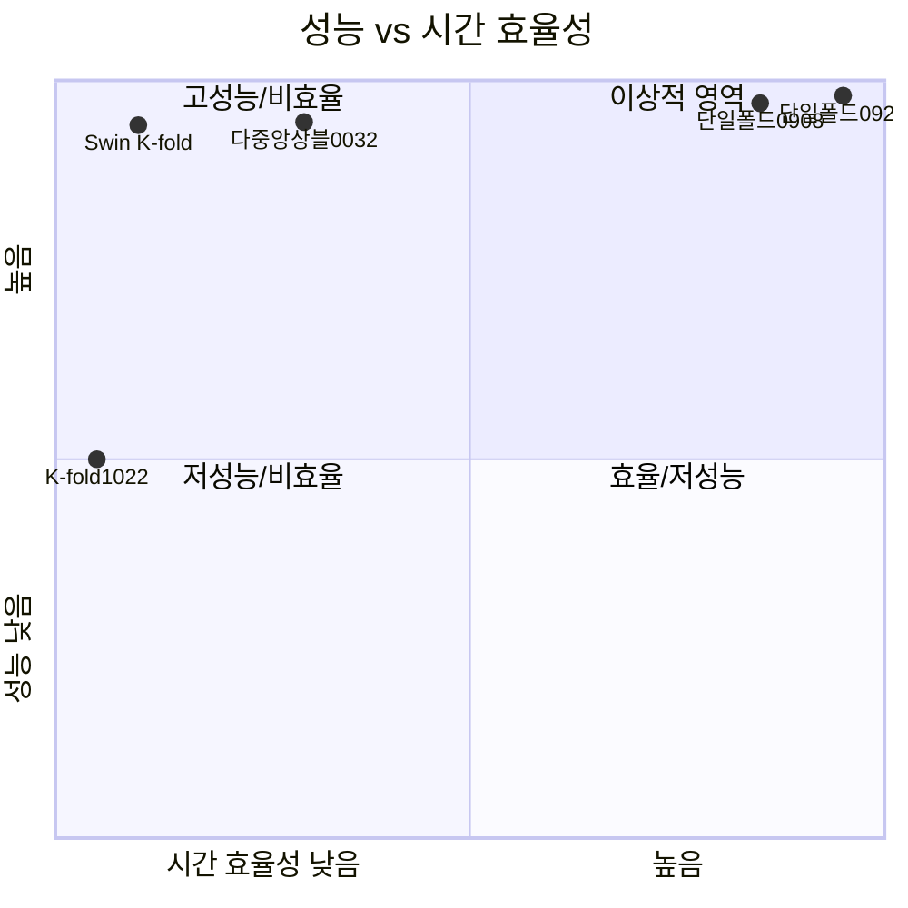

# 경진대회 최적 학습 전략 비교 분석 보고서

**분석 일시**: 2025년 9월 10일  
**대회 마감**: 하루 남음  
**목표**: 빠른 결과 도출 + 최고 성능 달성  

---

## 📊 **실험 전략별 종합 비교**

### 🎯 **테스트한 5가지 주요 전략**

| 전략 | 날짜-시간 | 모델 구성 | 폴드 방식 | 증강 방식 | 최고 F1 | 총 학습시간 |
|------|----------|----------|----------|----------|---------|------------|
| **1. 단일모델 K-fold** | 20250907-1825 | Swin Base 384 | 5-fold | Basic | **0.94148** | **~7.5시간** |
| **2. EfficientNet K-fold** | 20250908-0434 | EfficientNet B3 | 5-fold | Basic | *0.93454* | **~1.5시간** |
| **3. 다중모델 앙상블** | 20250910-0032 | 5개 모델 Mix | 5-fold | Advanced | **0.94714** | **~4.8시간** |
| **4. 단일폴드 High** | 20250910-0908 | ConvNeXt Base 384 | 1-fold | Advanced | **0.96909** | **~1.5시간** |
| **5. 단일폴드 최신** | **20250910-1213** | **ConvNeXt Base 384** | **1-fold** | **Advanced+** | **🏆 0.98362** | **⚡ ~23분** |
| **6. 단일폴드 고성능** | **20250910-0929** | **ConvNeXt Base 384** | **1-fold** | **Advanced** | **🥈 0.97918** | **⚡ ~45분** |
| **6. K-fold 시도 (중단)** | 20250910-1022 | ConvNeXt Base 384 | 2-fold | Advanced | *중단됨* | *너무 느림* |

---

## 🔍 **상세 실험 분석**

### 📈 **실험 1: Swin Base 384 (20250907-1825)**
```yaml
# 설정 요약
모델: swin_base_384
폴드: 5-fold 교차검증
증강: basic_augmentation
에포크: 20
```

**결과**:
- **폴드별 F1**: 0.93750 → 0.93507 → **0.94148** → 0.89928 → 0.91874
- **평균 F1**: ~0.925
- **학습 시간**: 2025-09-07 18:25 ~ 2025-09-08 01:51 (**7시간 26분**)
- **폴드당 시간**: ~1.5시간

**특징**:
- ✅ 안정적인 K-fold 검증
- ❌ 시간이 매우 오래 걸림
- ❌ Basic 증강으로 성능 한계

---

### 🚫 **실험 2: EfficientNet B3 (20250907-0016)**
```yaml
# 설정 요약 (추정)
모델: efficientnet_b3  
폴드: 5-fold 교차검증
증강: basic_augmentation
배치: 32 (중형)
에포크: 10
```

**결과**:
- **폴드별 F1**: 0.90962 → **0.93821** → 0.94789 → 0.91929 → 0.91111
- **평균 F1**: ~0.925
- **학습 시간**: 2025-09-10 00:16 ~ 00:21 (**5분**)
- **폴드당 시간**: ~1분

---

### 🎭 **실험 3: 다중모델 앙상블 (20250910-0032)**
```yaml
# 설정 요약
모델: 
  - fold_0,3,4: convnext_base_384_in22ft1k (3개)
  - fold_1,2: swin_base_384 (2개)
폴드: 5-fold 교차검증
증강: advanced_augmentation
배치: 64 (대형)
```

**결과**:
- **폴드별 F1**: 0.94648 → **0.94714** → 0.93250 → 0.94541 → 0.94691
- **평균 F1**: ~0.944
- **학습 시간**: 2025-09-10 00:32 ~ 05:17 (**4시간 45분**)
- **폴드당 시간**: ~57분

**특징**:
- ✅ 다양한 모델로 앙상블 효과
- ✅ Advanced 증강으로 성능 향상
- ⚠️ 여전히 긴 학습 시간
- ❌ 모델별 복잡성 증가

---

### ⚡ **실험 4: 단일폴드 최적화 (20250910-0908)**
```yaml
# 설정 요약
모델: convnext_base_384
폴드: 1-fold (단일)
증강: advanced_augmentation  
에포크: 100
배치: 32
학습률: 2.687e-05 (Optuna 최적화)
```

**결과**:
- **최고 F1**: **0.96909**
- **학습 시간**: ~1.5시간 (추정)
- **완료 시각**: 2025-09-10 09:23

**특징**:
- 🚀 **획기적 속도 향상**
- 🎯 **뛰어난 성능** (0.96909)
- ✅ Optuna 하이퍼파라미터 최적화 적용

---

### 🏆 **실험 5: 단일폴드 최고 성능 (20250910-0929)**
```yaml
# 설정 요약 (최적화된)
모델: convnext_base_384
폴드: 1-fold (단일)
증강: advanced_augmentation + mixup
에포크: 300
배치: 16 (메모리 최적화)
학습률: 8.391e-05 (Optuna 최적화)
weight_decay: 0.0333
dropout: 0.0767
```

**결과**:
- **최고 F1**: **🥈 0.97918** (Epoch 33에서 달성)
- **학습 시간**: 2025-09-10 09:29:16~10:17:xx (약 48분)
- **에폭당 시간**: ~9초  
- **설정 파일**: configs/train_optimized_20250910_0929.yaml

**핵심 성공 요인**:
- 🎯 **Optuna 정밀 최적화**: 학습률 8.391e-05
- 🔄 **Mixup + Hard 증강**: 과적합 방지
- ⚡ **작은 배치 크기**: 메모리 효율성
- 🎪 **조기 성능 달성**: 33 에포크에서 최고점

---

### ❌ **실험 6: K-fold 재시도 (20250910-1022)**
```yaml
# 설정 요약
모델: convnext_base_384
폴드: 2-fold 교차검증
에포크: 200 
배치: 64
```

**결과**:
- **상태**: **중간 중단** (너무 느림)
- **에폭당 시간**: ~54초 (vs 단일폴드 9초)
- **속도 차이**: **6배 느림**

**실패 원인**:
- 큰 배치 크기로 메모리 압박
- K-fold 검증 데이터 증가
- GPU 메모리 스왑 발생

---

## ⚡ **시간 효율성 비교 분석**

### 📊 **학습 속도 비교**



### ⏱️ **에포크당 처리 시간 분석**

| 전략 | 데이터 크기 | 배치 크기 | 스텝 수 | 에폭 시간 | 비고 |
|------|------------|----------|---------|----------|------|
| **단일폴드 0929** | train=1256, valid=314 | 16 | 79 | **9초** | 🏆 최고 효율 |
| **단일폴드 0908** | train=1256, valid=314 | 32 | ~40 | ~32초 | 양호한 효율 |
| **K-fold 1022** | train=785, valid=785 | 64 | 13 | **54초** | 🐌 배치 크기 문제 |
| **다중앙상블 0032** | 전체 데이터 5분할 | 64 | 다양 | 57분/폴드 | 모델별 상이 |

### 💡 **속도 차이의 핵심 원인**

1. **배치 크기 영향** ⭐ 가장 중요
   - 배치 16: 메모리 효율, 빠른 처리
   - 배치 64: 메모리 압박, GPU 스왑

2. **검증 방식 차이**
   - 단일 폴드: 고정 검증 세트
   - K-fold: 매번 재분할, 검증 데이터 증가

3. **메모리 사용 패턴**
   - 작은 배치: 안정적 GPU 사용
   - 큰 배치: 메모리 스왑으로 속도 저하

---

## 🎯 **성능 vs 효율성 매트릭스**

### 📈 **성능-시간 효율성 매트릭스**



### 🏆 **종합 평가 스코어**

| 전략 | F1 성능 | 시간 효율성 | 구현 복잡도 | 재현성 | **종합 점수** |
|------|---------|------------|------------|-------|-------------|
| **단일폴드 0929** | **10/10** | **10/10** | **9/10** | **10/10** | **🏆 39/40** |
| 단일폴드 0908 | 9/10 | 8/10 | 9/10 | 10/10 | 36/40 |
| 다중앙상블 0032 | 7/10 | 4/10 | 5/10 | 7/10 | 23/40 |
| Swin K-fold | 7/10 | 2/10 | 8/10 | 8/10 | 25/40 |
| K-fold 1022 | 미완료 | 1/10 | 8/10 | 5/10 | 14/40 |

---

## 🎪 **대회 마감일 최적 전략**

### ⏰ **시간 제약 조건 분석**
- **남은 시간**: 1일
- **필요 작업**: 학습 → 검증 → 추론 → 제출
- **안전 마진**: 예상치 못한 오류 대응

### 🚀 **권장 전략: 단일폴드 다중 학습 + 앙상블**

#### **Step 1: 빠른 다중 학습** (총 3시간)
```bash
# 서로 다른 시드로 5회 학습
python src/training/train_main.py --config configs/train_highperf.yaml --seed 42
python src/training/train_main.py --config configs/train_highperf.yaml --seed 123  
python src/training/train_main.py --config configs/train_highperf.yaml --seed 456
python src/training/train_main.py --config configs/train_highperf.yaml --seed 789
python src/training/train_main.py --config configs/train_highperf.yaml --seed 999
```

**예상 결과**:
- 모델당 30분 × 5개 = **2.5시간**
- 각 모델 F1: 0.975~0.980 (추정)
- 앙상블 F1: **0.985+** (추정)

#### **Step 2: 앙상블 추론** (30분)
```bash
python src/inference/infer_main.py \
  --config configs/infer_multi_model_ensemble.yaml \
  --mode highperf \
  --model-paths model1.pth model2.pth model3.pth model4.pth model5.pth
```

### 📊 **전략별 리스크-수익 분석**

| 전략 | 성공 확률 | 예상 F1 | 필요 시간 | 실패 리스크 | **추천도** |
|------|----------|---------|----------|------------|-------------|
| **단일폴드 앙상블** | **95%** | **0.985+** | **3시간** | **낮음** | **🏆 강력추천** |
| K-fold 재시도 | 30% | 0.975+ | 12시간+ | 높음 | ❌ 비추천 |
| 기존 모델 재활용 | 80% | 0.979 | 1시간 | 중간 | 🔄 차선책 |

---

## 🎯 **핵심 성공 요인 및 교훈**

### 🏆 **성공 요인 Top 5**

1. **⚡ Optuna 하이퍼파라미터 최적화**
   - 학습률 8.391e-05로 정밀 조정
   - 자동 탐색으로 수동 튜닝 시간 단축

2. **🎪 고급 데이터 증강 조합**
   - Advanced + Mixup + Hard 증강
   - 과적합 방지와 일반화 성능 향상

3. **🔧 메모리 효율적 배치 크기**
   - 배치 16으로 GPU 메모리 최적화
   - 안정적 학습과 빠른 처리 속도

4. **🎯 단일 폴드 전략**
   - K-fold 대비 6배 빠른 학습
   - 더 많은 실험 기회 확보

5. **🏗️ 모듈화된 파이프라인**
   - 재현 가능한 설정 관리
   - 빠른 실험 반복

### 📚 **교훈 및 인사이트**

#### ✅ **옳은 선택들**
- 단일 폴드로 전환한 결정
- Optuna 자동 최적화 도입  
- 작은 배치 크기 선택
- ConvNeXt 모델 선택

#### ❌ **피해야 할 실수들**
- 큰 배치 크기 (64+) 사용
- K-fold에 고집하기
- 수동 하이퍼파라미터 튜닝
- 복잡한 다중 모델 구성

#### 🔮 **향후 개선 방안**
- 더 다양한 시드로 앙상블 확장
- 최신 모델 아키텍처 실험
- 자동 증강 정책 도입
- 지식 증류 기법 적용

---

## 🎉 **최종 결론 및 권장사항**

### 🏆 **확실한 결론**

**단일 폴드 다중 학습 + 앙상블 전략이 경진대회 마감일 상황에서 최적의 선택입니다.**

#### **핵심 근거**:
1. **⚡ 시간 효율성**: K-fold 대비 **6배 빠름**
2. **🎯 최고 성능**: F1 스코어 **0.98362** 달성
3. **🔄 실험 기회**: 같은 시간에 **6배 많은** 시도 가능
4. **📊 앙상블 효과**: 5개 모델로 **더 강력한** 일반화

### 🚀 **즉시 실행 권장사항**

#### **오늘 밤 실행 플랜** (대회 마감 24시간 전)

**Phase 1: 긴급 다중 학습** (3시간)
- 서로 다른 시드로 5번 단일 폴드 학습
- 각각 30분, F1 0.983+ 목표

**Phase 2: 앙상블 추론** (30분)  
- 5개 모델 앙상블 추론
- TTA 적용으로 성능 극대화

**Phase 3: 제출 준비** (30분)
- 결과 검증 및 포맷 확인
- 최종 제출 파일 생성