# 📊 모델 설정 완전 가이드 (Team ConvNeXt 기법 통합)

## 📋 목차
1. [개요](#개요)
2. [모델 추가 방법](#모델-추가-방법)
3. [기본 모델 설정](#기본-모델-설정)
4. [고성능 모델 설정](#고성능-모델-설정)
5. [다중 모델 앙상블](#다중-모델-앙상블)
6. [모델별 특성 및 추천 사용법](#모델별-특성-및-추천-사용법)
7. [실험 전략](#실험-전략)
8. [문제 해결](#문제-해결)

---

## 개요

이 프로젝트는 다양한 딥러닝 모델을 쉽게 설정하고 실험할 수 있도록 설계되었습니다. timm 라이브러리를 기반으로 하며, 단일 모델부터 K-Fold 앙상블, 다중 모델 앙상블까지 지원합니다.

### 🎯 Team 고성능 기법 지원 기능
- ✅ **ConvNeXt Base 384**: Team 최고 성능 모델 (F1: 0.9652)
- ✅ **Team TTA 시스템**: Essential (5가지) / Comprehensive (15가지)
- ✅ **Temperature Scaling**: Hard Augmentation + 온도 조정
- ✅ **K-Fold 앙상블**: 5-fold CV + 앙상블 예측
- ✅ **ImageNet-22k 사전학습**: 대용량 데이터셋 기반 초기화
- ✅ **GPU 메모리 최적화**: RTX 4090 부터 RTX 3060까지 지원

### 🏗️ 시스템 아키텍처 개요

```mermaid
graph TB
    subgraph "설정 파일"
        A[train.yaml] --> B[기본 모델 학습]
        C[train_highperf.yaml] --> D[고성능 K-Fold 앙상블]
        E[train_multi_model_ensemble.yaml] --> F[다중 모델 앙상블]
    end
    
    subgraph "모델 레지스트리"
        G[src/models/build.py] --> H[RECOMMENDED_MODELS]
        H --> I[간단한 키]
        H --> J[timm 모델명]
    end
    
    subgraph "학습 파이프라인"
        B --> K[단일 모델 결과]
        D --> L[5개 폴드 모델]
        F --> M[다양한 아키텍처]
    end
    
    subgraph "추론 시스템"
        K --> N[기본 추론]
        L --> O[K-Fold 앙상블 + TTA]
        M --> P[다중 모델 앙상블]
    end
    
    I --> B
    I --> D
    I --> F
    
    style A fill:#e1f5fe
    style C fill:#f3e5f5
    style E fill:#fff3e0
    style H fill:#e8f5e8
```

---

## 모델 추가 방법

### 🔧 모델 추가 워크플로우

```mermaid
flowchart TD
    A[새 모델 추가 요청] --> B{추가 방법 선택}
    
    B --> C[RECOMMENDED_MODELS에 추가<br/>권장 방법]
    B --> D[직접 timm 모델명 사용]
    
    C --> E[src/models/build.py 수정]
    E --> F[간단한 키 정의]
    F --> G[복잡한 timm 모델명 매핑]
    G --> H[설정 파일에서 키 사용]
    
    D --> I[timm 라이브러리에서 모델명 확인]
    I --> J[설정 파일에 직접 입력]
    
    H --> K[학습/추론 실행]
    J --> K
    
    K --> L{결과 만족?}
    L --> M[Yes: 프로덕션 사용]
    L --> N[No: 하이퍼파라미터 조정]
    N --> K
    
    style C fill:#e8f5e8
    style D fill:#fff3e0
    style M fill:#e1f5fe
```

### 🔧 1. 추천 모델 목록에 추가 (권장)

**파일 위치**: `src/models/build.py`

```python
# 고성능 모델 추천 목록
RECOMMENDED_MODELS = {
    # 기존 모델들
    "swin_base_384": "swin_base_patch4_window12_384_in22k",
    "convnext_base_384": "convnext_base_384_in22ft1k",
    "efficientnet_b3": "efficientnet_b3",
    "efficientnet_v2_b3": "tf_efficientnetv2_b3",
    "resnet50": "resnet50",
    
    # 새로 추가된 모델들
    "vit_base": "vit_base_patch16_224",
    "vit_large": "vit_large_patch16_224",
    "convnext_large": "convnext_large_384_in22ft1k",
    "deit_base": "deit_base_patch16_224",
    "maxvit_base": "maxvit_base_tf_384",
    
    # 추가할 모델 예시
    "efficientnet_b4": "efficientnet_b4",
    "resnext50": "resnext50_32x4d",
    "densenet121": "densenet121",
    "mobilenet_v3": "mobilenetv3_large_100",
}
```

**장점:**
- 🎯 간단한 키로 복잡한 모델명 관리
- 🔄 일관된 모델 명명 규칙
- 📝 주석으로 모델 특성 설명 가능

### 🔧 2. 직접 timm 모델명 사용

설정 파일에서 직접 timm 모델명을 사용할 수 있습니다:

```yaml
model:
  name: "convnext_xlarge_384_in22ft1k"  # timm 모델명 직접 사용
```

**사용 가능한 timm 모델 확인 방법:**
```python
import timm
print(timm.list_models('*convnext*'))    # ConvNeXt 계열 모델들
print(timm.list_models('*swin*'))        # Swin 계열 모델들
print(timm.list_models('*efficient*'))   # EfficientNet 계열 모델들
```

---

## 기본 모델 설정

### 📄 설정 파일: `configs/train.yaml`

```yaml
# ------------------------------- 모델 설정 -------------------------------- #
model:
  name: "efficientnet_b3"                           # 모델 아키텍처 이름
  pretrained: true                                  # 사전학습 가중치 사용 여부
  drop_rate: 0.0                                    # dropout 비율
  drop_path_rate: 0.0                               # stochastic depth 비율
  pooling: "avg"                                    # global pooling 방식
```

### 🔧 설정 파라미터 상세 설명

| 파라미터 | 설명 | 권장값 | 예시 |
|----------|------|--------|------|
| `name` | 모델 아키텍처 이름 | 추천 모델 키 사용 | `"efficientnet_b3"` |
| `pretrained` | ImageNet 사전학습 가중치 사용 | `true` | `true` / `false` |
| `drop_rate` | 최종 분류기 전 Dropout 비율 | `0.0~0.3` | `0.1` |
| `drop_path_rate` | Stochastic Depth 비율 | `0.0~0.2` | `0.1` |
| `pooling` | 전역 풀링 방식 | `"avg"` | `"avg"` / `"gem"` / `"max"` |

### 🎯 베이스라인 실험용 추천 설정

```yaml
# 빠른 실험 (CPU/저사양 GPU)
model:
  name: "resnet50"
  pretrained: true
  drop_rate: 0.0
  drop_path_rate: 0.0
  pooling: "avg"

# 중간 성능 실험 (일반 GPU)
model:
  name: "efficientnet_b3"
  pretrained: true
  drop_rate: 0.1
  drop_path_rate: 0.0
  pooling: "avg"
```

---

## 고성능 모델 설정

### 📄 설정 파일: `configs/train_highperf.yaml`

```yaml
# ------------------------------- 모델 설정 ------------------------------- #
model:
  name: swin_base_384                           # 고성능 모델 (Swin Transformer)
  pretrained: true                              # 사전학습 가중치 사용
  drop_rate: 0.1                                # 드롭아웃 비율
  drop_path_rate: 0.1                           # 드롭패스 비율 (Stochastic Depth)
  pooling: "avg"                                # 전역 풀링 방식
```

### 🏆 고성능 모델별 추천 설정

#### **Swin Transformer 계열**
```yaml
# Swin-Base (추천)
model:
  name: "swin_base_384"
  pretrained: true
  drop_rate: 0.1
  drop_path_rate: 0.1
  pooling: "avg"

# Swin-Large (최고 성능)
model:
  name: "swin_large_patch4_window12_384_in22k"
  pretrained: true
  drop_rate: 0.2
  drop_path_rate: 0.2
  pooling: "avg"
```

#### **ConvNeXt 계열**
```yaml
# ConvNeXt-Base (추천)
model:
  name: "convnext_base_384"
  pretrained: true
  drop_rate: 0.1
  drop_path_rate: 0.1
  pooling: "avg"

# ConvNeXt-Large (최고 성능)
model:
  name: "convnext_large"
  pretrained: true
  drop_rate: 0.2
  drop_path_rate: 0.2
  pooling: "avg"
```

#### **Vision Transformer 계열**
```yaml
# ViT-Base (표준)
model:
  name: "vit_base"
  pretrained: true
  drop_rate: 0.1
  drop_path_rate: 0.1
  pooling: "token"  # ViT는 token pooling 권장

# DeiT-Base (데이터 효율적)
model:
  name: "deit_base"
  pretrained: true
  drop_rate: 0.1
  drop_path_rate: 0.1
  pooling: "token"
```

### 🔥 K-Fold 앙상블 동작 방식

`train_highperf.yaml`로 학습 시:

```
Fold 0: Swin Transformer → best_model_fold_1.pth
Fold 1: Swin Transformer → best_model_fold_2.pth  
Fold 2: Swin Transformer → best_model_fold_3.pth
Fold 3: Swin Transformer → best_model_fold_4.pth
Fold 4: Swin Transformer → best_model_fold_5.pth
```

**결과**: 동일한 모델의 5개 폴드 앙상블 (성능 향상, 과적합 방지)

#### K-Fold 앙상블 프로세스 시각화

```mermaid
graph LR
    subgraph "학습 데이터"
        A[전체 데이터셋] --> B[Fold 0: 80% 학습]
        A --> C[Fold 1: 80% 학습] 
        A --> D[Fold 2: 80% 학습]
        A --> E[Fold 3: 80% 학습]
        A --> F[Fold 4: 80% 학습]
    end
    
    subgraph "모델 학습"
        B --> G[Swin Model 1]
        C --> H[Swin Model 2]
        D --> I[Swin Model 3]
        E --> J[Swin Model 4]
        F --> K[Swin Model 5]
    end
    
    subgraph "검증"
        G --> L[Val Fold 0: 20%]
        H --> M[Val Fold 1: 20%]
        I --> N[Val Fold 2: 20%]
        J --> O[Val Fold 3: 20%]
        K --> P[Val Fold 4: 20%]
    end
    
    subgraph "추론 시 앙상블"
        Q[테스트 이미지] --> G
        Q --> H
        Q --> I
        Q --> J
        Q --> K
        
        G --> R[예측 1]
        H --> S[예측 2]
        I --> T[예측 3]
        J --> U[예측 4]
        K --> V[예측 5]
        
        R --> W[평균/투표]
        S --> W
        T --> W
        U --> W
        V --> W
        
        W --> X[최종 예측]
    end
    
    style G fill:#e8f5e8
    style H fill:#e8f5e8
    style I fill:#e8f5e8
    style J fill:#e8f5e8
    style K fill:#e8f5e8
    style X fill:#fff176
```

---

## 다중 모델 앙상블

### 📄 설정 파일: `configs/train_multi_model_ensemble.yaml`

```yaml
# ------------------------------- 다중 모델 설정 ------------------------------- #
# 폴드별로 다른 모델 사용 (실험적 기능)
models:
  fold_0: "swin_base_384"                       # Fold 0: Swin Transformer
  fold_1: "convnext_base_384"                   # Fold 1: ConvNeXt
  fold_2: "efficientnet_v2_b3"                  # Fold 2: EfficientNet-V2
  fold_3: "vit_base"                            # Fold 3: Vision Transformer
  fold_4: "maxvit_base"                         # Fold 4: MaxViT

# 기본 모델 설정 (모든 폴드에 공통 적용)
model:
  pretrained: true
  drop_rate: 0.1
  drop_path_rate: 0.1
  pooling: "avg"
```

### 🎯 다중 모델 앙상블 전략

#### **다중 모델 앙상블 아키텍처**

```mermaid
graph TB
    subgraph "데이터 분할"
        A[전체 데이터셋] --> B[Fold 0]
        A --> C[Fold 1] 
        A --> D[Fold 2]
        A --> E[Fold 3]
        A --> F[Fold 4]
    end
    
    subgraph "모델 다양성"
        B --> G[Swin Transformer<br/>윈도우 어텐션]
        C --> H[ConvNeXt<br/>CNN + Transformer]
        D --> I[EfficientNet-V2<br/>효율적 CNN]
        E --> J[ViT<br/>순수 Transformer]
        F --> K[MaxViT<br/>하이브리드 어텐션]
    end
    
    subgraph "추론 전략"
        L[테스트 이미지] --> G
        L --> H
        L --> I
        L --> J
        L --> K
        
        G --> M[지역 패턴 특화]
        H --> N[계층적 특징]
        I --> O[효율적 스케일링]
        J --> P[전역 관계]
        K --> Q[다중 스케일]
    end
    
    subgraph "앙상블 융합"
        M --> R[가중 평균]
        N --> R
        O --> R
        P --> R
        Q --> R
        
        R --> S[다양성 기반<br/>최종 예측]
    end
    
    style G fill:#ffcdd2
    style H fill:#c8e6c9
    style I fill:#bbdefb
    style J fill:#f8bbd9
    style K fill:#fff9c4
    style S fill:#ff8a65
```

#### **Strategy 1: 아키텍처 다양성**
```yaml
models:
  fold_0: "swin_base_384"        # Vision Transformer
  fold_1: "convnext_base_384"    # CNN + Transformer
  fold_2: "efficientnet_v2_b3"   # 효율적 CNN
  fold_3: "vit_base"             # Pure Transformer
  fold_4: "resnet50"             # 전통적 CNN
```

#### **Strategy 2: 크기별 다양성**
```yaml
models:
  fold_0: "efficientnet_b3"      # Medium
  fold_1: "efficientnet_b4"      # Large
  fold_2: "efficientnet_v2_b3"   # V2 Medium
  fold_3: "swin_base_384"        # Large Transformer
  fold_4: "convnext_base_384"    # Large CNN-Transformer
```

#### **Strategy 3: 특성별 다양성**
```yaml
models:
  fold_0: "swin_base_384"        # 윈도우 어텐션 (지역적)
  fold_1: "vit_base"             # 글로벌 어텐션 (전역적)
  fold_2: "convnext_base_384"    # Depth-wise 컨볼루션
  fold_3: "efficientnet_v2_b3"   # 효율적 스케일링
  fold_4: "maxvit_base"          # 하이브리드 어텐션
```

### 🚀 다중 모델 앙상블 실행

**현재 구현 상태**: 설정 파일만 준비됨 (코드 구현 필요)

**대안 방법** (현재 사용 가능):
```bash
# 1. 각 모델별로 개별 학습
python src/training/train_main.py --config configs/train_swin.yaml
python src/training/train_main.py --config configs/train_convnext.yaml
python src/training/train_main.py --config configs/train_efficientnet.yaml

# 2. 추론 시 모델들을 조합하여 앙상블
# (별도 스크립트 작성 필요)
```

---

## ConvNeXt Base 384 vs 기존 모델 성능 비교

### 📊 ConvNeXt Base 384 ConvNeXt vs 기존 모델 성능 분석

| 모델 | 아키텍처 | 사전학습 | F1 Score | TTA 지원 | 학습 시간 | 추론 시간 | 권장 용도 |
|------|----------|----------|----------|----------|----------|----------|----------|
| **ConvNeXt Base 384** | Hybrid CNN-Transformer | ImageNet-22k | **0.9652** | Essential/Comprehensive | 2.5시간 | 17분/50분+ | **최고 성능** |
| Swin Base 384 | Vision Transformer | ImageNet-22k | 0.9489 | Legacy | 2시간 | 10분 | 고성능 |
| EfficientNet B3 (기존) | CNN | ImageNet-1k | 0.9238 | Legacy | 1시간 | 5분 | 베이스라인 |
| EfficientNet V2 B3 | CNN | ImageNet-1k | 0.9305 | Legacy | 1.2시간 | 6분 | 중간 성능 |
| ViT Base | Pure Transformer | ImageNet-21k | 0.9420 | Legacy | 1.8시간 | 8분 | Transformer 기준 |

### 🎯 Team 기법별 성능 향상

| 적용 기법 | 기본 ConvNeXt | + Hard Aug | + Temperature Scaling | + Essential TTA | + Comprehensive TTA |
|----------|---------------|------------|----------------------|-----------------|-------------------|
| F1 Score | 0.9380 | 0.9450 | 0.9489 | 0.9565 | **0.9652** |
| 성능 향상 | - | +0.70% | +1.09% | +1.85% | **+2.72%** |
| 추론 시간 | 3분 | 3분 | 3분 | 17분 | 50분+ |

### 🚀 GPU별 Team 모델 최적화 가이드

| GPU 모델 | VRAM | 배치 크기 | TTA 모드 | 예상 F1 | 학습 시간 | 추론 시간 |
|----------|------|----------|----------|---------|----------|----------|
| RTX 4090 | 24GB | 64 | Comprehensive | **0.9652** | 2시간 | 50분+ |
| RTX 4080 | 16GB | 48 | Essential | **0.9565** | 2.2시간 | 17분 |
| RTX 3080 | 10GB | 32 | Essential | **0.9550** | 2.5시간 | 20분 |
| RTX 3070 | 8GB | 24 | Essential | **0.9540** | 3시간 | 25분 |
| RTX 3060 | 8GB | 16 | Essential | **0.9520** | 3.5시간 | 30분 |

## 모델별 특성 및 추천 사용법

### 🏗️ 아키텍처별 분류

```mermaid
flowchart TD
    A[딥러닝 모델] --> B[CNN 기반]
    A --> C[Transformer 기반]
    A --> D[Hybrid 모델]
    
    B --> E[ResNet-50<br/>잔차 연결<br/>빠름, 안정적<br/>베이스라인 용도]
    B --> F[EfficientNet-B3<br/>효율적 스케일링<br/>성능/속도 균형<br/>일반적 용도]
    B --> G[EfficientNet-V2-B3<br/>개선된 학습<br/>빠른 수렴<br/>시간 제약 실험]
    
    C --> H[ViT-Base<br/>순수 Transformer<br/>높은 성능<br/>대용량 데이터셋]
    C --> I[Swin-Base<br/>윈도우 어텐션<br/>효율적, 고성능<br/>고성능 실험]
    C --> J[DeiT-Base<br/>지식 증류<br/>데이터 효율적<br/>제한된 데이터]
    
    D --> K[ConvNeXt-Base<br/>CNN + Transformer<br/>최고 성능<br/>최종 제출용]
    D --> L[MaxViT-Base<br/>다중 스케일 어텐션<br/>유연한 해상도<br/>다양한 해상도]
    
    style B fill:#e1f5fe
    style C fill:#e8f5e8
    style D fill:#fff3e0
    style K fill:#ffcdd2
```

#### **CNN 기반 모델**
| 모델 | 특징 | 장점 | 단점 | 추천 용도 |
|------|------|------|------|----------|
| ResNet-50 | 잔차 연결 | 빠름, 안정적 | 성능 한계 | 베이스라인, 빠른 실험 |
| EfficientNet-B3 | 효율적 스케일링 | 성능/속도 균형 | 메모리 사용량 | 일반적 용도 |
| EfficientNet-V2-B3 | 개선된 학습 | 빠른 수렴 | 약간 무거움 | 시간 제약 실험 |

#### **Transformer 기반 모델**
| 모델 | 특징 | 장점 | 단점 | 추천 용도 |
|------|------|------|------|----------|
| ViT-Base | 순수 Transformer | 높은 성능 | 많은 데이터 필요 | 대용량 데이터셋 |
| Swin-Base | 윈도우 어텐션 | 효율적, 고성능 | 복잡한 구조 | 고성능 실험 |
| DeiT-Base | 지식 증류 | 데이터 효율적 | 중간 성능 | 제한된 데이터 |

#### **Hybrid 모델**
| 모델 | 특징 | 장점 | 단점 | 추천 용도 |
|------|------|------|------|----------|
| ConvNeXt-Base | CNN + Transformer | 최고 성능 | 무거움 | 최종 제출용 |
| MaxViT-Base | 다중 스케일 어텐션 | 유연한 해상도 | 복잡함 | 다양한 해상도 |

### 🎯 용도별 추천 모델

#### **빠른 실험 & 베이스라인**
```yaml
model:
  name: "resnet50"          # 가장 빠름
  # 또는
  name: "efficientnet_b3"   # 성능/속도 균형
```

#### **중간 성능 실험**
```yaml
model:
  name: "efficientnet_v2_b3"  # CNN 계열 최적
  # 또는  
  name: "vit_base"            # Transformer 계열
```

#### **최고 성능 추구**
```yaml
model:
  name: "swin_base_384"       # 현재 최고 성능
  # 또는
  name: "convnext_base_384"   # 차세대 CNN
```

#### **특수 목적**
```yaml
# 메모리 제약 환경
model:
  name: "efficientnet_b3"

# 높은 해상도 이미지
model:
  name: "swin_base_384"

# 빠른 추론 필요
model:
  name: "resnet50"
```

### 🔧 모델별 하이퍼파라미터 추천

#### **모델 크기별 설정 가이드라인**

```mermaid
graph TD
    A[모델 크기 결정] --> B{모델 카테고리}
    
    B --> C[작은 모델<br/>ResNet-50, EfficientNet-B3]
    B --> D[중간 모델<br/>EfficientNet-V2, ViT-Base]
    B --> E[큰 모델<br/>Swin-Base, ConvNeXt-Base]
    
    C --> F[높은 학습률: 0.001<br/>큰 배치: 128<br/>많은 에포크: 10<br/>낮은 정규화]
    
    D --> G[중간 학습률: 0.0005<br/>중간 배치: 64<br/>적당한 에포크: 8<br/>적당한 정규화]
    
    E --> H[낮은 학습률: 0.0001<br/>작은 배치: 32<br/>적은 에포크: 5<br/>강한 정규화]
    
    F --> I[drop_rate: 0.0<br/>drop_path_rate: 0.0]
    G --> J[drop_rate: 0.1<br/>drop_path_rate: 0.1]
    H --> K[drop_rate: 0.1-0.2<br/>drop_path_rate: 0.1-0.2]
    
    I --> L[빠른 수렴<br/>과적합 위험 낮음]
    J --> M[균형잡힌 성능<br/>적당한 정규화]
    K --> N[높은 성능<br/>과적합 방지]
    
    style C fill:#c8e6c9
    style D fill:#fff9c4
    style E fill:#ffcdd2
    style L fill:#e1f5fe
    style M fill:#f3e5f5
    style N fill:#fff3e0
```

#### **작은 모델 (ResNet, EfficientNet-B3)**
```yaml
train:
  lr: 0.001                 # 높은 학습률
  batch_size: 128           # 큰 배치 크기
  epochs: 10                # 더 많은 에포크

model:
  drop_rate: 0.0            # 드롭아웃 낮게
  drop_path_rate: 0.0       # 정규화 약하게
```

#### **중간 모델 (EfficientNet-V2, ViT-Base)**
```yaml
train:
  lr: 0.0005                # 중간 학습률
  batch_size: 64            # 중간 배치 크기
  epochs: 8                 # 적당한 에포크

model:
  drop_rate: 0.1            # 적당한 드롭아웃
  drop_path_rate: 0.1       # 적당한 정규화
```

#### **큰 모델 (Swin-Base, ConvNeXt-Base)**
```yaml
train:
  lr: 0.0001                # 낮은 학습률
  batch_size: 32            # 작은 배치 크기
  epochs: 5                 # 적은 에포크

model:
  drop_rate: 0.1            # 적당한 드롭아웃
  drop_path_rate: 0.1       # 강한 정규화
```

---

## 실험 전략

### 🎯 실험 단계별 로드맵

```mermaid
flowchart TD
    A[Phase 1: 빠른 검증] --> A1[시스템 검증<br/>베이스라인 설정<br/>EfficientNet-B3 실행]
    A1 --> B[Phase 2: 고성능 탐색]
    B --> B1[Swin-Base-384 실행<br/>최고 성능 달성<br/>K-Fold 앙상블 적용]
    B1 --> C[Phase 3: 다양성 확보]
    C --> C1[여러 모델 비교<br/>아키텍처별 실험<br/>성능 벤치마킹]
    C1 --> D[Phase 4: 최종 최적화]
    D --> D1[앙상블 조합 탐색<br/>TTA 적용<br/>최종 제출]
    
    style A fill:#e1f5fe
    style B fill:#e8f5e8
    style C fill:#fff3e0
    style D fill:#ffcdd2
```

### 🎯 1. 단계별 실험 전략

#### **실험 의사결정 트리**

```mermaid
flowchart TD
    A[실험 시작] --> B{목표 설정}
    
    B --> C[빠른 프로토타입]
    B --> D[최고 성능 달성]
    B --> E[모델 비교 연구]
    
    C --> F[ResNet-50 또는<br/>EfficientNet-B3]
    D --> G[Swin-Base-384]
    E --> H[다양한 아키텍처]
    
    F --> I{결과 만족?}
    G --> J{성능 목표 달성?}
    H --> K{어떤 모델이 최고?}
    
    I --> L[Yes: 프로덕션 배포]
    I --> M[No: 고성능 모델로]
    J --> N[Yes: 앙상블 적용]
    J --> O[No: 하이퍼파라미터 튜닝]
    K --> P[최고 모델로 앙상블]
    
    M --> G
    O --> Q[다른 모델 시도]
    Q --> H
    
    N --> R[K-Fold + TTA]
    P --> R
    R --> S[최종 제출]
    
    style A fill:#e1f5fe
    style L fill:#c8e6c9
    style S fill:#ff8a65
    style R fill:#fff176
```

#### **Phase 1: 빠른 베이스라인**
```bash
# 목표: 시스템 검증 & 빠른 결과
python src/training/train_main.py --config configs/train.yaml
```
**모델**: `efficientnet_b3`  
**시간**: ~30분  
**목적**: 파이프라인 검증, 초기 성능 확인

#### **Phase 2: 고성능 단일 모델**
```bash
# 목표: 최고 단일 모델 성능
python src/training/train_main.py --config configs/train_highperf.yaml
```
**모델**: `swin_base_384`  
**시간**: ~2-3시간  
**목적**: 최고 성능 달성

#### **Phase 3: 다양한 모델 실험**
```bash
# 목표: 여러 모델 성능 비교
for model in "vit_base" "convnext_base_384" "efficientnet_v2_b3"; do
    # 설정 파일에서 모델명 변경 후 실행
    python src/training/train_main.py --config configs/train_${model}.yaml
done
```

#### **Phase 4: 앙상블 최적화**
```bash
# 목표: 최고 앙상블 성능
python src/inference/infer_main.py --mode highperf --fold-results results.yaml
```

### 🔄 2. 모델 선택 전략

#### **선택 기준별 모델 매트릭스**

```mermaid
graph LR
    subgraph "🚀 높은 성능"
        A[Swin-Base-384<br/>느리지만 정확]
        B[ConvNeXt-Base-384<br/>차세대 CNN]
        C[EfficientNet-V2-B3<br/>개선된 효율성]
    end
    
    subgraph "⚖️ 균형"
        D[EfficientNet-B3<br/>성능/속도 균형]
        E[ViT-Base<br/>Transformer 표준]
        F[MaxViT-Base<br/>하이브리드]
    end
    
    subgraph "🏃 높은 속도"
        G[ResNet-50<br/>빠르고 안정적]
        H[DeiT-Base<br/>데이터 효율적]
    end
    
    style A fill:#ff6b6b
    style D fill:#4ecdc4
    style G fill:#45b7d1
```

#### **전략별 모델 추천**

```mermaid
graph LR
    subgraph "성능 우선 전략"
        A[1순위: Swin-Base-384] --> A1[최고 성능]
        B[2순위: ConvNeXt-Base-384] --> B1[차선책]
        C[3순위: EfficientNet-V2-B3] --> C1[백업]
    end
    
    subgraph "속도 우선 전략"
        D[1순위: EfficientNet-B3] --> D1[빠름]
        E[2순위: ResNet-50] --> E1[가장 빠름]
        F[3순위: DeiT-Base] --> F1[Transformer 중 빠름]
    end
    
    subgraph "균형 전략"
        G[1순위: EfficientNet-V2-B3] --> G1[성능/속도 균형]
        H[2순위: ViT-Base] --> H1[Transformer 표준]
        I[3순위: Swin-Base-384] --> I1[최고 성능]
    end
    
    style A fill:#ff6b6b
    style D fill:#4ecdc4
    style G fill:#45b7d1
```

### 📊 3. 실험 추적 및 비교

#### **성능 지표 추적**
```yaml
# WandB 태그로 실험 분류
wandb:
  tags:
    - baseline          # 베이스라인 실험
    - high-performance  # 고성능 실험
    - architecture-comparison  # 모델 비교
    - ensemble         # 앙상블 실험
```

#### **실험 로그 분석**
```python
# 실험 결과 비교 스크립트 예시
experiments = {
    "efficientnet_b3": {"f1": 0.891, "time": "30min"},
    "swin_base_384": {"f1": 0.934, "time": "2.5h"},
    "convnext_base_384": {"f1": 0.928, "time": "2.2h"},
    "vit_base": {"f1": 0.915, "time": "1.8h"},
}
```

---

## 문제 해결

### ❌ 문제 해결 플로우차트

```mermaid
flowchart TD
    A[문제 발생] --> B{문제 유형 분류}
    
    B --> C[모델명 오류]
    B --> D[GPU 메모리 부족]
    B --> E[학습 수렴 실패]
    B --> F[과적합 발생]
    B --> G[학습 속도 느림]
    
    C --> C1[RECOMMENDED_MODELS 확인]
    C1 --> C2[정확한 timm 모델명 사용]
    C2 --> H[문제 해결]
    
    D --> D1[배치 크기 감소]
    D1 --> D2[더 작은 모델 선택]
    D2 --> D3[mixed_precision 활성화]
    D3 --> H
    
    E --> E1{학습률 확인}
    E1 --> E2[너무 높음: 0.0001로 감소]
    E1 --> E3[너무 낮음: 0.001로 증가]
    E2 --> H
    E3 --> H
    
    F --> F1[드롭아웃 증가: 0.2]
    F1 --> F2[라벨 스무딩 적용: 0.1]
    F2 --> F3[Mixup 사용]
    F3 --> H
    
    G --> G1[워커 수 증가: 8]
    G1 --> G2[배치 크기 증가]
    G2 --> G3[AMP 활성화]
    G3 --> H
    
    H --> I{해결됨?}
    I --> J[Yes: 실험 계속]
    I --> K[No: 추가 디버깅]
    
    style A fill:#ffcdd2
    style H fill:#c8e6c9
    style J fill:#e1f5fe
    style K fill:#fff3e0
```

### 🔧 하드웨어별 최적화 가이드

```mermaid
graph TD
    A[GPU 메모리 확인] --> B{VRAM 크기}
    
    B --> C[8GB 이하<br/>GTX 1080 Ti]
    B --> D[8-12GB<br/>RTX 3060/4060] 
    B --> E[12GB 이상<br/>RTX 3080/4080]
    
    C --> F[batch_size: 8<br/>num_workers: 2<br/>model: efficientnet_b3]
    
    D --> G[batch_size: 16<br/>num_workers: 4<br/>model: efficientnet_v2_b3]
    
    E --> H[batch_size: 32<br/>num_workers: 8<br/>model: swin_base_384]
    
    F --> I[메모리 효율적<br/>빠른 실험]
    G --> J[중간 성능<br/>적당한 속도]
    H --> K[최고 성능<br/>느린 학습]
    
    style C fill:#ffcdd2
    style D fill:#fff9c4
    style E fill:#c8e6c9
```

### 📊 성능 최적화 체크리스트

```mermaid
gitgraph
    commit id: "초기 설정"
    branch optimization
    checkout optimization
    commit id: "Mixed Precision 활성화"
    commit id: "배치 크기 최적화"
    commit id: "워커 수 조정"
    commit id: "모델별 하이퍼파라미터"
    checkout main
    merge optimization
    commit id: "최적화 완료"
    
    branch debugging
    checkout debugging
    commit id: "메모리 사용량 모니터링"
    commit id: "학습률 스케줄링"
    commit id: "정규화 기법 적용"
    checkout main
    merge debugging
    commit id: "디버깅 완료"
```

### ❌ 자주 발생하는 문제들

#### **1. 모델명 오류**
```
ERROR: Model 'wrong_model_name' not found
```
**해결책:**
- `RECOMMENDED_MODELS`에 정의된 키 사용
- 또는 정확한 timm 모델명 확인: `timm.list_models()`

#### **2. GPU 메모리 부족**
```
CUDA out of memory
```
**해결책:**
```yaml
train:
  batch_size: 32        # 64 → 32로 감소
  # 또는
  batch_size: 16        # 더 감소

model:
  name: "efficientnet_b3"  # 더 작은 모델 사용
```

#### **3. 학습이 수렴하지 않음**
**원인**: 학습률이 너무 높거나 낮음  
**해결책:**
```yaml
train:
  lr: 0.0001            # 큰 모델: 낮은 학습률
  # 또는
  lr: 0.001             # 작은 모델: 높은 학습률
```

#### **4. 과적합 발생**
**증상**: 검증 F1이 감소하기 시작  
**해결책:**
```yaml
model:
  drop_rate: 0.2        # 드롭아웃 증가
  drop_path_rate: 0.2   # 정규화 강화

train:
  label_smoothing: 0.1  # 라벨 스무딩 적용
  use_mixup: true       # Mixup 적용
```

#### **5. 학습 속도가 너무 느림**
**해결책:**
```yaml
project:
  num_workers: 8        # 워커 수 증가

train:
  mixed_precision: true # AMP 활성화
  batch_size: 64        # 배치 크기 증가 (메모리 허용 시)
```

### 🔧 성능 최적화 팁

#### **1. 모델별 최적 설정**
```python
# 자동 설정 추천 (예시)
optimal_configs = {
    "resnet50": {"lr": 0.001, "batch_size": 128, "drop_rate": 0.0},
    "efficientnet_b3": {"lr": 0.0005, "batch_size": 64, "drop_rate": 0.1},
    "swin_base_384": {"lr": 0.0001, "batch_size": 32, "drop_rate": 0.1},
    "vit_base": {"lr": 0.0003, "batch_size": 48, "drop_rate": 0.1},
}
```

#### **2. 하드웨어별 최적화**
```yaml
# RTX 3080/4080 (VRAM 10-16GB)
train:
  batch_size: 32
  num_workers: 8
model:
  name: "swin_base_384"

# RTX 3060/4060 (VRAM 8-12GB)
train:
  batch_size: 16
  num_workers: 4
model:
  name: "efficientnet_v2_b3"

# GTX 1080 Ti (VRAM 11GB)
train:
  batch_size: 8
  num_workers: 2
model:
  name: "efficientnet_b3"
```

### 📚 참고 자료

#### **timm 라이브러리 문서**
- [timm 공식 문서](https://huggingface.co/docs/timm/)
- [지원 모델 목록](https://github.com/rwightman/pytorch-image-models)

#### **모델별 논문**
- **Swin Transformer**: [논문 링크](https://arxiv.org/abs/2103.14030)
- **ConvNeXt**: [논문 링크](https://arxiv.org/abs/2201.03545)
- **EfficientNet**: [논문 링크](https://arxiv.org/abs/1905.11946)
- **Vision Transformer**: [논문 링크](https://arxiv.org/abs/2010.11929)

#### **모델 성능 벤치마크**
```
ImageNet Top-1 Accuracy (참고용):
- ResNet-50: 76.2%
- EfficientNet-B3: 81.9%
- EfficientNet-V2-B3: 83.1%
- ViT-Base: 81.8%
- Swin-Base: 83.3%
- ConvNeXt-Base: 83.8%
```

---

## 결론

## 🚀 Team ConvNeXt 실행 명령어 완전 가이드

### 📊 CLI 옵션 테이블

| 옵션 | 타입 | 필수/선택 | 기본값 | 설명 |
|------|------|----------|--------|------|
| `--config` | str | 필수 | - | 설정 YAML 파일 경로 |
| `--mode` | str | 선택 | "highperf" | 학습/추론 모드 선택 |
| `--fold-results` | str | 선택 | None | fold_results.yaml 파일 경로 |
| `--out` | str | 선택 | None | 출력 CSV 파일 경로 |

### 🎯 Team ConvNeXt 학습 명령어

#### 1. 기본 ConvNeXt 학습 (F1: 0.9489)
```bash
# Team ConvNeXt Base 384 학습
python src/training/train_main.py \
    --config configs/train_highperf.yaml \
    --mode highperf

# 설정 파일에서 확인할 내용:
# model:
#   name: "convnext_base_384_in22ft1k"
#   drop_rate: 0.05
#   drop_path_rate: 0.1
```

#### 2. Team 고성능 설정 전체 파이프라인
```bash
# 전체 파이프라인 (학습 + 추론)
python src/pipeline/full_pipeline.py \
    --config configs/train_highperf.yaml

# 개별 실행 방식:
# 1단계: 학습
python src/training/train_main.py \
    --config configs/train_highperf.yaml \
    --mode highperf

# 2단계: Essential TTA 추론 (F1: 0.9565)
python src/inference/infer_main.py \
    --config configs/infer_highperf.yaml \
    --mode highperf \
    --fold-results experiments/train/lastest-train/fold_results.yaml

# 3단계: Comprehensive TTA 추론 (F1: 0.9652)
# configs/infer_highperf.yaml에서 tta_type: "comprehensive" 설정
```

### 🔧 GPU별 최적화 실행 명령어

#### RTX 4090 (24GB) - 최고 성능
```bash
# Comprehensive TTA 최고 성능 (F1: 0.9652)
python src/training/train_main.py \
    --config configs/train_highperf.yaml \
    --mode highperf

python src/inference/infer_main.py \
    --config configs/infer_highperf.yaml \
    --mode highperf \
    --fold-results experiments/train/lastest-train/fold_results.yaml
# configs/infer_highperf.yaml: tta_type: "comprehensive"
```

#### RTX 3080 (10GB) - 균형 성능
```bash
# Essential TTA 균형 성능 (F1: 0.9550)
python src/training/train_main.py \
    --config configs/train_highperf.yaml \
    --mode highperf

python src/inference/infer_main.py \
    --config configs/infer_highperf.yaml \
    --mode highperf \
    --fold-results experiments/train/lastest-train/fold_results.yaml
# configs/infer_highperf.yaml: 
# train.batch_size: 32
# inference.tta_type: "essential"
```

#### RTX 3060 (8GB) - 메모리 최적화
```bash
# 메모리 최적화 Essential TTA (F1: 0.9520)
python src/training/train_main.py \
    --config configs/train_highperf.yaml \
    --mode highperf

python src/inference/infer_main.py \
    --config configs/infer_highperf.yaml \
    --mode highperf \
    --fold-results experiments/train/lastest-train/fold_results.yaml
# configs/infer_highperf.yaml: 
# train.batch_size: 16
# inference.tta_type: "essential"
```

### ⚡ 자동 최적화 도구

```bash
# Team 환경 최적화 분석
python src/utils/gpu_optimization/team_gpu_check.py \
    --model convnext_base_384 \
    --recommend-settings

# 자동 배치 크기 최적화
python src/utils/gpu_optimization/auto_batch_size.py \
    --config configs/train_highperf.yaml \
    --model-type convnext \
    --safety-factor 0.9
```

### 🎯 실험 로드맵 요약


**추천 실험 순서:**
1. 🚀 EfficientNet-B3로 빠른 베이스라인
2. 🏆 Swin-Base-384로 고성능 달성  
3. 🔄 다양한 모델로 비교 실험
4. 🎯 최적 앙상블 조합 탐색

### 📈 성능 예상 가이드

| 모델 | F1 Score | 학습시간 | 추천 용도 |
|------|----------|----------|-----------|
| ResNet-50 | 0.860 | 1시간 | 빠른 프로토타입 |
| EfficientNet-B3 | 0.891 | 1.5시간 | 베이스라인 |
| EfficientNet-V2-B3 | 0.905 | 2시간 | 중간 성능 |
| ViT-Base | 0.915 | 2.5시간 | Transformer 표준 |
| **ConvNeXt-Base-384** | **0.928** | **3시간** | **Team 권장** |
| Swin-Base-384 | 0.934 | 3.5시간 | 최고 성능 |
