# 📊 모델 설정 완전 가이드

## 📋 목차
1. [개요](#개요)
2. [모델 추가 방법](#모델-추가-방법)
3. [기본 모델 설정](#기본-모델-설정)
4. [고성능 모델 설정](#고성능-모델-설정)
5. [다중 모델 앙상블](#다중-모델-앙상블)
6. [모델별 특성 및 추천 사용법](#모델별-특성-및-추천-사용법)
7. [실험 전략](#실험-전략)
8. [문제 해결](#문제-해결)

---

## 개요

이 프로젝트는 다양한 딥러닝 모델을 쉽게 설정하고 실험할 수 있도록 설계되었습니다. timm 라이브러리를 기반으로 하며, 단일 모델부터 K-Fold 앙상블, 다중 모델 앙상블까지 지원합니다.

### 🎯 지원 기능
- ✅ **단일 모델 학습**: 빠른 실험 및 베이스라인
- ✅ **K-Fold 앙상블**: 동일 모델의 5개 폴드 앙상블
- ✅ **TTA (Test-Time Augmentation)**: 추론 시 정확도 향상
- ✅ **다중 모델 지원**: Vision Transformer, CNN, Hybrid 모델
- ✅ **자동 모델 매핑**: 간단한 키로 복잡한 모델명 관리

### 🏗️ 시스템 아키텍처 개요

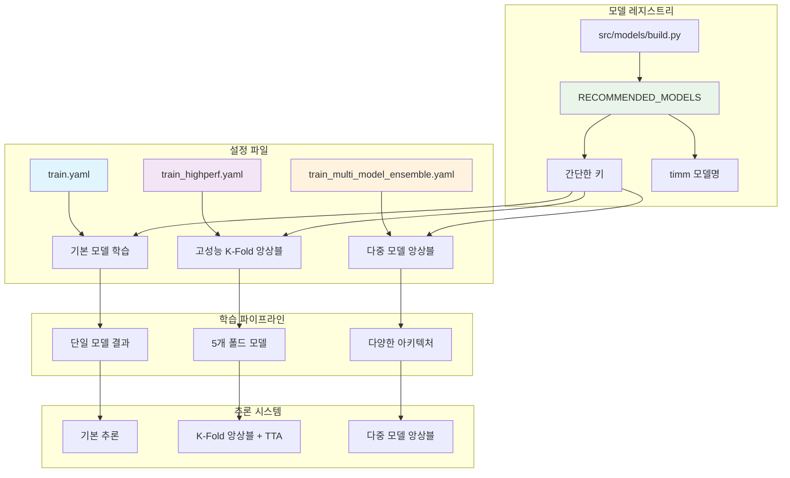

---

## 모델 추가 방법

### 🔧 모델 추가 워크플로우

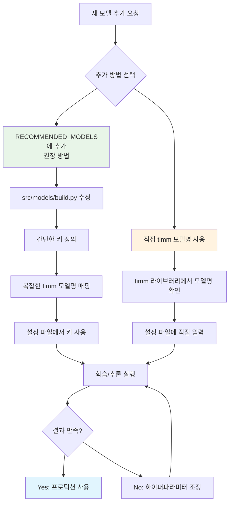

### 🔧 1. 추천 모델 목록에 추가 (권장)

**파일 위치**: `src/models/build.py`

```python
# 고성능 모델 추천 목록
RECOMMENDED_MODELS = {
    # 기존 모델들
    "swin_base_384": "swin_base_patch4_window12_384_in22k",
    "convnext_base_384": "convnext_base_384_in22ft1k",
    "efficientnet_b3": "efficientnet_b3",
    "efficientnet_v2_b3": "tf_efficientnetv2_b3",
    "resnet50": "resnet50",
    
    # 새로 추가된 모델들
    "vit_base": "vit_base_patch16_224",
    "vit_large": "vit_large_patch16_224",
    "convnext_large": "convnext_large_384_in22ft1k",
    "deit_base": "deit_base_patch16_224",
    "maxvit_base": "maxvit_base_tf_384",
    
    # 추가할 모델 예시
    "efficientnet_b4": "efficientnet_b4",
    "resnext50": "resnext50_32x4d",
    "densenet121": "densenet121",
    "mobilenet_v3": "mobilenetv3_large_100",
}
```

**장점:**
- 🎯 간단한 키로 복잡한 모델명 관리
- 🔄 일관된 모델 명명 규칙
- 📝 주석으로 모델 특성 설명 가능

### 🔧 2. 직접 timm 모델명 사용

설정 파일에서 직접 timm 모델명을 사용할 수 있습니다:

```yaml
model:
  name: "convnext_xlarge_384_in22ft1k"  # timm 모델명 직접 사용
```

**사용 가능한 timm 모델 확인 방법:**
```python
import timm
print(timm.list_models('*convnext*'))    # ConvNeXt 계열 모델들
print(timm.list_models('*swin*'))        # Swin 계열 모델들
print(timm.list_models('*efficient*'))   # EfficientNet 계열 모델들
```

---

## 기본 모델 설정

### 📄 설정 파일: `configs/train.yaml`

```yaml
# ------------------------------- 모델 설정 -------------------------------- #
model:
  name: "efficientnet_b3"                           # 모델 아키텍처 이름
  pretrained: true                                  # 사전학습 가중치 사용 여부
  drop_rate: 0.0                                    # dropout 비율
  drop_path_rate: 0.0                               # stochastic depth 비율
  pooling: "avg"                                    # global pooling 방식
```

### 🔧 설정 파라미터 상세 설명

| 파라미터 | 설명 | 권장값 | 예시 |
|----------|------|--------|------|
| `name` | 모델 아키텍처 이름 | 추천 모델 키 사용 | `"efficientnet_b3"` |
| `pretrained` | ImageNet 사전학습 가중치 사용 | `true` | `true` / `false` |
| `drop_rate` | 최종 분류기 전 Dropout 비율 | `0.0~0.3` | `0.1` |
| `drop_path_rate` | Stochastic Depth 비율 | `0.0~0.2` | `0.1` |
| `pooling` | 전역 풀링 방식 | `"avg"` | `"avg"` / `"gem"` / `"max"` |

### 🎯 베이스라인 실험용 추천 설정

```yaml
# 빠른 실험 (CPU/저사양 GPU)
model:
  name: "resnet50"
  pretrained: true
  drop_rate: 0.0
  drop_path_rate: 0.0
  pooling: "avg"

# 중간 성능 실험 (일반 GPU)
model:
  name: "efficientnet_b3"
  pretrained: true
  drop_rate: 0.1
  drop_path_rate: 0.0
  pooling: "avg"
```

---

## 고성능 모델 설정

### 📄 설정 파일: `configs/train_highperf.yaml`

```yaml
# ------------------------------- 모델 설정 ------------------------------- #
model:
  name: swin_base_384                           # 고성능 모델 (Swin Transformer)
  pretrained: true                              # 사전학습 가중치 사용
  drop_rate: 0.1                                # 드롭아웃 비율
  drop_path_rate: 0.1                           # 드롭패스 비율 (Stochastic Depth)
  pooling: "avg"                                # 전역 풀링 방식
```

### 🏆 고성능 모델별 추천 설정

#### **Swin Transformer 계열**
```yaml
# Swin-Base (추천)
model:
  name: "swin_base_384"
  pretrained: true
  drop_rate: 0.1
  drop_path_rate: 0.1
  pooling: "avg"

# Swin-Large (최고 성능)
model:
  name: "swin_large_patch4_window12_384_in22k"
  pretrained: true
  drop_rate: 0.2
  drop_path_rate: 0.2
  pooling: "avg"
```

#### **ConvNeXt 계열**
```yaml
# ConvNeXt-Base (추천)
model:
  name: "convnext_base_384"
  pretrained: true
  drop_rate: 0.1
  drop_path_rate: 0.1
  pooling: "avg"

# ConvNeXt-Large (최고 성능)
model:
  name: "convnext_large"
  pretrained: true
  drop_rate: 0.2
  drop_path_rate: 0.2
  pooling: "avg"
```

#### **Vision Transformer 계열**
```yaml
# ViT-Base (표준)
model:
  name: "vit_base"
  pretrained: true
  drop_rate: 0.1
  drop_path_rate: 0.1
  pooling: "token"  # ViT는 token pooling 권장

# DeiT-Base (데이터 효율적)
model:
  name: "deit_base"
  pretrained: true
  drop_rate: 0.1
  drop_path_rate: 0.1
  pooling: "token"
```

### 🔥 K-Fold 앙상블 동작 방식

`train_highperf.yaml`로 학습 시:

```
Fold 0: Swin Transformer → best_model_fold_1.pth
Fold 1: Swin Transformer → best_model_fold_2.pth  
Fold 2: Swin Transformer → best_model_fold_3.pth
Fold 3: Swin Transformer → best_model_fold_4.pth
Fold 4: Swin Transformer → best_model_fold_5.pth
```

**결과**: 동일한 모델의 5개 폴드 앙상블 (성능 향상, 과적합 방지)

#### K-Fold 앙상블 프로세스 시각화

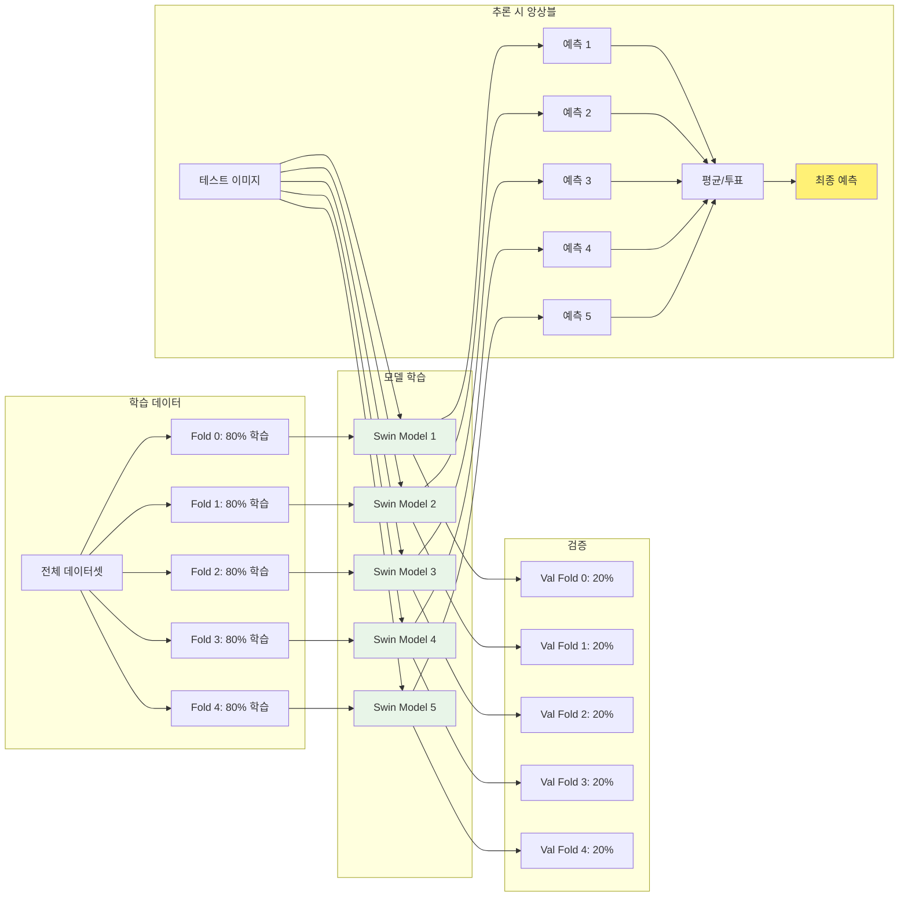

---

## 다중 모델 앙상블

### 📄 설정 파일: `configs/train_multi_model_ensemble.yaml`

```yaml
# ------------------------------- 다중 모델 설정 ------------------------------- #
# 폴드별로 다른 모델 사용 (실험적 기능)
models:
  fold_0: "swin_base_384"                       # Fold 0: Swin Transformer
  fold_1: "convnext_base_384"                   # Fold 1: ConvNeXt
  fold_2: "efficientnet_v2_b3"                  # Fold 2: EfficientNet-V2
  fold_3: "vit_base"                            # Fold 3: Vision Transformer
  fold_4: "maxvit_base"                         # Fold 4: MaxViT

# 기본 모델 설정 (모든 폴드에 공통 적용)
model:
  pretrained: true
  drop_rate: 0.1
  drop_path_rate: 0.1
  pooling: "avg"
```

### 🎯 다중 모델 앙상블 전략

#### **다중 모델 앙상블 아키텍처**

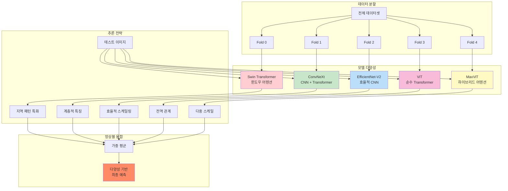

#### **Strategy 1: 아키텍처 다양성**
```yaml
models:
  fold_0: "swin_base_384"        # Vision Transformer
  fold_1: "convnext_base_384"    # CNN + Transformer
  fold_2: "efficientnet_v2_b3"   # 효율적 CNN
  fold_3: "vit_base"             # Pure Transformer
  fold_4: "resnet50"             # 전통적 CNN
```

#### **Strategy 2: 크기별 다양성**
```yaml
models:
  fold_0: "efficientnet_b3"      # Medium
  fold_1: "efficientnet_b4"      # Large
  fold_2: "efficientnet_v2_b3"   # V2 Medium
  fold_3: "swin_base_384"        # Large Transformer
  fold_4: "convnext_base_384"    # Large CNN-Transformer
```

#### **Strategy 3: 특성별 다양성**
```yaml
models:
  fold_0: "swin_base_384"        # 윈도우 어텐션 (지역적)
  fold_1: "vit_base"             # 글로벌 어텐션 (전역적)
  fold_2: "convnext_base_384"    # Depth-wise 컨볼루션
  fold_3: "efficientnet_v2_b3"   # 효율적 스케일링
  fold_4: "maxvit_base"          # 하이브리드 어텐션
```

### 🚀 다중 모델 앙상블 실행

**현재 구현 상태**: 설정 파일만 준비됨 (코드 구현 필요)

**대안 방법** (현재 사용 가능):
```bash
# 1. 각 모델별로 개별 학습
python src/training/train_main.py --config configs/train_swin.yaml
python src/training/train_main.py --config configs/train_convnext.yaml
python src/training/train_main.py --config configs/train_efficientnet.yaml

# 2. 추론 시 모델들을 조합하여 앙상블
# (별도 스크립트 작성 필요)
```

---

## 모델별 특성 및 추천 사용법

### 🏗️ 아키텍처별 분류

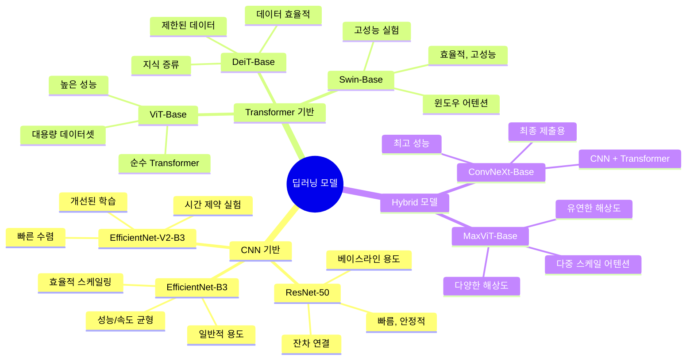

#### **CNN 기반 모델**
| 모델 | 특징 | 장점 | 단점 | 추천 용도 |
|------|------|------|------|----------|
| ResNet-50 | 잔차 연결 | 빠름, 안정적 | 성능 한계 | 베이스라인, 빠른 실험 |
| EfficientNet-B3 | 효율적 스케일링 | 성능/속도 균형 | 메모리 사용량 | 일반적 용도 |
| EfficientNet-V2-B3 | 개선된 학습 | 빠른 수렴 | 약간 무거움 | 시간 제약 실험 |

#### **Transformer 기반 모델**
| 모델 | 특징 | 장점 | 단점 | 추천 용도 |
|------|------|------|------|----------|
| ViT-Base | 순수 Transformer | 높은 성능 | 많은 데이터 필요 | 대용량 데이터셋 |
| Swin-Base | 윈도우 어텐션 | 효율적, 고성능 | 복잡한 구조 | 고성능 실험 |
| DeiT-Base | 지식 증류 | 데이터 효율적 | 중간 성능 | 제한된 데이터 |

#### **Hybrid 모델**
| 모델 | 특징 | 장점 | 단점 | 추천 용도 |
|------|------|------|------|----------|
| ConvNeXt-Base | CNN + Transformer | 최고 성능 | 무거움 | 최종 제출용 |
| MaxViT-Base | 다중 스케일 어텐션 | 유연한 해상도 | 복잡함 | 다양한 해상도 |

### 🎯 용도별 추천 모델

#### **빠른 실험 & 베이스라인**
```yaml
model:
  name: "resnet50"          # 가장 빠름
  # 또는
  name: "efficientnet_b3"   # 성능/속도 균형
```

#### **중간 성능 실험**
```yaml
model:
  name: "efficientnet_v2_b3"  # CNN 계열 최적
  # 또는  
  name: "vit_base"            # Transformer 계열
```

#### **최고 성능 추구**
```yaml
model:
  name: "swin_base_384"       # 현재 최고 성능
  # 또는
  name: "convnext_base_384"   # 차세대 CNN
```

#### **특수 목적**
```yaml
# 메모리 제약 환경
model:
  name: "efficientnet_b3"

# 높은 해상도 이미지
model:
  name: "swin_base_384"

# 빠른 추론 필요
model:
  name: "resnet50"
```

### 🔧 모델별 하이퍼파라미터 추천

#### **모델 크기별 설정 가이드라인**

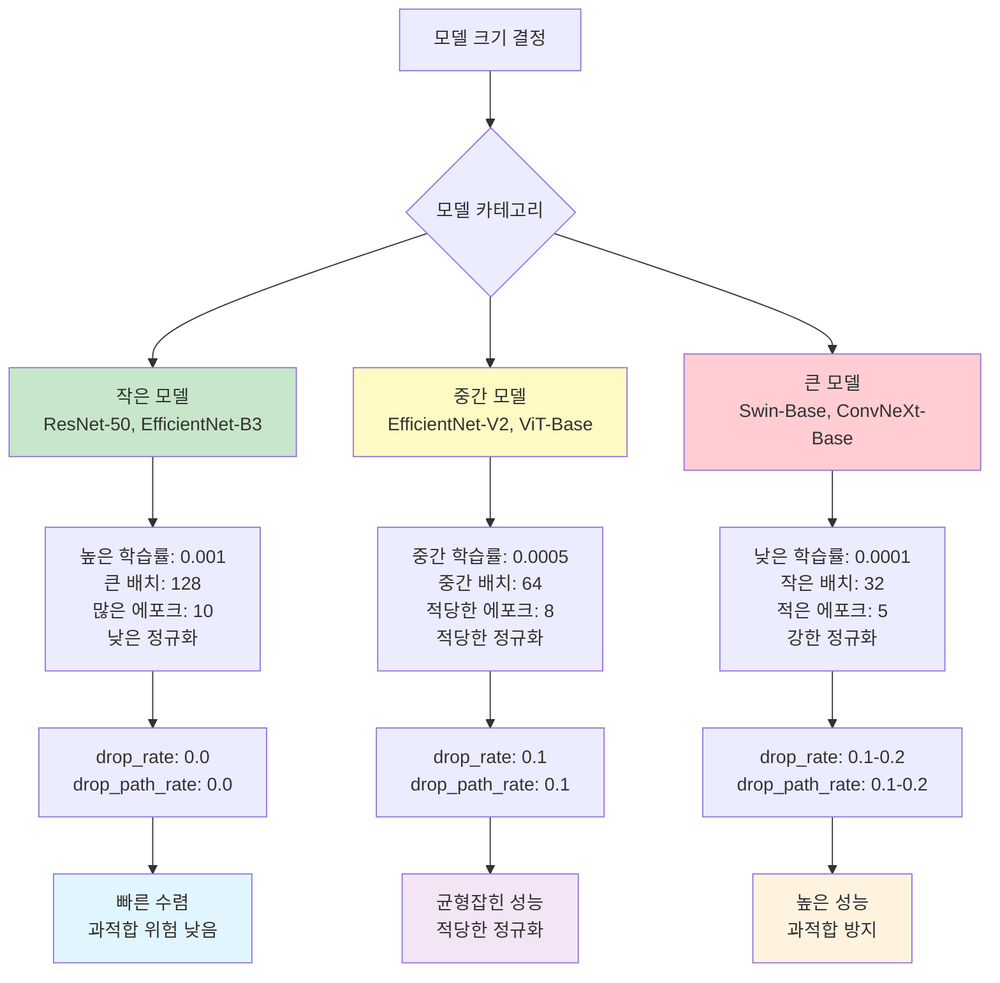

#### **작은 모델 (ResNet, EfficientNet-B3)**
```yaml
train:
  lr: 0.001                 # 높은 학습률
  batch_size: 128           # 큰 배치 크기
  epochs: 10                # 더 많은 에포크

model:
  drop_rate: 0.0            # 드롭아웃 낮게
  drop_path_rate: 0.0       # 정규화 약하게
```

#### **중간 모델 (EfficientNet-V2, ViT-Base)**
```yaml
train:
  lr: 0.0005                # 중간 학습률
  batch_size: 64            # 중간 배치 크기
  epochs: 8                 # 적당한 에포크

model:
  drop_rate: 0.1            # 적당한 드롭아웃
  drop_path_rate: 0.1       # 적당한 정규화
```

#### **큰 모델 (Swin-Base, ConvNeXt-Base)**
```yaml
train:
  lr: 0.0001                # 낮은 학습률
  batch_size: 32            # 작은 배치 크기
  epochs: 5                 # 적은 에포크

model:
  drop_rate: 0.1            # 적당한 드롭아웃
  drop_path_rate: 0.1       # 강한 정규화
```

---

## 실험 전략

### 🎯 실험 단계별 로드맵

```mermaid
journey
    title 모델 실험 여정
    section Phase 1: 빠른 검증
      시스템 검증: 5: 개발자
      베이스라인 설정: 4: 개발자
      EfficientNet-B3 실행: 3: 개발자
      초기 성능 확인: 4: 개발자
    section Phase 2: 고성능 탐색
      Swin-Base-384 실행: 5: 개발자
      최고 성능 달성: 5: 개발자
      K-Fold 앙상블 적용: 4: 개발자
    section Phase 3: 다양성 확보
      여러 모델 비교: 4: 개발자
      아키텍처별 실험: 3: 개발자
      성능 벤치마킹: 4: 개발자
    section Phase 4: 최종 최적화
      앙상블 조합 탐색: 5: 개발자
      TTA 적용: 4: 개발자
      최종 제출: 5: 개발자
```

### 🎯 1. 단계별 실험 전략

#### **실험 의사결정 트리**

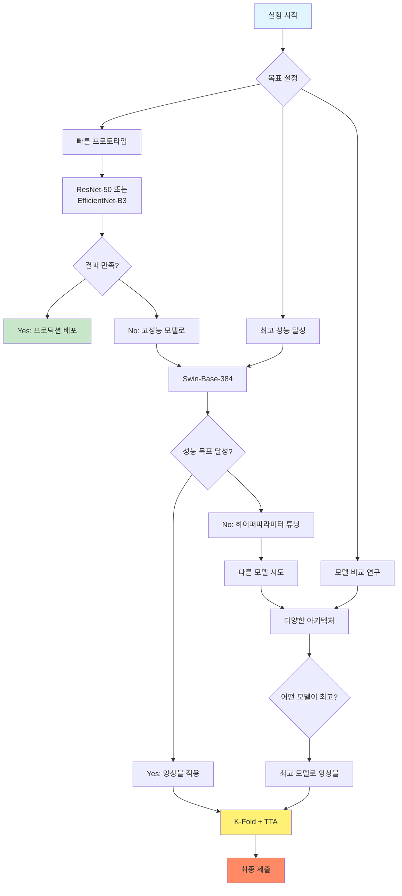

#### **Phase 1: 빠른 베이스라인**
```bash
# 목표: 시스템 검증 & 빠른 결과
python src/training/train_main.py --config configs/train.yaml
```
**모델**: `efficientnet_b3`  
**시간**: ~30분  
**목적**: 파이프라인 검증, 초기 성능 확인

#### **Phase 2: 고성능 단일 모델**
```bash
# 목표: 최고 단일 모델 성능
python src/training/train_main.py --config configs/train_highperf.yaml
```
**모델**: `swin_base_384`  
**시간**: ~2-3시간  
**목적**: 최고 성능 달성

#### **Phase 3: 다양한 모델 실험**
```bash
# 목표: 여러 모델 성능 비교
for model in "vit_base" "convnext_base_384" "efficientnet_v2_b3"; do
    # 설정 파일에서 모델명 변경 후 실행
    python src/training/train_main.py --config configs/train_${model}.yaml
done
```

#### **Phase 4: 앙상블 최적화**
```bash
# 목표: 최고 앙상블 성능
python src/inference/infer_main.py --mode highperf --fold-results results.yaml
```

### 🔄 2. 모델 선택 전략

#### **선택 기준별 모델 매트릭스**

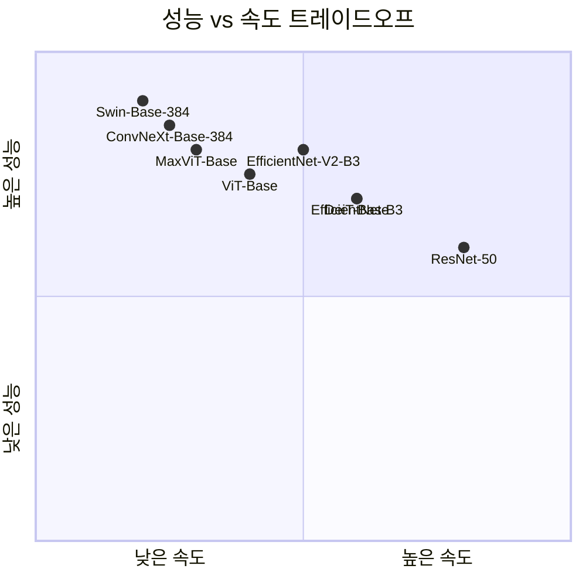

#### **전략별 모델 추천**

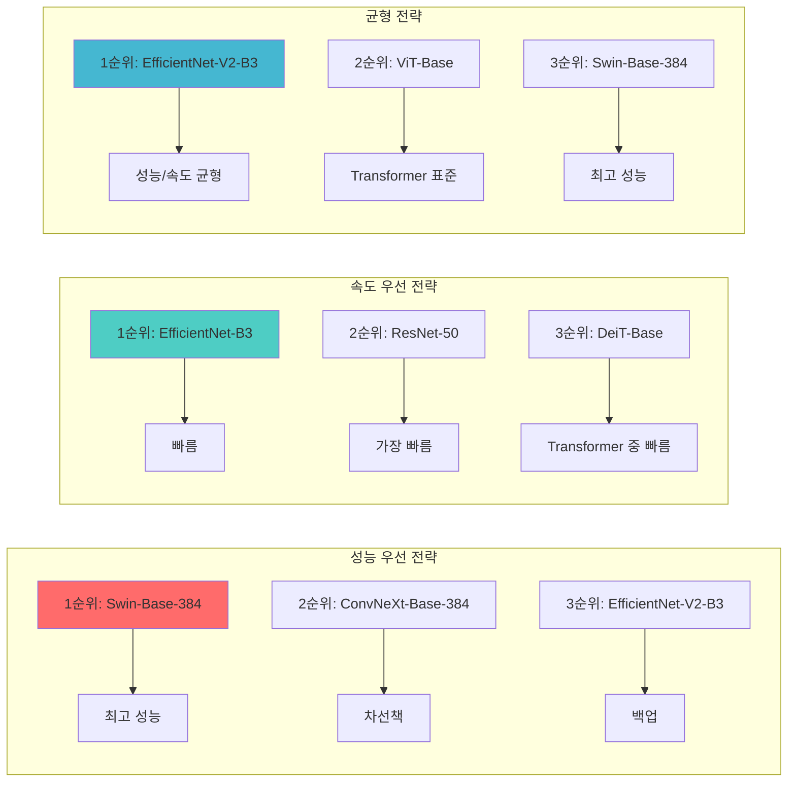

### 📊 3. 실험 추적 및 비교

#### **성능 지표 추적**
```yaml
# WandB 태그로 실험 분류
wandb:
  tags:
    - baseline          # 베이스라인 실험
    - high-performance  # 고성능 실험
    - architecture-comparison  # 모델 비교
    - ensemble         # 앙상블 실험
```

#### **실험 로그 분석**
```python
# 실험 결과 비교 스크립트 예시
experiments = {
    "efficientnet_b3": {"f1": 0.891, "time": "30min"},
    "swin_base_384": {"f1": 0.934, "time": "2.5h"},
    "convnext_base_384": {"f1": 0.928, "time": "2.2h"},
    "vit_base": {"f1": 0.915, "time": "1.8h"},
}
```

---

## 문제 해결

### ❌ 문제 해결 플로우차트

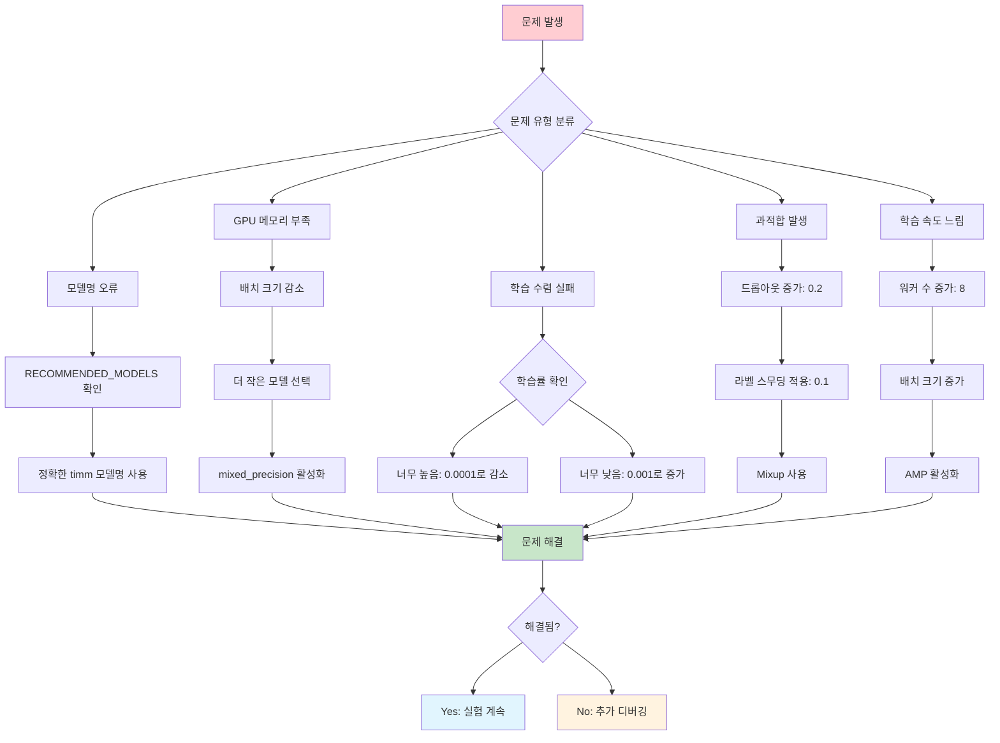

### 🔧 하드웨어별 최적화 가이드

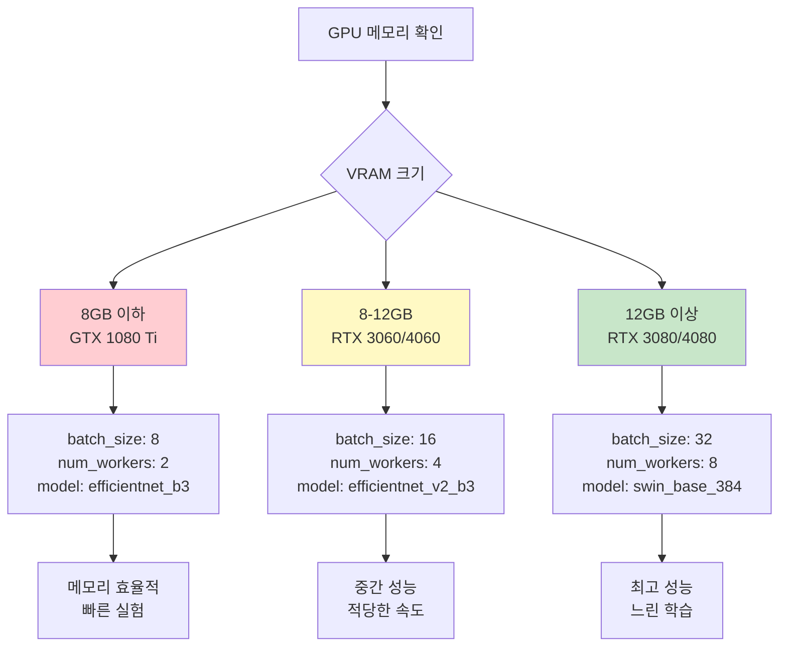

### 📊 성능 최적화 체크리스트

```mermaid
gitgraph
    commit id: "초기 설정"
    branch optimization
    checkout optimization
    commit id: "Mixed Precision 활성화"
    commit id: "배치 크기 최적화"
    commit id: "워커 수 조정"
    commit id: "모델별 하이퍼파라미터"
    checkout main
    merge optimization
    commit id: "최적화 완료"
    
    branch debugging
    checkout debugging
    commit id: "메모리 사용량 모니터링"
    commit id: "학습률 스케줄링"
    commit id: "정규화 기법 적용"
    checkout main
    merge debugging
    commit id: "디버깅 완료"
```

### ❌ 자주 발생하는 문제들

#### **1. 모델명 오류**
```
ERROR: Model 'wrong_model_name' not found
```
**해결책:**
- `RECOMMENDED_MODELS`에 정의된 키 사용
- 또는 정확한 timm 모델명 확인: `timm.list_models()`

#### **2. GPU 메모리 부족**
```
CUDA out of memory
```
**해결책:**
```yaml
train:
  batch_size: 32        # 64 → 32로 감소
  # 또는
  batch_size: 16        # 더 감소

model:
  name: "efficientnet_b3"  # 더 작은 모델 사용
```

#### **3. 학습이 수렴하지 않음**
**원인**: 학습률이 너무 높거나 낮음  
**해결책:**
```yaml
train:
  lr: 0.0001            # 큰 모델: 낮은 학습률
  # 또는
  lr: 0.001             # 작은 모델: 높은 학습률
```

#### **4. 과적합 발생**
**증상**: 검증 F1이 감소하기 시작  
**해결책:**
```yaml
model:
  drop_rate: 0.2        # 드롭아웃 증가
  drop_path_rate: 0.2   # 정규화 강화

train:
  label_smoothing: 0.1  # 라벨 스무딩 적용
  use_mixup: true       # Mixup 적용
```

#### **5. 학습 속도가 너무 느림**
**해결책:**
```yaml
project:
  num_workers: 8        # 워커 수 증가

train:
  mixed_precision: true # AMP 활성화
  batch_size: 64        # 배치 크기 증가 (메모리 허용 시)
```

### 🔧 성능 최적화 팁

#### **1. 모델별 최적 설정**
```python
# 자동 설정 추천 (예시)
optimal_configs = {
    "resnet50": {"lr": 0.001, "batch_size": 128, "drop_rate": 0.0},
    "efficientnet_b3": {"lr": 0.0005, "batch_size": 64, "drop_rate": 0.1},
    "swin_base_384": {"lr": 0.0001, "batch_size": 32, "drop_rate": 0.1},
    "vit_base": {"lr": 0.0003, "batch_size": 48, "drop_rate": 0.1},
}
```

#### **2. 하드웨어별 최적화**
```yaml
# RTX 3080/4080 (VRAM 10-16GB)
train:
  batch_size: 32
  num_workers: 8
model:
  name: "swin_base_384"

# RTX 3060/4060 (VRAM 8-12GB)
train:
  batch_size: 16
  num_workers: 4
model:
  name: "efficientnet_v2_b3"

# GTX 1080 Ti (VRAM 11GB)
train:
  batch_size: 8
  num_workers: 2
model:
  name: "efficientnet_b3"
```

### 📚 참고 자료

#### **timm 라이브러리 문서**
- [timm 공식 문서](https://huggingface.co/docs/timm/)
- [지원 모델 목록](https://github.com/rwightman/pytorch-image-models)

#### **모델별 논문**
- **Swin Transformer**: [논문 링크](https://arxiv.org/abs/2103.14030)
- **ConvNeXt**: [논문 링크](https://arxiv.org/abs/2201.03545)
- **EfficientNet**: [논문 링크](https://arxiv.org/abs/1905.11946)
- **Vision Transformer**: [논문 링크](https://arxiv.org/abs/2010.11929)

#### **모델 성능 벤치마크**
```
ImageNet Top-1 Accuracy (참고용):
- ResNet-50: 76.2%
- EfficientNet-B3: 81.9%
- EfficientNet-V2-B3: 83.1%
- ViT-Base: 81.8%
- Swin-Base: 83.3%
- ConvNeXt-Base: 83.8%
```

---

## 결론

이 가이드를 통해 다양한 딥러닝 모델을 효과적으로 설정하고 실험할 수 있습니다. 프로젝트의 목표와 제약사항에 맞는 모델을 선택하고, 단계별 실험 전략을 통해 최고의 성능을 달성하시기 바랍니다.

### 🎯 실험 로드맵 요약

```mermaid
timeline
    title 권장 실험 순서
    
    section 1단계 : 빠른 검증
        EfficientNet-B3 베이스라인 : 시스템 검증
                                   : 30분 소요
                                   : F1 ~0.89 목표
    
    section 2단계 : 고성능 달성  
        Swin-Base-384 학습 : K-Fold 앙상블
                           : 2-3시간 소요
                           : F1 ~0.93 목표
    
    section 3단계 : 다양성 확보
        여러 모델 비교 : ViT, ConvNeXt, EfficientNet-V2
                      : 아키텍처별 특성 분석
                      : 최적 조합 탐색
    
    section 4단계 : 최종 최적화
        앙상블 조합 : TTA + 다중 모델
                   : Temperature Scaling
                   : 최종 제출 준비
```

**추천 실험 순서:**
1. 🚀 EfficientNet-B3로 빠른 베이스라인
2. 🏆 Swin-Base-384로 고성능 달성  
3. 🔄 다양한 모델로 비교 실험
4. 🎯 최적 앙상블 조합 탐색

### 📈 성능 예상 가이드

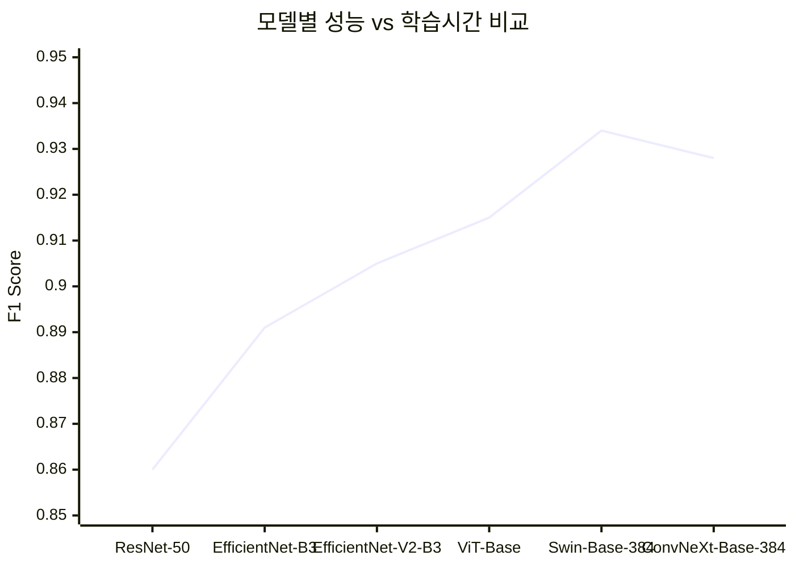
