# 📊 시각화 시스템 완전 가이드 (Team ConvNeXt 성능 분석 포함)

## 🎯 Team ConvNeXt 시각화 시스템 개요

Team의 0.9652 F1 Score 달성을 위한 고도화된 시각화 시스템입니다. ConvNeXt Base 384 모델의 학습, TTA 추론, 온도 스케일링 및 성능 분석을 전문적으로 시각화합니다.

### 📈 Team 전용 시각화 기능
- ✅ **ConvNeXt 학습 분석**: Loss/F1/Learning Rate 경향 시각화
- ✅ **TTA 성능 비교**: Essential vs Comprehensive TTA 결과
- ✅ **Temperature Scaling**: Hard Augmentation 효과 분석
- ✅ **5-Fold 앙상블**: Fold별 성능 또는 비교 차트
- ✅ **GPU 메모리 추적**: ConvNeXt 메모리 사용량 모니터링
- ✅ **신뢰도 분석**: 예측 신뢰도 및 불확실성 정량화

### 🏆 Team ConvNeXt 시각화 성능 분석 (F1: 0.9652)

| 시각화 타입 | 기존 EfficientNet B3 | Team ConvNeXt Essential | Team ConvNeXt Comprehensive | 분석 가치 |
|------------|-------------------|------------------------|----------------------------|----------|
| **학습 곡선** | F1: 0.9238 수렴 | F1: 0.9489 수렴 | F1: 0.9565 학습 데이터 | ⭐⭐⭐⭐⭐ |
| **TTA 성능 비교** | 단순 회전 TTA | 5가지 Essential | 15가지 Comprehensive | ⭐⭐⭐⭐⭐ |
| **Fold별 성능** | CV: 0.9200-0.9280 | CV: 0.9450-0.9520 | CV: 0.9620-0.9680 | ⭐⭐⭐⭐ |
| **신뢰도 분석** | 기본 예측 신뢰도 | Temperature Scaling | Advanced Calibration | ⭐⭐⭐⭐⭐ |
| **메모리 사용량** | 8GB 안정적 | 10GB 최적화 필요 | 16GB+ 권장 | ⭐⭐⭐⭐ |
| **추론 시간** | 5분 빠름 | 17분 균형 | 50분+ 최고 품질 | ⭐⭐⭐ |

### 🔧 Team 전용 모듈형 구조 (ConvNeXt 최적화)

Team ConvNeXt를 위한 고도화된 시각화 시스템:

- **`src/utils/visualizations/`** - 메인 모듈 디렉터리
  - `base_visualizer.py` - 핵심 SimpleVisualizer 클래스 및 Korean 폰트 설정
  - `training_viz.py` - 학습 시각화 전용 모듈 (7개 이미지)
  - `inference_viz.py` - 추론 시각화 전용 모듈 (7개 이미지)  
  - `optimization_viz.py` - 최적화 시각화 전용 모듈 (6개 이미지)
  - `output_manager.py` - 실험 출력 관리자
  - `__init__.py` - 모듈 exports 및 호환성 관리

## 🏗️ 시각화 시스템 아키텍처

```mermaid
graph TD
    subgraph "🎯 Team ConvNeXt 파이프라인"
        A[Team 학습<br/>train_main.py --mode highperf<br/>ConvNeXt Base 384]
        B[Team TTA 추론<br/>infer_main.py --mode highperf<br/>Essential/Comprehensive]
        C[Team 최적화<br/>optuna_tuner.py<br/>F1: 0.9652 목표]
    end
    
    subgraph "📊 시각화 모듈 시스템"
        D[SimpleVisualizer<br/>Core Engine<br/>src/utils/visualizations/base_visualizer.py]
        E[create_training_visualizations<br/>학습 전용<br/>src/utils/visualizations/training_viz.py]
        F[create_inference_visualizations<br/>추론 전용<br/>src/utils/visualizations/inference_viz.py]
        G[create_optimization_visualizations<br/>최적화 전용<br/>src/utils/visualizations/optimization_viz.py]
    end
    
    subgraph "💾 자동 저장 시스템"
        H[ExperimentOutputManager<br/>폴더 구조 관리]
        I[자동 폴더 생성<br/>YYYY/MM/DD 기반]
        J[이미지 파일 저장<br/>PNG 고해상도]
    end
    
    subgraph "📁 정리된 출력 구조"
        K[experiments/train/<br/>YYYYMMDD/model_name/images/]
        L[experiments/infer/<br/>YYYYMMDD/model_name/images/]
        M[experiments/optimization/<br/>YYYYMMDD/model_name/images/]
    end
    
    A --> E
    B --> F
    C --> G
    
    E --> D
    F --> D
    G --> D
    
    D --> H
    H --> I
    I --> J
    
    J --> K
    J --> L
    J --> M
    
    style A fill:#e1f5fe, color:#000000
    style B fill:#e8f5e8, color:#000000
    style C fill:#fff3e0, color:#000000
    style D fill:#f3e5f5, color:#000000
    style K fill:#ffebee, color:#000000
    style L fill:#ffebee, color:#000000
    style M fill:#ffebee, color:#000000
```



## 🔄 시각화 생성 플로우

```mermaid
flowchart TD
    subgraph "Phase 1: 파이프라인 실행"
        A1[ML 파이프라인 시작]
        A2[모델 학습/추론/최적화]
        A3[결과 데이터 생성]
        A1 --> A2 --> A3
    end
    
    subgraph "Phase 2: 시각화 트리거"
        B1[파이프라인 완료 감지]
        B2[시각화 모듈 호출]
        B3[데이터 유효성 검사]
        B1 --> B2 --> B3
    end
    
    subgraph "Phase 3: 시각화 생성"
        C1[차트 유형별 분기]
        C2[matplotlib/seaborn 렌더링]
        C3[PNG 파일 생성]
        C1 --> C2 --> C3
    end
    
    subgraph "Phase 4: 자동 저장"
        D1[날짜/모델명 기반 경로 생성]
        D2[images 폴더 자동 생성]
        D3[고해상도 이미지 저장]
        D4[저장 경로 로그 출력]
        D1 --> D2 --> D3 --> D4
    end
    
    Phase1 --> Phase2
    Phase2 --> Phase3
    Phase3 --> Phase4
    
    style A2 fill:#e1f5fe, color:#000000
    style B2 fill:#f3e5f5, color:#000000
    style C2 fill:#e8f5e8, color:#000000
    style D3 fill:#ffebee, color:#000000
```



## 📊 시각화 유형별 상세 가이드

### 🎓 학습 시각화 (Training Visualizations)

#### 생성 조건
- 학습 파이프라인 완료 시 자동 트리거
- fold_results 데이터 존재 시
- history_data (선택사항) 포함 시 더 풍부한 시각화

```mermaid
graph LR
    subgraph "학습 데이터 입력"
        A[fold_results<br/>각 폴드별 성능]
        B[history_data<br/>에포크별 변화]
        C[model_name<br/>모델 식별자]
    end
    
    subgraph "생성되는 시각화"
        D[fold_performance.png<br/>폴드별 F1 점수]
        E[training_history.png<br/>학습 곡선 4분할]
        F[performance_summary.png<br/>통계 요약]
    end
    
    A --> D
    B --> E
    C --> F
    
    style D fill:#e1f5fe, color:#000000
    style E fill:#e1f5fe, color:#000000
    style F fill:#e1f5fe, color:#000000
```



#### 저장 경로 구조
```
experiments/train/
└── 20250908/                    # 실행 날짜
    └── swin_base_384/           # 모델명
        └── images/              # 시각화 이미지
            ├── fold_performance.png      # 폴드별 성능 비교
            ├── training_history.png      # 학습 곡선 (2x2 레이아웃)
            └── performance_summary.png   # 성능 통계 요약
```

#### 시각화 내용 상세

**1. fold_performance.png**
- **내용**: 각 폴드별 F1 점수 막대그래프
- **특징**: 
  - 폴드별 색상 구분
  - 막대 위에 정확한 점수 표시
  - 평균 점수 점선 표시
  - 그리드로 가독성 향상

**2. training_history.png (2x2 레이아웃)**
- **좌상단**: 학습 Loss 곡선
- **우상단**: 검증 Loss 곡선
- **좌하단**: 검증 F1 점수 곡선
- **우하단**: 통계 요약 텍스트 박스

**3. performance_summary.png**
- **내용**: 전체 학습 결과 통계
- **포함 정보**: 평균 F1, 최고 F1, 표준편차, 모델명

### 🔮 추론 시각화 (Inference Visualizations)

#### 생성 조건
- 추론 파이프라인 완료 시 자동 트리거
- predictions 배열 존재 시
- confidence_scores (선택사항) 포함 시 신뢰도 분석

```mermaid
graph LR
    subgraph "추론 데이터 입력"
        A[predictions<br/>예측 결과 배열]
        B[confidence_scores<br/>신뢰도 점수]
        C[model_name<br/>모델 식별자]
    end
    
    subgraph "생성되는 시각화"
        D[inference_analysis.png<br/>추론 결과 4분할 분석]
        E[confidence_distribution.png<br/>신뢰도 분포]
        F[class_distribution.png<br/>클래스별 분포]
    end
    
    A --> D
    B --> E
    C --> F
    
    style D fill:#e8f5e8, color:#000000
    style E fill:#e8f5e8, color:#000000
    style F fill:#e8f5e8, color:#000000
```



#### 저장 경로 구조
```
experiments/infer/
└── 20250908/                    # 실행 날짜
    └── swin_ensemble/           # 모델명 (앙상블의 경우)
        └── images/              # 시각화 이미지
            ├── inference_analysis.png    # 종합 추론 분석 (2x2)
            ├── confidence_distribution.png  # 신뢰도 히스토그램
            └── class_distribution.png       # 클래스별 예측 분포
```

#### 시각화 내용 상세

**1. inference_analysis.png (2x2 레이아웃)**
- **좌상단**: 클래스별 예측 개수 막대그래프
- **우상단**: 신뢰도 점수 히스토그램
- **좌하단**: 클래스별 평균 신뢰도
- **우하단**: 예측 통계 요약 텍스트

**2. confidence_distribution.png**
- **내용**: 전체 예측의 신뢰도 분포
- **특징**: 
  - 30개 bin 히스토그램
  - 평균 신뢰도 수직선
  - 고신뢰도(>0.9) 영역 하이라이트

**3. class_distribution.png**
- **내용**: 각 클래스별 예측 개수
- **특징**: 
  - 클래스 불균형 시각화
  - 백분율 정보 포함
  - 색상으로 클래스 구분

### ⚡ 최적화 시각화 (Optimization Visualizations)

#### 생성 조건
- Optuna 최적화 완료 시 자동 트리거
- study.pkl 파일 존재 시
- 최소 3개 이상의 trial 완료 시

```mermaid
graph LR
    subgraph "최적화 데이터 입력"
        A[study.pkl<br/>Optuna Study 객체]
        B[trials_data<br/>시도별 결과]
        C[best_params<br/>최적 하이퍼파라미터]
    end
    
    subgraph "생성되는 시각화"
        D[optimization_analysis.png<br/>최적화 진행 4분할]
        E[parameter_importance.png<br/>파라미터 중요도]
        F[best_trials_comparison.png<br/>상위 결과 비교]
    end
    
    A --> D
    B --> E
    C --> F
    
    style D fill:#fff3e0, color:#000000
    style E fill:#fff3e0, color:#000000
    style F fill:#fff3e0, color:#000000
```



#### 저장 경로 구조
```
experiments/optimization/
└── 20250908/                    # 실행 날짜
    └── swin_optuna/             # 최적화 모델명
        └── images/              # 시각화 이미지
            ├── optimization_analysis.png    # 최적화 진행 분석 (2x2)
            ├── parameter_importance.png     # 하이퍼파라미터 중요도
            ├── best_trials_comparison.png   # 상위 3개 시도 비교
            └── hyperparameter_relationships.png  # 파라미터 상관관계
```

#### 시각화 내용 상세

**1. optimization_analysis.png (2x2 레이아웃)**
- **좌상단**: Trial별 목적함수 값 변화 (점선 그래프)
- **우상단**: 성능 분포 히스토그램 (평균/최고 표시)
- **좌하단**: 누적 최고 성능 변화
- **우하단**: 최적화 통계 요약 텍스트

**2. parameter_importance.png**
- **내용**: Optuna 계산 파라미터 중요도
- **특징**: 
  - 수평 막대그래프
  - 중요도 순 정렬
  - 수치값 표시

**3. best_trials_comparison.png**
- **내용**: 상위 3개 trial 성능 비교
- **특징**: 
  - 막대그래프로 F1 점수 비교
  - Trial 번호 및 성능 표시
  - 색상으로 순위 구분

## 📁 자동 폴더 구조 관리

### 🗂️ 디렉토리 구조 자동 생성

```mermaid
graph TD
    A[시각화 요청] --> B{실행 날짜 확인}
    B --> C[YYYYMMDD 폴더 존재?]
    C -->|No| D[날짜 폴더 생성]
    C -->|Yes| E[모델명 폴더 존재?]
    D --> E
    E -->|No| F[모델명 폴더 생성]
    E -->|Yes| G[images 폴더 존재?]
    F --> G
    G -->|No| H[images 폴더 생성]
    G -->|Yes| I[시각화 이미지 저장]
    H --> I
    
    style B fill:#e1f5fe, color:#000000
    style D fill:#f3e5f5, color:#000000
    style F fill:#e8f5e8, color:#000000
    style H fill:#fff3e0, color:#000000
    style I fill:#ffebee, color:#000000
```



### 📂 표준 폴더 구조

```
experiments/
├── train/                      # 학습 실험 결과
│   ├── 20250908/               # 실행 날짜
│   │   ├── swin_base_384/      # 모델별 폴더
│   │   │   ├── ckpt/           # 체크포인트 파일
│   │   │   ├── config.yaml     # 실험 설정
│   │   │   ├── fold_results.yaml  # 폴드별 결과
│   │   │   └── images/         # 🎨 시각화 이미지
│   │   │       ├── fold_performance.png
│   │   │       ├── training_history.png
│   │   │       └── performance_summary.png
│   │   ├── convnext_large/
│   │   └── ensemble_model/
│   ├── 20250907/
│   └── 20250909/
│
├── infer/                      # 추론 실험 결과
│   ├── 20250908/
│   │   ├── single_model/
│   │   │   └── images/         # 🎨 시각화 이미지
│   │   │       ├── inference_analysis.png
│   │   │       ├── confidence_distribution.png
│   │   │       └── class_distribution.png
│   │   └── ensemble_tta/
│   │       └── images/
│   └── 20250907/
│
└── optimization/               # 최적화 실험 결과
    ├── 20250908/
    │   ├── optuna_swin/
    │   │   ├── study.pkl       # Optuna Study 객체
    │   │   ├── best_params.yaml  # 최적 하이퍼파라미터
    │   │   └── images/         # 🎨 시각화 이미지
    │   │       ├── optimization_analysis.png
    │   │       ├── parameter_importance.png
    │   │       └── best_trials_comparison.png
    │   └── optuna_convnext/
    └── 20250907/
```

## 🛠️ 시각화 시스템 설정 및 사용

### 1. 시스템 요구사항

```bash
# 필수 패키지 설치
pip install matplotlib seaborn pandas numpy optuna

# 한글 폰트 지원 (선택사항)
sudo apt-get install fonts-nanum
```

### 2. 자동 시각화 활성화

모든 파이프라인에서 자동으로 활성화되어 있습니다. 별도 설정 불필요.

```python
# src/training/train_highperf.py 내부
from src.utils.visualizations import visualize_training_pipeline

# 학습 완료 후 자동 호출
visualize_training_pipeline(
    fold_results=fold_results_dict,
    model_name=model_name,
    output_dir=exp_root,
    history_data=history_data
)
```

### 3. 수동 시각화 생성

필요시 개별적으로 시각화를 생성할 수 있습니다.

```bash
# 학습 결과 시각화
python -c "
from src.utils.visualizations import create_training_visualizations
create_training_visualizations(
    fold_results={'fold_results': [{'fold': 1, 'best_f1': 0.85}]},
    model_name='test_model',
    output_dir='experiments/train/20250908/test_model'
)
"

# 추론 결과 시각화
python -c "
import numpy as np
from src.utils.visualizations import create_inference_visualizations
predictions = np.random.rand(100, 3)
create_inference_visualizations(
    predictions=predictions,
    model_name='test_model',
    output_dir='experiments/infer/20250908/test_model'
)
"

# 최적화 결과 시각화
python -c "
from src.utils.visualizations import create_optimization_visualizations
create_optimization_visualizations(
    study_path='experiments/optimization/20250908/test_model/study.pkl',
    model_name='test_model',
    output_dir='experiments/optimization/20250908/test_model'
)
"
```

### 4. 시각화 시스템 테스트

```bash
# 전체 시각화 시스템 테스트
python scripts/test_visualization.py

# 결과 확인
ls -la experiments/test_viz/images/
```

## ⚙️ 고급 설정 및 커스터마이징

### 🎨 시각화 스타일 커스터마이징

```python
# src/utils/visualizations/base_visualizer.py 내부 설정
class SimpleVisualizer:
    def __init__(self, output_dir: str, model_name: str):
        # 색상 팔레트 커스터마이징
        self.colors = ['#2E86C1', '#28B463', '#F39C12', '#E74C3C', '#8E44AD', '#17A2B8']
        
        # 해상도 설정
        self.dpi = 300  # 고해상도
        
        # 폰트 설정
        plt.rcParams['font.size'] = 12
        plt.rcParams['axes.titlesize'] = 16
```

### 📊 추가 시각화 유형 추가

새로운 시각화 유형을 추가하려면:

1. 적절한 모듈(`src/utils/visualizations/training_viz.py`, `inference_viz.py`, `optimization_viz.py`)에 새 함수 추가
2. 해당 파이프라인에서 호출 추가
3. 테스트 스크립트에 검증 로직 추가

```python
def create_custom_visualization(data, model_name, output_dir):
    """커스텀 시각화 함수"""
    viz = SimpleVisualizer(output_dir, model_name)
    
    # 시각화 로직
    plt.figure(figsize=(10, 6))
    # ... 차트 생성 ...
    
    viz.save_plot('custom_analysis.png')
```

### 🔧 자동 저장 경로 커스터마이징

```python
# 커스텀 경로 생성 함수
def create_custom_output_structure(base_dir: str, pipeline_type: str, 
                                  model_name: str, custom_suffix: str = "") -> Path:
    """커스텀 출력 구조 생성"""
    date_str = datetime.now().strftime('%Y%m%d')
    if custom_suffix:
        folder_name = f"{model_name}_{custom_suffix}"
    else:
        folder_name = model_name
        
    output_dir = Path(base_dir) / pipeline_type / date_str / folder_name
    output_dir.mkdir(parents=True, exist_ok=True)
    
    images_dir = output_dir / "images"
    images_dir.mkdir(exist_ok=True)
    
    return output_dir
```

## 📈 시각화 품질 관리

### 🔍 이미지 품질 설정

```python
# 고해상도 설정
plt.savefig(path, dpi=300, bbox_inches='tight', 
           facecolor='white', edgecolor='none')

# 벡터 형식 저장 (선택사항)
plt.savefig(path.replace('.png', '.svg'), format='svg')
```

### 📏 일관된 스타일 가이드

1. **색상 팔레트**: 6개 기본 색상으로 일관성 유지
2. **폰트 크기**: 제목 16pt, 본문 12pt, 라벨 10pt
3. **해상도**: 300 DPI 고해상도
4. **파일 형식**: PNG (호환성), SVG (벡터, 선택사항)

### 🚨 오류 처리

```python
try:
    # 시각화 생성
    create_training_visualizations(...)
    logger.write(f"[VIZ] Training visualizations created in {output_dir}")
except Exception as viz_error:
    logger.write(f"[WARNING] Visualization failed: {str(viz_error)}")
    # 파이프라인은 계속 진행 (시각화 실패가 전체 실행을 중단하지 않음)
```

## 🔧 트러블슈팅

### 일반적인 문제들

**1. 폰트 관련 경고**
```bash
# 문제: findfont: Font family 'NanumGothic' not found
# 해결: 시스템에 한글 폰트 설치
sudo apt-get install fonts-nanum
```

**2. 메모리 부족**
```python
# 문제: 대용량 데이터 시각화 시 메모리 부족
# 해결: 배치 처리 또는 샘플링
if len(predictions) > 10000:
    # 10000개 샘플로 제한
    indices = np.random.choice(len(predictions), 10000, replace=False)
    predictions = predictions[indices]
```

**3. 디스크 공간 부족**
```bash
# 문제: 시각화 이미지로 인한 디스크 공간 부족
# 해결: 오래된 이미지 정리
find experiments/*/images -name "*.png" -mtime +30 -delete
```

**4. 권한 문제**
```bash
# 문제: experiments 폴더 쓰기 권한 없음
# 해결: 권한 설정
chmod -R 755 experiments/
```

### 성능 최적화

**1. 시각화 생성 속도 향상**
```python
# matplotlib 백엔드 최적화
import matplotlib
matplotlib.use('Agg')  # GUI 없는 백엔드 사용
```

**2. 메모리 사용량 최적화**
```python
# 플롯 후 메모리 정리
plt.close('all')  # 모든 figure 닫기
gc.collect()      # 가비지 컬렉션 강제 실행
```

## 📊 시각화 결과 분석 가이드

### 학습 시각화 해석

**fold_performance.png 분석**
- 폴드 간 성능 편차가 클 경우: 데이터 분할 재검토 필요
- 전체적으로 낮은 성능: 모델 아키텍처 또는 하이퍼파라미터 조정 필요
- 특정 폴드만 낮은 경우: 해당 폴드 데이터 품질 확인

**training_history.png 분석**
- Loss 곡선이 수렴하지 않는 경우: 학습률 조정 필요
- Validation F1이 불안정한 경우: 정규화 강화 또는 배치 크기 조정
- Overfitting 징후: Early stopping 또는 드롭아웃 적용

### 추론 시각화 해석

**inference_analysis.png 분석**
- 클래스 불균형이 심한 경우: 데이터 분포 재확인
- 낮은 신뢰도 분포: 모델 보정(calibration) 필요
- 특정 클래스만 낮은 신뢰도: 해당 클래스 데이터 증강 필요

### 최적화 시각화 해석

**optimization_analysis.png 분석**
- 수렴하지 않는 최적화: trial 수 증가 또는 탐색 공간 조정
- 급격한 성능 변화: 하이퍼파라미터 범위 재설정
- 낮은 전체 성능: 기본 모델 아키텍처 재검토
