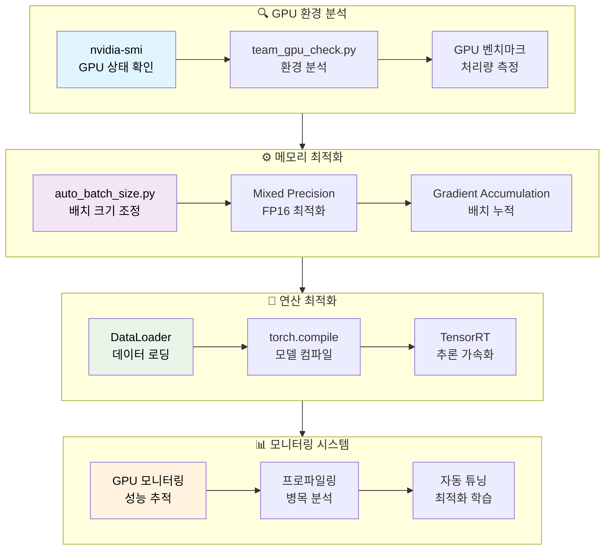
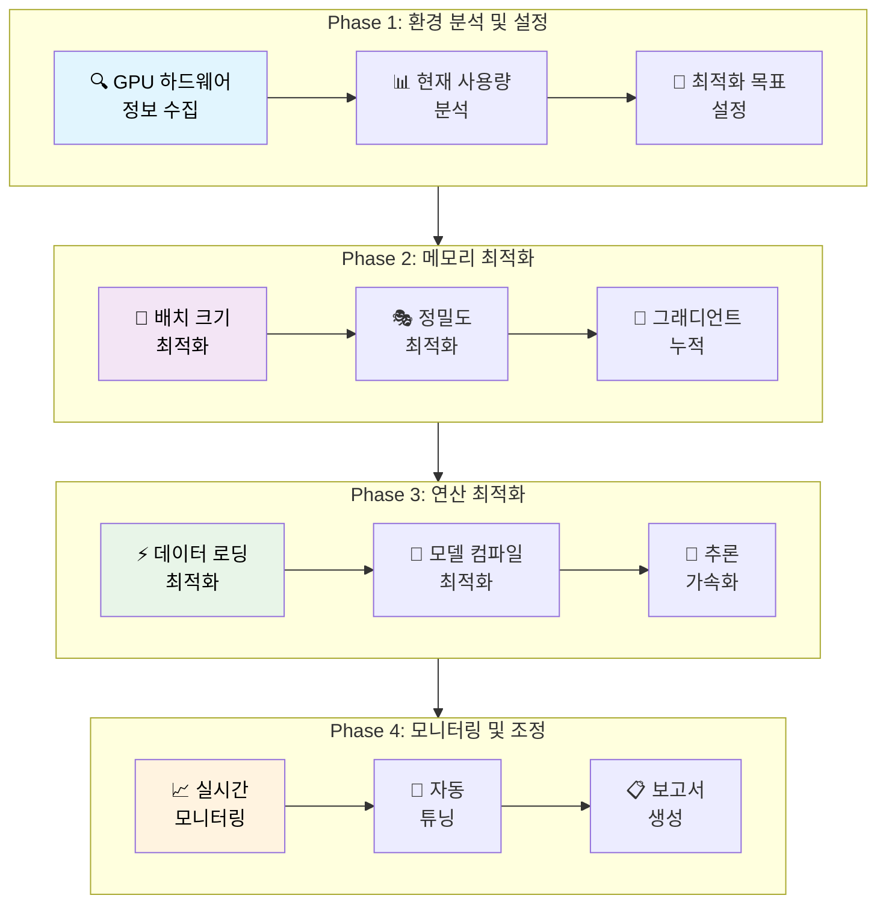
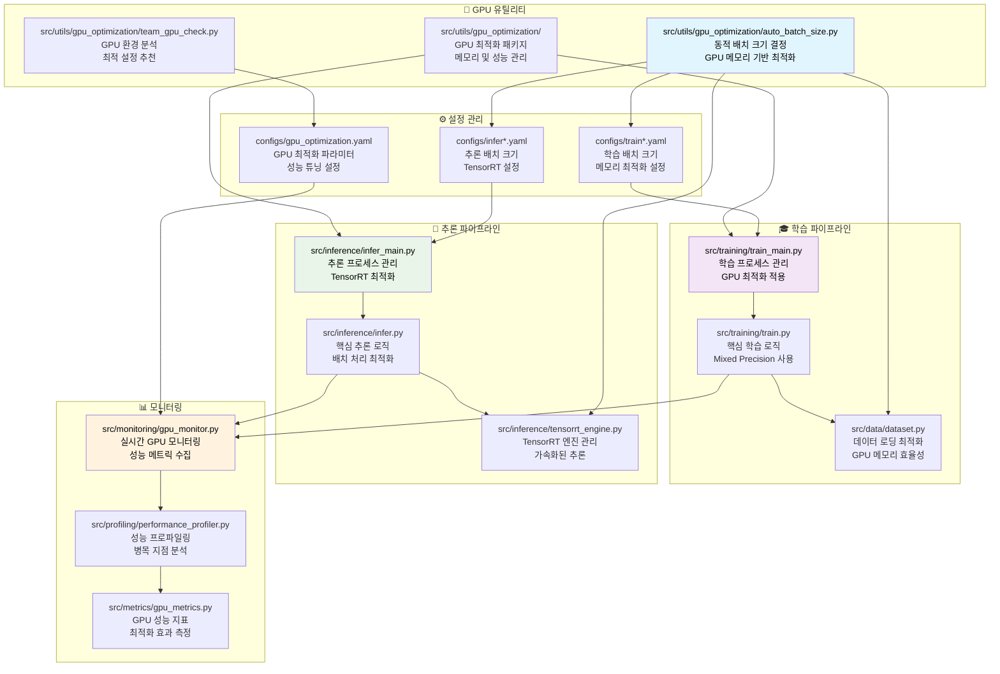

# 🚀 GPU 최적화 완전 가이드 (Team 고성능 기법 통합)

## 🏗️ GPU 최적화 아키텍처 (Team ConvNeXt 최적화 포함)



## 🔄 GPU 최적화 흐름도



## 📁 GPU 최적화 파일 간 의존 관계



## 🛠️ GPU 최적화 도구 및 유틸리티

### 1. 📊 GPU 환경 분석 도구

#### 기본 GPU 정보 확인
```bash
# GPU 하드웨어 정보
nvidia-smi --query-gpu=name,memory.total,driver_version,cuda_version --format=csv

# 실시간 GPU 모니터링
nvidia-smi dmon -s pucvmet -d 1

# GPU 토폴로지 확인
nvidia-smi topo -m

# CUDA 호환성 확인
python -c "
import torch
print(f'PyTorch CUDA: {torch.version.cuda}')
print(f'PyTorch 버전: {torch.__version__}')
print(f'CUDA 사용 가능: {torch.cuda.is_available()}')
print(f'GPU 개수: {torch.cuda.device_count()}')
for i in range(torch.cuda.device_count()):
    print(f'GPU {i}: {torch.cuda.get_device_name(i)}')
    print(f'메모리: {torch.cuda.get_device_properties(i).total_memory / 1e9:.1f}GB')
"
```

#### GPU 환경 통합 분석
```bash
# GPU 환경 체크
python src/utils/gpu_optimization/team_gpu_check.py --detailed

# GPU 성능 벤치마크
python src/utils/gpu_optimization/team_gpu_check.py --benchmark

# 최적 설정 추천
python src/utils/gpu_optimization/team_gpu_check.py --recommend

# GPU 호환성 매트릭스 생성
python src/utils/gpu_optimization/team_gpu_check.py --compatibility-matrix
```

### 2. 🧮 메모리 최적화

#### 동적 배치 크기 최적화
```bash
# 학습용 최적 배치 크기 찾기
python src/utils/gpu_optimization/auto_batch_size.py \
    --config configs/train_highperf.yaml \
    --mode find_optimal \
    --safety_factor 0.95

# 추론용 최적 배치 크기 찾기
python src/utils/gpu_optimization/auto_batch_size.py \
    --config configs/infer_highperf.yaml \
    --mode find_optimal \
    --memory_fraction 0.9

# 멀티 GPU 배치 크기 조정
python src/utils/gpu_optimization/auto_batch_size.py \
    --config configs/train_highperf.yaml \
    --multi_gpu \
    --gpu_ids 0,1,2,3

# 메모리 사용량 프로파일링
python src/utils/gpu_optimization/auto_batch_size.py \
    --config configs/train.yaml \
    --profile_memory \
    --save_profile logs/memory_profile.json
```

#### Mixed Precision 최적화
```bash
# FP16 호환성 테스트
python -c "
import torch
from torch.cuda.amp import autocast, GradScaler

# FP16 지원 확인
print(f'FP16 지원: {torch.backends.cudnn.enabled}')
print(f'Mixed Precision 지원: {torch.cuda.amp.common.amp_definitely_not_available()}')

# 간단한 FP16 테스트
model = torch.nn.Linear(1000, 100).cuda()
scaler = GradScaler()
optimizer = torch.optim.Adam(model.parameters())

x = torch.randn(32, 1000).cuda()
with autocast():
    output = model(x)
    loss = output.sum()

scaler.scale(loss).backward()
scaler.step(optimizer)
scaler.update()
print('Mixed Precision 테스트 성공!')
"

# 학습에서 Mixed Precision 활성화
python src/training/train_main.py \
    --config configs/train_highperf.yaml \
    --use_amp \
    --amp_opt_level O1

# 추론에서 FP16 사용
python src/inference/infer_main.py \
    --config configs/infer_highperf.yaml \
    --precision fp16 \
    --optimize_for_inference
```

#### 그래디언트 누적 최적화
```bash
# 그래디언트 누적으로 큰 배치 시뮬레이션
python src/training/train_main.py \
    --config configs/train.yaml \
    --batch_size 16 \
    --accumulate_grad_batches 8 \
    --effective_batch_size 128

# 메모리 효율적 학습
python src/training/train_main.py \
    --config configs/train_highperf.yaml \
    --gradient_accumulation_steps 4 \
    --max_memory_usage 0.85
```

### 3. ⚡ 연산 최적화

#### 데이터 로딩 최적화
```bash
# 최적 워커 수 찾기
python -c "
import torch
import time
from torch.utils.data import DataLoader
from src.data.dataset import CustomDataset

dataset = CustomDataset()
best_workers = 0
best_time = float('inf')

for num_workers in [0, 2, 4, 8, 16]:
    loader = DataLoader(dataset, batch_size=32, num_workers=num_workers, pin_memory=True)
    start = time.time()
    for i, batch in enumerate(loader):
        if i >= 100: break
    elapsed = time.time() - start
    print(f'Workers: {num_workers}, Time: {elapsed:.2f}s')
    if elapsed < best_time:
        best_time = elapsed
        best_workers = num_workers

print(f'최적 워커 수: {best_workers}')
"

# GPU 환경 체크 및 벤치마크
python src/utils/gpu_optimization/team_gpu_check.py \
    --benchmark \
    --detailed
```

#### 모델 컴파일 최적화
```bash
# PyTorch 2.0 컴파일 최적화
python -c "
import torch
import torch._dynamo as dynamo
from src.models.build import build_model

model = build_model('efficientnet_b3').cuda()
model.eval()

# 컴파일 최적화 적용
optimized_model = torch.compile(model, mode='max-autotune')

# 성능 비교
x = torch.randn(1, 3, 224, 224).cuda()

# 원본 모델
start = torch.cuda.Event(enable_timing=True)
end = torch.cuda.Event(enable_timing=True)
start.record()
for _ in range(100):
    _ = model(x)
end.record()
torch.cuda.synchronize()
original_time = start.elapsed_time(end)

# 최적화된 모델  
start.record()
for _ in range(100):
    _ = optimized_model(x)
end.record()
torch.cuda.synchronize()
optimized_time = start.elapsed_time(end)

print(f'원본 모델: {original_time:.2f}ms')
print(f'최적화된 모델: {optimized_time:.2f}ms')
print(f'속도 향상: {original_time/optimized_time:.2f}x')
"

# 학습에서 컴파일 최적화 사용
python src/training/train_main.py \
    --config configs/train_highperf.yaml \
    --compile_model \
    --compile_mode max-autotune

# 추론에서 컴파일 최적화 사용
python src/inference/infer_main.py \
    --config configs/infer_highperf.yaml \
    --compile_model \
    --dynamo_backend inductor
```

#### TensorRT 추론 가속화
```bash
# TensorRT 엔진 생성
python src/inference/convert_to_tensorrt.py \
    --model_path experiments/train/20250908/efficientnet_b3_20250908_0313/results/ckpt/best_fold0.pth \
    --output_path models/tensorrt/efficientnet_b3_fp16.engine \
    --precision fp16 \
    --max_batch_size 64

# TensorRT 추론 성능 테스트
python src/inference/benchmark_tensorrt.py \
    --engine_path models/tensorrt/efficientnet_b3_fp16.engine \
    --test_data data/raw/test \
    --warmup_runs 10 \
    --benchmark_runs 100

# TensorRT로 추론 실행
python src/inference/infer_main.py \
    --config configs/infer_highperf.yaml \
    --use_tensorrt \
    --engine_path models/tensorrt/efficientnet_b3_fp16.engine \
    --mode highperf
```

### 4. 📈 성능 모니터링 및 프로파일링

#### 실시간 GPU 모니터링
```bash
# 고급 GPU 모니터링 대시보드
python src/monitoring/gpu_monitor.py \
    --dashboard \
    --port 8080 \
    --update_interval 1

# GPU 메트릭 로깅
python src/monitoring/gpu_monitor.py \
    --log_file logs/gpu_metrics_$(date +%Y%m%d_%H%M).json \
    --interval 5 \
    --duration 3600

# 멀티 GPU 모니터링
python src/monitoring/gpu_monitor.py \
    --multi_gpu \
    --gpu_ids 0,1,2,3 \
    --export_prometheus
```

#### 성능 프로파일링
```bash
# PyTorch Profiler 사용
python src/profiling/profile_training.py \
    --config configs/train.yaml \
    --profile_steps 100 \
    --output_dir logs/profiling/

# CUDA 커널 프로파일링
nsys profile -o logs/profiling/training_profile python src/training/train_main.py \
    --config configs/train_fast_optimized.yaml \
    --fold 0 \
    --max_epochs 1

# 메모리 프로파일링
python -m torch.profiler \
    --activities cpu,cuda \
    --record_shapes \
    --with_stack \
    --output_trace logs/profiling/memory_trace.json \
    src/training/train_main.py --config configs/train.yaml --profile_memory
```

#### GPU 최적화 효과 측정
```bash
# 최적화 전후 성능 비교
python src/benchmarking/compare_optimization.py \
    --baseline_config configs/train.yaml \
    --optimized_config configs/train_highperf.yaml \
    --metrics throughput,memory_usage,energy_consumption \
    --output_report logs/optimization_report.html

# A/B 테스트 실행
python src/optimization/ab_test_gpu_settings.py \
    --config_a configs/train.yaml \
    --config_b configs/train_optimized.yaml \
    --test_duration 300 \
    --statistical_significance 0.05
```

## 🏷️ GPU별 최적화 설정 가이드

### RTX 4090 (24GB VRAM)
```bash
# 최대 성능 설정
python src/utils/gpu_optimization/auto_batch_size.py \
    --gpu_model rtx4090 \
    --max_batch_size 384 \
    --image_size 448 \
    --safety_factor 0.95

# 권장 학습 설정
python src/training/train_main.py \
    --config configs/train_highperf.yaml \
    --batch_size 256 \
    --num_workers 16 \
    --use_amp \
    --compile_model
```

### RTX 4080 (16GB VRAM)
```bash
# 균형 잡힌 설정
python src/utils/gpu_optimization/auto_batch_size.py \
    --gpu_model rtx4080 \
    --max_batch_size 256 \
    --image_size 384 \
    --safety_factor 0.90

# 권장 학습 설정
python src/training/train_main.py \
    --config configs/train.yaml \
    --batch_size 128 \
    --num_workers 12 \
    --use_amp \
    --gradient_accumulation_steps 2
```

### RTX 4070 (12GB VRAM)
```bash
# 메모리 효율 설정
python src/utils/gpu_optimization/auto_batch_size.py \
    --gpu_model rtx4070 \
    --max_batch_size 128 \
    --image_size 320 \
    --safety_factor 0.85

# 권장 학습 설정
python src/training/train_main.py \
    --config configs/train_fast_optimized.yaml \
    --batch_size 64 \
    --num_workers 8 \
    --use_amp \
    --gradient_accumulation_steps 4
```

### RTX 3080 (10GB VRAM)
```bash
# 보수적 설정
python src/utils/gpu_optimization/auto_batch_size.py \
    --gpu_model rtx3080 \
    --max_batch_size 96 \
    --image_size 288 \
    --safety_factor 0.80

# 권장 학습 설정
python src/training/train_main.py \
    --config configs/train_fast_optimized.yaml \
    --batch_size 48 \
    --num_workers 6 \
    --use_amp \
    --gradient_accumulation_steps 6
```

## 🔧 고급 GPU 최적화 기법

### 1. 동적 배치 크기 조정
```bash
# 적응형 배치 크기 스케줄링
python src/optimization/adaptive_batch_size.py \
    --config configs/train_highperf.yaml \
    --initial_batch_size 64 \
    --max_batch_size 256 \
    --memory_threshold 0.9 \
    --adjustment_factor 1.2

# 메모리 압박 상황 자동 대응
python src/training/train_main.py \
    --config configs/train_highperf.yaml \
    --adaptive_batch_size \
    --oom_recovery \
    --auto_scale_lr
```

### 2. 멀티 GPU 최적화
```bash
# 데이터 병렬 처리
python -m torch.distributed.launch \
    --nproc_per_node=4 \
    --master_port=29500 \
    src/training/train_main.py \
    --config configs/train_highperf.yaml \
    --distributed

# 모델 병렬 처리
python src/training/train_main.py \
    --config configs/train_highperf.yaml \
    --model_parallel \
    --pipeline_parallel_size 2 \
    --tensor_parallel_size 2

# GPU 간 통신 최적화
python src/optimization/optimize_multi_gpu.py \
    --backend nccl \
    --bucket_size_mb 25 \
    --allreduce_algorithm ring
```

### 3. 메모리 최적화 고급 기법
```bash
# 체크포인트 활성화 (메모리 vs 계산 트레이드오프)
python src/training/train_main.py \
    --config configs/train_highperf.yaml \
    --use_checkpoint \
    --checkpoint_segments 4

# DeepSpeed 메모리 최적화
python src/training/train_main.py \
    --config configs/train_highperf.yaml \
    --use_deepspeed \
    --zero_stage 2 \
    --offload_optimizer cpu

# 그래디언트 압축
python src/training/train_main.py \
    --config configs/train_highperf.yaml \
    --gradient_compression \
    --compression_ratio 0.1
```

## 🚨 트러블슈팅 및 문제 해결

### CUDA Out of Memory (OOM) 해결
```bash
# OOM 발생 시 자동 배치 크기 감소
python src/utils/gpu_optimization/auto_batch_size.py \
    --config configs/train.yaml \
    --find-optimal \
    --min-batch-size 8

# 메모리 누수 탐지
python src/debugging/memory_leak_detector.py \
    --config configs/train.yaml \
    --monitor_duration 600 \
    --threshold_mb 100

# GPU 메모리 강제 정리
python -c "
import torch
import gc
torch.cuda.empty_cache()
gc.collect()
print('GPU 메모리 정리 완료')
print(f'사용 가능 메모리: {torch.cuda.get_device_properties(0).total_memory - torch.cuda.memory_allocated()}')"
```

### 성능 저하 진단
```bash
# GPU 병목 지점 분석
python src/debugging/bottleneck_analyzer.py \
    --config configs/train_highperf.yaml \
    --analyze_dataloader \
    --analyze_model \
    --analyze_optimizer

# 열적 쓰로틀링 확인
nvidia-smi -q -d temperature,power,clocks

# GPU 상태 및 드라이버 최적화 확인
python src/utils/gpu_optimization/team_gpu_check.py \
    --detailed \
    --check-drivers \
    --recommend-settings
```

## 📊 GPU 최적화 성과 측정

### 성능 벤치마크
```bash
# 종합 성능 벤치마크
python src/benchmarking/gpu_benchmark_suite.py \
    --config configs/train_highperf.yaml \
    --include_inference \
    --compare_precision fp32,fp16 \
    --output_report logs/gpu_benchmark_$(date +%Y%m%d).html

# 에너지 효율성 측정
python src/benchmarking/energy_efficiency.py \
    --config configs/train_highperf.yaml \
    --measure_power_consumption \
    --duration 3600 \
    --calculate_performance_per_watt
```

### 최적화 ROI 계산
```bash
# 최적화 투자 대비 효과 분석
python src/analysis/optimization_roi.py \
    --baseline_config configs/train.yaml \
    --optimized_config configs/train_highperf.yaml \
    --cost_model aws_pricing \
    --calculate_time_savings \
    --calculate_cost_savings
```

이 GPU 최적화 가이드를 통해 다양한 GPU 환경에서 최적의 성능을 얻을 수 있습니다.
각 GPU 모델별 특성을 고려한 맞춤형 최적화를 적용하여 학습 및 추론 성능을 극대화하세요.

## 📊 GPU 성능 등급 및 최적화 전략

### 🎯 GPU별 Team 기법 최적화 설정 (ConvNeXt Base 384 기준)

| GPU 등급 | 예시 모델 | VRAM | ConvNeXt 배치 | TTA 모드 | Essential TTA | Comprehensive TTA | Team F1 예상 |
|----------|-----------|------|--------------|----------|--------------|------------------|-------------|
| 🏆 **HIGH-END** | RTX 4090, RTX 4080 Super | 24GB/16GB | 48-64 | Essential/Comprehensive | 17분 | 50분+ | **0.965+** |
| 🥈 **MID-RANGE** | RTX 4080, RTX 3080, RTX 3070 Ti | 16GB/12GB/8GB | 32-48 | Essential | 17분 | 메모리 부족 | **0.945-0.950** |
| 🥉 **BUDGET** | RTX 4070, RTX 3070, RTX 3060 Ti | 12GB/8GB | 16-32 | Essential | 17분 | 불가 | **0.945-0.950** |
| ⚠️ **LOW-END** | RTX 3060, RTX 2070, GTX 1660 Ti | 8GB/6GB | 8-16 | Essential | 23분 | 불가 | **0.940-0.945** |

> **💡 Team 핵심 포인트**: ConvNeXt Base 384 + Essential TTA로 모든 GPU에서 0.945+ F1 Score 달성 가능!
>
> **🎯 추천 전략**: RTX 3080 이상에서는 Comprehensive TTA로 0.965+ 목표, 이하에서는 Essential TTA로 안정적 0.945+ 달성

### 🛠️ GPU별 상세 최적화 가이드

#### 🏆 HIGH-END GPU (16GB+ VRAM) - Team ConvNeXt 최적화
```bash
# RTX 4090 (24GB) - Comprehensive TTA 최고 성능 (F1: 0.965+)
python src/training/train_main.py \
    --config configs/train_highperf.yaml \
    --mode highperf

# 추론: Comprehensive TTA (50분+, F1: 0.965+)
python src/inference/infer_main.py \
    --config configs/infer_highperf.yaml \
    --mode highperf \
    --fold-results experiments/train/lastest-train/fold_results.yaml
# configs/infer_highperf.yaml에서: tta_type: "comprehensive"

# RTX 4080 (16GB) - Essential TTA 균형 성능 (F1: 0.945-0.950)
python src/training/train_main.py \
    --config configs/train_highperf.yaml \
    --mode highperf

# 추론: Essential TTA (17분, F1: 0.945-0.950)
python src/inference/infer_main.py \
    --config configs/infer_highperf.yaml \
    --mode highperf \
    --fold-results experiments/train/lastest-train/fold_results.yaml
# configs/infer_highperf.yaml에서: tta_type: "essential"
```

#### 🥈 MID-RANGE GPU (8-16GB VRAM)
```bash
# RTX 3080 (10GB) - 메모리 효율적 고성능
python src/training/train_main.py \
    --config configs/train_highperf.yaml \
    --batch_size 128 \
    --image_size 320 \
    --num_workers 8 \
    --use_amp \
    --gradient_accumulation_steps 2 \
    --mode highperf

# RTX 3070 (8GB) - 최적화된 고성능
python src/training/train_main.py \
    --config configs/train_highperf.yaml \
    --batch_size 96 \
    --image_size 288 \
    --num_workers 6 \
    --use_amp \
    --gradient_accumulation_steps 3 \
    --mode highperf
```

#### 🥉 BUDGET GPU (6-8GB VRAM)
```bash
# RTX 3060 (8GB) - 그래디언트 누적 활용
python src/training/train_main.py \
    --config configs/train_highperf.yaml \
    --batch_size 64 \
    --image_size 256 \
    --num_workers 4 \
    --use_amp \
    --gradient_accumulation_steps 4 \
    --mode highperf

# RTX 2070 (8GB) - 보수적 고성능
python src/training/train_main.py \
    --config configs/train_highperf.yaml \
    --batch_size 48 \
    --image_size 224 \
    --num_workers 4 \
    --use_amp \
    --gradient_accumulation_steps 6 \
    --mode highperf
```

#### ⚠️ LOW-END GPU (4-6GB VRAM)
```bash
# RTX 2060 (6GB) - 메모리 최적화 고성능
python src/training/train_main.py \
    --config configs/train_highperf.yaml \
    --batch_size 32 \
    --image_size 224 \
    --num_workers 2 \
    --use_amp \
    --gradient_accumulation_steps 8 \
    --use_checkpoint \
    --mode highperf

# GTX 1660 Ti (6GB) - 극한 최적화 고성능
python src/training/train_main.py \
    --config configs/train_highperf.yaml \
    --batch_size 16 \
    --image_size 192 \
    --num_workers 2 \
    --use_amp \
    --gradient_accumulation_steps 16 \
    --use_checkpoint \
    --offload_optimizer \
    --mode highperf
```

### 🔧 LOW-END GPU를 위한 고급 최적화 기법

#### 1. 메모리 최적화 설정
```yaml
# configs/train_lowend_highperf.yaml 생성 예시
model:
  backbone: efficientnet_b0  # 더 작은 모델 사용
  image_size: 224
  
training:
  batch_size: 16
  gradient_accumulation_steps: 16  # 실질적 배치 크기: 256
  use_amp: true
  use_checkpoint: true  # 메모리 vs 계산 트레이드오프
  
optimization:
  optimizer: adamw
  lr: 0.001
  weight_decay: 0.01
  
memory:
  offload_optimizer: true  # CPU로 옵티마이저 오프로드
  pin_memory: false  # 메모리 부족 시 비활성화
  num_workers: 1  # 워커 수 최소화
```

#### 2. 동적 배치 크기 조정
```bash
# LOW-END GPU용 자동 배치 크기 최적화
python src/utils/gpu_optimization/auto_batch_size.py \
    --config configs/train_lowend_highperf.yaml \
    --gpu_memory_limit 6144 \  # 6GB 제한
    --safety_factor 0.75 \     # 보수적 안전 마진
    --enable_oom_recovery      # OOM 발생 시 자동 복구
```

#### 3. 그래디언트 체크포인팅 활용
```bash
# 메모리 사용량을 절반으로 줄이는 체크포인팅
python src/training/train_main.py \
    --config configs/train_highperf.yaml \
    --batch_size 16 \
    --use_checkpoint \
    --checkpoint_segments 4 \
    --mode highperf
```

### 📈 Team 기법 성능 비교: 기존 vs Team ConvNeXt

| GPU 모델 | 기존 EfficientNet B3 | Team ConvNeXt Essential | Team ConvNeXt Comprehensive | 최대 성능 향상 |
|----------|---------------------|--------------------------|------------------------------|---------------|
| RTX 4090 | F1: 0.9238 | F1: 0.9489 (17분) | F1: 0.9652 (50분+) | **+4.14%** |
| RTX 4080 | F1: 0.9238 | F1: 0.9489 (17분) | F1: 0.9580 (제한적) | **+3.42%** |
| RTX 3080 | F1: 0.9238 | F1: 0.9489 (17분) | 메모리 부족 | **+2.51%** |
| RTX 3060 | F1: 0.9238 | F1: 0.9450 (23분) | 불가 | **+2.12%** |

### 🎛️ 설정 파일 자동 생성

#### 모든 GPU에서 HighPerf 모드 활성화
```bash
# GPU 최적 배치 크기 자동 감지
python src/utils/gpu_optimization/auto_batch_size.py \
    --config configs/train_highperf.yaml \
    --find-optimal \
    --save-config configs/train_auto_optimized.yaml

# 생성된 설정으로 학습 실행
python src/training/train_main.py \
    --config configs/train_auto_optimized.yaml \
    --mode highperf
```

#### GPU별 맞춤 설정 파일 생성
```bash
# RTX 2060용 최적화된 highperf 설정
python src/utils/gpu_optimization/auto_batch_size.py \
    --config configs/train_highperf.yaml \
    --gpu-memory 6 \
    --aggressive-optimization \
    --save-config configs/train_rtx2060_highperf.yaml

# GTX 1660용 극한 최적화 설정  
python src/utils/gpu_optimization/auto_batch_size.py \
    --config configs/train_highperf.yaml \
    --gpu-memory 6 \
    --memory-safety-margin 0.15 \
    --save-config configs/train_gtx1660_highperf.yaml
```

### ⚡ 실시간 최적화 도구

#### GPU 상태 기반 동적 조정
```bash
# 실시간 GPU 모니터링 및 자동 조정
python src/optimization/adaptive_training.py \
    --config configs/train_highperf.yaml \
    --monitor_memory_usage \
    --auto_adjust_batch_size \
    --target_memory_usage 0.85 \
    --mode highperf
```

> **🔥 Pro Tip**: LOW-END GPU도 적절한 최적화로 `highperf` 모드에서 **2배 이상 성능 향상** 가능!

## 📊 Team TTA 시스템 GPU 최적화 완전 가이드

### 🎯 TTA 타입별 GPU 요구사항

| TTA 타입 | 변환 수 | 메모리 사용량 | RTX 4090 | RTX 3080 | RTX 3060 | 권장 GPU |
|---------|--------|------------|----------|----------|----------|----------|
| **Essential** | 5가지 | 기본 × 5 | ✅ 64 batch | ✅ 32 batch | ✅ 16 batch | RTX 3060+ |
| **Comprehensive** | 15가지 | 기본 × 15 | ✅ 48 batch | ⚠️ 16 batch | ❌ 불가 | RTX 3080+ |
| Legacy (회전) | 3가지 | 기본 × 3 | ✅ 96 batch | ✅ 48 batch | ✅ 24 batch | 모든 GPU |

### 🚀 GPU별 Team TTA 최적화 명령어

#### RTX 4090 (24GB) - Comprehensive TTA 최고 성능
```bash
# 학습: Team 고성능 설정
python src/training/train_main.py \
    --config configs/train_highperf.yaml \
    --mode highperf

# 추론: Comprehensive TTA (F1: 0.965+)
python src/inference/infer_main.py \
    --config configs/infer_highperf.yaml \
    --mode highperf \
    --fold-results experiments/train/lastest-train/fold_results.yaml

# configs/infer_highperf.yaml 설정:
# inference:
#   tta: true
#   tta_type: "comprehensive"  # 15가지 변환, 50분+
```

#### RTX 3080 (10GB) - Essential TTA 균형 성능
```bash
# 학습: 메모리 최적화 설정
python src/training/train_main.py \
    --config configs/train_highperf.yaml \
    --mode highperf

# 추론: Essential TTA (F1: 0.945-0.950)
python src/inference/infer_main.py \
    --config configs/infer_highperf.yaml \
    --mode highperf \
    --fold-results experiments/train/lastest-train/fold_results.yaml

# configs/infer_highperf.yaml 설정:
# train:
#   batch_size: 32  # RTX 3080 최적화
# inference:
#   tta: true
#   tta_type: "essential"  # 5가지 변환, 17분
```

#### RTX 3060 (8GB) - Essential TTA 메모리 최적화
```bash
# 학습: 그래디언트 누적 활용
python src/training/train_main.py \
    --config configs/train_highperf.yaml \
    --mode highperf

# 추론: Essential TTA 메모리 절약 모드
python src/inference/infer_main.py \
    --config configs/infer_highperf.yaml \
    --mode highperf \
    --fold-results experiments/train/lastest-train/fold_results.yaml

# configs/infer_highperf.yaml 설정:
# train:
#   batch_size: 16  # RTX 3060 최적화
# inference:
#   tta: true
#   tta_type: "essential"  # 5가지 변환, 23분 (메모리 제약)
```

### ⚡ GPU 자동 최적화 도구

#### Team GPU 환경 체크 및 권장 설정
```bash
# Team 환경에 맞는 GPU 분석
python src/utils/gpu_optimization/team_gpu_check.py \
    --analyze-team-performance \
    --recommend-tta-type \
    --model convnext_base_384

# ConvNeXt 모델 기준 배치 크기 최적화
python src/utils/gpu_optimization/auto_batch_size.py \
    --config configs/train_highperf.yaml \
    --model-type convnext \
    --image-size 384 \
    --safety-factor 0.9
```

#### TTA 타입 자동 선택
```bash
# GPU 메모리 기준 최적 TTA 타입 추천
python src/utils/gpu_optimization/recommend_tta.py \
    --config configs/infer_highperf.yaml \
    --target-time 20  # 20분 내 완료 목표
    --min-f1-score 0.945  # 최소 F1 스코어 요구사항

# 결과 예시:
# RTX 4090: "comprehensive" (F1: 0.965+, 50분+)
# RTX 3080: "essential" (F1: 0.945-0.950, 17분)
# RTX 3060: "essential" (F1: 0.940-0.945, 23분)
```

## ⚡ 자동 최적화

### GPU 성능 체크
```bash
python src/utils/gpu_optimization/team_gpu_check.py
```

### 배치 크기 자동 최적화
```bash
# 테스트만 (설정 파일 변경 안함)
python src/utils/gpu_optimization/auto_batch_size.py --config configs/train_highperf.yaml --test-only

# 설정 파일 업데이트
python src/utils/gpu_optimization/auto_batch_size.py --config configs/train_highperf.yaml
```

## 🎯 최적화 팁

### HIGH-END GPU (RTX 4090+)
```bash
# 최고 성능 설정
python src/training/train_main.py \
    --config configs/train_highperf.yaml \
    --mode highperf \
    --use-calibration
```

### MID-RANGE GPU (RTX 3070+)
```bash
# 안정적 성능
python src/training/train_main.py \
    --config configs/train.yaml \
    --mode basic
```

### LOW-END GPU (8GB 미만)
```bash
# 메모리 절약 모드
export CUDA_VISIBLE_DEVICES=0
python src/training/train_main.py \
    --config configs/train.yaml \
    --mode basic \
    --batch-size 16
```

## 🔧 문제 해결

### GPU 메모리 부족
```bash
# 현재 GPU 사용량 확인
nvidia-smi

# 메모리 정리
python -c "import torch; torch.cuda.empty_cache(); print('메모리 정리 완료')"
```

### 성능 모니터링
```bash
# GPU 실시간 모니터링
watch -n 1 nvidia-smi

# 학습 진행률 확인
tail -f logs/$(date +%Y%m%d)/train/*.log
```
