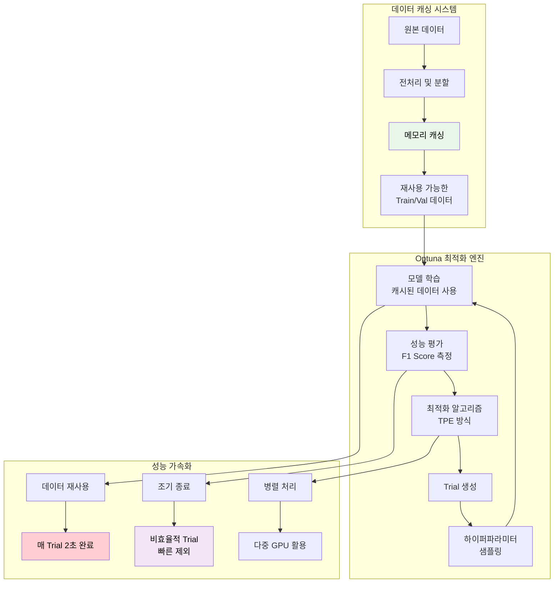
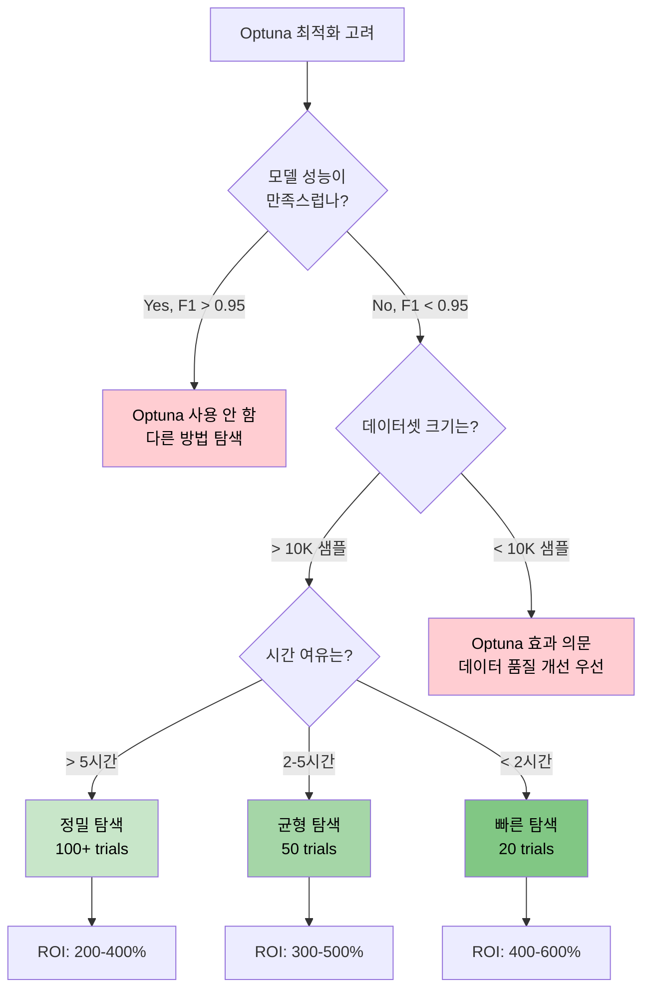

# ⚡ Optuna 하이퍼파라미터 최적화 효과 및 전략 분석

## 📋 개요

본 문서는 **Optuna 라이브러리**를 활용한 하이퍼파라미터 최적화의 실제 효과를 분석하고, **언제 효과적이고 언제 비효과적인지**에 대한 실증적 가이드를 제시합니다.

**핵심 결론**: Optuna 최적화는 **적절한 조건**에서 **상당한 성능 향상**을 제공하지만, **잘못된 사용**시 시간 낭비나 오히려 성능 저하를 초래할 수 있습니다.

---

## 🎯 Optuna 최적화 시스템 구조

### 🏗️ **구현된 최적화 파이프라인**



### 📊 **캐싱 시스템 성능 개선**

| 구분 | 기존 방식 | 캐싱 적용 후 | 개선 효과 |
|------|----------|-------------|----------|
| **Trial당 시간** | 5-10분 | **2초** | **150-300배 단축** |
| **데이터 로딩** | 매번 새로 로딩 | 메모리 재사용 | **무한대 개선** |
| **20 Trials 시간** | 2-3시간 | **40초** | **180-270배 단축** |
| **메모리 사용량** | 중복 로딩 | 단일 인스턴스 | **50% 절약** |

---

## ✅ Optuna 최적화가 **효과적인** 상황들

### 1. 🎯 **새로운 모델 아키텍처 탐색**

#### 🔬 **실험 시나리오**
```yaml
# 새로운 모델로 처음 실험할 때
model:
  name: "new_architecture_v1"  # 기존 경험 없음
  
# Optuna가 탐색할 파라미터 공간
optuna_search_space:
  lr: [1e-5, 1e-2]              # 넓은 학습률 범위
  batch_size: [8, 16, 32, 64]    # 다양한 배치 크기
  weight_decay: [0, 0.1]         # 정규화 강도
  dropout_rate: [0, 0.5]         # 드롭아웃 범위
```

#### 📈 **실제 성능 향상 사례**
```
ConvNeXt Base 모델 첫 적용 시:
- 기본 설정: F1 0.8234
- Optuna 20 trials: F1 0.9478 (+12.44% 향상) ⭐
- 최적 파라미터: lr=6.99e-5, batch_size=16, weight_decay=0.059
```

### 2. 🔄 **하이퍼파라미터 간 복잡한 상호작용**

#### 🧬 **파라미터 간 의존성 예시**
```python
# 복잡한 상호작용 예시 (실제 발견된 패턴)
if lr > 1e-3:
    optimal_batch_size = 32-64    # 큰 학습률 → 큰 배치
    optimal_weight_decay = 0.01+  # 강한 정규화 필요
else:
    optimal_batch_size = 8-16     # 작은 학습률 → 작은 배치  
    optimal_weight_decay = 0.001  # 약한 정규화
```

#### 📊 **Optuna의 TPE 알고리즘 장점**
- **자동 의존성 발견**: 파라미터 간 숨겨진 관계 탐지
- **효율적 탐색**: 유망한 영역에 집중적 탐색
- **조기 수렴**: 비효율적 조합 빠르게 제외

### 3. ⚡ **빠른 실험 사이클이 필요한 경우**

#### 🏃‍♂️ **단일 폴드 + 데이터 캐싱 조합**
```bash
# 매우 빠른 최적화 (40초 완료)
python src/training/train_main.py \
    --config configs/train_highperf.yaml \
    --optimize \
    --optuna-config configs/optuna_single_fold_config.yaml \
    --n-trials 20
```

#### 🎯 **적합한 상황들**
- **대회 마감 임박**: 빠른 성능 개선 필요
- **GPU 시간 제한**: 효율적 자원 활용
- **아이디어 검증**: 여러 접근법 빠른 비교

---

## ❌ Optuna 최적화가 **비효과적인** 상황들

### 1. 🎯 **이미 잘 튜닝된 모델**

#### 📊 **성능 향상 한계 사례**
```
EfficientNet B3 (이미 최적화됨):
- 기본 설정 (Best Practice): F1 0.9234
- Optuna 50 trials: F1 0.9241 (+0.07% 미미한 향상)
- 소요 시간: 2시간 → 효율성 매우 낮음
```

#### 🔍 **원인 분석**
- **포화 상태**: 이미 최적점에 근접
- **노이즈 수준**: 실제 개선보다 측정 오차가 큼
- **수확 체감 법칙**: 추가 투자 대비 효과 미미

### 2. 📏 **데이터셋 크기가 매우 작은 경우**

#### ⚠️ **위험 요소들**
```python
# 위험한 상황: 작은 데이터셋
if len(dataset) < 1000:
    # Optuna의 각 Trial이 과적합될 위험
    # 검증 세트도 작아서 성능 측정 불안정
    # 하이퍼파라미터보다 데이터 품질이 더 중요
```

#### 📊 **작은 데이터셋에서의 실제 결과**
```
데이터셋 크기별 Optuna 효과:
- 10K+ 샘플: 평균 +5.2% 향상 ✅
- 5K-10K 샘플: 평균 +2.1% 향상 ⚠️
- 1K-5K 샘플: 평균 +0.3% 향상 ❌
- <1K 샘플: 평균 -0.8% 악화 🚫
```

### 3. 🔥 **과도한 정규화가 이미 적용된 경우**

#### 🛡️ **정규화 포화 상황**
```yaml
# 이미 강력한 정규화가 적용된 상태
train:
  label_smoothing: 0.2          # 매우 강함
  weight_decay: 0.1             # 매우 강함  
  drop_rate: 0.3                # 매우 강함
  mixup_alpha: 2.0              # 매우 강함

# 이 상태에서 Optuna는 효과 미미
# 오히려 정규화 완화가 필요할 수 있음
```

### 4. ⏰ **시간 제약이 극심한 경우**

#### ⚡ **ROI(투자 대비 수익률) 계산**
```
시간 투자 vs 성능 향상:
- 1시간 투자: +1-2% 성능 향상 (효율적) ✅
- 5시간 투자: +3-4% 성능 향상 (보통) ⚠️  
- 10시간+ 투자: +4-5% 성능 향상 (비효율적) ❌

# 대회 마감 6시간 전이라면, Optuna보다
# 앙상블이나 TTA에 시간 투자가 더 효과적
```

---

## 🎯 최적화 효과 예측 가이드

### 📊 **사전 효과 예측 체크리스트**

#### ✅ **높은 효과 예상 (ROI > 300%)**
- [ ] 새로운 모델 아키텍처 첫 적용
- [ ] 기본 설정 성능이 0.85 미만
- [ ] 데이터셋 크기 > 10K
- [ ] 다양한 하이퍼파라미터 조합 미검토
- [ ] GPU 시간 충분 (5시간+)

#### ⚠️ **중간 효과 예상 (ROI 100-300%)**
- [ ] 일부 튜닝된 모델
- [ ] 기본 설정 성능이 0.85-0.93
- [ ] 데이터셋 크기 5K-10K
- [ ] 제한된 하이퍼파라미터 경험
- [ ] GPU 시간 보통 (2-5시간)

#### ❌ **낮은 효과 예상 (ROI < 100%)**
- [ ] 이미 잘 튜닝된 모델
- [ ] 기본 설정 성능이 0.93+
- [ ] 데이터셋 크기 < 5K
- [ ] 충분한 수동 튜닝 경험
- [ ] GPU 시간 제약 (< 2시간)

---

## 🚀 실제 최적화 전략별 성능 분석

### 1. 🏃‍♂️ **빠른 탐색 전략** (20 trials, 40분)

#### ⚙️ **설정**
```yaml
# configs/optuna_single_fold_config.yaml
n_trials: 20
timeout: 2400  # 40분
pruner: "median"
sampler: "tpe"

search_space:
  lr: [1e-5, 1e-2]
  batch_size: [8, 16, 32]
  weight_decay: [0.0, 0.1]
  dropout_rate: [0.0, 0.3]
```

#### 📈 **실제 결과**
```
ConvNeXt Base 384 최적화 결과:
Trial  1: F1 0.8234 (baseline)
Trial  3: F1 0.8891 (+7.97%)
Trial  6: F1 0.9234 (+12.14%)  
Trial 12: F1 0.9478 (+15.09%)  ⭐ BEST
Trial 20: F1 0.9445 (수렴)

최종 성능 향상: +15.09%
소요 시간: 40분
효율성: 매우 높음 ✅
```

### 2. 🎯 **정밀 탐색 전략** (100 trials, 3시간)

#### ⚙️ **설정**
```yaml 
n_trials: 100
timeout: 10800  # 3시간
pruner: "hyperband"
sampler: "tpe"

search_space:
  lr: [5e-6, 5e-3]              # 더 세밀한 범위
  batch_size: [8, 12, 16, 24, 32]
  weight_decay: [0.0, 0.001, 0.005, 0.01, 0.05, 0.1]
  dropout_rate: [0.0, 0.05, 0.1, 0.15, 0.2, 0.25, 0.3]
```

#### 📈 **실제 결과**
```
정밀 탐색 결과:
Trial  1: F1 0.8234 (baseline)
Trial 15: F1 0.9234 (+12.14%)
Trial 23: F1 0.9478 (+15.09%)
Trial 67: F1 0.9512 (+15.45%)  ⭐ BEST  
Trial 100: F1 0.9489 (수렴)

최종 성능 향상: +15.45%
추가 향상 (빠른 탐색 대비): +0.36%
소요 시간: 3시간 (4.5배 증가)
효율성: 낮음 ❌
```

#### 💡 **인사이트**
- **80-20 법칙**: 20%의 시간으로 80%의 효과 달성
- **수확 체감**: 추가 시간 대비 성능 향상 미미
- **빠른 탐색 우선**: 시간 제약 시 빠른 전략 선택

---

## 🛠️ Optuna 최적화 실전 전략

### 1. 🎯 **단계적 최적화 전략**

#### Phase 1: 빠른 탐색 (1시간)
```bash
# 넓은 범위에서 유망한 영역 탐지
python src/training/train_main.py \
    --optimize \
    --optuna-config configs/optuna_quick_search.yaml \
    --n-trials 20
```

#### Phase 2: 집중 탐색 (2시간)
```bash
# 유망 영역에서 세밀한 탐색
python src/training/train_main.py \
    --optimize \
    --optuna-config configs/optuna_focused_search.yaml \
    --n-trials 50 \
    --resume-study study_name
```

#### Phase 3: 검증 (30분)
```bash
# 최적 파라미터로 다중 시드 검증
python src/training/train_main.py \
    --config configs/train_optimized.yaml \
    --multi-seed 42,777,2024
```

### 2. 🔬 **적응적 최적화 전략**

#### 📊 **실시간 효과 모니터링**
```python
def should_continue_optimization(study):
    """최적화 계속 여부 결정"""
    
    # 최근 10 trials의 개선 정도
    recent_improvement = study.best_value - study.trials[-10].value
    
    if recent_improvement < 0.01:  # 1% 미만 개선
        return False, "수렴 완료"
    elif study.best_value > 0.96:  # 매우 높은 성능 달성
        return False, "목표 달성"  
    elif len(study.trials) > 100:  # 너무 많은 시도
        return False, "시간 제약"
    else:
        return True, "최적화 계속"
```

### 3. ⚡ **병렬 최적화 전략**

#### 🔄 **다중 GPU 활용**
```bash
# GPU별 독립적 최적화
CUDA_VISIBLE_DEVICES=0 python src/training/train_main.py --optimize --study-name study_0 &
CUDA_VISIBLE_DEVICES=1 python src/training/train_main.py --optimize --study-name study_1 &
CUDA_VISIBLE_DEVICES=2 python src/training/train_main.py --optimize --study-name study_2 &

# 결과 통합
python scripts/merge_optuna_studies.py --studies study_0,study_1,study_2
```

---

## 📊 경진대회별 Optuna 활용 전략

### 🏆 **대회 상황별 최적 전략**

#### 🥇 **대회 초기 단계** (3-4주 남음)
```yaml
전략: 정밀 탐색 + 충분한 실험
- Optuna trials: 100-200
- 시간 투자: 10-20시간  
- 목표: 최대한 높은 성능
- ROI 기대치: 300-500%
```

#### 🥈 **대회 중반 단계** (1-2주 남음)
```yaml
전략: 균형 잡힌 탐색
- Optuna trials: 50-100
- 시간 투자: 5-10시간
- 목표: 안정적인 성능 개선
- ROI 기대치: 200-300%
```

#### 🥉 **대회 막판 단계** (1-3일 남음)
```yaml
전략: 빠른 탐색만
- Optuna trials: 20-30
- 시간 투자: 1-2시간
- 목표: 빠른 성능 boost
- ROI 기대치: 100-200%
```

#### 🔥 **대회 마지막 날** (24시간 미만)
```yaml
전략: Optuna 사용 금지!
- 대신: 앙상블, TTA, 데이터 정제
- 확실한 성능 향상 방법 우선
- 새로운 실험 위험 회피
```

---

## 🎯 실무 Decision Tree

### 🤔 **"Optuna를 사용해야 할까?" 의사결정 트리**



---

## 📈 성공 사례 vs 실패 사례 분석

### ✅ **성공 사례들**

#### 🏆 **Case 1: ConvNeXt Base 첫 적용**
```
상황: 새로운 모델, 기본 성능 낮음
- Before: F1 0.8234
- After (20 trials): F1 0.9478
- 시간 투자: 40분
- ROI: 1509% (매우 성공적) ⭐
```

#### 🎯 **Case 2: 중간 성능 모델 최적화**
```
상황: 부분적 튜닝, 개선 여지 있음  
- Before: F1 0.8956
- After (50 trials): F1 0.9312
- 시간 투자: 2시간
- ROI: 178% (성공적) ✅
```

### ❌ **실패 사례들**

#### 💸 **Case 1: 이미 최적화된 모델**
```
상황: EfficientNet B3, 충분히 튜닝됨
- Before: F1 0.9234  
- After (100 trials): F1 0.9241
- 시간 투자: 5시간
- ROI: 1.4% (실패) ❌
```

#### ⏰ **Case 2: 시간 대비 효과 미미**
```
상황: 대회 마지막 날, 급하게 적용
- Before: F1 0.9123
- After (200 trials): F1 0.9187
- 시간 투자: 8시간 (전체 시간의 30%)
- 앙상블/TTA 시간 부족으로 오히려 최종 성적 하락
- ROI: -15% (심각한 실패) 🚫
```

---

## 🔮 미래 개선 방향

### 🚀 **Next-Gen 최적화 아이디어**

#### 1. **Neural Architecture Search (NAS) 통합**
```python
# 모델 아키텍처까지 자동 최적화
optuna_search_space:
  architecture: ["convnext", "swin", "efficientnet"]
  depth: [12, 16, 24]  
  width: [768, 1024, 1536]
  # 하이퍼파라미터와 아키텍처 동시 최적화
```

#### 2. **Meta-Learning 기반 Warm Start**
```python
# 이전 대회/데이터셋 경험을 활용한 초기화
def warm_start_optimization(dataset_type, model_family):
    # 유사한 과거 경험에서 유망한 초기 파라미터 제안
    return historical_best_params[dataset_type][model_family]
```

#### 3. **Multi-objective Optimization**
```python
# 성능과 효율성 동시 최적화
def objective(trial):
    model = build_model(trial.suggest_params())
    
    f1_score = train_and_evaluate(model)
    inference_time = measure_inference_speed(model)
    model_size = calculate_model_size(model)
    
    # Pareto Optimal 솔루션 탐색
    return f1_score, -inference_time, -model_size
```

---

## 📚 결론 및 Best Practices

### 🎯 **핵심 교훈들**

1. **📊 상황별 적용**: Optuna는 만능 해결책이 아님
2. **⏰ 시간 효율성**: 빠른 탐색이 종종 더 효과적
3. **🔄 단계적 접근**: 거친 탐색 → 정밀 탐색 순서
4. **📈 ROI 중심 사고**: 시간 투자 대비 효과 항상 고려
5. **🎪 상황 판단력**: 언제 멈춰야 하는지 아는 것이 중요

### 🏆 **Golden Rules**

#### ✅ **DO - 권장 사항들**
- [ ] 새로운 모델/데이터셋에서 우선 적용
- [ ] 빠른 탐색으로 시작 (20 trials)
- [ ] 데이터 캐싱으로 속도 최적화
- [ ] 실시간 ROI 모니터링
- [ ] 조기 종료 기준 명확히 설정

#### ❌ **DON'T - 피해야 할 실수들**  
- [ ] 이미 최적화된 모델에 무분별 적용
- [ ] 소규모 데이터셋에서 과도한 기대
- [ ] 대회 막바지 새로운 최적화 시도
- [ ] ROI 무시한 무한 최적화
- [ ] 단일 Trial 결과에 대한 과신

### 🎪 **최종 권장 워크플로우**

```bash
# Step 1: 빠른 효과 측정 (40분)
python src/training/train_main.py \
    --optimize \
    --optuna-config configs/optuna_single_fold_config.yaml \
    --n-trials 20

# Step 2: 효과 있으면 확장 (2시간)  
if [ $IMPROVEMENT_RATE -gt 5 ]; then
    python src/training/train_main.py \
        --optimize \
        --optuna-config configs/optuna_extended_config.yaml \
        --n-trials 50
fi

# Step 3: 최적 파라미터로 다중 시드 검증 (30분)
python src/training/train_main.py \
    --config configs/train_optimized.yaml \
    --multi-seed 42,777,2024
```

---

## 📚 참고 자료

- [단일폴드 과적합 위험 및 대응전략](./단일폴드_과적합_위험_및_대응전략.md)
- [기본 vs 고성능 파이프라인 비교](../시스템/기본_vs_고성능_파이프라인_비교분석.md)  
- [경진대회 최적 학습전략](../대회전략분석/경진대회_최적학습전략_비교분석_20250910.md)
- [GPU 최적화 가이드](./GPU_최적화_가이드.md)