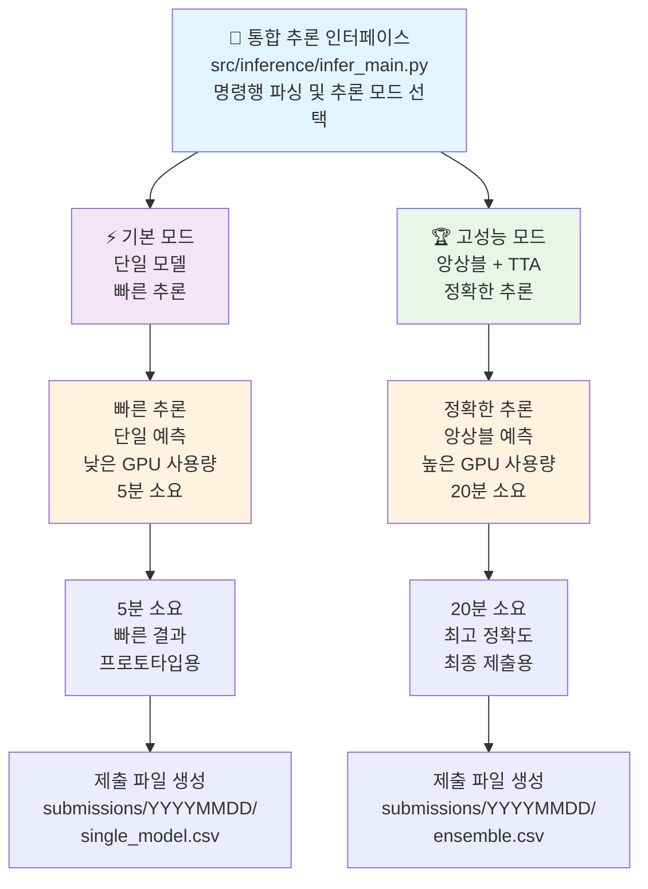
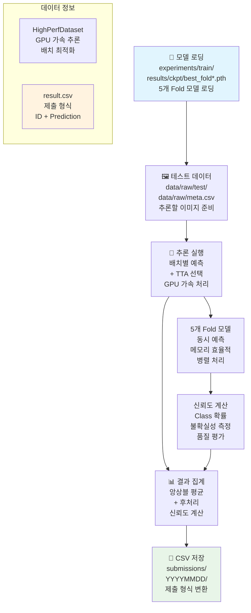
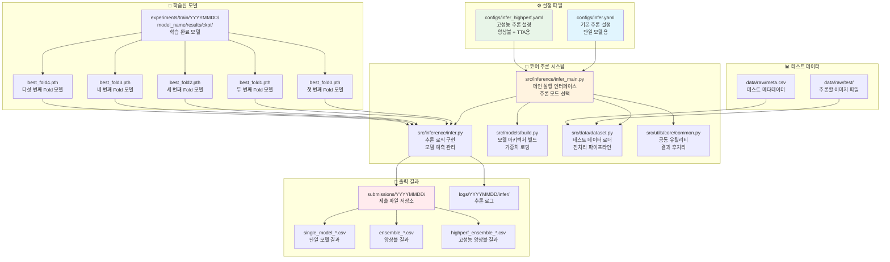

# 🔮 추론 파이프라인 완전 가이드

## 🏗️ 추론 파이프라인 아키텍처



## 🔀 파이프라인 흐름도


## 📁 파일 간 의존 관계 다이어그램



### 📂 디렉토리 구조 및 파일 상세 설명

```text
🔮 추론 파이프라인 파일 구조
├── src/inference/
│   ├── infer_main.py                       # 🚀 메인 추론 인터페이스
│   ├── infer.py                            # 🧠 핵심 추론 로직
│   └── __init__.py
│
├── src/models/
│   ├── build.py                            # 🏗️ 모델 아키텍처 빌더
│   ├── backbones/                          # 백본 네트워크 모음
│   └── __init__.py
│
├── src/data/
│   ├── dataset.py                          # 📊 테스트 데이터셋 및 로더
│   ├── transforms.py                       # 🔄 TTA 변환
│   └── __init__.py
│
├── src/utils/
│   ├── core/                               # 🔧 핵심 유틸리티
│   │   └── common.py                       # 공통 함수 (파일/YAML/로깅)
│   ├── config/                             # ⚙️ 설정 관리
│   │   ├── seed.py                         # 시드 설정
│   │   └── update_config_dates.py          # 설정 날짜 업데이트
│   ├── gpu_optimization/                   # 🚀 GPU 최적화
│   │   ├── auto_batch_size.py              # 동적 배치 크기 결정
│   │   └── team_gpu_check.py               # GPU 환경 분석
│   ├── code_management/                    # 📋 코드 관리
│   │   └── reorganize_experiments.py       # 실험 정리
│   ├── visualizations/                     # 📊 시각화 시스템
│   │   ├── base_visualizer.py              # 기본 시각화 엔진
│   │   ├── training_viz.py                 # 학습 시각화
│   │   ├── inference_viz.py                # 추론 시각화
│   │   ├── optimization_viz.py             # 최적화 시각화
│   │   └── output_manager.py               # 출력 관리
│   └── __init__.py
│
├── configs/
│   ├── infer.yaml                          # ⚙️ 기본 추론 설정
│   └── infer_highperf.yaml                 # 🏆 고성능 추론 설정
│
├── data/raw/
│   ├── test/                               # 📁 테스트 이미지 폴더
│   ├── meta.csv                            # 📋 테스트 메타데이터
│   └── sample_submission.csv               # 📄 제출 형식 예시
│
├── experiments/train/YYYYMMDD/
│   └── model_name_YYYYMMDD_HHMM/
│       ├── images/                         # 📊 학습 시각화 이미지
│       ├── logs/                           # 📋 학습 로그 파일
│       ├── configs/                        # ⚙️ 학습 설정 파일
│       └── results/                        # 📈 학습 결과
│           └── ckpt/                       # 💾 학습된 모델 체크포인트
│               ├── best_fold0.pth
│               ├── best_fold1.pth
│               ├── best_fold2.pth
│               ├── best_fold3.pth
│               └── best_fold4.pth
│
├── experiments/infer/YYYYMMDD/
│   └── model_name_YYYYMMDD_HHMM/
│       ├── images/                         # 📊 추론 시각화 이미지 (7개 차트)
│       ├── logs/                           # 📋 추론 로그 파일
│       ├── configs/                        # ⚙️ 추론 설정 파일
│       └── results/                        # 📤 추론 결과 파일
│
├── submissions/YYYYMMDD/
│   ├── single_model_YYYYMMDD_HHMM.csv      # 단일 모델 결과
│   ├── ensemble_YYYYMMDD_HHMM.csv          # 기본 앙상블 결과
│   ├── highperf_ensemble_YYYYMMDD_HHMM.csv # 고성능 앙상블 결과
│   └── metadata.json                       # 추론 설정 기록
│
└── logs/
    ├── YYYYMMDD/                           # 📁 날짜별 로그 (현재 미사용)
    └── infer/                              # 📁 추론 로그 (실제 저장 위치)
        ├── infer_YYYYMMDD-HHMM_modelname-inference.log  # 추론 진행 로그
        └── performance_HHMM.json          # 성능 및 시간 기록
```

#### 🔍 핵심 파일 상세 기능

**1. src/inference/infer_main.py**
- **주요 기능**: 추론 파이프라인의 통합 인터페이스 및 명령행 처리
- **핵심 역할**: 
  - argparse를 통한 추론 옵션 파싱
  - 설정 파일 로딩 및 검증
  - 추론 모드 선택 (basic/highperf/ensemble)
  - GPU 메모리 최적화 및 배치 크기 조정
  - 결과 파일 자동 명명 및 저장 경로 관리
- **의존성**: infer.py와 직접 연결하여 실제 추론 실행

**2. src/inference/infer.py**
- **주요 기능**: 핵심 추론 로직 및 앙상블 처리 구현
- **핵심 역할**:
  - 다중 모델 로딩 및 메모리 관리
  - 배치별 추론 실행 및 GPU 최적화
  - Test-Time Augmentation (TTA) 적용
  - 5-Fold 앙상블 예측 및 가중 평균
  - 신뢰도 점수 계산 및 불확실성 측정
- **의존성**: models/build.py로 모델 생성, data/dataset.py로 데이터 로딩

**3. src/models/build.py**
- **주요 기능**: 학습된 모델 복원 및 추론 모드 설정
- **핵심 역할**:
  - 체크포인트에서 모델 가중치 로딩
  - 모델을 평가 모드로 전환 (model.eval())
  - 다중 GPU 환경에서 모델 분산 처리
  - 메모리 효율적인 모델 관리
- **의존성**: PyTorch 모델 상태 딕셔너리 처리

**4. src/data/dataset.py (추론용)**
- **주요 기능**: 테스트 데이터 전용 데이터셋 및 로더
- **핵심 역할**:
  - 테스트 이미지 파일 읽기 및 전처리
  - TTA용 다중 변환 적용 (원본, 수평반전, 회전 등)
  - 배치 생성 및 GPU 메모리 최적화
  - 추론 속도 향상을 위한 데이터 파이프라인 최적화
- **의존성**: transforms.py와 연동하여 TTA 변환 적용

**5. configs/infer_*.yaml**
- **infer.yaml**: 빠른 단일 모델 추론용 (EfficientNet-B3, 배치 64)
- **infer_highperf.yaml**: 고성능 앙상블 추론용 (Swin-Base, TTA, 배치 32)

**6. 결과 파일 형식**
- **single_model_*.csv**: ID, prediction 컬럼으로 구성된 기본 제출 형식
- **ensemble_*.csv**: 5-Fold 앙상블 평균 결과
- **highperf_ensemble_*.csv**: TTA + 앙상블 + 후처리 적용 최고 성능 결과

## ⚙️ 설정 파일 및 실행 명령어

### 1. 기본 추론 모드 (단일 모델)

#### 설정 파일: `configs/infer.yaml`
```yaml
# 기본 추론 설정
model:
  name: efficientnet_b3
  img_size: 224
  num_classes: 17

inference:
  batch_size: 64
  device: cuda
  tta_enabled: false
  ensemble_method: none
  
data:
  test_dir: data/raw/test
  meta_path: data/raw/meta.csv
```

#### 기본 실행 명령어
```bash
# 가장 기본적인 단일 모델 추론
python src/inference/infer_main.py --config configs/infer.yaml

# 모드 명시 (기본값은 basic)
python src/inference/infer_main.py --config configs/infer.yaml --mode basic
```

### 2. 고성능 추론 모드 (앙상블 + TTA)

#### 설정 파일: `configs/infer_highperf.yaml`
```yaml
# 고성능 추론 설정
model:
  name: swin_base_patch4_window7_224
  img_size: 384
  num_classes: 17

inference:
  batch_size: 32  # 높은 해상도로 인한 작은 배치
  device: cuda
  tta_enabled: true
  tta_transforms: [original, hflip, rotation]
  ensemble_method: average
  confidence_threshold: 0.9
  
data:
  test_dir: data/raw/test
  meta_path: data/raw/meta.csv
```

#### 고성능 실행 명령어
```bash
# 고성능 앙상블 추론
python src/inference/infer_main.py --config configs/infer_highperf.yaml --mode highperf
```

## 🚀 실행 옵션 완전 가이드

### 기본 명령어 구조
```bash
python src/inference/infer_main.py [필수옵션] [선택옵션]
```

### 필수 옵션
- `--config <경로>`: 설정 파일 경로 (필수)

### 선택 옵션 상세 설명

#### 1. `--mode <모드>`
**기능**: 추론 파이프라인 모드 선택
**옵션값**:
- `basic`: 단일 모델 추론 (빠름)
- `highperf`: 앙상블 + TTA 추론 (정확함)
- `ensemble`: 다중 모델 앙상블 (균형)

```bash
# 기본 모드 (단일 모델, 빠름)
python src/inference/infer_main.py --config configs/infer.yaml --mode basic

# 고성능 모드 (앙상블 + TTA, 정확함)
python src/inference/infer_main.py --config configs/infer_highperf.yaml --mode highperf

# 앙상블 모드 (다중 모델, 균형)
python src/inference/infer_main.py --config configs/infer.yaml --mode ensemble
```

#### 2. `--ckpt <모델경로>`
**기능**: 특정 체크포인트 파일 지정
**기본값**: 설정 파일에서 자동 탐지

```bash
# 자동 모델 선택 (최신 모델)
python src/inference/infer_main.py --config configs/infer.yaml

# 특정 모델 지정
python src/inference/infer_main.py \
    --config configs/infer.yaml \
    --ckpt experiments/train/20250908/efficientnet_b3_20250908_0313/results/ckpt/best_fold0.pth

# 환경변수로 최신 모델 자동 선택  
LASTEST_MODEL=$(find experiments/train -path "*/results/ckpt/best_fold0.pth" | sort | tail -1)
python src/inference/infer_main.py --config configs/infer.yaml --ckpt $LASTEST_MODEL
```

#### 3. `--fold-results <폴더경로>`
**기능**: 5-Fold 앙상블을 위한 fold 결과 폴더 지정

```bash
# 특정 실험의 fold 결과 사용
python src/inference/infer_main.py \
    --config configs/infer_highperf.yaml \
    --mode highperf \
    --fold-results experiments/train/20250908/swin_base_20250908_0845/results/fold_results

# 최신 fold 결과 자동 선택
LASTEST_FOLD=$(find experiments/train -path "*/results/fold_results" | sort | tail -1)
python src/inference/infer_main.py \
    --config configs/infer_highperf.yaml \
    --mode highperf \
    --fold-results $LASTEST_FOLD
```

#### 4. `--use-tta`
**기능**: Test-Time Augmentation 활성화
**효과**: 다양한 증강으로 여러 번 예측 후 평균 (정확도 향상, 속도 감소)

```bash
# TTA 없이 (빠름)
python src/inference/infer_main.py --config configs/infer.yaml

# TTA 포함 (정확함, 3배 느림)
python src/inference/infer_main.py --config configs/infer.yaml --use-tta
```

#### 5. `--batch-size <숫자>`
**기능**: 추론 배치 크기 오버라이드
**기본값**: 설정 파일 값 사용

```bash
# 설정 파일 기본값 사용
python src/inference/infer_main.py --config configs/infer.yaml

# 작은 배치 크기로 메모리 절약
python src/inference/infer_main.py --config configs/infer.yaml --batch-size 16

# 큰 배치 크기로 속도 향상 (GPU 메모리 충분시)
python src/inference/infer_main.py --config configs/infer.yaml --batch-size 128
```

#### 6. `--device <디바이스>`
**기능**: 추론 장치 선택
**옵션값**: `cuda`, `cpu`, `cuda:0`, `cuda:1` 등

```bash
# GPU 사용 (기본값)
python src/inference/infer_main.py --config configs/infer.yaml --device cuda

# CPU 사용 (느리지만 GPU 메모리 불필요)
python src/inference/infer_main.py --config configs/infer.yaml --device cpu

# 특정 GPU 지정
python src/inference/infer_main.py --config configs/infer.yaml --device cuda:1
```

#### 7. `--output-dir <폴더경로>`
**기능**: 결과 CSV 파일 저장 위치 지정
**기본값**: `submissions/YYYYMMDD/`

```bash
# 기본 위치에 저장
python src/inference/infer_main.py --config configs/infer.yaml

# 사용자 지정 위치에 저장
python src/inference/infer_main.py \
    --config configs/infer.yaml \
    --output-dir custom_results/
```

#### 8. `--ensemble-weights <가중치>`
**기능**: 앙상블 시 모델별 가중치 지정 (콤마로 구분)

```bash
# 균등 가중치 (기본값)
python src/inference/infer_main.py --config configs/infer.yaml --mode ensemble

# 사용자 정의 가중치 (5개 fold의 가중치)
python src/inference/infer_main.py \
    --config configs/infer.yaml \
    --mode ensemble \
    --ensemble-weights 0.25,0.25,0.2,0.15,0.15
```

## 🎯 실전 사용 예시

### 1. 빠른 단일 모델 추론 (5분)
```bash
python src/inference/infer_main.py --config configs/infer.yaml --mode basic
```

### 2. 최고 성능 앙상블 추론 (20분)
```bash
python src/inference/infer_main.py \
    --config configs/infer_highperf.yaml \
    --mode highperf \
    --use-tta \
    --fold-results experiments/train/$(date +%Y%m%d)/*/results/fold_results
```

### 3. 특정 모델로 TTA 추론
```bash
BEST_MODEL=$(find experiments/train -path "*/results/ckpt/best_fold0.pth" | sort | tail -1)
python src/inference/infer_main.py \
    --config configs/infer.yaml \
    --mode basic \
    --ckpt $BEST_MODEL \
    --use-tta
```

### 4. 메모리 절약 추론 (저사양 GPU)
```bash
python src/inference/infer_main.py \
    --config configs/infer.yaml \
    --mode basic \
    --batch-size 8 \
    --device cuda
```

### 5. 5-Fold 가중치 앙상블
```bash
python src/inference/infer_main.py \
    --config configs/infer_highperf.yaml \
    --mode ensemble \
    --fold-results experiments/train/$(date +%Y%m%d)/*/results/fold_results \
    --ensemble-weights 0.3,0.25,0.2,0.15,0.1
```

## 📊 성능 및 속도 비교

| 실행 옵션 | 추론 시간 | 정확도 | GPU 메모리 | 추천 상황 |
|-----------|-----------|--------|------------|-----------|
| `--mode basic` | 5분 | 기준 | 4GB | 빠른 결과 |
| `--mode highperf` | 20분 | +2-3% | 8GB | 최고 성능 |
| `--use-tta` | 3배 시간 | +1-2% | 동일 | 정확도 우선 |
| `--mode ensemble` | 10분 | +1-2% | 6GB | 균형잡힌 선택 |
| `5-Fold 앙상블` | 25분 | +3-4% | 8GB | 최종 제출용 |

## 📁 결과 파일 관리

### 자동 생성되는 파일들
```bash
# 추론 결과 확인
ls -la submissions/$(date +%Y%m%d)/
# 출력 예시:
# single_model_20250908_1430.csv      (단일 모델)
# ensemble_20250908_1445.csv          (앙상블)
# highperf_ensemble_20250908_1500.csv (고성능 앙상블)
```

### 결과 파일 내용 확인
```bash
# CSV 파일 미리보기
head -10 submissions/$(date +%Y%m%d)/*.csv

# 제출 형식 검증
python -c "
import pandas as pd
df = pd.read_csv('submissions/$(date +%Y%m%d)/ensemble_*.csv')
print(f'샘플 수: {len(df)}')
print(f'컬럼: {df.columns.tolist()}')
print(f'클래스 분포:\n{df.iloc[:, 1].value_counts()}')
"
```

### 추론 로그 확인
```bash
# 실시간 추론 진행 상황
tail -f logs/$(date +%Y%m%d)/infer/*.log

# 성능 지표 확인
grep -i "accuracy\|f1\|완료" logs/$(date +%Y%m%d)/infer/*.log
```

## ⚠️ 주의사항 및 팁

### GPU 메모리 최적화
```bash
# 메모리 부족 시 배치 크기 줄이기
python src/inference/infer_main.py \
    --config configs/infer.yaml \
    --batch-size 8

# CPU 추론 (느리지만 안정적)
python src/inference/infer_main.py \
    --config configs/infer.yaml \
    --device cpu
```

### 모델 파일 관리
```bash
# 사용 가능한 모델 확인
find experiments/train -path "*/results/ckpt/*.pth" | head -10

# 최신 모델 자동 선택
LASTEST=$(find experiments/train -path "*/results/ckpt/best_fold0.pth" | sort | tail -1)
echo "최신 모델: $LASTEST"

# 모델 파일 크기 확인
ls -lh experiments/train/*/results/ckpt/*.pth
```

### 추론 성능 모니터링
```bash
# GPU 사용량 실시간 확인
watch -n 1 nvidia-smi

# 추론 속도 측정
time python src/inference/infer_main.py --config configs/infer.yaml --mode basic
```

## 🚀 모든 실행 명령어 모음

### 기본 추론 명령어
```bash
# 1. 기본 단일 모델 추론
python src/inference/infer_main.py --config configs/infer.yaml

# 2. 고성능 앙상블 추론
python src/inference/infer_main.py --config configs/infer_highperf.yaml

# 3. 모드 명시 추론
python src/inference/infer_main.py --config configs/infer.yaml --mode basic
python src/inference/infer_main.py --config configs/infer_highperf.yaml --mode highperf
python src/inference/infer_main.py --config configs/infer.yaml --mode ensemble
```

### 특정 모델 지정 추론
```bash
# 4. 특정 체크포인트 사용
python src/inference/infer_main.py \
    --config configs/infer.yaml \
    --ckpt experiments/train/20250908/efficientnet_b3_20250908_0313/results/ckpt/best_fold0.pth

# 5. 최신 모델 자동 선택
LASTEST_MODEL=$(find experiments/train -path "*/results/ckpt/best_fold0.pth" | sort | tail -1)
python src/inference/infer_main.py --config configs/infer.yaml --ckpt $LASTEST_MODEL

# 6. 특정 날짜 모델 사용
TODAY_MODEL=$(find experiments/train/$(date +%Y%m%d) -path "*/results/ckpt/best_fold0.pth" | head -1)
python src/inference/infer_main.py --config configs/infer.yaml --ckpt $TODAY_MODEL
```

### 5-Fold 앙상블 추론
```bash
# 7. Fold 결과 폴더 지정
python src/inference/infer_main.py \
    --config configs/infer_highperf.yaml \
    --mode highperf \
    --fold-results experiments/train/20250908/swin_base_20250908_0845/fold_results

# 8. 최신 fold 결과 자동 선택
LASTEST_FOLD=$(find experiments/train -name "fold_results" | sort | tail -1)
python src/inference/infer_main.py \
    --config configs/infer_highperf.yaml \
    --mode highperf \
    --fold-results $LASTEST_FOLD

# 9. 가중치 앙상블
python src/inference/infer_main.py \
    --config configs/infer.yaml \
    --mode ensemble \
    --ensemble-weights 0.25,0.25,0.2,0.15,0.15
```

### TTA (Test-Time Augmentation)
```bash
# 10. TTA 포함 추론
python src/inference/infer_main.py --config configs/infer.yaml --use-tta

# 11. TTA + 앙상블 조합
python src/inference/infer_main.py \
    --config configs/infer_highperf.yaml \
    --mode highperf \
    --use-tta

# 12. 고성능 TTA (최고 정확도)
python src/inference/infer_main.py \
    --config configs/infer_highperf.yaml \
    --mode highperf \
    --use-tta \
    --fold-results experiments/train/$(date +%Y%m%d)/*/results/fold_results
```

### 배치 크기 및 디바이스 설정
```bash
# 13. 작은 배치 크기 (메모리 절약)
python src/inference/infer_main.py --config configs/infer.yaml --batch-size 16
python src/inference/infer_main.py --config configs/infer.yaml --batch-size 8

# 14. 큰 배치 크기 (속도 향상)
python src/inference/infer_main.py --config configs/infer.yaml --batch-size 128
python src/inference/infer_main.py --config configs/infer.yaml --batch-size 256

# 15. 특정 GPU 지정
python src/inference/infer_main.py --config configs/infer.yaml --device cuda:0
python src/inference/infer_main.py --config configs/infer.yaml --device cuda:1

# 16. CPU 추론
python src/inference/infer_main.py --config configs/infer.yaml --device cpu
```

### 결과 저장 및 관리
```bash
# 17. 사용자 정의 출력 디렉토리
python src/inference/infer_main.py \
    --config configs/infer.yaml \
    --output-dir custom_results/

# 18. 환경변수로 동적 경로 설정
OUTPUT_DIR="submissions/$(date +%Y%m%d_%H%M)"
python src/inference/infer_main.py \
    --config configs/infer.yaml \
    --output-dir $OUTPUT_DIR

# 19. 여러 설정으로 배치 추론
for config in configs/infer*.yaml; do
    echo "Processing $config"
    python src/inference/infer_main.py --config $config
done
```

### 성능 최적화 명령어
```bash
# 20. GPU 메모리 자동 최적화
python src/utils/gpu_optimization/auto_batch_size.py --config configs/infer.yaml
python src/utils/gpu_optimization/auto_batch_size.py --config configs/infer_highperf.yaml

# 21. GPU 상태 확인
python src/utils/gpu_optimization/team_gpu_check.py

# 22. 특정 GPU로 추론 (환경변수)
CUDA_VISIBLE_DEVICES=0 python src/inference/infer_main.py --config configs/infer.yaml
CUDA_VISIBLE_DEVICES=1 python src/inference/infer_main.py --config configs/infer_highperf.yaml
```

### 결과 확인 및 검증
```bash
# 23. 최신 제출 파일 확인
ls -la submissions/$(date +%Y%m%d)/

# 24. CSV 파일 미리보기
head -10 submissions/$(date +%Y%m%d)/*.csv

# 25. 제출 형식 검증
python -c "
import pandas as pd
import glob
csv_files = glob.glob('submissions/$(date +%Y%m%d)/*.csv')
for file in csv_files:
    df = pd.read_csv(file)
    print(f'\n{file}:')
    print(f'  샘플 수: {len(df)}')
    print(f'  컬럼: {df.columns.tolist()}')
    print(f'  클래스 분포:\n{df.iloc[:, 1].value_counts().head()}')
"

# 26. 파일 크기 확인
ls -lh submissions/$(date +%Y%m%d)/*.csv
```

### 로그 및 모니터링
```bash
# 27. 실시간 추론 로그
tail -f logs/$(date +%Y%m%d)/infer/*.log

# 28. 추론 성능 지표
grep -i "accuracy\|f1\|완료\|time" logs/$(date +%Y%m%d)/infer/*.log

# 29. GPU 메모리 사용량 체크
nvidia-smi --query-gpu=memory.used,memory.total,utilization.gpu --format=csv

# 30. 추론 속도 벤치마크
time python src/inference/infer_main.py --config configs/infer.yaml --mode basic
```

### 실전 사용 시나리오
```bash
# 31. 빠른 단일 모델 추론 (5분)
python src/inference/infer_main.py --config configs/infer.yaml --mode basic

# 32. 최고 성능 앙상블 추론 (20분)
python src/inference/infer_main.py \
    --config configs/infer_highperf.yaml \
    --mode highperf \
    --use-tta \
    --fold-results experiments/train/$(date +%Y%m%d)/*/results/fold_results

# 33. 특정 모델로 TTA 추론
BEST_MODEL=$(find experiments/train -path "*/results/ckpt/best_fold0.pth" | sort | tail -1)
python src/inference/infer_main.py \
    --config configs/infer.yaml \
    --mode basic \
    --ckpt $BEST_MODEL \
    --use-tta

# 34. 메모리 절약 추론 (저사양 GPU)
python src/inference/infer_main.py \
    --config configs/infer.yaml \
    --mode basic \
    --batch-size 8 \
    --device cuda

# 35. 5-Fold 가중치 앙상블 (최종 제출용)
python src/inference/infer_main.py \
    --config configs/infer_highperf.yaml \
    --mode ensemble \
    --fold-results experiments/train/$(date +%Y%m%d)/*/results/fold_results \
    --ensemble-weights 0.3,0.25,0.2,0.15,0.1
```

### 환경 설정
```bash
# 36. Python 환경 활성화
eval "$(pyenv init --path)" && pyenv activate cv_py3_11_9

# 37. 추론 날짜 업데이트 스크립트
bash scripts/update_inference_date.sh

# 38. 환경 변수 로드
source path.env
```
