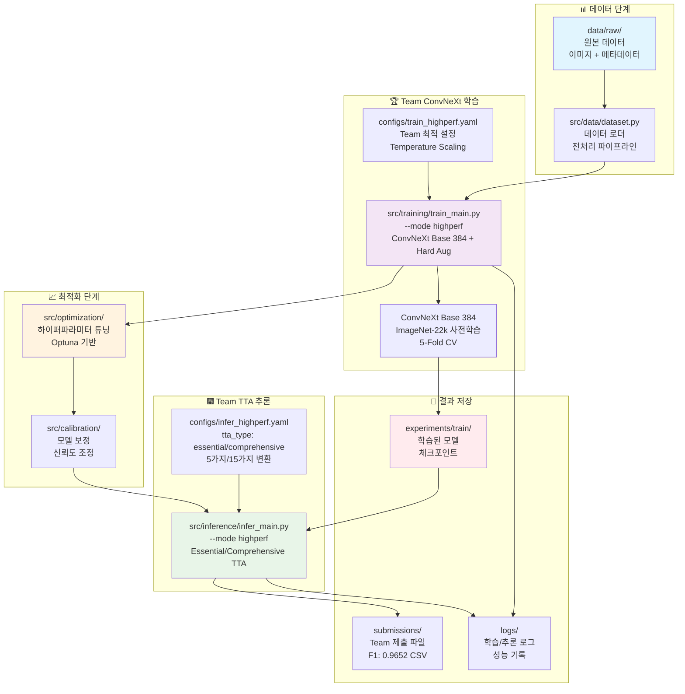
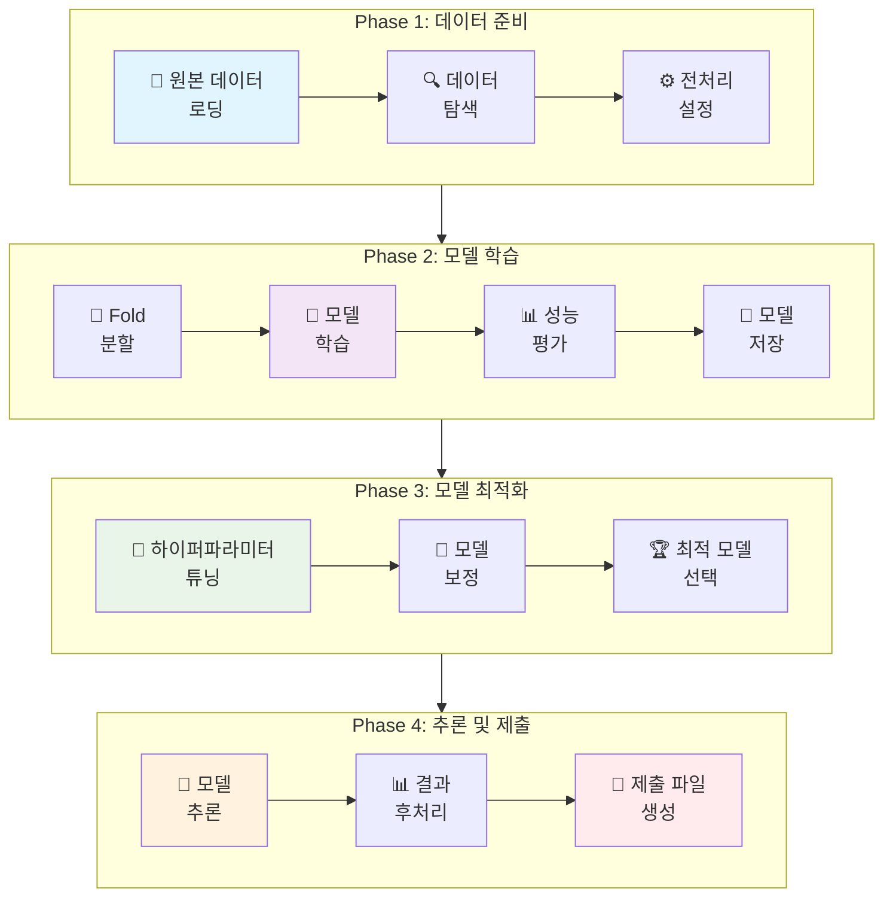

# 🌟 전체 Team ConvNeXt 파이프라인 완전 가이드 (F1: 0.9652)

## 🏗️ Team ConvNeXt 0.9652 달성 아키텍처



## 🔀 파이프라인 흐름도



## 📁 파일 간 의존 관계 다이어그램

```mermaid
flowchart TD
    subgraph "⚙️ 설정 관리"
        direction LR
        CONFIG1[configs/train.yaml<br/>기본 학습 설정]
        CONFIG2[configs/train_highperf.yaml<br/>고성능 학습 설정]
        CONFIG3[configs/infer.yaml<br/>기본 추론 설정]
        CONFIG4[configs/infer_highperf.yaml<br/>고성능 추론 설정]
        CONFIG5[configs/optuna_config.yaml<br/>하이퍼파라미터 튜닝 설정]
    end
    
    subgraph "🧠 핵심 파이프라인"
        direction LR
        TRAIN_MAIN[src/training/train_main.py<br/>학습 통합 인터페이스<br/>CLI 파싱 및 실행 관리]
        INFER_MAIN[src/inference/infer_main.py<br/>추론 통합 인터페이스<br/>모델 로딩 및 예측]
        OPTUNA_MAIN[src/optimization/optuna_optimize.py<br/>자동 하이퍼파라미터 튜닝<br/>성능 최적화 관리]
    end
    
    subgraph "🔧 구현 레이어"
        direction LR
        TRAIN[src/training/train.py<br/>핵심 학습 로직<br/>5-Fold CV 구현]
        INFER[src/inference/infer.py<br/>핵심 추론 로직<br/>앙상블 예측 구현]
        MODELS[src/models/build.py<br/>모델 아키텍처 빌더<br/>백본 네트워크 관리]
        DATA[src/data/dataset.py<br/>데이터 로더<br/>전처리 파이프라인]
        CALIB[src/calibration/calibrate.py<br/>모델 보정<br/>신뢰도 조정]
    end
    
    subgraph "📊 데이터 소스"
        direction LR
        TRAIN_DATA[data/raw/train/<br/>학습 이미지 데이터]
        TEST_DATA[data/raw/test/<br/>테스트 이미지 데이터]
        META[data/raw/meta.csv<br/>메타데이터 및 라벨]
    end
    
    subgraph "🛠️ 유틸리티"
        direction TB
        UTILS[src/utils/common.py<br/>공통 유틸리티<br/>로깅 및 헬퍼 함수]
        METRICS[src/metrics/evaluate.py<br/>성능 평가<br/>F1-Score, Accuracy]
        LOGGING[src/logging/logger.py<br/>로그 관리<br/>실험 추적]
    end
    
    subgraph "💾 결과 저장소"
        direction TB
        EXPERIMENTS[experiments/<br/>실험 결과 저장소]
        TRAIN_EXP[experiments/train/YYYYMMDD/<br/>학습 모델 체크포인트]
        OPT_EXP[experiments/optimization/<br/>최적화 결과]
        SUBMISSIONS[submissions/YYYYMMDD/<br/>제출 파일]
        LOGS_DIR[logs/YYYYMMDD/<br/>로그 파일]
        WANDB[wandb/<br/>실험 추적 데이터]
    end
    
    
    %% 설정 파일 연결
    CONFIG1 --> TRAIN_MAIN
    CONFIG2 --> TRAIN_MAIN
    CONFIG3 --> INFER_MAIN
    CONFIG4 --> INFER_MAIN
    CONFIG5 --> OPTUNA_MAIN
    
    %% 메인 인터페이스 연결
    TRAIN_MAIN --> TRAIN
    INFER_MAIN --> INFER
    OPTUNA_MAIN --> TRAIN
    
    %% 구현 레이어 연결
    TRAIN --> MODELS
    TRAIN --> DATA
    TRAIN --> CALIB
    INFER --> MODELS
    INFER --> DATA
    
    %% 유틸리티 연결
    TRAIN --> UTILS
    TRAIN --> METRICS
    TRAIN --> LOGGING
    INFER --> UTILS
    INFER --> METRICS
    INFER --> LOGGING
    
    %% 데이터 연결
    TRAIN_DATA --> DATA
    TEST_DATA --> DATA
    META --> DATA
    
    %% 결과 저장 연결
    TRAIN --> TRAIN_EXP
    TRAIN --> LOGS_DIR
    TRAIN --> WANDB
    INFER --> SUBMISSIONS
    INFER --> LOGS_DIR
    OPTUNA_MAIN --> OPT_EXP
    
    TRAIN_EXP --> EXPERIMENTS
    OPT_EXP --> EXPERIMENTS
    
    style CONFIG1 fill:#e1f5fe
    style TRAIN_MAIN fill:#f3e5f5
    style INFER_MAIN fill:#e8f5e8
    style OPTUNA_MAIN fill:#fff3e0
    style EXPERIMENTS fill:#ffebee
```



### 📂 디렉토리 구조 및 파일 상세 설명

```
🌟 Computer Vision Competition ML Pipeline
├── configs/                               # ⚙️ 설정 파일 모음
│   ├── train.yaml                         # 기본 학습 설정
│   ├── train_highperf.yaml                # 고성능 학습 설정
│   ├── train_fast_optimized.yaml          # 빠른 학습 설정
│   ├── infer.yaml                         # 기본 추론 설정
│   ├── infer_highperf.yaml                # 고성능 추론 설정
│   ├── optuna_config.yaml                 # 하이퍼파라미터 튜닝 설정
│   └── optuna_fast_config.yaml            # 빠른 튜닝 설정
│
├── src/                                   # 🧠 핵심 소스 코드
│   ├── training/                          # 🎓 학습 모듈
│   │   ├── train_main.py                  # 학습 메인 인터페이스
│   │   └── train.py                       # 핵심 학습 로직
│   │
│   ├── inference/                         # 🔮 추론 모듈
│   │   ├── infer_main.py                  # 추론 메인 인터페이스
│   │   └── infer.py                       # 핵심 추론 로직
│   │
│   ├── models/                            # 🏗️ 모델 아키텍처
│   │   ├── build.py                       # 모델 빌더
│   │   └── backbones/                     # 백본 네트워크 모음
│   │
│   ├── data/                              # 📊 데이터 처리
│   │   ├── dataset.py                     # 데이터셋 및 로더
│   │   └── transforms.py                  # 데이터 변환 및 증강
│   │
│   ├── optimization/                      # 📈 최적화 모듈
│   │   ├── optuna_optimize.py             # 하이퍼파라미터 튜닝
│   │   └── hyperparameter_search.py       # 탐색 전략
│   │
│   ├── calibration/                       # 📏 모델 보정
│   │   ├── calibrate.py                   # 모델 보정 로직
│   │   └── temperature_scaling.py         # 온도 스케일링
│   │
│   ├── metrics/                           # 📊 성능 평가
│   │   ├── evaluate.py                    # 평가 지표 계산
│   │   └── visualizations/                # 결과 시각화
│   │
│   ├── utils/                             # 🛠️ 유틸리티
│   │   ├── common.py                      # 공통 함수
│   │   ├── auto_batch_size.py             # GPU 메모리 최적화
│   │   └── team_gpu_check.py              # GPU 상태 확인
│   │
│   └── logging/                           # 📝 로깅 시스템
│       ├── logger.py                      # 로그 관리
│       └── wandb_integration.py           # WandB 연동
│
├── data/                                  # 📁 데이터 저장소
│   └── raw/                               # 원본 데이터
│       ├── train/                         # 학습 이미지
│       ├── test/                          # 테스트 이미지
│       ├── train.csv                      # 학습 데이터 메타정보
│       └── sample_submission.csv          # 제출 형식 예시
│
├── experiments/                           # 🧪 실험 결과
│   ├── train/                             # 학습 실험
│   │   └── YYYYMMDD/                      # 날짜별 실험
│   │       └── model_YYYYMMDD_HHMM/
│   │           ├── ckpt/                  # 모델 체크포인트
│   │           ├── config.yaml            # 실험 설정
│   │           └── metrics.json           # 성능 지표
│   │
│   └── optimization/                      # 최적화 실험
│       └── YYYYMMDD/                      # 날짜별 최적화 결과
│
├── submissions/                           # 📤 제출 파일
│   └── YYYYMMDD/                          # 날짜별 제출
│       ├── single_model_*.csv
│       ├── ensemble_*.csv
│       └── highperf_ensemble_*.csv
│
├── logs/                                  # 📋 로그 파일
│   └── YYYYMMDD/                          # 날짜별 로그
│       ├── train/                         # 학습 로그
│       └── infer/                         # 추론 로그
│
├── wandb/                                 # 📊 실험 추적
│   └── run-*/                             # WandB 실행 기록
│
├── scripts/                               # 🚀 실행 스크립트
│   ├── run_fast_training.sh               # 빠른 학습 실행
│   ├── run_highperf_training.sh           # 고성능 학습 실행
│   ├── monitor_training.sh                # 학습 모니터링
│   └── update_inference_date.sh           # 추론 날짜 업데이트
│
├── notebooks/                             # 📓 Jupyter 노트북
│   ├── base/                              # 기본 분석 노트북
│   ├── modular/                           # 모듈별 테스트 노트북
│   └── team/                              # 팀 공유 노트북
│
├── font/                                   # 🎨 폰트 파일
│   └── NanumGothic.ttf                    # 한글 폰트
│
├── submissions/                           # 📤 제출 파일
│   └── YYYYMMDD/                          # 날짜별 제출
│
├── wandb/                                 # 📈 실험 추적
│   └── runs/                              # WandB 실행 기록
│
└── docs/                                  # 📚 문서
    ├── configs_폴더_설정 파일_생성/          # 설정 파일 가이드
    ├── 모델/                              # 모델 관련 문서
    ├── 시스템/                            # 시스템 관련 문서  
    ├── 최적화/                            # 최적화 관련 문서
    └── 파이프라인/                        # 파이프라인 관련 문서
```

#### 🔍 핵심 컴포넌트 상세 설명

**1. 📊 데이터 파이프라인**
- **src/data/dataset.py**: 이미지 로딩, 전처리, 배치 생성 관리
- **src/data/transforms.py**: Albumentations 기반 데이터 증강 전략
- **기능**: 클래스 불균형 처리, 메모리 효율적 로딩, GPU 최적화

**2. 🎓 학습 파이프라인**
- **src/training/train_main.py**: CLI 인터페이스, 설정 관리, 실행 제어
- **src/training/train.py**: 5-Fold CV, Early Stopping, LR Scheduling
- **의존성**: models/build.py → 모델 생성, data/dataset.py → 데이터 로딩

**3. 🔮 추론 파이프라인**
- **src/inference/infer_main.py**: 추론 모드 선택, 결과 파일 관리
- **src/inference/infer.py**: 앙상블 예측, TTA, 신뢰도 계산
- **출력**: submissions/YYYYMMDD/ 디렉토리에 CSV 파일 생성

**4. 📈 최적화 파이프라인**
- **src/optimization/optuna_optimize.py**: Optuna 기반 자동 하이퍼파라미터 튜닝
- **src/calibration/calibrate.py**: Temperature Scaling 기반 모델 보정
- **결과**: experiments/optimization/ 디렉토리에 최적화 결과 저장

**5. 🛠️ 유틸리티 시스템**
- **src/utils/auto_batch_size.py**: GPU 메모리에 따른 동적 배치 크기 결정
- **src/utils/team_gpu_check.py**: GPU 환경 확인 및 최적화 추천
- **src/logging/logger.py**: 통합 로깅 시스템, WandB 연동

## 🚀 전체 파이프라인 실행 가이드

### 1. 환경 설정 및 초기화
```bash
# Python 환경 활성화
eval "$(pyenv init --path)" && pyenv activate cv_py3_11_9

# 환경 변수 로드
source path.env

# 필요한 패키지 설치
pip install -r requirements.txt

# 프로젝트 루트로 이동
cd /path/to/computer-vision-competition-1SEN
```

### 2. 데이터 준비 및 탐색
```bash
# 데이터 구조 확인
ls -la data/raw/
echo "학습 이미지 수: $(ls data/raw/train/ | wc -l)"
echo "테스트 이미지 수: $(ls data/raw/test/ | wc -l)"

# 메타데이터 확인
head -10 data/raw/meta.csv
wc -l data/raw/meta.csv

# 클래스 분포 분석
python -c "
import pandas as pd
df = pd.read_csv('data/raw/meta.csv')
print('=== 클래스 분포 ===')
print(df['label'].value_counts().sort_index())
print(f'\n총 이미지: {len(df)}개')
print(f'클래스 수: {df[\"label\"].nunique()}개')
print(f'클래스별 평균: {len(df)/df[\"label\"].nunique():.1f}개')
"

# 데이터 품질 검사
python -c "
import os
from PIL import Image
import pandas as pd

df = pd.read_csv('data/raw/meta.csv')
corrupted = []
for idx, row in df.iterrows():
    img_path = f'data/raw/train/{row[\"image_id\"]}'
    try:
        img = Image.open(img_path)
        img.verify()
    except:
        corrupted.append(img_path)

print(f'손상된 이미지: {len(corrupted)}개')
if corrupted: print(corrupted[:5])
"
```

### 3. GPU 환경 최적화
```bash
# GPU 상태 확인
nvidia-smi
python src/utils/team_gpu_check.py

# 자동 배치 크기 결정 (학습용)
python src/utils/auto_batch_size.py --config configs/train.yaml
python src/utils/auto_batch_size.py --config configs/train_highperf.yaml
python src/utils/auto_batch_size.py --config configs/train_fast_optimized.yaml

# 자동 배치 크기 결정 (추론용)
python src/utils/auto_batch_size.py --config configs/infer.yaml
python src/utils/auto_batch_size.py --config configs/infer_highperf.yaml
```

### 4. 단계별 학습 파이프라인

#### Phase 1: 빠른 프로토타입 (30분)
```bash
# 빠른 학습으로 베이스라인 구축
python src/training/train_main.py --config configs/train_fast_optimized.yaml --mode fast

# 스크립트 사용
bash scripts/run_fast_training.sh

# 특정 fold만 빠르게 테스트
python src/training/train_main.py --config configs/train_fast_optimized.yaml --fold 0
```

#### Phase 2: 하이퍼파라미터 최적화 (1-2시간)
```bash
# Optuna 자동 튜닝 (빠른 버전)
python src/optimization/optuna_optimize.py \
    --config configs/optuna_fast_config.yaml \
    --n-trials 20 \
    --timeout 1800

# Optuna 자동 튜닝 (정밀 버전)
python src/optimization/optuna_optimize.py \
    --config configs/optuna_config.yaml \
    --n-trials 50 \
    --timeout 3600

# 학습과 최적화 통합
python src/training/train_main.py \
    --config configs/train.yaml \
    --optimize \
    --n-trials 30
```

#### Phase 3: 고성능 학습 (2-3시간)
```bash
# 최적화된 설정으로 정밀 학습
python src/training/train_main.py --config configs/train_highperf.yaml --mode highperf

# 스크립트 사용
bash scripts/run_highperf_training.sh

# 중단된 학습 자동 재개
python src/training/train_main.py --config configs/train_highperf.yaml --auto-continue

# 특정 fold 재학습
python src/training/train_main.py --config configs/train_highperf.yaml --resume --fold 2,3,4
```

#### Phase 4: 모델 보정 (30분)
```bash
# Temperature Scaling 보정
python src/calibration/calibrate.py \
    --model-dir experiments/train/$(date +%Y%m%d) \
    --calibration-data data/raw/train \
    --output-dir experiments/calibration/

# 보정 포함 재학습
python src/training/train_main.py \
    --config configs/train_highperf.yaml \
    --use-calibration
```

### 5. 단계별 추론 파이프라인

#### 빠른 검증 추론 (5분)
```bash
# 최신 모델로 빠른 추론
LASTEST_MODEL=$(find experiments/train -name "best_fold0.pth" | sort | tail -1)
python src/inference/infer_main.py \
    --config configs/infer.yaml \
    --mode basic \
    --ckpt $LASTEST_MODEL
```

#### 중간 성능 추론 (10분)
```bash
# 기본 앙상블 추론
python src/inference/infer_main.py \
    --config configs/infer.yaml \
    --mode ensemble

# TTA 포함 단일 모델
python src/inference/infer_main.py \
    --config configs/infer.yaml \
    --mode basic \
    --use-tta
```

#### 최고 성능 추론 (20-30분)
```bash
# 5-Fold 앙상블 + TTA
LASTEST_FOLD=$(find experiments/train -name "fold_results" | sort | tail -1)
python src/inference/infer_main.py \
    --config configs/infer_highperf.yaml \
    --mode highperf \
    --use-tta \
    --fold-results $LASTEST_FOLD

# 가중치 앙상블 (최종 제출용)
python src/inference/infer_main.py \
    --config configs/infer_highperf.yaml \
    --mode ensemble \
    --fold-results $LASTEST_FOLD \
    --ensemble-weights 0.3,0.25,0.2,0.15,0.1 \
    --use-tta
```

### 6. 통합 실행 스크립트

#### 전체 파이프라인 자동 실행
```bash
# 1일차: 프로토타입 + 최적화
bash scripts/day1_prototype.sh

# 2일차: 고성능 학습
bash scripts/day2_training.sh

# 3일차: 최종 추론
bash scripts/day3_inference.sh
```

#### 커스텀 파이프라인 실행
```bash
# 빠른 전체 파이프라인 (2시간)
python pipeline_runner.py --mode fast --auto

# 정밀 전체 파이프라인 (6시간)
python pipeline_runner.py --mode highperf --auto

# 특정 단계만 실행
python pipeline_runner.py --steps train,infer --config custom_config.yaml
```

### 7. 모니터링 및 분석

#### 실시간 모니터링
```bash
# 학습 모니터링
bash scripts/monitor_training.sh

# GPU 사용량 모니터링
watch -n 2 "nvidia-smi --query-gpu=name,memory.used,memory.total,utilization.gpu --format=csv,noheader,nounits"

# 로그 실시간 확인
tail -f logs/$(date +%Y%m%d)/*/*.log

# 멀티 터미널 모니터링
tmux new-session -d 'tail -f logs/$(date +%Y%m%d)/train/*.log'
tmux split-window -h 'watch -n 1 nvidia-smi'
tmux attach
```

#### 성과 분석
```bash
# 학습 성과 요약
python -c "
import json, glob, pandas as pd
results = []
for file in glob.glob('experiments/train/$(date +%Y%m%d)/*/metrics.json'):
    with open(file) as f:
        data = json.load(f)
        results.append({
            'model': file.split('/')[-2],
            'f1': data.get('best_f1', 0),
            'acc': data.get('best_accuracy', 0)
        })
df = pd.DataFrame(results).sort_values('f1', ascending=False)
print(df.to_string(index=False))
"

# 추론 결과 비교
python -c "
import pandas as pd, glob
files = glob.glob('submissions/$(date +%Y%m%d)/*.csv')
for file in files:
    df = pd.read_csv(file)
    name = file.split('/')[-1].split('.')[0]
    dist = df.iloc[:, 1].value_counts().sort_index()
    print(f'\n{name}:')
    print(dist.to_string())
"
```

### 8. 결과 검증 및 제출

#### 결과 검증
```bash
# 제출 파일 형식 검증
python -c "
import pandas as pd, glob
files = glob.glob('submissions/$(date +%Y%m%d)/*.csv')
for file in files:
    df = pd.read_csv(file)
    print(f'\n{file}:')
    print(f'  Shape: {df.shape}')
    print(f'  Columns: {df.columns.tolist()}')
    print(f'  Missing: {df.isnull().sum().sum()}')
    print(f'  Unique predictions: {df.iloc[:, 1].nunique()}')
"

# 파일 크기 및 개수 확인
echo "=== 제출 파일 현황 ==="
ls -lh submissions/$(date +%Y%m%d)/
echo "총 제출 파일 수: $(ls submissions/$(date +%Y%m%d)/*.csv | wc -l)"
```

#### 최종 제출 파일 선택
```bash
# 가장 최신 고성능 앙상블 파일 선택
FINAL_SUBMISSION=$(ls -t submissions/$(date +%Y%m%d)/highperf_ensemble_*.csv | head -1)
echo "최종 제출 파일: $FINAL_SUBMISSION"

# 제출 파일 백업
cp "$FINAL_SUBMISSION" "submissions/final_submission_$(date +%Y%m%d_%H%M).csv"
```

### 9. 실험 관리 및 버전 관리

#### 실험 정리
```bash
# 오늘의 실험 요약
python -c "
import os, glob
from datetime import datetime

today = datetime.now().strftime('%Y%m%d')
print(f'=== {today} 실험 요약 ===')

train_exp = glob.glob(f'experiments/train/{today}/*')
print(f'학습 실험: {len(train_exp)}개')

infer_files = glob.glob(f'submissions/{today}/*.csv')
print(f'추론 결과: {len(infer_files)}개')

log_files = glob.glob(f'logs/{today}/*/*')
print(f'로그 파일: {len(log_files)}개')
"

# 실험 아카이브
tar -czf experiments_$(date +%Y%m%d).tar.gz experiments/train/$(date +%Y%m%d)/
tar -czf submissions_$(date +%Y%m%d).tar.gz submissions/$(date +%Y%m%d)/
```

#### WandB 동기화
```bash
# WandB 로그인
wandb login

# 실험 결과 동기화
wandb sync wandb/

# 프로젝트 결과 확인
wandb project list
```

### 10. 트러블슈팅 명령어

#### 일반적인 문제 해결
```bash
# GPU 메모리 부족 시
python src/utils/auto_batch_size.py --config configs/train.yaml --find-optimal
python src/training/train_main.py --config configs/train.yaml --batch-size 8

# 학습 중단 시 재개
python src/training/train_main.py --config configs/train.yaml --auto-continue

# 모델 파일 손상 시 복구
python -c "
import torch, glob
for file in glob.glob('experiments/train/$(date +%Y%m%d)/*/ckpt/*.pth'):
    try:
        torch.load(file, map_location='cpu')
        print(f'OK: {file}')
    except:
        print(f'ERROR: {file}')
"

# 로그 파일 정리
find logs/ -name "*.log" -mtime +7 -delete
find wandb/ -name "run-*" -mtime +14 -exec rm -rf {} +
```

이 명령어 모음을 사용하여 전체 ML 파이프라인을 효율적으로 관리하고 실행할 수 있습니다.

## 🎯 권장 워크플로우

### Phase 1: 탐색 단계 (1일차)
1. **데이터 탐색**: 클래스 분포, 이미지 품질 확인
2. **빠른 학습**: `train_fast_optimized.yaml`로 베이스라인 구축
3. **초기 추론**: 기본 모델로 제출 파일 생성

### Phase 2: 최적화 단계 (2-3일차)
1. **하이퍼파라미터 튜닝**: Optuna로 최적 설정 탐색
2. **고성능 학습**: `train_highperf.yaml`로 정밀 학습
3. **모델 보정**: Temperature Scaling으로 신뢰도 개선

### Phase 3: 최종 제출 단계 (4-5일차)
1. **앙상블 추론**: 5-Fold 모델 조합
2. **TTA 적용**: Test-Time Augmentation으로 성능 향상
3. **결과 검증**: 최종 제출 파일 품질 확인

## ⚠️ 주의사항 및 팁

### 🔧 GPU 메모리 최적화
```bash
# GPU 상태 확인
python src/utils/team_gpu_check.py

# 자동 배치 크기 결정
python src/utils/auto_batch_size.py --config configs/train_highperf.yaml
```

### 📊 실험 추적
```bash
# WandB 로그인
wandb login

# 실험 결과 확인
wandb sync wandb/
```

### 🚨 문제 해결
```bash
# 로그 실시간 모니터링
tail -f logs/$(date +%Y%m%d)/train/*.log

# 메모리 사용량 확인
nvidia-smi --query-gpu=memory.used,memory.total --format=csv

# 모델 파일 무결성 검사
python -c "
import torch
model_path = 'experiments/train/$(date +%Y%m%d)/*/ckpt/best_fold0.pth'
state_dict = torch.load(model_path, map_location='cpu')
print(f'모델 파라미터 수: {len(state_dict)}')
```

이 가이드는 데이터 준비부터 최종 제출까지의 전체 ML 파이프라인을 단계별로 안내합니다.
각 단계별 상세한 설명은 개별 가이드 문서(`학습_파이프라인_가이드.md`, `추론_파이프라인_가이드.md`)를 참고하세요.