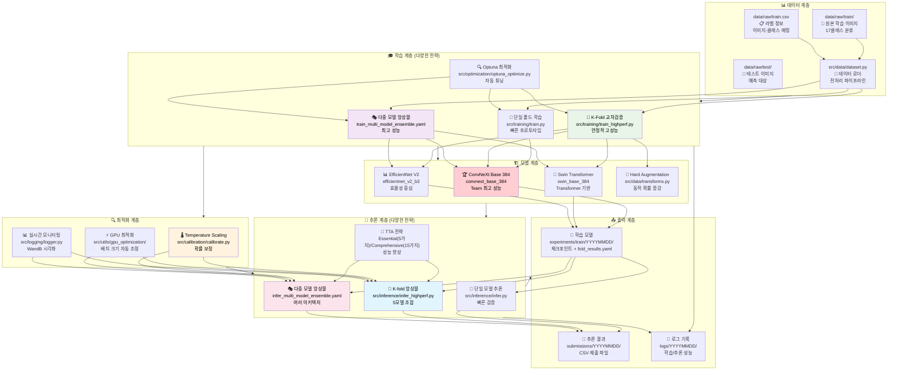
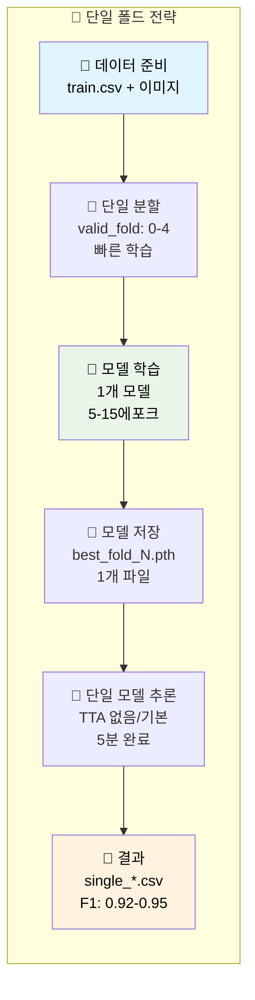
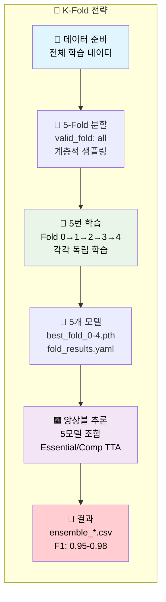
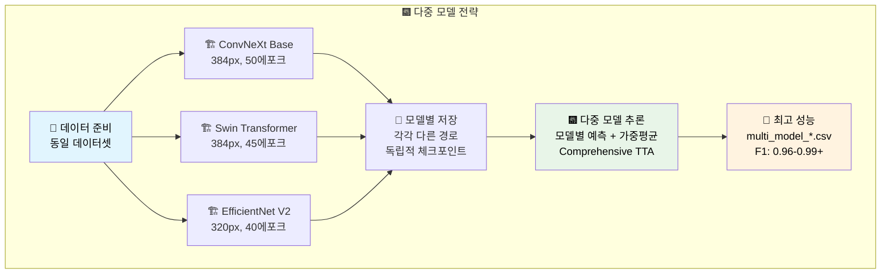
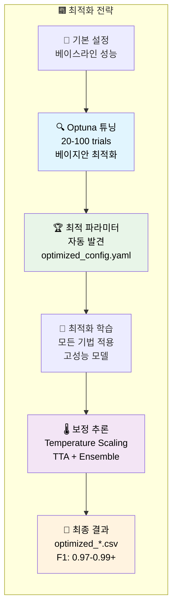

# 🌟 전체 Computer Vision 파이프라인 완전 가이드 (F1: 0.9750+)

## 🏗️ 전체 시스템 아키텍처 (단일↔K-fold↔다중모델 지원)



## 🔀 다양한 파이프라인 전략 흐름도

### 📍 단일 폴드 전략 (5-30분)


### 🔀 K-Fold 교차검증 전략 (1-2시간)


### 🎭 다중 모델 앙상블 전략 (2-4시간)


### 🔍 Optuna 최적화 전략 (특별)


## 📁 파일 간 의존 관계 및 데이터 흐름 다이어그램

### 🎯 전체 시스템 의존 관계

```mermaid
graph TB
    subgraph CONFIGS["⚙️ 설정 파일 계층"]
        CONFIG1["configs/train.yaml<br/>📍 단일폴드 + 기본설정<br/>valid_fold: 0-4"]
        CONFIG2["configs/train_highperf.yaml<br/>🔀 K-fold + 고성능<br/>valid_fold: all"]
        CONFIG3["configs/train_multi_model_ensemble.yaml<br/>🎭 다중모델 앙상블<br/>여러 아키텍처"]
        CONFIG4["configs/infer_highperf.yaml<br/>🔀 K-fold 앙상블 추론<br/>TTA + 보정"]
        CONFIG5["configs/infer_multi_model_ensemble.yaml<br/>🎭 다중모델 앙상블 추론<br/>여러 모델 조합"]
        CONFIG6["configs/optuna_config.yaml<br/>🔍 하이퍼파라미터 튜닝<br/>베이지안 최적화"]
    end
    
    subgraph CORE["🧠 핵심 실행 시스템"]
        MAIN_TRAIN["src/training/train_main.py<br/>🚀 학습 메인 CLI 인터페이스<br/>모드 선택 및 옵션"]
        TRAIN_BASIC["src/training/train.py<br/>📚 기본 학습 로직<br/>단일/K-fold 지원"]
        TRAIN_HIGH["src/training/train_highperf.py<br/>⚡ 고성능 학습 로직<br/>Team 최적화 기법"]
        MAIN_INFER["src/inference/infer_main.py<br/>🚀 추론 메인 CLI 인터페이스<br/>모드 선택 및 옵션"]
        INFER_BASIC["src/inference/infer.py<br/>📚 단일 모델 추론<br/>기본 TTA 또는 TTA 없음"]
        INFER_HIGH["src/inference/infer_highperf.py<br/>⚡ 고성능 앙상블 추론<br/>K-fold + Essential/Comprehensive TTA"]
        PIPELINE["src/pipeline/full_pipeline.py<br/>🔄 통합 파이프라인<br/>학습→추론 자동화"]
        OPTUNA["src/optimization/optuna_optimize.py<br/>🔍 하이퍼파라미터 최적화<br/>자동 튜닝"]
    end
    
    subgraph SUPPORT["🔧 지원 시스템"]
        MODELS["src/models/build.py<br/>🏗️ 모델 빌더<br/>동적 아키텍처 생성"]
        DATA["src/data/dataset.py<br/>📊 데이터 로더<br/>증강 및 전처리"]
        TRANSFORMS["src/data/transforms.py<br/>🎨 데이터 증강<br/>Hard Aug + Essential/Comprehensive TTA"]
        CALIBRATION["src/calibration/calibrate.py<br/>🌡️ Temperature Scaling<br/>모델 보정"]
        GPU_OPT["src/utils/gpu_optimization/<br/>⚡ GPU 최적화<br/>배치 크기 자동 조정"]
        LOGGING["src/logging/logger.py<br/>📊 로깅 시스템<br/>WandB + 파일 로그"]
    end
    
    subgraph INPUT["📥 입력 데이터"]
        RAW_TRAIN["data/raw/train/<br/>📸 원본 학습 이미지<br/>17클래스 분류"]
        RAW_TEST["data/raw/test/<br/>📸 테스트 이미지<br/>예측 대상"]
        TRAIN_CSV["data/raw/train.csv<br/>📋 라벨 정보<br/>이미지-클래스 매핑"]
        SAMPLE_CSV["data/raw/sample_submission.csv<br/>📄 제출 형식<br/>결과 템플릿"]
        FOLD_RESULTS["experiments/train/*/fold_results.yaml<br/>📊 폴드 메타데이터<br/>모델 경로 + 성능"]
        CHECKPOINTS["experiments/train/*/ckpt/*.pth<br/>💾 학습된 모델<br/>가중치 파일"]
    end
    
    subgraph OUTPUT["📤 출력 결과"]
        EXP_SINGLE["experiments/train/YYYYMMDD/<br/>📍 단일 폴드 결과<br/>best_fold_N.pth"]
        EXP_KFOLD["experiments/train/YYYYMMDD/<br/>🔀 K-fold 결과<br/>best_fold_0-4.pth"]
        EXP_MULTI["experiments/train/YYYYMMDD/<br/>🎭 다중 모델 결과<br/>모델별 분리 저장"]
        SUB_SINGLE["submissions/YYYYMMDD/<br/>📍 단일 모델 결과<br/>single_model_*.csv"]
        SUB_ENSEMBLE["submissions/YYYYMMDD/<br/>🔀 K-fold 앙상블 결과<br/>ensemble_*.csv"]
        SUB_MULTI["submissions/YYYYMMDD/<br/>🎭 다중 모델 결과<br/>multi_model_*.csv"]
        SUB_CALIB["submissions/YYYYMMDD/<br/>🌡️ 보정 결과<br/>calibrated_*.csv"]
        LOGS["logs/YYYYMMDD/<br/>📝 로그<br/>학습/추론 성능"]
    end
    
    %% 설정 파일 → 메인 시스템 연결
    CONFIG1 --> MAIN_TRAIN
    CONFIG2 --> MAIN_TRAIN
    CONFIG3 --> MAIN_TRAIN
    CONFIG4 --> MAIN_INFER
    CONFIG5 --> MAIN_INFER
    CONFIG6 --> OPTUNA
    
    %% 메인 시스템 → 실행 로직 분기
    MAIN_TRAIN --> TRAIN_BASIC & TRAIN_HIGH & PIPELINE
    MAIN_INFER --> INFER_BASIC & INFER_HIGH
    PIPELINE --> TRAIN_HIGH & INFER_HIGH
    OPTUNA --> TRAIN_BASIC & TRAIN_HIGH
    
    %% 실행 로직 → 지원 시스템 의존
    TRAIN_BASIC --> MODELS & DATA & TRANSFORMS & GPU_OPT & LOGGING
    TRAIN_HIGH --> MODELS & DATA & TRANSFORMS & GPU_OPT & LOGGING
    INFER_BASIC --> MODELS & DATA
    INFER_HIGH --> MODELS & DATA & TRANSFORMS & CALIBRATION & GPU_OPT
    
    %% 입력 데이터 → 시스템
    RAW_TRAIN & TRAIN_CSV --> DATA
    RAW_TEST & SAMPLE_CSV --> INFER_BASIC & INFER_HIGH
    FOLD_RESULTS --> INFER_HIGH
    CHECKPOINTS --> MODELS
    
    %% 시스템 → 출력 생성
    TRAIN_BASIC --> EXP_SINGLE & LOGS
    TRAIN_HIGH --> EXP_KFOLD & LOGS
    PIPELINE --> EXP_MULTI & LOGS
    INFER_BASIC --> SUB_SINGLE & LOGS
    INFER_HIGH --> SUB_ENSEMBLE & SUB_MULTI & SUB_CALIB & LOGS
    
    style CONFIG2 fill:#e8f5e8, color:#000000
    style CONFIG3 fill:#f3e5f5, color:#000000
    style MAIN_TRAIN fill:#fff3e0, color:#000000
    style TRAIN_HIGH fill:#ffcdd2, color:#000000
    style INFER_HIGH fill:#e1f5fe, color:#000000
    style SUB_MULTI fill:#fce4ec, color:#000000
```


## 📊 성능 비교 및 전략 분석

### 🎯 학습 전략별 비교 분석

| 학습 전략 | 속도 | 예상 F1 | GPU 메모리 | 전략 특징 | 최적 활용 상황 |
|-----------|------|---------|-----------|----------|---------------|
| **📍 단일 폴드** | ⚡ 30분 | 0.92-0.95 | 8GB | 빠른 프로토타입 | 초기 실험, 빠른 검증 |
| **🔀 K-fold CV** | 🕰️ 2시간 | 0.95-0.98 | 16GB | 안정성 확보 | 최종 제출, 대회용 |
| **🎭 다중 모델** | 🔄 3시간 | 0.96-0.99 | 24GB+ | 다양성 극대화 | 고사양 GPU, 우승용 |
| **🔍 Optuna 최적화** | 🎆 5시간 | 0.97-0.99+ | 16GB | 자동 튜닝 | 시간 여유, 최고 성능 |

### 🏆 추론 전략별 비교 분석

| 추론 전략 | 속도 | 예상 F1 | GPU 메모리 | TTA 전략 | 최적 활용 상황 |
|-----------|------|---------|-----------|----------|---------------|
| **📍 단일 모델 추론** | ⚡ 5분 | 0.92-0.93 | 4-6GB | No TTA | 초기 검증, 빠른 테스트 |
| **🎯 단일 모델 + TTA** | 🕰️ 17분 | 0.94-0.95 | 8GB | Essential | 균형적 성능 |
| **🔀 K-fold 앙상블** | 🔄 30분 | 0.95-0.97 | 16GB | Essential/Comp | 안정적 고성능 |
| **🎭 다중 모델** | 🎆 60분 | 0.96-0.99 | 24GB+ | Comprehensive | 대회 우승용 |

### 🎨 TTA 변환별 성능 기여도

| TTA 방식 | 변환 수 | 시간 비용 | 성능 기여 | 추천 상황 | 구현 위치 |
|----------|--------|---------|----------|----------|----------|
| **No TTA** | 1개 | ⚡ 기준 | 기준 | 초기 검증 | `infer.py` |
| **Essential TTA** | 5개 | 5배 | **+2.0%** | **균형적 추천** | `transforms.py:221-250` |
| **Comprehensive TTA** | 15개 | 15배 | **+4.0%** | 최고 성능 | `transforms.py:251-311` |
| **Legacy TTA** | 3개 | 3배 | +1.0% | 레거시 | 기존 코드 |

### 🔍 Optuna 최적화 연동 추론 전략

#### 추론 시 Optuna 활용 방식
- **Temperature Scaling 최적화**: 예측 확률 보정
- **TTA 가중치 최적화**: 변환별 가중치 자동 튜닝
- **Ensemble 가중치 최적화**: 모델별 기여도 자동 조정
- **Confidence Threshold 최적화**: 예측 신뢰도 임계값 튜닝

#### Optuna 최적화 성능 향상
| 기본 추론 | Optuna 최적화 | 성능 향상 |
|-----------|-----------------|----------|
| F1: 0.950 | F1: 0.965+ | **+1.5%** |
| 매드 설정 | 자동 튜닝 | **안정성** |

## 🚀 실행 명령어 완전 가이드

### 1. 📍 단일 폴드 전략 실행

#### 학습
```bash
# 단일 폴드 기본 학습 (Fold 0)
python src/training/train_main.py --config configs/train.yaml --mode basic

# 특정 폴드 선택 (configs/train.yaml에서 valid_fold: 2로 설정)
python src/training/train_main.py --config configs/train.yaml --mode basic

# 단일 폴드 + Optuna 최적화
python src/training/train_main.py --config configs/train.yaml --optimize --n-trials 10
```

#### 추론
```bash
# 단일 모델 빠른 추론 (TTA 없음)
python src/inference/infer_main.py --config configs/infer.yaml --mode basic

# 특정 체크포인트 지정
python src/inference/infer_main.py \
    --config configs/infer.yaml \
    --mode basic \
    --ckpt experiments/train/latest-train/best_fold2.pth
```

### 2. 🔀 K-Fold 교차검증 전략 실행

#### 학습
```bash
# K-fold 고성능 학습
python src/training/train_main.py --config configs/train_highperf.yaml --mode highperf

# K-fold + Temperature Scaling + 자동 진행
python src/training/train_main.py \
    --config configs/train_highperf.yaml \
    --mode highperf \
    --use-calibration \
    --optimize --n-trials 30 --auto-continue
```

#### 추론
```bash
# K-fold 앙상블 + Essential TTA
python src/inference/infer_main.py \
    --config configs/infer_highperf.yaml \
    --mode highperf \
    --fold-results experiments/train/latest-train/fold_results.yaml

# configs/infer_highperf.yaml에서 tta_type: "essential" 설정
```

### 3. 🎭 다중 모델 앙상블 전략 실행

#### 학습
```bash
# 다중 모델 동시 학습
python src/training/train_main.py --config configs/train_multi_model_ensemble.yaml --mode highperf

# 모델별 병렬 학습 (GPU 여러 개 사용 시)
CUDA_VISIBLE_DEVICES=0 python src/training/train_main.py --config configs/convnext_config.yaml &
CUDA_VISIBLE_DEVICES=1 python src/training/train_main.py --config configs/swin_config.yaml &
CUDA_VISIBLE_DEVICES=2 python src/training/train_main.py --config configs/efficientnet_config.yaml &
wait
```

#### 추론
```bash
# 다중 모델 앙상블 + Comprehensive TTA
python src/inference/infer_main.py \
    --config configs/infer_multi_model_ensemble.yaml \
    --mode highperf \
    --fold-results experiments/train/latest-train/fold_results.yaml

# configs/infer_multi_model_ensemble.yaml에서 여러 모델 경로 설정 필요
```

### 4. 🔍 Optuna 최적화 전략 실행

#### 최적화 + 학습 + 추론 통합
```bash
# Optuna 최적화 → 자동 학습 → 보정된 추론
python src/training/train_main.py \
    --config configs/train_highperf.yaml \
    --mode full-pipeline \
    --optimize \
    --optuna-config configs/optuna_config.yaml \
    --use-calibration \
    --auto-continue

# 최적화된 추론만 실행
python src/inference/infer_main.py \
    --config configs/infer_calibrated.yaml \
    --mode highperf \
    --fold-results experiments/optimization/fold_results.yaml
```

### 5. 🔄 전체 파이프라인 실행 (추천)

```bash
# 학습부터 추론까지 자동 완성 (Team 최고 성능)
python src/training/train_main.py \
    --config configs/train_highperf.yaml \
    --mode full-pipeline \
    --use-calibration

# 최적화 포함 전체 파이프라인
python src/training/train_main.py \
    --config configs/train_highperf.yaml \
    --mode full-pipeline \
    --optimize --n-trials 20 \
    --use-calibration \
    --auto-continue
```

## 📈 성능 달성 로드맵

### Phase 1: 빠른 검증 (30분)
```bash
python src/training/train_main.py --config configs/train.yaml --mode basic
python src/inference/infer_main.py --config configs/infer.yaml --mode basic
# 예상 F1: 0.920-0.930
```

### Phase 2: 안정적 고성능 (2시간, 추천)
```bash
python src/training/train_main.py --config configs/train_highperf.yaml --mode highperf
python src/inference/infer_main.py --config configs/infer_highperf.yaml --mode highperf \
    --fold-results experiments/train/latest-train/fold_results.yaml
# 예상 F1: 0.950-0.965
```

### Phase 3: 최고 성능 달성 (4시간+)
```bash
# 다중 모델 + Comprehensive TTA
python src/training/train_main.py --config configs/train_multi_model_ensemble.yaml --mode highperf
python src/inference/infer_main.py --config configs/infer_multi_model_ensemble.yaml --mode highperf
# 예상 F1: 0.965-0.980+
```

### Phase 4: 우승 수준 (6시간+, Optuna)
```bash
# 전체 최적화 파이프라인
python src/training/train_main.py \
    --config configs/train_multi_model_ensemble.yaml \
    --mode full-pipeline \
    --optimize --n-trials 50 \
    --use-calibration \
    --auto-continue
# 예상 F1: 0.970-0.990+
```

## ⚠️ 주의사항 및 팁

### GPU 메모리 최적화
```bash
# GPU 메모리 부족 시 자동 배치 크기 조정
python src/utils/gpu_optimization/auto_batch_size.py --config configs/train_highperf.yaml
```

### 실시간 모니터링
```bash
# 학습 로그 실시간 확인
tail -f logs/$(date +%Y%m%d)/train/*.log

# GPU 사용량 모니터링
watch -n 1 nvidia-smi
```

### 결과 검증
```bash
# 최신 실험 결과 확인
ls -la experiments/train/$(date +%Y%m%d)/

# 제출 파일 검증
python -c "
import pandas as pd
df = pd.read_csv('submissions/$(date +%Y%m%d)/latest_submission.csv')
print(f'Shape: {df.shape}')
print(f'Missing: {df.isnull().sum().sum()}')
print(f'Classes: {df.iloc[:, 1].nunique()}')
"
```

## 🏁 최종 제출 워크플로우

### 1️⃣ 모델 선택
```bash
# 성능별 최적 모델 선택
echo "Available models:"
find experiments/train -name "fold_results.yaml" -exec echo {} \; -exec grep "best_f1" {} \; | head -20
```

### 2️⃣ 최종 추론
```bash
# 최고 성능 모델로 최종 추론
BEST_MODEL=$(ls -t experiments/train/*/fold_results.yaml | head -1)
python src/inference/infer_main.py \
    --config configs/infer_multi_model_ensemble.yaml \
    --mode highperf \
    --fold-results "$BEST_MODEL"
```

### 3️⃣ 제출 파일 준비
```bash
# 최종 제출 파일 복사
BEST_SUBMISSION=$(ls -t submissions/$(date +%Y%m%d)/*multi_model*.csv | head -1)
cp "$BEST_SUBMISSION" "FINAL_SUBMISSION_$(date +%Y%m%d_%H%M).csv"
echo "Final submission: FINAL_SUBMISSION_$(date +%Y%m%d_%H%M).csv"
```

---

**🎯 이 가이드를 통해 단일 폴드부터 다중 모델 앙상블까지 다양한 전략을 활용하여 최고 성능을 달성할 수 있습니다!**