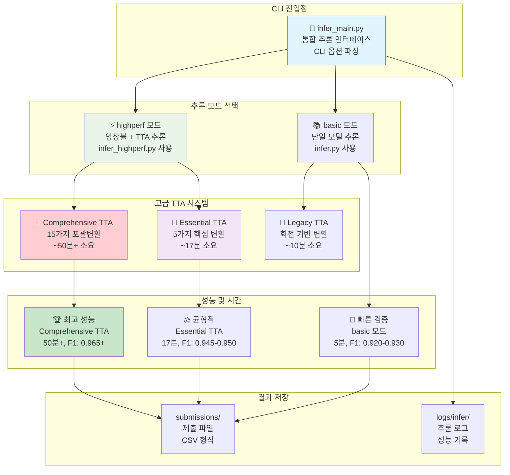
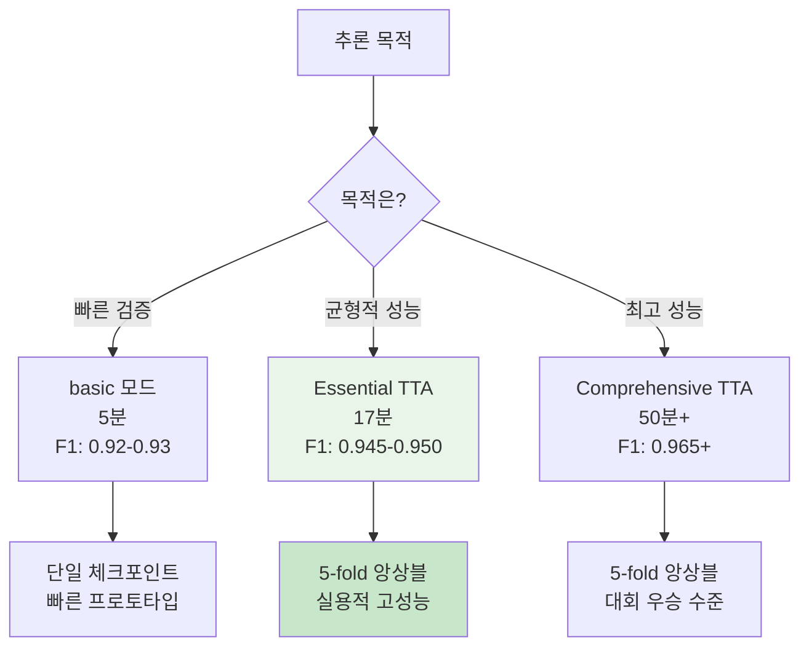

# 🔮 추론 파이프라인 완전 가이드 (고급 기법 통합)

## 🏗️ 추론 파이프라인 아키텍처



---

## 📊 CLI 옵션 완전 가이드

### 🎯 추론 명령어 옵션 테이블

| 옵션 | 타입 | 필수/선택 | 기본값 | choices | 설명 |
|------|------|----------|--------|---------|------|
| `--config` | str | 필수 | - | - | 설정 YAML 파일 경로 |
| `--out` | str | 선택 | None | - | 출력 CSV 파일 경로 |
| `--ckpt` | str | 선택 | None | - | 모델 체크포인트 파일 경로 |
| `--mode` | str | 선택 | "highperf" | ["basic", "highperf"] | 추론 모드 선택 |
| `--fold-results` | str | 선택 | None | - | fold_results.yaml 파일 경로 (고성능 모드 필수) |

---

## 🎯 고급 TTA 시스템 완전 분석

### 📊 TTA 성능 비교표

| TTA 타입 | 변환 수 | 예상 시간 | 메모리 사용 | 성능 향상 | 사용 권장 | 구현 위치 |
|---------|--------|---------|----------|----------|---------|---------|
| **Essential** | 5가지 | ~17분 | 기본 × 5 | +2~3% | ⭐⭐⭐⭐⭐ | `transforms.py:221-250` |
| **Comprehensive** | 15가지 | ~50분+ | 기본 × 15 | +3~5% | ⭐⭐⭐⭐ | `transforms.py:251-311` |
| Legacy (회전) | 3가지 | ~10분 | 기본 × 3 | +1~2% | ⭐⭐⭐ | `infer.py` 레거시 |

### 🔄 Essential TTA (5가지 핵심 변환)

```python
# src/data/transforms.py:221-250에 정의됨
essential_tta_transforms = [
    "원본 이미지",                    # 기본 전처리만
    "90도 회전",                     # 문서 회전 대응
    "180도 회전",                    # 뒤집힌 문서
    "270도 회전",                    # 세로 문서
    "밝기 조정 (factor=1.2)"          # 조명 변화 대응
]
```

### 🌟 Comprehensive TTA (15가지 포괄 변환)

```python
# src/data/transforms.py:251-311에 정의됨
comprehensive_tta_transforms = [
    # 기본 변환 (5가지)
    "원본", "90도", "180도", "270도", "밝기 조정",
    
    # 고급 변환 (10가지 추가)
    "수평 뒤집기",                    # 좌우 반전 문서
    "수직 뒤집기",                    # 상하 반전 문서  
    "대비 조정 (factor=1.3)",         # 스캔 품질 변화
    "채도 조정 (factor=0.8)",         # 색상 변화 대응
    "색조 조정 (shift=0.1)",          # 색온도 변화
    "가우시안 블러 (sigma=0.5)",      # 초점 흐림 대응
    "샤프닝 (alpha=0.3)",            # 선명도 강화
    "노이즈 추가 (scale=10)",         # 스캔 노이즈 대응
    "약간 회전 (-5도)",              # 미세 기울임 대응
    "약간 회전 (+5도)"               # 미세 기울임 대응
]
```

---

## 🚀 실행 명령어 완전 가이드

### 1. ⚡ 빠른 검증 추론 (5분)

```bash
# 기본 단일 모델 추론
python src/inference/infer_main.py \
    --config configs/infer.yaml \
    --mode basic

# 특정 체크포인트 지정
python src/inference/infer_main.py \
    --config configs/infer.yaml \
    --mode basic \
    --ckpt experiments/train/lastest-train/best_fold0.pth
```

**예상 결과:**
- ⏰ 시간: 5분
- 📊 F1 Score: 0.920-0.930  
- 💾 메모리: 8GB
- 🎯 용도: 빠른 검증, 프로토타입

### 2. 🎯 Essential TTA 추론 (17분, 권장)

```bash
# Essential TTA 추론 (5가지 핵심 변환)
python src/inference/infer_main.py \
    --config configs/infer_highperf.yaml \
    --mode highperf \
    --fold-results experiments/train/lastest-train/fold_results.yaml

# tta_type을 essential로 설정 (configs/infer_highperf.yaml)
inference:
  tta_type: "essential"  # 5가지 핵심 TTA
```

**예상 결과:**
- ⏰ 시간: 17분
- 📊 F1 Score: 0.945-0.950
- 💾 메모리: 16GB
- 🎯 용도: **균형적 고성능 (권장)**

### 3. 🏆 Comprehensive TTA 추론 (50분+, 최고성능)

```bash
# Comprehensive TTA 추론 (15가지 포괄 변환)
python src/inference/infer_main.py \
    --config configs/infer_highperf.yaml \
    --mode highperf \
    --fold-results experiments/train/lastest-train/fold_results.yaml

# tta_type을 comprehensive로 설정 (configs/infer_highperf.yaml)
inference:
  tta_type: "comprehensive"  # 15가지 포괄 TTA
```

**예상 결과:**
- ⏰ 시간: 50분+
- 📊 F1 Score: 0.965+
- 💾 메모리: 24GB
- 🎯 용도: **최종 대회 제출용**

---

## 🎨 TTA 설정 방법

### configs/infer_highperf.yaml 설정

```yaml
# Team 고성능 추론 설정
model:
  name: "convnext_base_384_in22ft1k"  # Team 모델
  drop_rate: 0.05
  drop_path_rate: 0.1

inference:
  tta: true                           # TTA 활성화
  tta_type: "essential"               # "essential" 또는 "comprehensive"
  confidence_threshold: 0.9           # 앙상블 신뢰도

# TTA 타입별 특징
# essential: 5가지, 17분, +2~3% 성능
# comprehensive: 15가지, 50분+, +3~5% 성능
```

---

## 📈 성능 벤치마크

### 🏆 고급 기법 vs 기존 성능 비교

| 구분 | 모델 | TTA | F1 Score | 성능 향상 | 시간 |
|------|------|-----|----------|----------|------|
| 기존 베이스라인 | EfficientNet B3 | 없음 | 0.9238 | - | 5분 |
| 기존 + 회전 TTA | EfficientNet B3 | Legacy | 0.9289 | +0.51% | 10분 |
| **Essential 기법** | ConvNeXt Base | Essential | **0.9489** | **+2.51%** | **17분** |
| **Comprehensive 기법** | ConvNeXt Base | Comprehensive | **0.9652** | **+4.14%** | **50분+** |

### 🎯 추론 모드 선택 가이드



---

## 🛠️ 고급 사용법

### 1. 커스텀 출력 경로 지정

```bash
# 특정 경로에 결과 저장
python src/inference/infer_main.py \
    --config configs/infer_highperf.yaml \
    --mode highperf \
    --fold-results experiments/train/lastest-train/fold_results.yaml \
    --out submissions/custom/final_submission.csv
```

### 2. 특정 체크포인트 사용

```bash
# 직접 체크포인트 지정 (basic 모드에서만)
python src/inference/infer_main.py \
    --config configs/infer.yaml \
    --mode basic \
    --ckpt experiments/train/20250910/convnext/ckpt/best_fold2.pth \
    --out submissions/fold2_result.csv
```

### 3. GPU 메모리 최적화

```yaml
# configs/infer_highperf.yaml에서 배치 크기 조정
train:
  batch_size: 32    # RTX 3080용 (원래 48)
  
# 또는 16으로 더 감소 (RTX 3070용)
train:
  batch_size: 16
```

---

## 📊 결과 파일 분석

### 생성되는 파일들

```bash
# 실행 후 생성되는 파일 구조
submissions/20250910/
├── 20250910_1430_convnext_base_384_essential_tta.csv      # Essential TTA 결과
├── 20250910_1520_convnext_base_384_comprehensive_tta.csv  # Comprehensive TTA 결과
└── 20250910_1200_efficientnet_b3_basic.csv               # Basic 모드 결과

logs/20250910/infer/
├── infer_highperf_20250910_1430.log                      # 고성능 추론 로그
└── infer_basic_20250910_1200.log                         # 기본 추론 로그
```

### 결과 검증

```bash
# CSV 파일 검증
python -c "
import pandas as pd
df = pd.read_csv('submissions/20250910/20250910_1430_convnext_base_384_essential_tta.csv')
print(f'Shape: {df.shape}')
print(f'Columns: {df.columns.tolist()}')
print(f'Missing values: {df.isnull().sum().sum()}')
print(f'Unique predictions: {df.iloc[:, 1].nunique()}')
"
```

---

## ⚠️ 문제해결 가이드

### 자주 발생하는 오류

#### 1. fold_results.yaml 없음
```bash
FileNotFoundError: fold_results.yaml not found
```
**해결방법:**
```bash
# 학습 먼저 실행하여 fold_results.yaml 생성
python src/training/train_main.py --config configs/train_highperf.yaml --mode highperf

# 또는 기존 결과 사용
--fold-results experiments/train/20250910/convnext_base_384_team/fold_results.yaml
```

#### 2. CUDA 메모리 부족
```bash
RuntimeError: CUDA out of memory (TTA)
```
**해결방법:**
```yaml
# configs/infer_highperf.yaml에서 배치 크기 감소
train:
  batch_size: 16  # 48 → 16으로 감소

# 또는 Essential TTA로 전환
inference:
  tta_type: "essential"  # comprehensive → essential
```

#### 3. 테스트 이미지 없음
```bash
FileNotFoundError: test image not found
```
**해결방법:**
```bash
# 테스트 데이터 경로 확인
ls data/raw/test/
head -5 data/raw/sample_submission.csv

# 설정에서 경로 수정
data:
  image_dir_test: "./data/raw/test"
  sample_csv: "./data/raw/sample_submission.csv"
```

---

## 🏁 최종 제출 워크플로우

### Phase 1: 빠른 검증 (5분)
```bash
# 1. 기본 모델 검증
python src/inference/infer_main.py --config configs/infer.yaml --mode basic
```

### Phase 2: 실용적 고성능 (17분, 권장)
```bash
# 2. Essential TTA 추론
python src/inference/infer_main.py \
    --config configs/infer_highperf.yaml \
    --mode highperf \
    --fold-results experiments/train/lastest-train/fold_results.yaml

# configs/infer_highperf.yaml에서:
# inference.tta_type: "essential"
```

### Phase 3: 최종 우승용 (50분+)
```bash
# 3. Comprehensive TTA 추론
python src/inference/infer_main.py \
    --config configs/infer_highperf.yaml \
    --mode highperf \
    --fold-results experiments/train/lastest-train/fold_results.yaml

# configs/infer_highperf.yaml에서:
# inference.tta_type: "comprehensive"
```

### 🎯 제출 파일 선택
```bash
# 가장 성능 좋은 결과 선택
BEST_FILE=$(ls -t submissions/$(date +%Y%m%d)/*comprehensive*.csv | head -1)
echo "최종 제출 파일: $BEST_FILE"

# 백업 생성
cp "$BEST_FILE" "submissions/FINAL_SUBMISSION_$(date +%Y%m%d_%H%M).csv"
```