# 🎓 학습 파이프라인 완전 가이드

## 🏗️ 학습 파이프라인 아키텍처

```mermaid
graph TB
    subgraph "CLI 진입점"
        A[train_main.py<br/>통합 학습 인터페이스<br/>CLI 옵션 파싱]
    end
    
    subgraph "학습 모드 선택"
        B[📚 basic 모드<br/>기본 학습 모드<br/>train.py 사용]
        C[⚡ highperf 모드<br/>고성능 학습 모드<br/>train_highperf.py 사용]
        D[🔄 full-pipeline 모드<br/>학습 + 추론 전체 실행<br/>full_pipeline.py 사용]
    end
    
    subgraph "모델 아키텍처"
        E[📊 EfficientNet B3<br/>12M 파라미터<br/>224-320px]
        F[🏆 ConvNeXt Base 384<br/>89M 파라미터<br/>384px]
        G[🎯 Swin Transformer<br/>88M 파라미터<br/>384px]
    end
    
    subgraph "Team 고성능 기법"
        H[💪 Hard Augmentation<br/>동적 확률 스케줄링<br/>확률 = 0.2 + 0.3 x 진행률]
        I[🎯 Essential TTA<br/>5가지 핵심 변환<br/>0°, 90°, 180°, 270°, 밝기]
        J[🌡️ Temperature Scaling<br/>모델 보정<br/>신뢰도 조정]
    end
    
    subgraph "최적화 시스템"
        K[🔍 Optuna 튜닝<br/>다양한 하이퍼파라미터<br/>베이지안 최적화]
        L[🎨 시각화 시스템<br/>실시간 성능 모니터링<br/>결과 차트 생성]
    end
    
    A --> B
    A --> C  
    A --> D
    
    B --> E
    C --> F
    C --> G
    
    C --> H
    C --> I
    C --> J
    
    A --> K
    A --> L
    
    style A fill:#e1f5fe, color:#000000
    style C fill:#e8f5e8, color:#000000
    style F fill:#ffcdd2, color:#000000
    style H fill:#fff3e0, color:#000000
    style I fill:#f3e5f5, color:#000000
    style K fill:#ffebee, color:#000000
```

## 🔀 파이프라인 흐름도

```mermaid
flowchart LR
    A[📁 데이터 준비<br/>data/raw/train/<br/>data/raw/meta.csv<br/>이미지 파일 및 라벨 로딩] --> B[🔀 Fold 분할<br/>KFold n=5<br/>stratified<br/>클래스 균형 유지]
    B --> C[🎯 모델 학습<br/>각 Fold별<br/>GPU 가속 학습<br/>병렬 처리]
    C --> D[📊 검증<br/>Validation<br/>F1-Score 계산<br/>성능 평가]
    D --> E[💾 최적 모델 저장<br/>experiments/train/<br/>YYYYMMDD/model/results/ckpt/<br/>베스트 체크포인트 + 시각화]
    
    C --> F[Early Stopping<br/>+ LR Scheduler<br/>과적합 방지<br/>학습률 조정]
    F --> D
    D --> G[Best Model<br/>Selection<br/>최고 성능 모델<br/>선택 저장]
    G --> H[best_fold*.pth<br/>5개 파일<br/>각 Fold별<br/>최적 가중치]
    
    subgraph "데이터 정보"
        I[17개 클래스<br/>2000+ 이미지<br/>불균형 데이터셋]
        J[Train: 80%<br/>Valid: 20%<br/>계층적 분할]
    end
    
    style A fill:#e1f5fe, color:#000000
    style E fill:#e8f5e8, color:#000000
    style H fill:#fff3e0, color:#000000
```


## 📁 파일 간 의존 관계 다이어그램

```mermaid
graph TB
    subgraph "⚙️ 설정 파일"
        CONFIG1[configs/train.yaml<br/>기본 학습 설정]
        CONFIG2[configs/train_highperf.yaml<br/>고성능 학습 설정]
        CONFIG3[configs/train_fast_optimized.yaml<br/>빠른 학습 설정]
    end
    
    subgraph "🧠 코어 학습 시스템"
        MAIN[src/training/train_main.py<br/>메인 실행 인터페이스<br/>명령행 파싱]
        TRAIN[src/training/train.py<br/>학습 로직 구현<br/>5-Fold CV 관리]
        MODELS[src/models/build.py<br/>모델 아키텍처 빌드<br/>백본 네트워크 선택]
        DATA[src/data/dataset.py<br/>데이터 로더 구현<br/>이미지 전처리]
        UTILS[src/utils/core/common.py<br/>공통 유틸리티<br/>로깅 및 헬퍼 함수]
    end
    
    subgraph "📊 입력 데이터"
        RAW[data/raw/train/<br/>원본 학습 이미지]
        META[data/raw/meta.csv<br/>라벨 정보 및 메타데이터]
    end
    
    subgraph "💾 출력 결과"
        EXP[experiments/train/YYYYMMDD/<br/>실험 결과 저장소<br/>images/ + results/ + logs/]
        LOGS[logs/YYYYMMDD/train/<br/>학습 로그 및 메트릭]
        WANDB[wandb/run-*/<br/>실험 추적 및 시각화]
    end
    
    CONFIG1 --> MAIN
    CONFIG2 --> MAIN
    CONFIG3 --> MAIN
    
    MAIN --> TRAIN
    MAIN --> MODELS
    MAIN --> DATA
    MAIN --> UTILS
    
    RAW --> DATA
    META --> DATA
    
    TRAIN --> EXP
    TRAIN --> LOGS
    TRAIN --> WANDB
    
    EXP --> FOLD1[best_fold0.pth<br/>첫 번째 Fold 최적 모델]
    EXP --> FOLD2[best_fold1.pth<br/>두 번째 Fold 최적 모델]
    EXP --> FOLD3[best_fold2.pth<br/>세 번째 Fold 최적 모델]
    EXP --> FOLD4[best_fold3.pth<br/>네 번째 Fold 최적 모델]
    EXP --> FOLD5[best_fold4.pth<br/>다섯 번째 Fold 최적 모델]
    
    style CONFIG1 fill:#e1f5fe, color:#000000
    style CONFIG2 fill:#e8f5e8, color:#000000
    style CONFIG3 fill:#f3e5f5, color:#000000
    style MAIN fill:#fff3e0, color:#000000
    style EXP fill:#ffebee, color:#000000
```



### 📂 디렉토리 구조 및 파일 상세 설명

```text
🎓 학습 파이프라인 파일 구조
├── src/training/
│   ├── train_main.py                          # 🚀 메인 실행 인터페이스
│   ├── train.py                               # 🧠 핵심 학습 로직
│   ├── train_highperf.py                      # 🏆 고성능 학습 로직
│   └── __init__.py
│
├── src/models/
│   ├── build.py                               # 🏗️ 모델 아키텍처 빌더
│   └── __init__.py
│
├── src/data/
│   ├── dataset.py                             # 📊 데이터셋 및 로더
│   ├── transforms.py                          # 🔄 데이터 증강
│   └── __init__.py
│
├── src/metrics/
│   ├── __init__.py
│   └── f1.cpython-311.py                     # 
│
├── src/utils/
│   ├── core/                                  # 🔧 핵심 유틸리티
│   │   └── common.py                          # 공통 함수 (파일/YAML/로깅)
│   ├── config/                                # ⚙️ 설정 관리
│   │   ├── seed.py                            # 시드 설정
│   │   └── update_config_dates.py             # 설정 날짜 업데이트
│   ├── gpu_optimization/                      # � GPU 최적화
│   │   ├── auto_batch_size.py                 # 동적 배치 크기 결정
│   │   └── team_gpu_check.py                  # GPU 환경 분석
│   ├── code_management/                       # 📋 코드 관리
│   │   └── reorganize_experiments.py          # 실험 정리
│   ├── visualizations/                        # 📊 시각화 시스템
│   │   ├── base_visualizer.py                 # 기본 시각화 엔진
│   │   ├── training_viz.py                    # 학습 시각화
│   │   ├── inference_viz.py                   # 추론 시각화
│   │   ├── optimization_viz.py                # 최적화 시각화
│   │   └── output_manager.py                  # 출력 관리
│   └── __init__.py
│
├── src/optimization/
│   ├── optuna_optimize.py                     # 🔍 하이퍼파라미터 튜닝
│   └── __init__.py
│
├── src/calibration/
│   ├── calibrate.py                           # 📏 모델 보정
│   └── __init__.py
│
├── src/logging/
│   ├── logger.py                              # � 로깅 시스템
│   └── __init__.py
│
├── configs/
│   ├── train.yaml                             # ⚙️ 기본 학습 설정
│   ├── train_highperf.yaml                    # 🏆 고성능 학습 설정
│   ├── train_fast_optimized.yaml              # ⚡ 빠른 학습 설정
│   ├── optuna_config.yaml                     # 🔍 하이퍼파라미터 튜닝 설정
│   └── optuna_fast_config.yaml                # ⚡ 빠른 튜닝 설정
│
├── data/raw/
│   ├── train/                                 # 📁 학습 이미지 폴더
│   ├── meta.csv                               # 📋 라벨 및 메타데이터
│   └── sample_submission.csv                  # 📄 제출 형식 예시
│
├── experiments/
│   ├── train/YYYYMMDD/                        # 📁 날짜별 학습 실험
│   │   └── model_name_YYYYMMDD_HHMM/
│   │       ├── ckpt/                          # 💾 체크포인트 저장소
│   │       │   ├── best_fold0.pth
│   │       │   ├── best_fold1.pth
│   │       │   ├── best_fold2.pth
│   │       │   ├── best_fold3.pth
│   │       │   ├── best_fold4.pth
│   │       │   └── last.pth                   # 마지막 에포크 모델
│   │       ├── config.yaml                    # 실험 설정 백업
│   │       └── metrics.json                   # 성능 지표 기록
│   └── optimization/                          # 📁 최적화 실험 결과
│
├── logs/YYYYMMDD/
│   └── train/                                 # 📁 학습 로그
│       ├── train_HHMM.log                     # 학습 진행 로그
│       └── metrics_HHMM.json                  # 성능 지표 로그
│
├── scripts/
│   ├── run_fast_training.sh                   # ⚡ 빠른 학습 실행 스크립트
│   ├── run_highperf_training.sh               # 🏆 고성능 학습 실행 스크립트
│   └── monitor_training.sh                    # 📊 학습 모니터링 스크립트
│
└── wandb/                                     # 📊 실험 추적 데이터
    └── run-*/                                 # WandB 실행 기록
```

#### 🔍 핵심 파일 상세 기능

**1. src/training/train_main.py**
- **주요 기능**: 명령행 인터페이스 제공 및 학습 파이프라인 통합 관리
- **핵심 역할**: 
  - argparse를 통한 사용자 입력 처리
  - 설정 파일 로딩 및 검증
  - 학습 모드 선택 (기본/고성능/빠른 모드)
  - GPU 자동 감지 및 분산 학습 설정
- **의존성**: train.py, config 파일들과 직접 연결

**2. src/training/train.py**
- **주요 기능**: 5-Fold Cross Validation 및 핵심 학습 로직 구현
- **핵심 역할**:
  - KFold 데이터 분할 (Stratified 방식)
  - 각 Fold별 모델 학습 관리
  - Early Stopping 및 Learning Rate Scheduling
  - 검증 성능 평가 (F1-Score, Accuracy)
  - 최적 모델 체크포인트 저장
- **의존성**: models/build.py, data/dataset.py와 긴밀한 연결

**3. src/models/build.py**
- **주요 기능**: 모델 아키텍처 동적 빌딩 및 백본 네트워크 관리
- **핵심 역할**:
  - EfficientNet, ResNet, Swin Transformer 등 백본 선택
  - 사전 훈련 가중치 로딩
  - 분류 헤드 커스터마이징 (17개 클래스 대응)
  - 모델 파라미터 초기화
- **의존성**: timm, torchvision 라이브러리 활용

**4. src/data/dataset.py**
- **주요 기능**: 커스텀 데이터셋 클래스 및 데이터 로더 구현
- **핵심 역할**:
  - 이미지 파일 로딩 및 전처리 파이프라인
  - 라벨 인코딩 및 클래스 매핑
  - 데이터 증강 적용 (Albumentations)
  - 배치 생성 및 GPU 메모리 최적화
- **의존성**: transforms.py와 연동하여 증강 기법 적용

**5. configs/train_*.yaml**
- **train.yaml**: 일반적인 실험용 기본 설정 (EfficientNet-B3, 224px)
- **train_highperf.yaml**: 최고 성능 추구 설정 (Swin-Base, 384px, 낮은 LR)
- **train_fast_optimized.yaml**: 빠른 프로토타입 설정 (작은 모델, 높은 LR)

## ⚙️ 설정 파일 및 실행 명령어

### 1. 기본 학습 모드 (EfficientNet-B3)

#### 설정 파일: `configs/train.yaml`
```yaml
# 핵심 설정
model:
  name: efficientnet_b3
  img_size: 224
  num_classes: 17

train:
  epochs: 10
  batch_size: 32  # auto_batch_size로 최적화 가능
  learning_rate: 0.001
  
data:
  train_dir: data/raw/train
  csv_path: data/raw/train.csv
```

#### 기본 실행 명령어
```bash
# 가장 기본적인 학습
python src/training/train_main.py --config configs/train.yaml

# 모드 명시 (기본값은 basic)
python src/training/train_main.py --config configs/train.yaml --mode basic
```

### 2. 고성능 학습 모드 (Swin Transformer)

#### 설정 파일: `configs/train_highperf.yaml`
```yaml
# 고성능 설정 (Team 기법 적용)
model:
  name: "convnext_base_384_in22ft1k"  # Team 고성능 모델
  img_size: 384
  num_classes: 17
  drop_rate: 0.05                    # Team 추천 설정
  drop_path_rate: 0.1               # Stochastic Depth

train:
  epochs: 50                        # Team 성능 달성용
  batch_size: 48                    # RTX 4090 최적화
  lr: 0.0001                        # 대형 모델 안정성
  use_advanced_augmentation: true   # Team Hard Augmentation
  use_mixup: true                   # Mixup 데이터 증강
  mixup_alpha: 1.0                  # Team 추천수치
  label_smoothing: 0.05             # 과적합 방지
```

#### 고성능 실행 명령어
```bash
# 고성능 모드
python src/training/train_main.py --config configs/train_highperf.yaml --mode highperf
```

## 🚀 실행 옵션 완전 가이드

### 기본 명령어 구조
```bash
python src/training/train_main.py [필수옵션] [선택옵션]
```

### 📊 CLI 옵션 완전 가이드

| 옵션 | 타입 | 필수/선택 | 기본값 | choices | 설명 |
|------|------|----------|--------|---------|------|
| `--config` | str | 필수 | - | - | 설정 YAML 파일 경로 |
| `--mode` | str | 선택 | "full-pipeline" | ["basic", "highperf", "full-pipeline"] | 실행 모드 선택 |
| `--skip-training` | flag | 선택 | False | - | 학습 건너뛰고 추론만 실행 |
| `--optimize` | flag | 선택 | False | - | Optuna 하이퍼파라미터 최적화 |
| `--n-trials` | int | 선택 | 20 | - | Optuna 시도 횟수 |
| `--optuna-config` | str | 선택 | None | - | Optuna 설정 파일 경로 |
| `--use-calibration` | flag | 선택 | False | - | Temperature Scaling 사용 |
| `--auto-continue` | flag | 선택 | False | - | 최적화 후 자동 진행 |

### 선택 옵션 상세 설명

#### 1. `--mode <모드>`
**기능**: 학습 파이프라인 모드 선택
**옵션값**:
- `basic`: 기본 학습 (빠름, 안정적)
- `highperf`: 고성능 학습 (느림, 정확함)
- `full-pipeline`: 학습 + 추론까지 전체 실행

```bash
# 기본 모드 (30분)
python src/training/train_main.py --config configs/train.yaml --mode basic

# 고성능 모드 (1-2시간)
python src/training/train_main.py --config configs/train_highperf.yaml --mode highperf

# 전체 파이프라인 (학습+추론)
python src/training/train_main.py --config configs/train.yaml --mode full-pipeline
```

#### 2. `--optimize`
**기능**: Optuna 하이퍼파라미터 자동 최적화 활성화
**효과**: learning_rate, batch_size, augmentation 파라미터 자동 튜닝

```bash
# 최적화 없이 학습 (기본 설정 사용)
python src/training/train_main.py --config configs/train.yaml

# 최적화와 함께 학습 (성능 향상 기대)
python src/training/train_main.py --config configs/train.yaml --optimize
```

#### 3. `--n-trials <숫자>`
**기능**: Optuna 최적화 시도 횟수 설정 (--optimize와 함께 사용)
**기본값**: 20
**권장값**: 
- 빠른 테스트: 5-10
- 일반 최적화: 20
- 완전 최적화: 50+

```bash
# 빠른 최적화 (5번 시도)
python src/training/train_main.py --config configs/train.yaml --optimize --n-trials 5

# 표준 최적화 (20번 시도)
python src/training/train_main.py --config configs/train.yaml --optimize --n-trials 20

# 완전 최적화 (50번 시도)
python src/training/train_main.py --config configs/train.yaml --optimize --n-trials 50
```

#### 4. `--use-calibration`
**기능**: Temperature Scaling 캘리브레이션 활성화
**효과**: 모델 신뢰도(confidence) 향상, 더 정확한 확률 예측

```bash
# 캘리브레이션 없이
python src/training/train_main.py --config configs/train.yaml

# 캘리브레이션 포함 (추천)
python src/training/train_main.py --config configs/train.yaml --use-calibration
```

#### 5. `--auto-continue`
**기능**: 최적화 완료 후 자동으로 전체 학습 진행 (--optimize와 함께 사용)

```bash
# 최적화만 실행 (수동으로 다음 단계 진행)
python src/training/train_main.py --config configs/train.yaml --optimize

# 최적화 후 자동으로 전체 학습 진행
python src/training/train_main.py --config configs/train.yaml --optimize --auto-continue
```

#### 6. `--resume`
**기능**: 중단된 학습을 체크포인트부터 재개

```bash
# 처음부터 학습
python src/training/train_main.py --config configs/train.yaml

# 중단된 지점부터 재개
python src/training/train_main.py --config configs/train.yaml --resume
```

## 🎯 실전 사용 예시

### 1. 빠른 결과 확인 (30분)
```bash
python src/training/train_main.py --config configs/train.yaml --mode basic
```

### 2. 최고 성능 추구 (2-3시간)
```bash
python src/training/train_main.py \
    --config configs/train_highperf.yaml \
    --mode highperf \
    --optimize \
    --n-trials 20 \
    --use-calibration \
    --auto-continue
```

### 3. 빠른 최적화 테스트 (1시간)
```bash
python src/training/train_main.py \
    --config configs/train.yaml \
    --optimize \
    --n-trials 5 \
    --use-calibration
```

### 4. 전체 파이프라인 (학습+추론)
```bash
python src/training/train_main.py \
    --config configs/train_highperf.yaml \
    --mode full-pipeline \
    --use-calibration
```

### 5. 🚀 단일 폴드 최적화 (신규 - 2025.09.10 추가)
**배경**: 경진대회 마감 시간 단축을 위해 K-fold 대신 단일 폴드 + 앙상블 전략 적용

```bash
# 단일 폴드 하이퍼파라미터 최적화 (매우 빠름 - 2분/trial)
python src/training/train_main.py \
    --config configs/train_highperf.yaml \
    --mode full-pipeline \
    --use-calibration \
    --optimize \
    --optuna-config configs/optuna_single_fold_config.yaml \
    --auto-continue
```

**핵심 개선사항:**
- ⚡ **속도 향상**: 매 trial 2초 완료 (데이터셋 캐싱 적용)
- 🎯 **실제 F1 점수**: 시뮬레이션 아닌 실제 학습 기반 평가
- 📊 **높은 성능**: F1 0.947+ 달성 가능
- 🔧 **메모리 최적화**: 캐시된 데이터로 반복 학습 속도 극대화

**설정 파일**: `configs/optuna_single_fold_config.yaml`
```yaml
optuna:
  n_trials: 20              # 빠른 테스트용 (실제 100+ 권장)
  n_jobs: 1                 # GPU 메모리에 따라 조정
  single_fold_validation:
    epochs: 5               # 빠른 검증용
    validation_split: 0.2   # 80:20 분할
```

## 📊 성능 비교 및 Team 기법 분석

### 🏆 최신 vs 기존 성능 비교

| 구분 | 모델 | F1 Score | 성능 향상 | 실험 일시 | 핵심 기법 |
|------|------|----------|----------|---------|---------|
| **기존 베이스라인** | EfficientNet B3 | 0.9238 | - | - | 기본 증강 |
| **고성능 최신** | ConvNeXt Base 384 | **0.98362** | **+6.5%** | 2025-09-10 12:13 | **최적화된 전체 기법** |
| **고성능 이전** | ConvNeXt Base 384 | **0.97918** | **+5.9%** | 2025-09-10 09:29 | Hard Aug + TTA + 캘리브레이션 |

### ⚡ 실행 모드별 성능 분석

| 실행 옵션 | 예상 시간 | 예상 F1 | GPU 메모리 | Team 기법 적용 | 추천 상황 |
|-----------|-----------|---------|------------|-------------|-----------|
| `--mode basic` | 30분 | 0.920-0.930 | 8GB | ❌ | 빠른 프로토타입 |
| `--mode basic --optimize` | 1시간 | 0.935-0.945 | 8GB | 부분적 | 개선된 베이스라인 |
| `--mode highperf` | 2시간 | **0.950-0.965** | 16GB | ✅ **전체** | **최종 제출용** |
| `--mode highperf --optimize` | 3시간 | **0.965+** | 16GB | ✅ **전체+튜닝** | **대회 우승용** |
| **🚀 단일 폴드 최적화** | **23분** | **0.969-0.984** | **12GB** | ✅ **캐싱+최적화** | **⚡ 빠른 경진대회용** |

### 🎯 Team 고성능 기법별 기여도

| 기법 | 성능 기여 | 구현 위치 | 설명 |
|------|----------|---------|------|
| **ConvNeXt ImageNet-22k** | +2.0% | `configs/train_highperf.yaml` | 사전학습 모델 업그레이드 |
| **Hard Augmentation** | +1.5% | `src/data/transforms.py:180-216` | 동적 확률 스케줄링 |
| **Essential TTA** | +0.8% | `src/data/transforms.py:221-250` | 5가지 핵심 변환 |
| **Temperature Scaling** | +0.3% | `src/calibration/` | 확률 보정 |
| **전체 조합** | **+4.14%** | 통합 적용 | 시너지 효과 |

## ⚠️ 주의사항 및 팁

### GPU 메모리 최적화
```bash
# GPU 메모리 부족 시
python src/utils/gpu_optimization/auto_batch_size.py --config configs/train.yaml
python src/training/train_main.py --config configs/train.yaml --mode basic
```

### 학습 모니터링
```bash
# 실시간 로그 확인
tail -f logs/$(date +%Y%m%d)/train/*.log

# GPU 사용량 모니터링
watch -n 1 nvidia-smi
```

### 체크포인트 관리
```bash
# 최신 모델 확인
ls -la experiments/train/$(date +%Y%m%d)/*/results/ckpt/

# 시각화 이미지 확인  
ls -la experiments/train/$(date +%Y%m%d)/*/images/

# 특정 fold 모델 사용
python src/training/train_main.py --config configs/train.yaml --resume --fold 0
```

## 🚀 모든 실행 명령어 모음

### 기본 학습 명령어
```bash
# 1. 기본 학습 (EfficientNet-B3, 224px)
python src/training/train_main.py --config configs/train.yaml

# 2. 고성능 학습 (Swin-Base, 384px)
python src/training/train_main.py --config configs/train_highperf.yaml

# 3. 빠른 학습 (프로토타입용)
python src/training/train_main.py --config configs/train_fast_optimized.yaml
```

### 고급 학습 옵션
```bash
# 4. 특정 모드로 학습
python src/training/train_main.py --config configs/train.yaml --mode basic
python src/training/train_main.py --config configs/train.yaml --mode highperf
python src/training/train_main.py --config configs/train.yaml --mode fast

# 5. 학습 재개 (체크포인트에서)
python src/training/train_main.py --config configs/train.yaml --resume
python src/training/train_main.py --config configs/train.yaml --resume --fold 2

# 6. 자동 계속 (중단된 학습 자동 재개)
python src/training/train_main.py --config configs/train.yaml --auto-continue

# 7. 특정 fold만 학습
python src/training/train_main.py --config configs/train.yaml --fold 0
python src/training/train_main.py --config configs/train.yaml --fold 1,2,3
```

### 최적화 관련 명령어
```bash
# 8. Optuna 하이퍼파라미터 튜닝
python src/training/train_main.py --config configs/train.yaml --optimize --n-trials 50

# 9. 빠른 최적화 (적은 trial)
python src/training/train_main.py --config configs/train_fast_optimized.yaml --optimize --n-trials 10

# 10. 보정 포함 학습
python src/training/train_main.py --config configs/train.yaml --use-calibration

# 11. 최적화 + 보정 조합
python src/training/train_main.py --config configs/train_highperf.yaml --optimize --n-trials 30 --use-calibration
```

### GPU 및 배치 설정
```bash
# 12. 특정 GPU 지정
CUDA_VISIBLE_DEVICES=0 python src/training/train_main.py --config configs/train.yaml
CUDA_VISIBLE_DEVICES=1 python src/training/train_main.py --config configs/train_highperf.yaml

# 13. 자동 배치 크기 결정
python src/utils/gpu_optimization/auto_batch_size.py --config configs/train.yaml
python src/utils/gpu_optimization/auto_batch_size.py --config configs/train_highperf.yaml

# 14. GPU 상태 확인
python src/utils/gpu_optimization/team_gpu_check.py
```

### 데이터 및 전처리
```bash
# 15. 데이터 준비 확인
ls -la data/raw/train/
head -5 data/raw/meta.csv

# 16. 클래스 분포 확인
python -c "
import pandas as pd
df = pd.read_csv('data/raw/meta.csv')
print('클래스 분포:')
print(df['label'].value_counts().sort_index())
print(f'\n총 이미지 수: {len(df)}')
print(f'클래스 수: {df["label"].nunique()}')
"
```

### 모니터링 및 로그
```bash
# 17. 실시간 학습 로그 확인
tail -f logs/$(date +%Y%m%d)/train/*.log

# 18. GPU 메모리 모니터링
watch -n 1 nvidia-smi

# 19. 학습 진행률 확인
grep -i "epoch\|loss\|f1" logs/$(date +%Y%m%d)/train/*.log | tail -20

# 20. WandB 동기화
wandb sync wandb/
```

### 결과 분석
```bash
# 21. 최신 실험 결과 확인 (전체 구조)
ls -la experiments/train/$(date +%Y%m%d)/

# 22. 체크포인트 파일 확인
find experiments/train -path "*/results/ckpt/*.pth" | head -10

# 22-1. 시각화 이미지 확인
find experiments/train/$(date +%Y%m%d) -name "*.png" | head -10

# 23. 학습 성능 요약
python -c "
import json, glob
metric_files = glob.glob('experiments/train/$(date +%Y%m%d)/*/results/metrics.json')
for file in metric_files:
    with open(file) as f:
        metrics = json.load(f)
        print(f'{file}: F1={metrics.get(\"best_f1\", \"N/A\"):.4f}')
"

# 24. 모델 크기 확인
ls -lh experiments/train/$(date +%Y%m%d)/*/results/ckpt/*.pth

# 25. 시각화 결과 확인
echo "=== 생성된 시각화 차트 ==="
find experiments/train/$(date +%Y%m%d) -name "*.png" -exec basename {} \; | sort
```

### 스크립트 실행
```bash
# 25. 빠른 학습 스크립트
bash scripts/run_fast_training.sh

# 26. 고성능 학습 스크립트  
bash scripts/run_highperf_training.sh

# 27. 학습 모니터링 스크립트
bash scripts/monitor_training.sh
```

### 환경 설정
```bash
# 28. Python 환경 활성화
eval "$(pyenv init --path)" && pyenv activate cv_py3_11_9

# 29. 필요한 패키지 설치
pip install -r requirements.txt

# 30. 환경 변수 설정
source path.env
```
