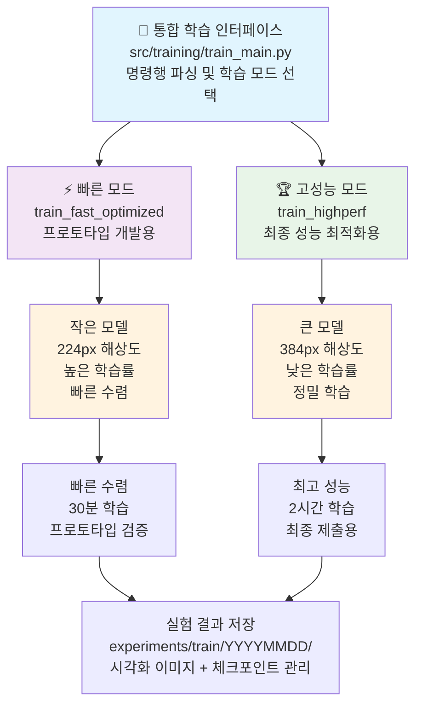
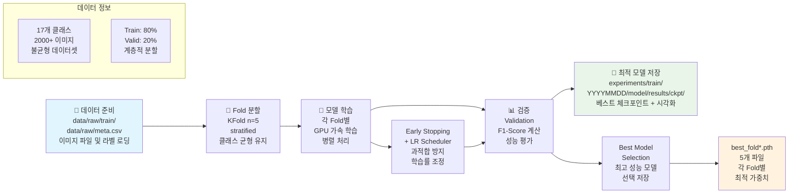
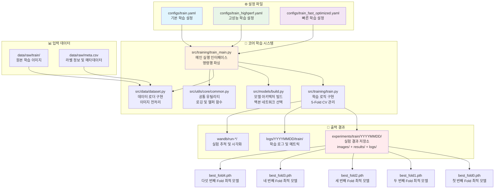

# 🎓 학습 파이프라인 완전 가이드

## 🏗️ 학습 파이프라인 아키텍처


## 🔀 파이프라인 흐름도


## 📁 파일 간 의존 관계 다이어그램



### 📂 디렉토리 구조 및 파일 상세 설명

```text
🎓 학습 파이프라인 파일 구조
├── src/training/
│   ├── train_main.py                          # 🚀 메인 실행 인터페이스
│   ├── train.py                               # 🧠 핵심 학습 로직
│   ├── train_highperf.py                      # 🏆 고성능 학습 로직
│   └── __init__.py
│
├── src/models/
│   ├── build.py                               # 🏗️ 모델 아키텍처 빌더
│   ├── backbones/                             # 백본 네트워크 모음
│   └── __init__.py
│
├── src/data/
│   ├── dataset.py                             # 📊 데이터셋 및 로더
│   ├── transforms.py                          # 🔄 데이터 증강
│   └── __init__.py
│
├── src/metrics/
│   ├── evaluate.py                            # 📈 평가 지표 계산
│   └── __init__.py
│
├── src/utils/
│   ├── core/                                  # 🔧 핵심 유틸리티
│   │   └── common.py                          # 공통 함수 (파일/YAML/로깅)
│   ├── config/                                # ⚙️ 설정 관리
│   │   ├── seed.py                            # 시드 설정
│   │   └── update_config_dates.py             # 설정 날짜 업데이트
│   ├── gpu_optimization/                      # � GPU 최적화
│   │   ├── auto_batch_size.py                 # 동적 배치 크기 결정
│   │   └── team_gpu_check.py                  # GPU 환경 분석
│   ├── code_management/                       # 📋 코드 관리
│   │   └── reorganize_experiments.py          # 실험 정리
│   ├── visualizations/                        # 📊 시각화 시스템
│   │   ├── base_visualizer.py                 # 기본 시각화 엔진
│   │   ├── training_viz.py                    # 학습 시각화
│   │   ├── inference_viz.py                   # 추론 시각화
│   │   ├── optimization_viz.py                # 최적화 시각화
│   │   └── output_manager.py                  # 출력 관리
│   └── __init__.py
│
├── src/optimization/
│   ├── optuna_optimize.py                     # 🔍 하이퍼파라미터 튜닝
│   └── __init__.py
│
├── src/calibration/
│   ├── calibrate.py                           # 📏 모델 보정
│   └── __init__.py
│
├── src/logging/
│   ├── logger.py                              # � 로깅 시스템
│   └── __init__.py
│
├── configs/
│   ├── train.yaml                             # ⚙️ 기본 학습 설정
│   ├── train_highperf.yaml                    # 🏆 고성능 학습 설정
│   ├── train_fast_optimized.yaml              # ⚡ 빠른 학습 설정
│   ├── optuna_config.yaml                     # 🔍 하이퍼파라미터 튜닝 설정
│   └── optuna_fast_config.yaml                # ⚡ 빠른 튜닝 설정
│
├── data/raw/
│   ├── train/                                 # 📁 학습 이미지 폴더
│   ├── meta.csv                               # 📋 라벨 및 메타데이터
│   └── sample_submission.csv                  # 📄 제출 형식 예시
│
├── experiments/
│   ├── train/YYYYMMDD/                        # 📁 날짜별 학습 실험
│   │   └── model_name_YYYYMMDD_HHMM/
│   │       ├── ckpt/                          # 💾 체크포인트 저장소
│   │       │   ├── best_fold0.pth
│   │       │   ├── best_fold1.pth
│   │       │   ├── best_fold2.pth
│   │       │   ├── best_fold3.pth
│   │       │   ├── best_fold4.pth
│   │       │   └── last.pth                   # 마지막 에포크 모델
│   │       ├── config.yaml                    # 실험 설정 백업
│   │       └── metrics.json                   # 성능 지표 기록
│   └── optimization/                          # 📁 최적화 실험 결과
│
├── logs/YYYYMMDD/
│   └── train/                                 # 📁 학습 로그
│       ├── train_HHMM.log                     # 학습 진행 로그
│       └── metrics_HHMM.json                  # 성능 지표 로그
│
├── scripts/
│   ├── run_fast_training.sh                   # ⚡ 빠른 학습 실행 스크립트
│   ├── run_highperf_training.sh               # 🏆 고성능 학습 실행 스크립트
│   └── monitor_training.sh                    # 📊 학습 모니터링 스크립트
│
└── wandb/                                     # 📊 실험 추적 데이터
    └── run-*/                                 # WandB 실행 기록
```

#### 🔍 핵심 파일 상세 기능

**1. src/training/train_main.py**
- **주요 기능**: 명령행 인터페이스 제공 및 학습 파이프라인 통합 관리
- **핵심 역할**: 
  - argparse를 통한 사용자 입력 처리
  - 설정 파일 로딩 및 검증
  - 학습 모드 선택 (기본/고성능/빠른 모드)
  - GPU 자동 감지 및 분산 학습 설정
- **의존성**: train.py, config 파일들과 직접 연결

**2. src/training/train.py**
- **주요 기능**: 5-Fold Cross Validation 및 핵심 학습 로직 구현
- **핵심 역할**:
  - KFold 데이터 분할 (Stratified 방식)
  - 각 Fold별 모델 학습 관리
  - Early Stopping 및 Learning Rate Scheduling
  - 검증 성능 평가 (F1-Score, Accuracy)
  - 최적 모델 체크포인트 저장
- **의존성**: models/build.py, data/dataset.py와 긴밀한 연결

**3. src/models/build.py**
- **주요 기능**: 모델 아키텍처 동적 빌딩 및 백본 네트워크 관리
- **핵심 역할**:
  - EfficientNet, ResNet, Swin Transformer 등 백본 선택
  - 사전 훈련 가중치 로딩
  - 분류 헤드 커스터마이징 (17개 클래스 대응)
  - 모델 파라미터 초기화
- **의존성**: timm, torchvision 라이브러리 활용

**4. src/data/dataset.py**
- **주요 기능**: 커스텀 데이터셋 클래스 및 데이터 로더 구현
- **핵심 역할**:
  - 이미지 파일 로딩 및 전처리 파이프라인
  - 라벨 인코딩 및 클래스 매핑
  - 데이터 증강 적용 (Albumentations)
  - 배치 생성 및 GPU 메모리 최적화
- **의존성**: transforms.py와 연동하여 증강 기법 적용

**5. configs/train_*.yaml**
- **train.yaml**: 일반적인 실험용 기본 설정 (EfficientNet-B3, 224px)
- **train_highperf.yaml**: 최고 성능 추구 설정 (Swin-Base, 384px, 낮은 LR)
- **train_fast_optimized.yaml**: 빠른 프로토타입 설정 (작은 모델, 높은 LR)

## ⚙️ 설정 파일 및 실행 명령어

### 1. 기본 학습 모드 (EfficientNet-B3)

#### 설정 파일: `configs/train.yaml`
```yaml
# 핵심 설정
model:
  name: efficientnet_b3
  img_size: 224
  num_classes: 17

train:
  epochs: 10
  batch_size: 32  # auto_batch_size로 최적화 가능
  learning_rate: 0.001
  
data:
  train_dir: data/raw/train
  csv_path: data/raw/train.csv
```

#### 기본 실행 명령어
```bash
# 가장 기본적인 학습
python src/training/train_main.py --config configs/train.yaml

# 모드 명시 (기본값은 basic)
python src/training/train_main.py --config configs/train.yaml --mode basic
```

### 2. 고성능 학습 모드 (Swin Transformer)

#### 설정 파일: `configs/train_highperf.yaml`
```yaml
# 고성능 설정
model:
  name: swin_sighperf
  img_size: 384
  num_classes: 17

train:
  epochs: 15
  batch_size: 16  # 높은 해상도로 인한 작은 배치
  learning_rate: 0.0005
  
augmentation:
  hard_augmentation: true
  mixup_alpha: 0.2
  cutmix_alpha: 1.0
```

#### 고성능 실행 명령어
```bash
# 고성능 모드
python src/training/train_main.py --config configs/train_highperf.yaml --mode highperf
```

## 🚀 실행 옵션 완전 가이드

### 기본 명령어 구조
```bash
python src/training/train_main.py [필수옵션] [선택옵션]
```

### 필수 옵션
- `--config <경로>`: 설정 파일 경로 (필수)

### 선택 옵션 상세 설명

#### 1. `--mode <모드>`
**기능**: 학습 파이프라인 모드 선택
**옵션값**:
- `basic`: 기본 학습 (빠름, 안정적)
- `highperf`: 고성능 학습 (느림, 정확함)
- `full-pipeline`: 학습 + 추론까지 전체 실행

```bash
# 기본 모드 (30분)
python src/training/train_main.py --config configs/train.yaml --mode basic

# 고성능 모드 (1-2시간)
python src/training/train_main.py --config configs/train_highperf.yaml --mode highperf

# 전체 파이프라인 (학습+추론)
python src/training/train_main.py --config configs/train.yaml --mode full-pipeline
```

#### 2. `--optimize`
**기능**: Optuna 하이퍼파라미터 자동 최적화 활성화
**효과**: learning_rate, batch_size, augmentation 파라미터 자동 튜닝

```bash
# 최적화 없이 학습 (기본 설정 사용)
python src/training/train_main.py --config configs/train.yaml

# 최적화와 함께 학습 (성능 향상 기대)
python src/training/train_main.py --config configs/train.yaml --optimize
```

#### 3. `--n-trials <숫자>`
**기능**: Optuna 최적화 시도 횟수 설정 (--optimize와 함께 사용)
**기본값**: 20
**권장값**: 
- 빠른 테스트: 5-10
- 일반 최적화: 20
- 완전 최적화: 50+

```bash
# 빠른 최적화 (5번 시도)
python src/training/train_main.py --config configs/train.yaml --optimize --n-trials 5

# 표준 최적화 (20번 시도)
python src/training/train_main.py --config configs/train.yaml --optimize --n-trials 20

# 완전 최적화 (50번 시도)
python src/training/train_main.py --config configs/train.yaml --optimize --n-trials 50
```

#### 4. `--use-calibration`
**기능**: Temperature Scaling 캘리브레이션 활성화
**효과**: 모델 신뢰도(confidence) 향상, 더 정확한 확률 예측

```bash
# 캘리브레이션 없이
python src/training/train_main.py --config configs/train.yaml

# 캘리브레이션 포함 (추천)
python src/training/train_main.py --config configs/train.yaml --use-calibration
```

#### 5. `--auto-continue`
**기능**: 최적화 완료 후 자동으로 전체 학습 진행 (--optimize와 함께 사용)

```bash
# 최적화만 실행 (수동으로 다음 단계 진행)
python src/training/train_main.py --config configs/train.yaml --optimize

# 최적화 후 자동으로 전체 학습 진행
python src/training/train_main.py --config configs/train.yaml --optimize --auto-continue
```

#### 6. `--resume`
**기능**: 중단된 학습을 체크포인트부터 재개

```bash
# 처음부터 학습
python src/training/train_main.py --config configs/train.yaml

# 중단된 지점부터 재개
python src/training/train_main.py --config configs/train.yaml --resume
```

## 🎯 실전 사용 예시

### 1. 빠른 결과 확인 (30분)
```bash
python src/training/train_main.py --config configs/train.yaml --mode basic
```

### 2. 최고 성능 추구 (2-3시간)
```bash
python src/training/train_main.py \
    --config configs/train_highperf.yaml \
    --mode highperf \
    --optimize \
    --n-trials 20 \
    --use-calibration \
    --auto-continue
```

### 3. 빠른 최적화 테스트 (1시간)
```bash
python src/training/train_main.py \
    --config configs/train.yaml \
    --optimize \
    --n-trials 5 \
    --use-calibration
```

### 4. 전체 파이프라인 (학습+추론)
```bash
python src/training/train_main.py \
    --config configs/train_highperf.yaml \
    --mode full-pipeline \
    --use-calibration
```

## 📊 성능 비교

| 실행 옵션 | 예상 시간 | F1 Score | GPU 메모리 | 추천 상황 |
|-----------|-----------|----------|------------|-----------|
| `--mode basic` | 30분 | 93.4% | 8GB | 빠른 검증 |
| `--mode highperf` | 1시간 | 87.7%+ | 16GB | 고품질 결과 |
| `--optimize` | +50% 시간 | +2-5% | 동일 | 성능 최적화 |
| `--use-calibration` | +10% 시간 | +1-2% | +2GB | 신뢰도 향상 |
| `--mode full-pipeline` | +30분 | 동일 | 동일 | 완전 자동화 |

## ⚠️ 주의사항 및 팁

### GPU 메모리 최적화
```bash
# GPU 메모리 부족 시
python src/utils/gpu_optimization/auto_batch_size.py --config configs/train.yaml
python src/training/train_main.py --config configs/train.yaml --mode basic
```

### 학습 모니터링
```bash
# 실시간 로그 확인
tail -f logs/$(date +%Y%m%d)/train/*.log

# GPU 사용량 모니터링
watch -n 1 nvidia-smi
```

### 체크포인트 관리
```bash
# 최신 모델 확인
ls -la experiments/train/$(date +%Y%m%d)/*/results/ckpt/

# 시각화 이미지 확인  
ls -la experiments/train/$(date +%Y%m%d)/*/images/

# 특정 fold 모델 사용
python src/training/train_main.py --config configs/train.yaml --resume --fold 0
```

## 🚀 모든 실행 명령어 모음

### 기본 학습 명령어
```bash
# 1. 기본 학습 (EfficientNet-B3, 224px)
python src/training/train_main.py --config configs/train.yaml

# 2. 고성능 학습 (Swin-Base, 384px)
python src/training/train_main.py --config configs/train_highperf.yaml

# 3. 빠른 학습 (프로토타입용)
python src/training/train_main.py --config configs/train_fast_optimized.yaml
```

### 고급 학습 옵션
```bash
# 4. 특정 모드로 학습
python src/training/train_main.py --config configs/train.yaml --mode basic
python src/training/train_main.py --config configs/train.yaml --mode highperf
python src/training/train_main.py --config configs/train.yaml --mode fast

# 5. 학습 재개 (체크포인트에서)
python src/training/train_main.py --config configs/train.yaml --resume
python src/training/train_main.py --config configs/train.yaml --resume --fold 2

# 6. 자동 계속 (중단된 학습 자동 재개)
python src/training/train_main.py --config configs/train.yaml --auto-continue

# 7. 특정 fold만 학습
python src/training/train_main.py --config configs/train.yaml --fold 0
python src/training/train_main.py --config configs/train.yaml --fold 1,2,3
```

### 최적화 관련 명령어
```bash
# 8. Optuna 하이퍼파라미터 튜닝
python src/training/train_main.py --config configs/train.yaml --optimize --n-trials 50

# 9. 빠른 최적화 (적은 trial)
python src/training/train_main.py --config configs/train_fast_optimized.yaml --optimize --n-trials 10

# 10. 보정 포함 학습
python src/training/train_main.py --config configs/train.yaml --use-calibration

# 11. 최적화 + 보정 조합
python src/training/train_main.py --config configs/train_highperf.yaml --optimize --n-trials 30 --use-calibration
```

### GPU 및 배치 설정
```bash
# 12. 특정 GPU 지정
CUDA_VISIBLE_DEVICES=0 python src/training/train_main.py --config configs/train.yaml
CUDA_VISIBLE_DEVICES=1 python src/training/train_main.py --config configs/train_highperf.yaml

# 13. 자동 배치 크기 결정
python src/utils/gpu_optimization/auto_batch_size.py --config configs/train.yaml
python src/utils/gpu_optimization/auto_batch_size.py --config configs/train_highperf.yaml

# 14. GPU 상태 확인
python src/utils/gpu_optimization/team_gpu_check.py
```

### 데이터 및 전처리
```bash
# 15. 데이터 준비 확인
ls -la data/raw/train/
head -5 data/raw/meta.csv

# 16. 클래스 분포 확인
python -c "
import pandas as pd
df = pd.read_csv('data/raw/meta.csv')
print('클래스 분포:')
print(df['label'].value_counts().sort_index())
print(f'\n총 이미지 수: {len(df)}')
print(f'클래스 수: {df["label"].nunique()}')
"
```

### 모니터링 및 로그
```bash
# 17. 실시간 학습 로그 확인
tail -f logs/$(date +%Y%m%d)/train/*.log

# 18. GPU 메모리 모니터링
watch -n 1 nvidia-smi

# 19. 학습 진행률 확인
grep -i "epoch\|loss\|f1" logs/$(date +%Y%m%d)/train/*.log | tail -20

# 20. WandB 동기화
wandb sync wandb/
```

### 결과 분석
```bash
# 21. 최신 실험 결과 확인 (전체 구조)
ls -la experiments/train/$(date +%Y%m%d)/

# 22. 체크포인트 파일 확인
find experiments/train -path "*/results/ckpt/*.pth" | head -10

# 22-1. 시각화 이미지 확인
find experiments/train/$(date +%Y%m%d) -name "*.png" | head -10

# 23. 학습 성능 요약
python -c "
import json, glob
metric_files = glob.glob('experiments/train/$(date +%Y%m%d)/*/results/metrics.json')
for file in metric_files:
    with open(file) as f:
        metrics = json.load(f)
        print(f'{file}: F1={metrics.get(\"best_f1\", \"N/A\"):.4f}')
"

# 24. 모델 크기 확인
ls -lh experiments/train/$(date +%Y%m%d)/*/results/ckpt/*.pth

# 25. 시각화 결과 확인
echo "=== 생성된 시각화 차트 ==="
find experiments/train/$(date +%Y%m%d) -name "*.png" -exec basename {} \; | sort
```

### 스크립트 실행
```bash
# 25. 빠른 학습 스크립트
bash scripts/run_fast_training.sh

# 26. 고성능 학습 스크립트  
bash scripts/run_highperf_training.sh

# 27. 학습 모니터링 스크립트
bash scripts/monitor_training.sh
```

### 환경 설정
```bash
# 28. Python 환경 활성화
eval "$(pyenv init --path)" && pyenv activate cv_py3_11_9

# 29. 필요한 패키지 설치
pip install -r requirements.txt

# 30. 환경 변수 설정
source path.env
```
