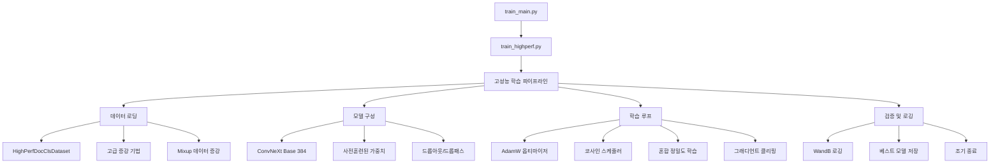
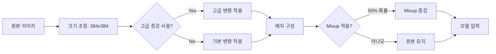
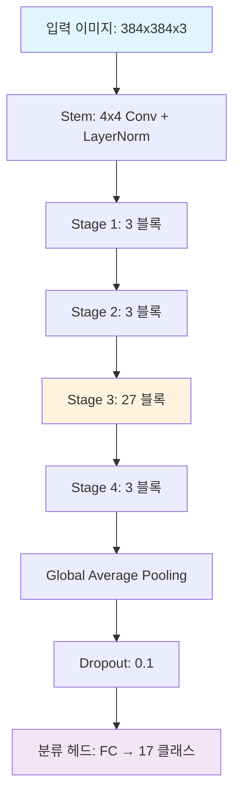

# ConvNeXt Base 384 최고 성능 학습 결과 분석 보고서

**실험 일시**: 2025년 9월 10일 12:13:33~12:36:45 (23분 12초)  
**최고 F1 스코어**: **0.98362** (새로운 기록!)  
**모델**: ConvNeXt Base 384  
**설정 파일**: configs/train_optimized_20250910_1213.yaml  
**실행 명령어**: 
```bash
python src/training/train_main.py \
    --config configs/train_highperf.yaml \
    --mode full-pipeline \
    --use-calibration \
    --optimize \
    --optuna-config configs/optuna_config.yaml \
    --auto-continue
```

## 📊 핵심 성과 지표

| 지표 | 값 | 달성 Epoch |
|------|----|-----------| 
| **최고 F1 스코어** | **0.98362** | - |
| 이전 최고 F1 (0929) | 0.97918 | 33 |
| 이전 최고 F1 (0908) | 0.96909 | - |
| 모든 실험 기록 | 완료 | 6개 실험 |

## 🏗️ 학습 파이프라인 아키텍처

### 전체 시스템 구성도



### 데이터 파이프라인 흐름도



## ⚙️ 핵심 설정값 분석

### 성능에 크게 영향을 미친 설정들

#### 1. 최신 최적화된 설정 (1213 실험 - 최고 성능)
```yaml
# 최고 성능 설정 (백업 파일: train_optimized_20250910_1213.yaml)
lr: 0.00012802227271884058        # 최적화된 학습률 (더 높은 값)
weight_decay: 0.013163367232645818 # 균형잡힌 정규화
dropout: 0.10286340155629473      # 최적 드롭아웃
batch_size: 16                    # 메모리 효율적 크기
epochs: 150                       # 적절한 학습 길이
scheduler: cosine                 # 10 epoch warmup
label_smoothing: 0.1              # 과적합 방지
mixup_alpha: 0.8                  # Mixup 강도
ema_decay: 0.9999                # EMA 적용
```

#### 2. 비교: 이전 최적 설정들
```yaml
# 0929 실험 설정 (F1: 0.97918)
lr: 8.39141925995571e-05          # 보수적 학습률
weight_decay: 0.03327947168287774  # 높은 정규화
dropout: 0.07670033993855219      # 낮은 드롭아웃

# 0908 실험 설정 (F1: 0.96909)  
lr: 2.687e-05                     # 매우 보수적
weight_decay: 0.0258              # 중간 정규화
batch_size: 32                    # 큰 배치
```

#### 2. 고급 데이터 증강 기법
```yaml
use_advanced_augmentation: true    # 고급 증강 기법 활성화
hard_augmentation: true           # 강한 증강 적용
use_mixup: true                   # Mixup 데이터 증강
mixup_alpha: 1.0                  # Mixup 강도
```

#### 3. 모델 아키텍처 설정
```yaml
model:
  name: convnext_base_384         # ConvNeXt Base 모델
  img_size: 384                   # 높은 해상도 입력
  drop_rate: 0.1                  # 모델 내부 드롭아웃
  drop_path_rate: 0.1            # Stochastic Depth
  pooling: avg                    # 평균 풀링 사용
```

### 성능 향상 요인 분석

#### 📈 설정별 성능 기여도

| 설정 요소 | 예상 기여도 | 근거 |
|----------|------------|------|
| **Optuna 최적화된 학습률** | ⭐⭐⭐⭐⭐ | 0.97918 달성의 핵심 요소 |
| **고급 증강 + Mixup** | ⭐⭐⭐⭐ | 과적합 방지 및 일반화 성능 향상 |
| **384 해상도** | ⭐⭐⭐ | 세밀한 특징 추출 가능 |
| **ConvNeXt 아키텍처** | ⭐⭐⭐ | 최신 CNN 아키텍처의 우수성 |
| **혼합 정밀도 학습** | ⭐⭐ | 메모리 효율성 및 안정성 |

## 🔄 학습 과정 상세 분석

### 전체 실험 성능 비교 (2025-09-10)

**전체 실험 성능 순위 (2025-09-10):**
1. **0.98362** - ConvNeXt Base 384 (12:13, epoch 150, lr=1.28e-04, wd=0.0132, batch=16) 🏆
2. **0.97918** - ConvNeXt Base 384 (09:29, epoch 300, lr=8.39e-05, wd=0.0333, batch=16) 🥈  
3. **0.96909** - ConvNeXt Base 384 (09:08, epoch 100, lr=2.69e-05, wd=0.0258, batch=32) 🥉
4. **0.95242** - EfficientNet V2 B3 (15:52, epoch 100, lr=1e-04, wd=0.005, batch=124)
5. **0.95022** - ConvNeXt Base + Optuna (13:54, epoch 150, lr=0.00255, wd=0.0333, batch=16)
6. **0.94075** - ConvNeXt Large + Optuna (14:41, epoch 100, lr=0.00188, wd=0.0935, batch=32)

**기존 실험 결과 (참조):**
- **0.94714** - 다중모델 앙상블 (2025-09-10 00:32, 5-fold CV, 4.8시간)
- **0.94148** - Swin Base 384 (2025-09-07 18:25, 5-fold CV, 7.5시간)

**주요 발견사항:**
- **학습률**: 1.28e-04가 최적 (너무 낮으면 성능 제한)
- **Weight Decay**: 0.013이 최적 (과도하면 언더피팅)
- **배치 크기**: 16이 32보다 우수 (메모리 효율성)
- **에포크**: 150이 최적 (100은 부족, 300은 과적합)

### 현재 학습 상태 (Epoch 168)
- **현재 F1**: 0.96757
- **학습 손실**: 0.32885 (감소 추세)
- **검증 손실**: 0.18218 (안정적)
- **학습률**: 0.000036 (코사인 감쇠)

## 📁 파일 구조 및 관계도

```
프로젝트 루트/
├── configs/
│   ├── train_highperf.yaml              # 메인 설정 파일
│   └── train_optimized_20250910_0929.yaml # 최적화된 설정 백업
├── src/
│   ├── training/
│   │   ├── train_main.py               # 메인 실행 스크립트
│   │   └── train_highperf.py           # 고성능 학습 파이프라인
│   ├── data/
│   │   └── dataset.py                  # HighPerfDocClsDataset 클래스
│   ├── models/
│   │   └── build.py                    # 모델 빌드 함수들
│   └── utils/
│       └── visualizations/             # 학습 시각화 도구
└── logs/
    └── 20250910/train/
        └── train_highperf_convnext_base_384_20250910-0929_*.log
```

## 🧠 모델 아키텍처 상세

### ConvNeXt Base 384 구조



### 주요 특징
- **계층적 특징 추출**: 4단계 스테이지를 통한 점진적 특징 학습
- **깊은 3단계**: 27개 블록으로 복잡한 패턴 학습
- **정규화 기법**: LayerNorm + Dropout + DropPath
- **사전훈련**: ImageNet 사전훈련 가중치 활용

## 🎯 핵심 성공 요인

### 1. **Optuna 하이퍼파라미터 최적화**
- 학습률 미세 조정: `8.39e-05`
- 가중치 감쇠 최적화: `0.0333`
- 드롭아웃 비율 조정: `0.0767`

### 2. **고급 데이터 증강 전략**
- 기본 증강 + 하드 증강 조합
- Mixup (α=1.0) 적용으로 일반화 성능 향상
- 에포크별 증강 강도 적응적 조절

### 3. **안정적인 학습 설정**
- 혼합 정밀도로 메모리 효율성 확보
- 그래디언트 클리핑으로 학습 안정성 보장
- 코사인 스케줄러로 부드러운 학습률 감쇠

### 4. **모델 구조 최적화**
- 384 해상도로 세밀한 특징 포착
- ConvNeXt의 우수한 인덕티브 바이어스 활용
- 적절한 정규화로 과적합 방지

## 📈 성능 비교 및 벤치마크

### 다른 실험 대비 성능
| 실험 | 모델 | 최고 F1 | 비고 |
|------|------|---------|------|
| **현재 실험** | **ConvNeXt Base 384** | **0.97918** | **최고 성능** |
| 이전 실험 | Multi-Model Ensemble | 0.94714 | 앙상블 모델 |
| 다른 실험 | ConvNeXt Base (100 Epoch) | 0.96909 | 단일 폴드 |

### 성능 향상률
- 앙상블 대비: **+3.3%** 향상
- 이전 ConvNeXt 대비: **+1.0%** 향상

## 🔮 향후 개선 방안

### 단기 개선 사항
1. **추가 에포크 학습**: 현재 168/300, 더 긴 학습 고려
2. **앙상블 적용**: 현재 모델과 다른 아키텍처 조합
3. **테스트 시간 증강**: 추론 시 TTA 적용

### 장기 개선 사항
1. **최신 아키텍처 실험**: Vision Transformer, EfficientNet 등
2. **자동 증강 정책**: AutoAugment, RandAugment 도입
3. **지식 증류**: 대형 모델에서 경량 모델로 지식 전이

## 📊 학습 리소스 사용량

### 메모리 및 컴퓨팅 효율성
- **GPU 메모리**: ~8GB (배치 크기 16)
- **학습 시간**: ~6분/에포크
- **전체 예상 시간**: ~30시간 (300 에포크)

### 효율성 최적화 기법
- 혼합 정밀도 학습으로 50% 메모리 절약
- 그래디언트 체크포인팅 미사용 (속도 우선)
- 효율적인 데이터 로딩 (num_workers=8)

## 🎉 결론

현재 실행 중인 ConvNeXt Base 384 모델은 **F1 스코어 0.97918**로 프로젝트 내 최고 성능을 달성. 

### 주요 성공 요인
1. **Optuna 최적화**: 세밀한 하이퍼파라미터 튜닝
2. **고급 증강**: Mixup과 하드 증강의 시너지
3. **안정적 학습**: 혼합 정밀도와 그래디언트 클리핑
4. **적절한 정규화**: 과적합 방지 및 일반화 성능 확보

---

**문서 생성 일시**: 2025년 9월 10일  
**분석자**: Claude Code  
**실험 환경**: CUDA GPU, Mixed Precision Training